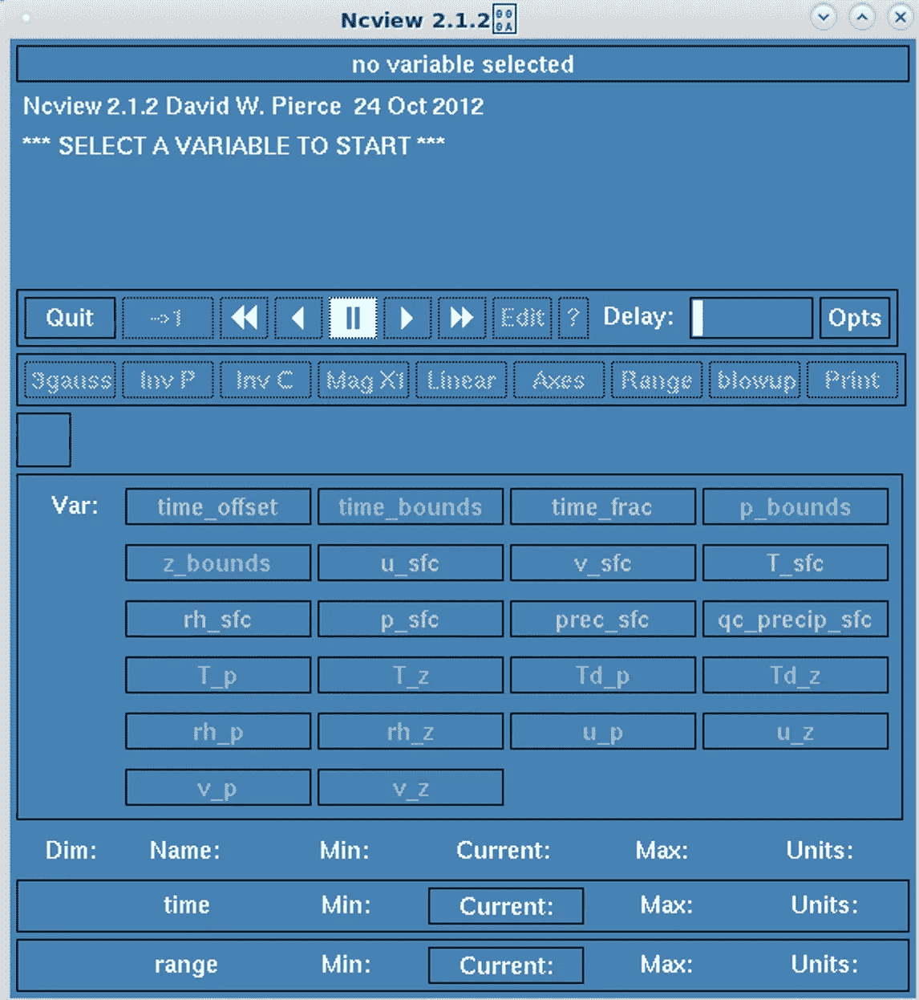
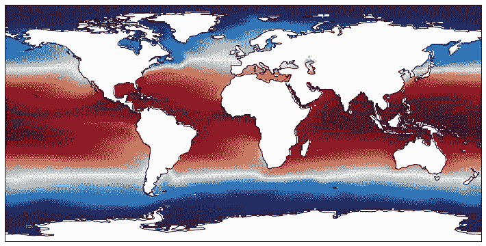

# 绝对初学者使用 XArray 处理 NetCDF 文件

> 原文：<https://towardsdatascience.com/handling-netcdf-files-using-xarray-for-absolute-beginners-111a8ab4463f?source=collection_archive---------2----------------------->

## 探索 Python 中与气候相关的数据操作工具


Photo by [Alberto Restifo](https://unsplash.com/@albertorestifo?utm_source=medium&utm_medium=referral) on [Unsplash](https://unsplash.com?utm_source=medium&utm_medium=referral)

N etCDF 是一种独立于机器的、面向数组的、多维的、自描述的、可移植的数据格式，被各种科学团体所使用。它的文件扩展名是*。nc* 或*。cdf* (虽然据信两者之间有细微差别)。不像*里的文件。csv* 或*。xlsx* ，NetCDF 格式无法使用电子表格软件直接访问和查看。

> 即使你可以，你也不会用一堆元数据来处理一个四维数据。

我将以美国 [*大气辐射测量气候研究机构*](https://www.arm.gov/) (ARM)和欧洲 [*欧洲中期天气预报中心*](https://www.ecmwf.int/) (ECMWF)的气候数据为例。

## 目录

*   [先决条件](https://medium.com/p/111a8ab4463f#dce7)
*   [替代品](https://medium.com/p/111a8ab4463f#4715)
*   [数据预览](https://medium.com/p/111a8ab4463f#f232)
*   [术语](https://medium.com/p/111a8ab4463f#70a2)
*   [使用 XArray 编码](https://medium.com/p/111a8ab4463f#14ea)
*   [备注](https://medium.com/p/111a8ab4463f#00c2)

*原载于我的博客*[*edenau . github . io*](https://edenau.github.io)*。*

# 先决条件

我们将使用 Python 中的`[xarray](http://xarray.pydata.org/en/stable/)`库进行数据处理。长话短说，它建立在`numpy`(和`dask`)库的基础上，并利用了`pandas`的能力，但是你可能不需要了解它。正如您可能知道的，包依赖是 Python 中的一个难点。这就是为什么安装所有东西最方便的方法是使用以下命令:

```
$ conda install xarray dask netCDF4 bottleneck
```

建议有经验的 Python 程序员查看相关的[文档](http://xarray.pydata.org/en/stable/installing.html)了解更多细节。如果你是初学者，不用担心。我列出了你需要检查的依赖项:

*   **Python*2.7/3.5+*必需**
*   ***numpy* 1.12+** 必填
*   ***熊猫* 0.19.2+** 必填
*   **为插补特征**
*   *****瓶颈*** 加速跳 NaN**
*   *****netCDF 4-python****用于基本的 netCDF 读/写等操作***
*   ******dask-array*0.16+**与 *dask* 进行并行计算***

**如果您想要可视化您的数据集，您可能需要这些:**

*   *****matplotlib***1.5+用于绘图**
*   *****cartopy*** 为地图**
*   *****seaborn*** 更好的调色板**

**对于绝对的初学者，您可以通过以下方式检查您的默认 Python 版本**

```
**$ python --version
Python 2.7.5**
```

**您还可以通过以下方式检查 Python3 是否已安装**

```
**$ python3 --version
Python 3.4.9**
```

**要检查软件包的版本，使用`pip freeze`或`conda list`。如果你通过`conda`安装`xarray`的话，事情应该没问题。**

# **可供选择的事物**

**`[iris](https://scitools.org.uk/iris/docs/latest/)`是`xarray`的替代品，但需要做一些工作才能让它在 Windows 上工作，在 Mac OS 上效果不好。Iris 也是一个英文单词，所以谷歌‘iris’会给你很多不相关的结果。使用`iris`对我来说是一种痛苦。**

# **数据预览**

**“预览”和“了解”您的数据、其元数据和数据结构总是一个好主意。假设您已经安装了`netCDF4-python`，您只需要两个命令`ncdump`和`ncview`。前者给出了 netCDF 数据集的文本表示(基本上是元数据和数据本身)，而后者是一个非常强大的图形界面，用于即时数据可视化。**

## **ncdump**

**转到数据集的目录并尝试**

```
**$ ncdump -h twparmbeatmC1.c1.20050101.000000.cdf**
```

**由于此时我们不需要查看每个数据条目的值，`-h`确保只显示标题(元数据)。你会得到**

```
**netcdf twparmbeatmC1.c1.20050101.000000 {
dimensions:
 time = UNLIMITED ; // (8760 currently)
 range = 2 ;
 p = 37 ;
 z = 512 ;
variables:
 double base_time ;
  base_time:long_name = "Base time in Epoch" ;
  base_time:units = "seconds since 1970-1-1 0:00:00 0:00" ;
  base_time:string = "2005-01-01 00.00, GMT" ;
  base_time:ancillary_variables = "time_offset" ;
 float prec_sfc(time) ;
  prec_sfc:long_name = "Precipitation Rate" ;
  prec_sfc:standard_name = "lwe_precipitation_rate" ;
  prec_sfc:units = "mm/hour" ;
  prec_sfc:missing_value = -9999.f ;
  prec_sfc:_FillValue = -9999.f ;
  prec_sfc:source = "twpsmet60sC1.b1" ;
 float T_p(time, p) ;
  T_p:long_name = "Dry Bulb Temperature, from sounding in p coordinate" ;
  T_p:standard_name = "air_temperature" ;
  T_p:units = "K" ;
  T_p:missing_value = -9999.f ;
  T_p:_FillValue = -9999.f ;
  T_p:source = "twpsondewnpnC1.b1:tdry" ;// global attributes:
***< OTHER METADATA >***
}**
```

**您可以看到维度、变量和其他不言自明的元数据。全局属性(上面没有打印)告诉我们如何收集和预处理数据。在本例中，它们是 ARM 在巴布亚新几内亚马努斯 147.4E 2.1S 处获取的测量数据。**

**当我们查看变量列表:1-dim `prec_sfc`和 2-dim `T_p`时，我们意识到它们具有不同的维度(！).降水率在每次都是标量测量，而温度在每次都是柱形(这次是在不同气压水平而不是海拔高度水平测量)。在气候科学中，四维数据是很常见的——纬度、经度、海拔/气压水平、时间。**

## **ncview**

**试试下面的命令，它会给你一个图形界面，列出数据集中的所有变量，非常简单。**

```
**$ ncview twparmbeatmC1.c1.20050101.000000.cdf**
```

****

**The graphical interface in Linux using ***ncview*****

# **术语**

****

**Data structures of **xarray****

## **数据阵列**

**`xarray.DataArray`是一个带标签的多维数组**的实现，用于单个变量**，如降雨量、温度等..它具有以下关键属性:**

*   **`values`:保存数组值的`numpy.ndarray`**
*   **`dims`:各轴的尺寸名称(如`('lat', 'lon', 'z', 'time')`)**
*   **`coords`:一个类似 dict 的数组(坐标)容器，用于标记每个点(例如，一维数字数组、*日期时间*对象或字符串)**
*   **`attrs`:保存任意元数据(属性)的`OrderedDict`**

## **资料组**

**`xarray.DataSet`是 DataArrays 的集合。每个 NetCDF 文件都包含一个数据集。**

# **使用 XArray 编码**

## **数据导入**

**在你阅读数据之前，你不能摆弄它。使用`open_dataset`或`open_mfdataset`读取单个或多个 NetCDF 文件，并将其存储在名为`DS`的数据集中。**

```
**import xarray as xr# single file
dataDIR = '../data/ARM/twparmbeatmC1.c1.20050101.000000.cdf'
DS = xr.open_dataset(dataDIR)# OR multiple files
mfdataDIR = '../data/ARM/twparmbeatmC1.c1.*.000000.cdf'
DS = xr.open_mfdataset(mfdataDIR)**
```

## **数据检查**

**还记得数据数组的 4 个关键属性吗？您可以使用`DS.values`、`DS.var`、`DS.dims`、`DS.coords`和`DS.attrs`进行数据检查。这在交互式 Python 中将变得非常方便。它们的功能非常明显，留给读者作为练习。).**

## **数据阵列提取**

**从数据集`DS`中提取数据数组非常简单，因为`DS.<var_name>`就足够了。您可以考虑用`dropna()`删除 NaN 条目，并用`sel()`选择数据。`sel()`中的`method`参数允许我们通过使用`'pad'`、`'backfill'`或`'nearest'`方法来启用最近邻(不精确)查找。要指定范围，使用`slice()`。**

**您可以通过`da.values`将`xr.DataArray`转换为`numpy.ndarray`。**

```
**# Extract Dry Bulb Temperature in z-coordinate (T_z)
# Select the altitude nearest to 500m above surface
# Drop NaN, convert to Celcius
da = DS.T_z.sel(z=500,method='nearest').dropna(dim='time') - 273.15  # or .ffill(dim='time')# Select data in 2000s
da = da.sel(time=slice('2000-01-01', '2009-12-31'))
da_numpy = da.values**
```

**按照惯例，DataSet 用大写字母`DS`命名，DataArray 用小写字母`da`命名。**

## **日期时间操作**

**假设 DataArray `da`有一个 *DateTime* 格式的维度`time`，我们可以通过`da.time.dt.<year/month/day/...>`提取出*年* / *月* / *日* / *日* / *日*。注意，输出仍然在 DataArray 中。**

**以下示例进一步尝试计算每个月任何变量的平均值/总和。我们先用`assign_coords()`定义一个新的坐标系。为什么？尝试观察*年*和*月*在*日期时间*中的表现。如果我们需要系统知道 2000 年 1 月和 2001 年 1 月之间的差异，我们需要*年*和*月*来定义一个新坐标，我们称之为`year_month`。**

**然后，我们可以根据新定义的坐标系，通过`groupby('year_month')`对数据进行分组，然后进行`mean()`或`sum()`操作。**

```
**# Contract the DataArray by taking mean for each Year-Month
def mean_in_year_month(da):
    # Index of Year-Month starts at Jan 1991
    month_cnt_1991 = (da.time.dt.year.to_index() - 1991) * 12 + da.time.dt.month.to_index()
    # Assign newly defined Year-Month to coordinates, then group by it, then take the mean
    return da.assign_coords(year_month = month_cnt_1991).groupby('year_month').mean()da_1 = mean_in_year_month(da1)**
```

## **数据数组合并**

**我们可以使用`xr.merge()`合并多个数据数组。如果试图合并两个同名但不同值的变量，将引发`xr.MergeError`。这确保了`xr.merge()`是非破坏性的。**

```
**DS_new = xr.merge([da_1,da_2,da_3]).dropna(dim='year_month')**
```

## **测绘**

**您可以简单地将数据数组作为`matplotlib.pyplot`方法的参数。对于绝对的初学者，尝试使用`plt.plot()`或`plt.scatter()`绘制线图或散点图。记住通过`plt.show()`显示数字，或者通过`plt.savefig()`保存数字。**

**如果你需要地图，`cartopy`库可以轻松生成一张。**

```
**import cartopy.crs as ccrs
import matplotlib.pyplot as pltda = DS.t_sfc# Draw coastlines of the Earth
ax = plt.axes(projection=ccrs.PlateCarree())
ax.coastlines() 
da.plot()
plt.show()**
```

**通过几行额外的代码，您可以生成如下内容:**

****

**Plots generated by **cartopy****

## **数据导出**

**如前所述，您可以将 DataArray 转换为`numpy.ndarray`，或者将 DataSet 或 DataArray 转换为`pandas.DataFrame`，如下图所示。**

```
**df = DS.to_dataframe()**
```

**还可以通过以下方式将 DataArray 或 DataSet 导出到 NetCDF 文件**

```
**dataDIR = '../data/new.nc'
DS.to_netcdf(dataDIR)**
```

# **评论**

**如果您对 Python 或编程感兴趣，以下文章可能会有所帮助:**

**[](/5-python-features-i-wish-i-had-known-earlier-bc16e4a13bf4) [## 我希望我能早点知道的 5 个 Python 特性

### 超越 lambda、map 和 filter 的 Python 技巧

towardsdatascience.com](/5-python-features-i-wish-i-had-known-earlier-bc16e4a13bf4) [](/visualizing-bike-mobility-in-london-using-interactive-maps-for-absolute-beginners-3b9f55ccb59) [## 使用交互式地图和动画可视化伦敦的自行车移动性

### 探索 Python 中的数据可视化工具

towardsdatascience.com](/visualizing-bike-mobility-in-london-using-interactive-maps-for-absolute-beginners-3b9f55ccb59) 

本教程是为教学目的而写的，只包括`xarray`的基础知识。希望这有所帮助！

*原载于我的博客*[*edenau . github . io*](https://edenau.github.io)*。*

## 参考

*   [https://www . unidata . ucar . edu/software/netcdf/netcdf-4/new docs/netcdf/NC dump . html](https://www.unidata.ucar.edu/software/netcdf/netcdf-4/newdocs/netcdf/ncdump.html)
*   [http://xarray.pydata.org/en/stable/](http://xarray.pydata.org/en/stable/)
*   [https://scitools . org . uk/cartopy/docs/v 0.15/matplotlib/intro . html](https://scitools.org.uk/cartopy/docs/v0.15/matplotlib/intro.html)
*   [http://earthpy.org/cartopy_backgroung.html](http://earthpy.org/cartopy_backgroung.html)**