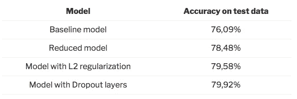

# 处理深度学习模型中的过拟合

> 原文：<https://towardsdatascience.com/handling-overfitting-in-deep-learning-models-c760ee047c6e?source=collection_archive---------2----------------------->


当您在训练数据上实现了模型的良好拟合，而在新的、看不见的数据上没有很好地概括时，就会发生过度拟合。换句话说，模型学习了特定于训练数据的模式，而这些模式在其他数据中是不相关的。

我们可以通过查看验证指标(如损失或准确性)来识别过度拟合。通常，验证度量在一定数量的时期后停止提高，之后开始下降。训练指标不断改进，因为模型试图找到最适合训练数据的方法。

有几种方式可以减少深度学习模型中的过度拟合。最好的选择是 ***获取更多的训练数据*** 。不幸的是，在现实世界中，由于时间、预算或技术限制，您通常没有这种可能性。

另一种减少过拟合的方法是 ***降低模型记忆训练数据的容量*** 。因此，模型将需要关注训练数据中的相关模式，这将导致更好的泛化。在本帖中，我们将讨论实现这一目标的三个选项。

# 项目的建立

我们首先导入必要的包并配置一些参数。我们将使用 [Keras](https://keras.io/) 来拟合深度学习模型。训练数据是来自 Kaggle 的 [Twitter 美国航空公司情绪数据集。](https://www.kaggle.com/crowdflower/twitter-airline-sentiment)

```
# Basic packages
import pandas as pd 
import numpy as np
import re
import collections
import matplotlib.pyplot as plt
from pathlib import Path# Packages for data preparation
from sklearn.model_selection import train_test_split
from nltk.corpus import stopwords
from keras.preprocessing.text import Tokenizer
from keras.utils.np_utils import to_categorical
from sklearn.preprocessing import LabelEncoder# Packages for modeling
from keras import models
from keras import layers
from keras import regularizersNB_WORDS = 10000  # Parameter indicating the number of words we'll put in the dictionary
NB_START_EPOCHS = 20  # Number of epochs we usually start to train with
BATCH_SIZE = 512  # Size of the batches used in the mini-batch gradient descent
MAX_LEN = 20  # Maximum number of words in a sequenceroot = Path('../')
input_path = root / 'input/' 
ouput_path = root / 'output/'
source_path = root / 'source/'
```

# 一些助手功能

在本文中，我们将使用一些助手函数。

```
def deep_model(model, X_train, y_train, X_valid, y_valid):
    '''
    Function to train a multi-class model. The number of epochs and 
    batch_size are set by the constants at the top of the
    notebook. 

    Parameters:
        model : model with the chosen architecture
        X_train : training features
        y_train : training target
        X_valid : validation features
        Y_valid : validation target
    Output:
        model training history
    '''
    model.compile(optimizer='rmsprop'
                  , loss='categorical_crossentropy'
                  , metrics=['accuracy'])

    history = model.fit(X_train
                       , y_train
                       , epochs=NB_START_EPOCHS
                       , batch_size=BATCH_SIZE
                       , validation_data=(X_valid, y_valid)
                       , verbose=0)
    return history def eval_metric(model, history, metric_name):
    '''
    Function to evaluate a trained model on a chosen metric. 
    Training and validation metric are plotted in a
    line chart for each epoch.

    Parameters:
        history : model training history
        metric_name : loss or accuracy
    Output:
        line chart with epochs of x-axis and metric on
        y-axis
    '''
    metric = history.history[metric_name]
    val_metric = history.history['val_' + metric_name] e = range(1, NB_START_EPOCHS + 1) plt.plot(e, metric, 'bo', label='Train ' + metric_name)
    plt.plot(e, val_metric, 'b', label='Validation ' + metric_name)
    plt.xlabel('Epoch number')
    plt.ylabel(metric_name)
    plt.title('Comparing training and validation ' + metric_name + ' for ' + model.name)
    plt.legend()
    plt.show()def test_model(model, X_train, y_train, X_test, y_test, epoch_stop):
    '''
    Function to test the model on new data after training it
    on the full training data with the optimal number of epochs.

    Parameters:
        model : trained model
        X_train : training features
        y_train : training target
        X_test : test features
        y_test : test target
        epochs : optimal number of epochs
    Output:
        test accuracy and test loss
    '''
    model.fit(X_train
              , y_train
              , epochs=epoch_stop
              , batch_size=BATCH_SIZE
              , verbose=0)
    results = model.evaluate(X_test, y_test)
    print()
    print('Test accuracy: {0:.2f}%'.format(results[1]*100))
    return results def remove_stopwords(input_text):
    '''
    Function to remove English stopwords from a Pandas Series.

    Parameters:
        input_text : text to clean
    Output:
        cleaned Pandas Series 
    '''
    stopwords_list = stopwords.words('english')
    # Some words which might indicate a certain sentiment are kept via a whitelist
    whitelist = ["n't", "not", "no"]
    words = input_text.split() 
    clean_words = [word for word in words if (word not in stopwords_list or word in whitelist) and len(word) > 1] 
    return " ".join(clean_words) 

def remove_mentions(input_text):
    '''
    Function to remove mentions, preceded by @, in a Pandas Series

    Parameters:
        input_text : text to clean
    Output:
        cleaned Pandas Series 
    '''
    return re.sub(r'@\w+', '', input_text) def compare_models_by_metric(model_1, model_2, model_hist_1, model_hist_2, metric):
    '''
    Function to compare a metric between two models 

    Parameters:
        model_hist_1 : training history of model 1
        model_hist_2 : training history of model 2
        metrix : metric to compare, loss, acc, val_loss or val_acc

    Output:
        plot of metrics of both models
    '''
    metric_model_1 = model_hist_1.history[metric]
    metric_model_2 = model_hist_2.history[metric] e = range(1, NB_START_EPOCHS + 1)

    metrics_dict = {
        'acc' : 'Training Accuracy',
        'loss' : 'Training Loss',
        'val_acc' : 'Validation accuracy',
        'val_loss' : 'Validation loss'
    }

    metric_label = metrics_dict[metric] plt.plot(e, metric_model_1, 'bo', label=model_1.name)
    plt.plot(e, metric_model_2, 'b', label=model_2.name)
    plt.xlabel('Epoch number')
    plt.ylabel(metric_label)
    plt.title('Comparing ' + metric_label + ' between models')
    plt.legend()
    plt.show()

def optimal_epoch(model_hist):
    '''
    Function to return the epoch number where the validation loss is
    at its minimum

    Parameters:
        model_hist : training history of model Output:
        epoch number with minimum validation loss
    '''
    min_epoch = np.argmin(model_hist.history['val_loss']) + 1
    print("Minimum validation loss reached in epoch {}".format(min_epoch))
    return min_epoch
```

# 数据准备

## 数据清理

我们用 tweets 加载 CSV 并执行随机洗牌。在分割训练集和测试集之前，对数据进行洗牌是一个很好的做法。这样，情感类别在训练集和测试集中平均分布。我们只将 ***文本*** 列作为输入，将 ***航空公司 _ 情绪*** 列作为目标。

接下来我们要做的是 ***去除停用词*** 。停用词对于预测情绪没有任何价值。此外，由于我们希望建立一个同样适用于其他航空公司的模型，我们 ***删除了提到的*** 。

```
df = pd.read_csv(input_path / 'Tweets.csv')
df = df.reindex(np.random.permutation(df.index))  
df = df[['text', 'airline_sentiment']]
df.text = df.text.apply(remove_stopwords).apply(remove_mentions)
```

## 列车测试分离

模型性能的评估需要在单独的测试集上完成。因此，我们可以估计模型的概括程度。这是通过 scikit-learn 的***train _ test _ split***方法完成的。

```
X_train, X_test, y_train, y_test = train_test_split(df.text, df.airline_sentiment, test_size=0.1, random_state=37)
```

## 将单词转换成数字

要使用文本作为模型的输入，我们首先需要将单词转换成记号，这仅仅意味着将单词转换成引用字典中索引的整数。这里我们将只保留训练集中最常用的单词。

我们通过应用 ***滤镜*** 将文字整理成 ***小写*** 。单词由空格分隔。

```
tk = Tokenizer(num_words=NB_WORDS,
               filters='!"#$%&()*+,-./:;<=>?@[\\]^_`{"}~\t\n',
               lower=True,
               char_level=False,
               split=' ')
tk.fit_on_texts(X_train)
```

创建字典后，我们可以将 tweet 的文本转换为带有 NB_WORDS 值的向量。用 ***mode=binary*** 表示，它包含了一个指示词是否出现在推文中。这是通过记号赋予器的***texts _ to _ matrix***方法完成的。

```
X_train_oh = tk.texts_to_matrix(X_train, mode='binary')
X_test_oh = tk.texts_to_matrix(X_test, mode='binary')
```

## 将目标类转换为数字

我们还需要将目标类转换成数字，然后用 Keras 中的***to _ categorial***方法对数字进行一次性编码

```
le = LabelEncoder()
y_train_le = le.fit_transform(y_train)
y_test_le = le.transform(y_test)
y_train_oh = to_categorical(y_train_le)
y_test_oh = to_categorical(y_test_le)
```

## 分离验证集

现在我们的数据已经准备好了，我们分离出一个验证集。当我们调整模型的参数时，这个验证集将用于评估模型的性能。

```
X_train_rest, X_valid, y_train_rest, y_valid = train_test_split(X_train_oh, y_train_oh, test_size=0.1, random_state=37)
```

# 深度学习

## 创建一个过度拟合的模型

我们从一个过度拟合的模型开始。它有两层紧密相连的 64 个元素。第一层的 ***input_shape*** 等于我们保存在字典中的单词数，我们为其创建了一个热编码特征。

因为我们需要预测 3 个不同的情感类别，所以最后一层有 3 个元素。 ***softmax*** 激活功能确保三个概率总和为 1。

要训练的参数数量计算为 ***(nb 输入 x 隐藏层中的 nb 元素)+ nb 偏差项*** 。第一层的输入数量等于我们语料库中的单词数量。后续层将前一层的输出数量作为输入。因此每层的参数数量为:

*   第一层:(10000 x 64) + 64 = 640064
*   第二层:(64 x 64) + 64 = 4160
*   最后一层:(64 x 3) + 3 = 195

```
base_model = models.Sequential()
base_model.add(layers.Dense(64, activation='relu', input_shape=(NB_WORDS,)))
base_model.add(layers.Dense(64, activation='relu'))
base_model.add(layers.Dense(3, activation='softmax'))
base_model.name = 'Baseline model'
```

因为这个项目是多类单标签预测，所以我们用***categorial _ cross entropy***作为损失函数，用 ***softmax*** 作为最终激活函数。我们在训练数据上拟合模型，并在验证集上验证。我们运行预定数量的历元，并观察模型何时开始过度拟合。

```
base_history = deep_model(base_model, X_train_rest, y_train_rest, X_valid, y_valid)
base_min = optimal_epoch(base_history)eval_metric(base_model, base_history, 'loss')
```


开始时， ***验证损失*** 下降。但是在时期 3，这停止并且验证损失开始快速增加。这是模型开始过度拟合的时候。

***训练损耗*** 继续下降，在纪元 20 几乎归零。这是正常的，因为模型被训练为尽可能好地拟合训练数据。

# 处理过拟合

现在，我们可以试着做一些关于过度拟合的事情。有不同的方法可以做到这一点。

*   ***通过移除图层或减少隐藏图层中的元素数量来减少网络容量***
*   应用 ***正则化*** ，这归结于为大权重的损失函数增加了一个成本
*   使用 ***脱落层*** ，将某些特征设置为零，随机删除

## 降低网络容量

我们的第一个模型有大量可训练的参数。这个数字越高，模型就越容易记住每个训练样本的目标类。显然，这对于新数据的推广并不理想。

通过降低网络容量，您迫使它学习重要的模式或将损失降至最低。另一方面，过多地减少网络的容量会导致 ***配不上*** 。该模型将无法学习列车数据中的相关模式。

我们通过移除一个隐藏层并将剩余层中的元素数量减少到 16 个来减少网络容量。

```
reduced_model = models.Sequential()
reduced_model.add(layers.Dense(16, activation='relu', input_shape=(NB_WORDS,)))
reduced_model.add(layers.Dense(3, activation='softmax'))
reduced_model.name = 'Reduced model'reduced_history = deep_model(reduced_model, X_train_rest, y_train_rest, X_valid, y_valid)
reduced_min = optimal_epoch(reduced_history)eval_metric(reduced_model, reduced_history, 'loss')
```


我们可以看到，在简化模型开始过度拟合之前，需要更多的时期。验证损失也比我们的第一个模型上升得慢。

```
compare_models_by_metric(base_model, reduced_model, base_history, reduced_history, 'val_loss')
```


当我们比较基线模型的验证损失时，很明显，简化模型在以后开始过度拟合。验证损失低于基线模型的时间要长得多。

## 应用正则化

为了解决过拟合问题，我们可以对模型应用权重正则化。对于较大的权重(或参数值)，这将增加网络损耗函数的成本。因此，您会得到一个更简单的模型，它将被迫只学习列车数据中的相关模式。

**有 *L1 正则化和*L2 正则化**。

*   L1 正则化将会增加一个关于 ***参数的绝对值*** 的费用。这将导致一些权重等于零。
*   L2 正则化将增加参数 的 ***平方值的成本。这将导致较小的重量。***

让我们试试 L2 正则化。

```
reg_model = models.Sequential()
reg_model.add(layers.Dense(64, kernel_regularizer=regularizers.l2(0.001), activation='relu', input_shape=(NB_WORDS,)))
reg_model.add(layers.Dense(64, kernel_regularizer=regularizers.l2(0.001), activation='relu'))
reg_model.add(layers.Dense(3, activation='softmax'))
reg_model.name = 'L2 Regularization model'reg_history = deep_model(reg_model, X_train_rest, y_train_rest, X_valid, y_valid)
reg_min = optimal_epoch(reg_history)
```

对于正则化模型，我们注意到它在与基线模型相同的时期开始过拟合。然而，随后的损失增加速度要慢得多。

```
eval_metric(reg_model, reg_history, 'loss')
```


```
compare_models_by_metric(base_model, reg_model, base_history, reg_history, 'val_loss')
```


## 添加脱落层

我们尝试的最后一个选项是添加脱落层。脱落图层会将图层的输出要素随机设置为零。

```
drop_model = models.Sequential()
drop_model.add(layers.Dense(64, activation='relu', input_shape=(NB_WORDS,)))
drop_model.add(layers.Dropout(0.5))
drop_model.add(layers.Dense(64, activation='relu'))
drop_model.add(layers.Dropout(0.5))
drop_model.add(layers.Dense(3, activation='softmax'))
drop_model.name = 'Dropout layers model'drop_history = deep_model(drop_model, X_train_rest, y_train_rest, X_valid, y_valid)
drop_min = optimal_epoch(drop_history)eval_metric(drop_model, drop_history, 'loss')
```


具有脱落层的模型比基线模型晚开始过度拟合。损耗的增加也比基线模型慢。

```
compare_models_by_metric(base_model, drop_model, base_history, drop_history, 'val_loss')
```


具有脱落层的模型稍后开始过度拟合。与基线模型相比，损耗也保持低得多。

# 全训练数据的训练和测试数据的评估

乍一看，简化的模型似乎是最好的泛化模型。但是让我们在测试集上检查一下。

```
base_results = test_model(base_model, X_train_oh, y_train_oh, X_test_oh, y_test_oh, base_min)
reduced_results = test_model(reduced_model, X_train_oh, y_train_oh, X_test_oh, y_test_oh, reduced_min)
reg_results = test_model(reg_model, X_train_oh, y_train_oh, X_test_oh, y_test_oh, reg_min)
drop_results = test_model(drop_model, X_train_oh, y_train_oh, X_test_oh, y_test_oh, drop_min)
```



# 结论

如上所示，所有三个选项都有助于减少过度拟合。我们设法大幅提高测试数据的准确性。在这三个选项中，具有脱落层的模型在测试数据上表现最好。

你可以在 [GitHub](https://github.com/bertcarremans/TwitterUSAirlineSentiment/blob/master/source/Handling%20overfitting%20in%20deep%20learning%20models.ipynb) 上找到笔记本。好好享受吧！欢迎任何反馈。