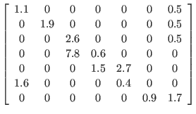
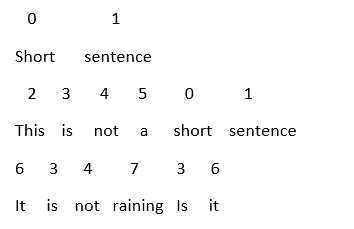

# 处理稀疏矩阵——压缩稀疏行(CSR)矩阵背后的概念

> 原文：<https://towardsdatascience.com/handling-sparse-matrix-concept-behind-compressed-sparse-row-csr-matrix-4fe6abe58a7a?source=collection_archive---------3----------------------->

Source: [https://www.loginworks.com/web-scraping-blogs/text-mining/](https://www.loginworks.com/web-scraping-blogs/text-mining/)

有两种常见的矩阵——密集矩阵和稀疏矩阵

稀疏矩阵的大部分元素为零，而密集矩阵的大部分元素不为零。对于大矩阵，通常大部分元素为零。因此，只使用非零值来执行运算是有意义的，因为零乘以任何值都将始终等于零。

Source: [https://www.coin-or.org/Ipopt/documentation/node38.html](https://www.coin-or.org/Ipopt/documentation/node38.html)

Scipy 提供了各种只存储非零元素的稀疏矩阵函数。通过这样做，可以最小化数据存储所需的存储器。机器学习过程通常需要数据帧在内存中。它分解数据帧以适合 RAM。通过压缩，数据可以很容易地放入 RAM。仅使用稀疏矩阵的非零值来执行操作可以大大提高算法的执行速度。

压缩稀疏行(CSR)算法是 Scipy 提供的类型之一。下面是它的工作原理。

# **样本文本文档**

短句

这不是一个短句

没有下雨。是吗？

**第一步——步进**

给单词编号。如果单词重复，分配相同的数字。通过这一步，我们知道整个文档中有多少单词。

索引从 0 开始。第一个单词是“short ”,它被索引为“0 ”,同样，每个唯一单词都将被索引。单词“Short”出现两次，因此它每次在文档中出现时都获得相同的索引值“0”。

**步骤 2——文档的矢量表示**

对于文档中的每一行，创建向量表示。计算唯一索引的数量。在这种情况下，我们有从 0 到 7 的 8 个索引，因此每个文档(行)使用 8 个值来表示，每个值表示对应于该索引的特定单词出现的次数。

(索引，单词)——(0，短，(1，句子)，(2，这个，(3，是)，(4，不是)，(5，a)，(6，它)，(7，下雨)

01234567

[11000000]

[11111100]

[00021021]

这里，第一个向量的第一个位置中的值 1 表示索引为“0”的单词在文档中出现 1 次。第三个向量的第四个位置的值 2 表示索引为“3”的单词在该文档中出现了两次。

**步骤 3——为每个文档创建稀疏向量**

下面是每个文档的稀疏矩阵表示。它删除所有零值，只存储非零值。

文档 1: <0 1, 1 1>

第一个文档只在前两个位置有值，所以只表示它们。(0 1)表示第 0 个位置的值为 1，而(1 1)表示第 1 个位置的值为 1。在<0 1, 1 1>的(0-1)中，0 对应于索引，而 1 对应于特定索引在文档中出现的次数(值)

文件 2: <0 1, 1 1, 2 1, 3 1, 4 1, 5 1>

文件 3: < 3 2, 4 1, 6 2, 7 1>

CSR 矩阵表示需要三个数组——索引、值和指针。

**索引**

Ind — [0，1，0，1，2，3，4，5，3，4，6，7]

从上述步骤中获得的每个文档的索引被合并为一个。索引的大小是文档中非零值的个数。

**值**

瓦尔-[1，1，1，1，1，1，1，1，2，1，2，1]

值数组包含与从每个文档中获得的每个索引相对应的值。索引的大小是文档中非零值的个数。

**指针**

现在，我们已经组合了文档中所有行的索引和值。指针有助于在索引和值数组中标识完整文本文档中每个文档(行)的开头和结尾。

ptr -[0，2，8，12]

0 表示文档 1(行 1)的开始，它在开始后两个位置结束。从第三个位置开始，文档 2(行 2)开始并在第八个位置结束。从第 9 个位置开始，文档 3(第 3 行)开始并在第 12 个位置结束。这适用于索引数组和值数组。指针有助于理解索引和值数组。给定一个索引和指针数组，就可以知道每个文档的开始和结束。

传递这些数组将给出 CSR 矩阵，这就是 scipy 中 csr_matrix 函数的工作方式。

**代码**

来自 scipy.sparse import *

来自 scipy import *

ind = [0，1，0，1，2，3，4，5，3，4，6，7]

val = [1，1，1，1，1，1，1，1，2，1，2，1]

ptr = [0，2，8，12]

csr_matrix( (val，ind，ptr))

输出:< 3x8 sparse matrix of type ‘

具有压缩稀疏行格式的 12 个存储元素>

处理文本文档时，CSR 矩阵就是这样创建的。

……未完待续

灵感来自我的数据挖掘课。