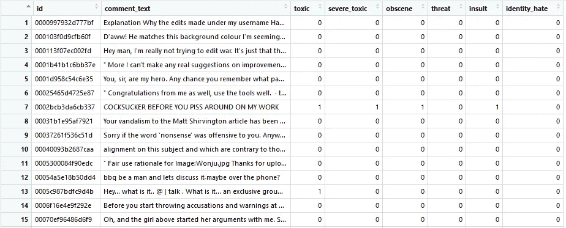
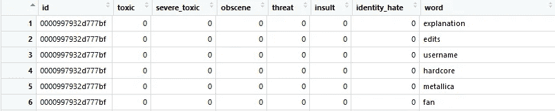
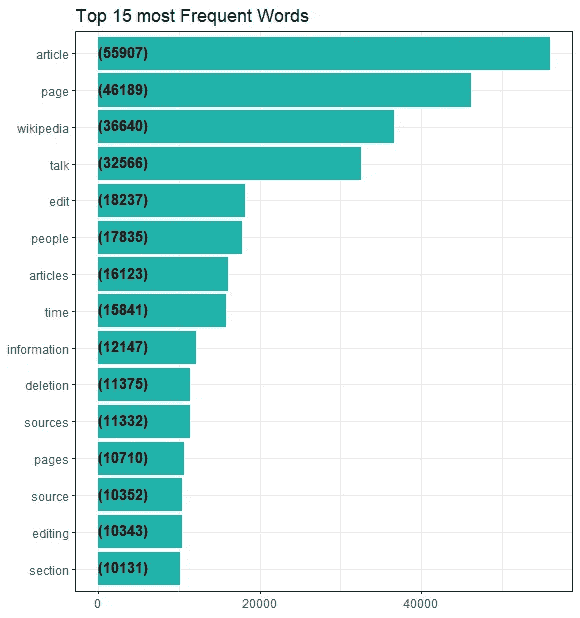
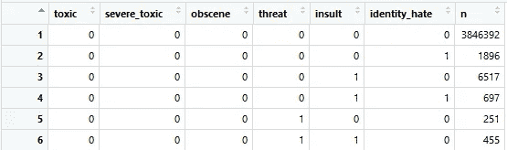
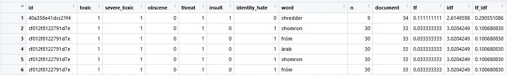
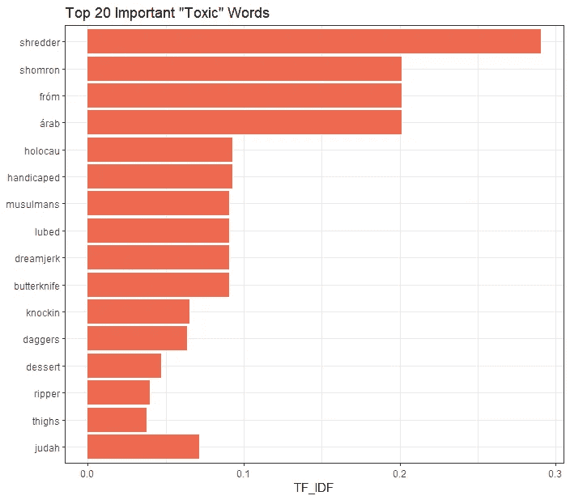
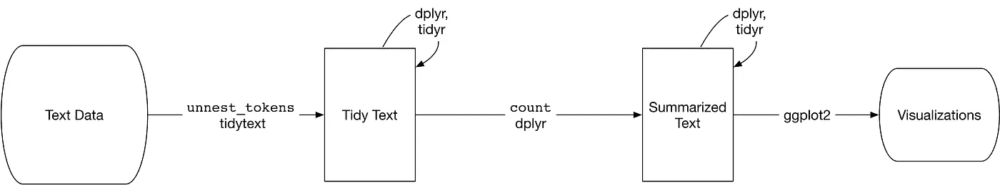
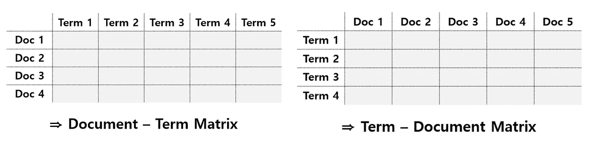
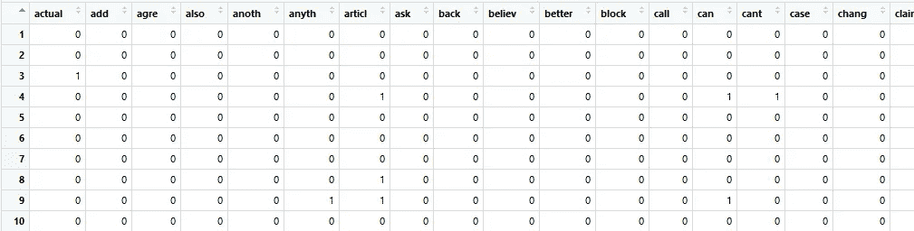
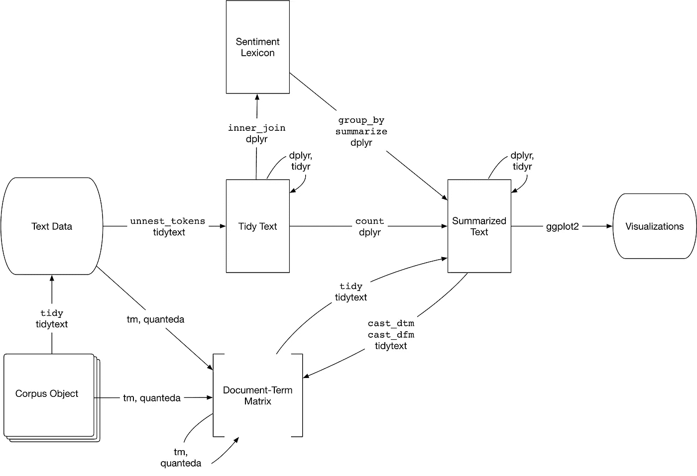

# 放手键盘战士:有毒评论的文本挖掘

> 原文：<https://towardsdatascience.com/hands-off-keyboard-warrior-text-mining-with-toxic-comments-6603ee3bc12e?source=collection_archive---------15----------------------->

从整齐的文本数据到 R 模型拟合的 NLP 初学者终极指南


通过互联网与人交流和接触是很神奇的。我们可以听到一些人的想法，如果没有这些想法，他们永远也不可能见面。可能是住在地球对面的人，或者是我们永远没有机会聊天的人。我们甚至可以和他们成为朋友，这就是为什么我们在这个年龄说“超级联系”。

然而，也有很多勇士威胁着这个令人敬畏的空间。键盘战士。他们没有基本的礼节，只是躲在他们的显示器后面，抛出他们的仇恨言论。这种评论不仅伤害了他人的感情，也破坏了网上交流的可能性。我们不能用数据科学来解决这个问题吗？我们能不能用机器学习建立一个有毒评论的检测器，让在线交流更健康？

今天我带来了另一个检测有毒评论的 NLP 项目。这是一项最初在卡格尔举行的比赛。我们面临的挑战是建立一个能够检测评论毒性的多头模型。有 6 种不同类型的毒性，即毒性、严重毒性、淫秽、威胁、侮辱和基于身份的仇恨。我来解释一下 NLP 的基本步骤。你可以从 Kaggle 下载[数据集](https://www.kaggle.com/c/jigsaw-toxic-comment-classification-challenge/data)，完整代码可以在我的 [Github](https://github.com/jjone36/myKaggle/blob/master/NLP_toxic.R) 上找到。

# 加载数据集

我们先来看看数据集。我们有`comment_text`栏和 6 种不同类型的毒性。

```
# Reading the dataset
train = read_csv('train.csv')
test = read_csv('test.csv')
```



这 6 个变量是我们的目标变量，有一个二进制值。拟合模型来一次预测 6 个变量将是这个项目的一个有趣的部分，你可以在这篇文章的结尾查看。在进入模型拟合之前，让我们先做一些挖掘`comment_text`。

# 整理文本数据

为了处理文本变量，我将把它们标记成整齐的文本格式。但什么是记号化或记号化呢？

> 标记是一个有意义的文本单元，比如一个单词，我们有兴趣用于分析，而标记化是将文本拆分成标记的过程。

在大多数的自然语言处理工作中，我们基本上是在一个单词单元中处理文本数据。如果你需要一个 unigram 或 one-hot-encoding 的基本概念，请查看我之前的文章。

```
# Tokenize the comment_text column 
tr_token = train %>%
  unnest_tokens(output = word, input = comment_text) %>%
  anti_join(stop_words, by = 'word')
```

函数`unnest_tokens()`将文本变量分割成单个单词，并以每行一个标记的结构返回它们。这是处理文本数据的一种更简单的方式。记号不一定总是一个单词。它们可以是一个 N-gram，一个句子，甚至一个段落，这取决于你的目的。我个人很喜欢这个功能，因为它感觉就像我在开始烹饪之前切完所有的蔬菜和肉类一样。



因此，在对文本数据进行标记后，我们得到了如上所示的数据帧。我们来统计一下每个词的出现频率，并把它们形象化。

```
# Count frequency of each word
freq_n = tr_token %>%
  group_by(word) %>%
  count() %>%
  arrange(-n)# words frequency bar plot
freq_n[1:15, ] %>%
  ggplot(aes(x = reorder(word, n), y = n)) + 
  geom_col(fill = 'lightseagreen') +
  geom_text(aes(x = word, y = 1, label = paste0('(', n, ')')), 
            hjust = 0, vjust = .3, fontface = 'bold', size = 4) +
  coord_flip() + 
  labs(x = NULL, y = NULL, title = 'Top 15 most Frequent Words') +
  theme_bw()
```



***文章、页面、维基百科、talk、*** 和 ***来源*** 是评论中使用频率最高的。那大概是因为我们通常会留下评论新闻 ***文章*** 或观点 ***章节*** 和 ***谈论*** 关于我们的想法或附加 ***信息*** 来自其他 ***来源*** 。

# 术语频率-逆文档频率

的确，这些词是最常见的术语。但是对于我们的分析来说，很难说它们是“重要”的词。有时出现频率很高的词可能是不太重要的词，比如停用词。想想我们有 20 条评论，一个单词，比如“states”，出现在所有的评论中。或者‘医疗’这个词只出现在 3 条评论里怎么办？哪个更重要？这就是 TF-IDF 的由来。

> 统计数据 **tf-idf** 旨在衡量一个单词对文档集合(或语料库)中的文档有多重要，例如，对小说集合中的一部小说或网站集合中的一个网站。

**词频** (tf)就和我们上面统计的一样。一个单词在文档中出现的频率(在这种情况下是一个注释)。**逆文档频率** (idf)是包含该单词的文档数量的倒数。所以我们通过将这两个概念相乘来赋予这个词权重。你不必害怕数学，因为`bind_tf_idf()`会为你计算所有这些。

那么数据集中有多少文档呢？因为有 6 种不同类型的毒性，并且我们要检查每种毒性的重要单词，所以我们有 41 种不同的毒性组合。这意味着有 41 个不同的文档。

```
tr_token_n = tr_token %>%
  group_by(toxic, severe_toxic, obscene, threat, insult, identity_hate) %>%
  count()head(tr_token_n)
# -> 41 different combinations of ‘toxic comment’ documents
```



```
tr_token_n$document = 1:41tr_tfidf = tr_token %>% 
  left_join(tr_token_n) %>%
  bind_tf_idf(term = word, document = document, n = n) %>%
  arrange(desc(tf_idf))
```



有了`tf`、`idf`和`tf_idf`，我们现在可以得到真正重要的单词了。让我们在柱状图中标出重要的“有毒”单词。结果将与我们上面看到的大不相同。

```
# toxic important word
tr_tfidf %>%
  filter(toxic == 1) %>%
  top_n(20) %>%
  ggplot(aes(x = reorder(word, tf_idf), y = tf_idf)) +
  geom_col(fill = 'coral2') +
  coord_flip() +
  theme_bw() +
  labs(x = NULL, y = 'TF_IDF', title = 'Top 20 Important \"Toxic\" Words')
```



让我们回顾一下到目前为止我们所讨论的内容。对于文本数据，我们用`unnest_tokens()`对它们进行标记，使它们成为整齐的格式，并以可视化的方式统计单词的频率。



# 语料库和文档术语矩阵

为了建立机器学习，我们必须将数据转换成 dtm。什么是 dtm？它只是一个简单的矩阵。但是我们在前面附加了‘文档-术语’,以指定它在行中包含文档，在列中包含术语(所以文档-术语矩阵)。tdm 则相反。它的行中有术语，列中有文档。看你选择用 dtm 还是 tdm。



所以从现在开始，我们将把整个数据集转换成 dtm 并拟合一个模型。你注意到了吗，到目前为止我们一直在用训练集工作？测试集从未被接触过。因此，我将对整个数据集进行标记，但这一次是以不同的方式。还有一种方法可以处理文本数据，那就是通过`tm`包把它们做成语料库。

```
# combining train and test dataset
full = rbind(train, test)
target = full[, 3:8]
part = 1:nrow(train)# transforming comment_text into corpus
corpus = full$comment_text %>%
  str_trim() %>%
  tolower() %>%
  VectorSource() %>%
  VCorpus()corpus = tm_map(corpus, removePunctuation)   
corpus = tm_map(corpus, stripWhitespace)   
corpus = tm_map(corpus, removeNumbers)  
corpus = tm_map(corpus, removeWords, stopwords('en'))    
corpus = tm_map(corpus, stemDocument)# casting into dtm and data frame 
term_dtm = DocumentTermMatrix(corpus)
term_m = removeSparseTerms(term_dtm, sparse = 0.97) %>% as.matrix()
```

经过降低大写字母、删除标点、空格、数字和单词等几个步骤的处理，我得到了数据框。它看起来怎么样？



每行对应于`id`，所有列变量都是单词或术语(记住文档-术语矩阵！).大部分都填了 0。它看起来像有很多洞的瑞士奶酪。由于这个漏洞，我们通常通过`removeSparseTerms()`来降低稀疏度，以缩减数据。

# 拟合模型

终于到了建模的时候了！我将使用 glmnet 来拟合模型。我们有 6 个需要预测的目标变量。是不是意味着我们要一个一个的造 6 个模型？绝对不行。我们可以简单地使用 for 循环，迭代相同的算法 6 次，如下所示。

```
tr_x = term_m[part, ]
tr_y = target[part, ]te_x = term_m[-part, ]
te_y = target[-part, ]pred_glmnet = tibble()
for(x in names(target)){
  y = tr_y[[x]]
  model_glmnet = cv.glmnet(x = tr_x, y = factor(y), 
                           family = 'binomial', 
                           type.measure = 'auc', 
                           nfolds = 5, 
                           alpha = 0)

  pred = predict(model_glmnet, newx = te_x, 
                 s = 'lambda.min', type = 'response')
  pred = ifelse(pred < .5, 0, 1)

  pred_glmnet[, x] = pred
}
```

# 摘要

哇！我们今天经历了很多事情。让我们用一个更大的图表再回顾一遍。



我们首先遵循图片中间的步骤。然后我们在底部也尝试了不同的步骤。利用`tm`软件包，我们制作了语料库，将其转换成 dtm 并拟合出模型。

我们最终让检测器能够对仇恨者的评论进行分类。厉害！对我来说，数据科学最大的乐趣就是帮助解决问题，让世界变得更美好。你也可以使用情感分析或主题建模，获得更复杂的模型。如果你想深入文本挖掘的世界，这里的是很好的教程。如果你不喜欢用课本学习，你也可以从 [Datacamp](https://www.datacamp.com) 获得[这个在线课程](https://www.datacamp.com/tracks/text-mining-with-r)。

# 参考

*   用 R:[https://www.tidytextmining.com/](https://www.tidytextmining.com/)进行文本挖掘
*   维基百科:【https://en.wikipedia.org/wiki/Tf%E2%80%93idf 

感谢您的阅读，希望这篇文章对您有所帮助。如果你想鼓励一个有抱负的数据科学家，请给一个或两个或三个掌声！我会很感激任何反馈，所以请在下面分享你的想法，或者在 [LinkedIn](https://www.linkedin.com/in/jiwon-jeong/) 上联系我。我会回来讲另一个有趣的故事。在那之前，机器学习快乐:-)