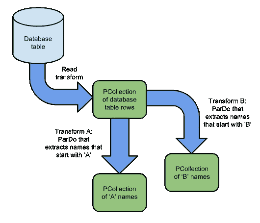

# Apache Beam 实践，用 Python 构建数据管道

> 原文：<https://towardsdatascience.com/hands-on-apache-beam-building-data-pipelines-in-python-6548898b66a5?source=collection_archive---------3----------------------->


Apache Beam 是一个开源 SDK，它允许您从基于批处理或流的集成中构建多个数据管道，并以直接或分布式的方式运行它。您可以在每个管道中添加各种转换。但是 Beam 的真正强大之处在于它不基于特定的计算引擎，因此是平台无关的。您声明您想要使用哪个“跑步者”来计算您的变换。默认情况下，它使用您的本地计算资源，但是您可以指定一个 Spark 引擎或云数据流…

在本文中，我将创建一个接收 csv 文件的管道，计算历史 S&P500 数据集的打开和关闭列的平均值。这里的目标不是给出一个关于 Beam 特性的详细教程，而是给你一个总体的概念，告诉你可以用它做什么，以及它是否值得你更深入地使用 Beam 构建定制管道。虽然我只写批处理，但是流管道是 Beam 的一个强大特性！

Beam 的 SDK 可以用于各种语言，Java，Python…但是在本文中我将重点介绍 Python。


# 装置

在本文发表时，Apache Beam (2.8.1)只与 Python 2.7 兼容，但是 Python 3 版本应该很快就会推出。如果你安装了 python-snappy，Beam 可能会崩溃。这个问题是已知的，将在 Beam 2.9 中修复。

```
pip install apache-beam
```

# 创建接收 CSV 的基本管道

# 数据

在本例中，我们将使用包含标准普尔 500 历史值的 csv。数据看起来是这样的:

```
Date,Open,High,Low,Close,Volume
03–01–00,1469.25,1478,1438.359985,1455.219971,931800000
04–01–00,1455.219971,1455.219971,1397.430054,1399.420044,1009000000
```

# 基本管道

要创建管道，我们需要实例化管道对象，最终传递一些选项，并声明管道的步骤/转换。

```
import apache_beam as beam
from apache_beam.options.pipeline_options import PipelineOptionsoptions = PipelineOptions()
p = beam.Pipeline(options=options)
```

根据梁文档:

> 使用管道选项来配置管道的不同方面，例如将执行管道的管道流道，以及所选流道所需的任何特定于流道的配置。您的管道选项可能包括诸如项目 ID 或文件存储位置等信息。

上面的 PipelineOptions()方法是一个命令行解析器，它将读取通过以下方式传递的任何标准选项:

```
--<option>=<value>
```

# 自定义选项

您还可以构建自己的自定义选项。在这个例子中，我为我的管道设置了一个输入和一个输出文件夹:

```
**class** **MyOptions**(PipelineOptions):@classmethod
  **def** **_add_argparse_args**(cls, parser):
    parser**.**add_argument('--input',
                        help**=**'Input for the pipeline',
                        default**=**'./data/')
    parser**.**add_argument('--output',
                        help**=**'Output for the pipeline',
                        default**=**'./output/')
```

# 转变原则

在 Beam 中，数据被表示为一个***p 集合*** 对象。因此，为了开始接收数据，我们需要从 csv 中读取并将其存储为一个***p 集合*** ，然后我们可以对其应用转换。读取操作被视为一种转换，并遵循所有转换的语法:

```
[Output PCollection] **=** [Input PCollection] **|** [Transform]
```

这些转换可以像这样链接起来:

`[Final Output PCollection] **=** ([Initial Input PCollection] **|** [First Transform]
**|** [Second Transform]
**|** [Third Transform])`

该管道相当于一个*应用*方法。

输入和输出 p 集合以及每个中间 p 集合都被视为单独的数据容器。这允许对同一 PCollection 应用多个转换，因为初始 PCollection 是不可变的。例如:

```
[Output PCollection 1] **=** [Input PCollection] **|** [Transform 1]
[Output PCollection 2] **=** [Input PCollection] **|** [Transform 2]
```

# 读取输入数据和写入输出数据

因此，让我们首先使用提供的一个阅读器来阅读我们的 csv，不要忘记跳过标题行:

```
csv_lines = (p | ReadFromText(input_filename, skip_header_lines=1) |   ...
```

在管道的另一端，我们希望输出一个文本文件。所以让我们使用标准编写器:

```
... **|** beam**.**io**.**WriteToText(output_filename)
```

# 转换

现在我们想对用 Reader 函数创建的 PCollection 应用一些转换。变换分别应用于 PCollection 的每个元素。

根据您选择的工作者，您的转换可以是分布式的。然后在每个节点上执行转换的实例。

> 运行在每个 worker 上的用户代码生成输出元素，这些元素最终被添加到转换生成的最终输出`*PCollection*`中。

Beam 有核心方法(ParDo，Combine ),允许应用自定义转换，但也有预写的转换，称为[复合转换](https://beam.apache.org/documentation/programming-guide/#composite-transforms)。在我们的例子中，我们将使用 ParDo 变换来应用我们自己的函数。

我们已经将 csv 读入到一个***p 集合*** 中，所以让我们将其拆分，以便我们可以访问日期并关闭项目:

```
… beam.ParDo(Split()) …
```

并定义我们的 split 函数，这样我们只保留日期，然后关闭并将其作为 dictionnary 返回:

```
class Split(beam.DoFn):
    def process(self, element):
        Date,Open,High,Low,Close,Volume = element.split(“,”)
        return [{
            ‘Open’: float(Open),
            ‘Close’: float(Close),
        }]
```

现在我们有了需要的数据，我们可以使用一个[标准组合器](https://beam.apache.org/releases/pydoc/2.6.0/_modules/apache_beam/transforms/combiners.html#Mean)来计算整个 p 集合的平均值。

要做的第一件事是将数据表示为一个元组，这样我们就可以按键分组，然后将组合值与它所期望的相结合。为此，我们使用一个自定义函数“CollectOpen()”，它返回一个包含(1，<open_value>)的元组列表。</open_value>

```
class CollectOpen(beam.DoFn):
    def process(self, element):
        # Returns a list of tuples containing Date and Open value
        result = [(1, element[‘Open’])]
        return result
```

元组的第一个参数是固定的，因为我们想要计算整个数据集的平均值，但是您可以使它动态地只在由该键定义的子集上执行下一个转换。

GroupByKey 函数允许创建所有元素的 PCollection，对于这些元素，键(即元组的左侧)是相同的。

```
mean_open = (
    csv_lines | beam.ParDo(CollectOpen()) |
    "Grouping keys Open" >> beam.GroupByKey() |
    "Calculating mean for Open" >> beam.CombineValues(
        beam.combiners.MeanCombineFn()
    )
)
```

当你给一个转换分配一个标签时，确保它是唯一的，否则 Beam 将抛出一个错误。

如果我们想链接所有东西，我们的最终管道可能是这样的:

```
csv_lines = (
    p | beam.io.ReadFromText(input_filename) | 
    beam.ParDo(Split()) |
    beam.ParDo(CollectOpen()) |
    "Grouping keys Open" >> beam.GroupByKey() |
    "Calculating mean" >> beam.CombineValues(
        beam.combiners.MeanCombineFn()
    ) | beam**.**io**.**WriteToText(output_filename)
)
```

但是我们也可以用一种允许在 splitted PCollection 上添加未来变换的方式来编写它(例如像 close 的平均值):

```
csv_lines = (
    p | beam.io.ReadFromText(input_filename) |
    beam.ParDo(Split())
)mean_open = (
    csv_lines | beam.ParDo(CollectOpen()) |
    "Grouping keys Open" >> beam.GroupByKey() |
    "Calculating mean for Open" >> beam.CombineValues(
        beam.combiners.MeanCombineFn()
    )
)output = (
    mean_open | beam**.**io**.**WriteToText(output_filename)
) 
```

# 同一 PCollection 上的多个转换

如果我想在 csv_lines PCollection 上添加另一个转换操作，我将获得第二个“转换的 PCollection”。Beam 以“分支”变换的形式很好地代表了它:



要应用不同的变换，我们需要:

```
csv_lines = (
    p | beam.io.ReadFromText(input_filename) |
    beam.ParDo(Split())
)mean_open = (
    csv_lines | beam.ParDo(CollectOpen()) |
    "Grouping keys Open" >> beam.GroupByKey() |
    "Calculating mean for Open" >> beam.CombineValues(
        beam.combiners.MeanCombineFn()
    )
)mean_close = (
    csv_lines | beam.ParDo(CollectClose()) |
    "Grouping keys Close" >> beam.GroupByKey() |
    "Calculating mean for Close" >> beam.CombineValues(
        beam.combiners.MeanCombineFn()
    )
)
```

但是现在我们有两个 PCollections: mean_open 和 mean_close，作为转换的结果。我们需要合并/连接这些结果，以获得一个可以用 writer 写入文件的集合。Beam 的`CoGroupByKey`就是这么做的。我们的输出将如下所示:

```
output= ( 
    { 
        ‘Mean Open’: mean_open,
        ‘Mean Close’: mean_close
    } | 
    apache_beam.CoGroupByKey() | 
    WriteToText(output_filename))
)
```

我们现在已经定义了端到端的管道。您可以使用我们之前定义的自定义参数通过命令行运行它:

```
python test_beam.py **--**input ./data/sp500.csv **--**output ./output/result.txt 
```

文件中的最终结果如下所示:

```
(1, {‘Mean Close’: [1482.764536822227], ‘Mean Open’: [1482.5682959997862]})
```

# 光束读取器和写入器

在这个例子中，我们只使用了 csv 阅读器和文本编写器，但是 Beam 有更多的连接器(不幸的是，大多数连接器都适用于 Java 平台，但是还有一些 Python 连接器正在开发中)。您可以在以下位置找到可用连接器的列表及其文档:

[](https://beam.apache.org/documentation/io/built-in/) [## 内置 I/O 转换

### Apache Beam 是一个开源、统一的模型和一组特定于语言的 SDK，用于定义和执行数据…

beam.apache.org](https://beam.apache.org/documentation/io/built-in/) 

如果你足够勇敢，你也可以找到一个指南来编写你自己的连接器:

[](https://beam.apache.org/documentation/io/authoring-overview/) [## 创作 I/O 转换-概述

### Apache Beam 是一个开源、统一的模型和一组特定于语言的 SDK，用于定义和执行数据…

beam.apache.org](https://beam.apache.org/documentation/io/authoring-overview/) 

# 创建数据管道时的一般逻辑

每当需要实现数据管道时，我们都希望清楚管道/转换的需求和最终目标。在 Beam 文档中，我找到了这个小摘录，我认为它是开始用 Beam 构建管道时应该如何推理的核心:

> **你输入的数据储存在哪里？**你有几组输入数据？这将决定您需要在管道的开始应用哪种类型的`Read`转换。
> 
> **您的数据是什么样的？**它可能是明文、格式化的日志文件或数据库表中的行。一些波束转换专门作用于键/值对的`PCollection`;您需要确定您的数据是否以及如何被键控，以及如何在您的管道的`PCollection`中最好地表示它。
> 
> **您希望如何处理您的数据？**Beam SDK 中的核心转换是通用的。了解您需要如何更改或操作您的数据将决定您如何构建核心转换，如 [ParDo](https://beam.apache.org/documentation/programming-guide/#pardo) ，或者您何时使用 Beam SDKs 中包含的预先编写的转换。
> 
> **你的输出数据是什么样的，应该放在哪里？**这将决定你需要在你的管道末端应用什么类型的`Write`转换。

# 使用分布式转轮

如前所述，您可以使用 Spark 之类的分布式计算引擎，而不是使用本地计算能力(DirectRunner)。您可以通过为管道选项设置以下选项来实现这一点(在命令行参数或选项列表中):

```
--runner SparkRunner  --sparkMaster spark://host:port
```

更多选项可用[这里](https://beam.apache.org/documentation/runners/spark/)，但这两个是基本的。

# 结论

在编写定制转换时，Beam 是非常低级的，它提供了用户可能需要的灵活性。它速度很快，可以处理云/分布式环境。如果你看一个更高级的 API/SDK，一些像 tf.transform 这样的库实际上是建立在 Beam 之上的，在编码更少的情况下为你提供强大的功能。权衡在于您所寻求的灵活性。

这篇文章的代码可以在 GitHub [这里](https://github.com/vincentteyssier/apache-beam-tutorial)找到。

我希望你喜欢这篇文章。如果你看到了，欢迎鼓掌或关注我:)