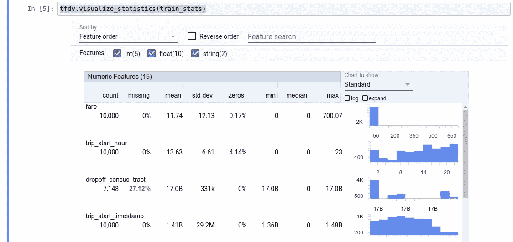
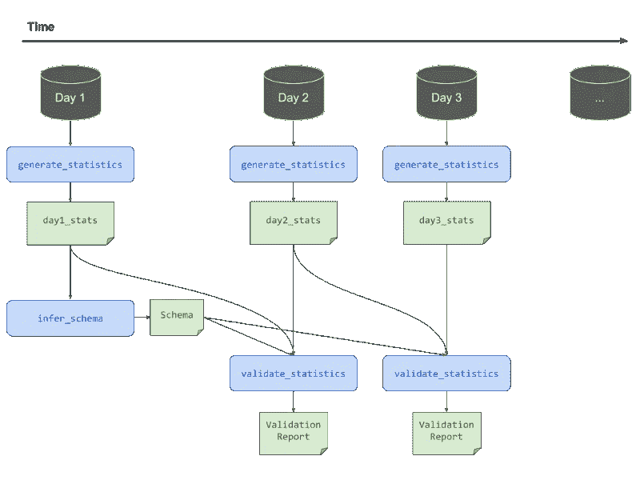
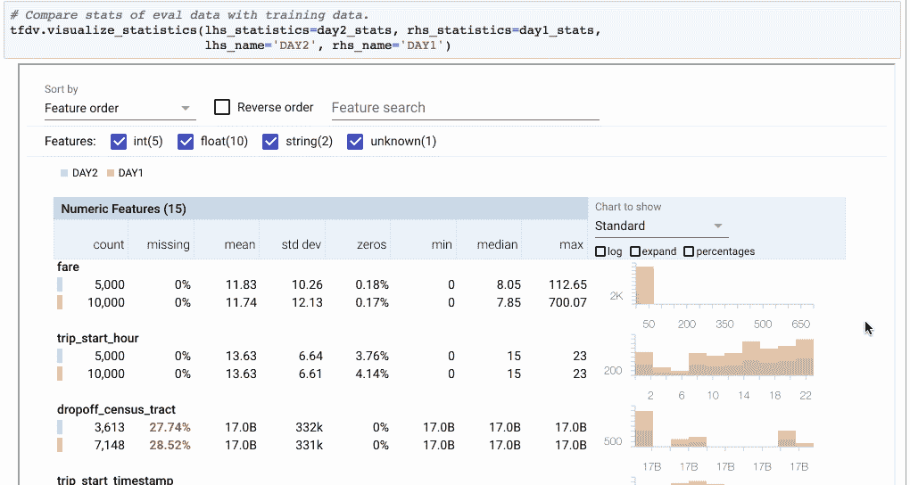
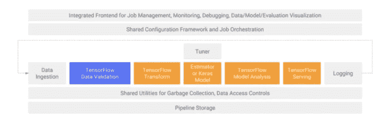

# Tensorflow 数据验证实践

> 原文：<https://towardsdatascience.com/hands-on-tensorflow-data-validation-61e552f123d7?source=collection_archive---------4----------------------->


谷歌刚刚发布了他们的端到端大数据平台新产品 TFDV！数据科学中的一大难题是处理数据质量问题，即数据验证。让我们看看 google 是如何发布第一个版本的，以及这个新库有多有用。

# 1.装置

通过 pip 进行相当标准的安装过程，但是要确保你已经预先安装了一些依赖项，以确保它编译没有问题。就我而言，在 Ubuntu 16.04 上，我缺少 python-dev 和 python-snappy 来获得更快的性能。如果你开始使用 TFX 图书馆，Bazel 也是不错的选择。

```
sudo apt-get install python-dev python-snappy
pip install tensorflow-data-validation
```

这个 TFDV 是一个相当新的库，文档非常漂亮…所以我强烈建议您克隆[库](https://github.com/tensorflow/data-validation.git),看看您使用的每个函数接受什么参数。

# 2.加载数据和生成统计数据:

这里没有火箭科学，我们首先导入库，数据集分析/验证的第一步是在数据集上生成统计数据。我将在这里加载一个 csv 并指定一个分隔符，但是您也可以加载一个 TFRecords。为方便起见，下面是两个函数定义头:

```
import tensorflow_data_validation as tfdv**def generate_statistics_from_csv(** data_location,
column_names = None,
delimiter = ‘,’,
output_path = None,
stats_options = stats_api.StatsOptions(),
pipeline_options = None,):...**def generate_statistics_from_tfrecord(** data_location,
output_path = None,
stats_options = stats_api.StatsOptions(),
pipeline_options = None,):
```

让我们加载并生成我们的统计数据:

```
BASE_DIR = os.getcwd()
DATA_DIR = os.path.join(BASE_DIR, 'data')
TRAIN_DATA = os.path.join(DATA_DIR, 'train.csv')train_stats = tfdv.generate_statistics_from_csv(TRAIN_DATA, delimiter=';')
```

首先要注意的是，该操作非常占用内存。我的数据集只有一个 86Mb 的 csv 文件，但是内存使用量增加了近 1Gb，所以请确保您有大量的可用内存！

# 3.可视化统计数据:

统计数据生成后，您有两个选项来实现它们。您可以使用[**Facets Overview**](https://pair-code.github.io/facets/)**，根据您的平台，安装起来可能会很棘手，或者您可以使用内置的 TFDV 可视化功能，它提供的信息与 Facets 完全相同:**

```
tfdv.visualize_statistics(stats)
```

****

**如果您有大量缺失数据、高标准偏差等，立即发现是非常有用的。然而，我真的很喜欢 [Dive](https://pair-code.github.io/facets/) 模块的方面，它让你以一种非常直观的方式探索你的数据集是什么样子的。**

**到目前为止，没有什么革命性的…但是大事来了…**

# **4.描述您的数据集以供将来验证**

**TFDV 的主要特征是“图式”的概念。这基本上是对您的数据的描述，因此您可以将此描述与新的数据进行匹配，并验证它们…或者不验证。**

**它描述了数据的标准特征，如列数据类型、数据的存在/缺失、预期的值范围。**

**您可以在被视为参考数据集的数据集上创建模式，并可以重用它来验证具有相同结构的其他数据集。**

**一个更有趣的特性是，您可以在 TFTransform 中重用这个模式来自动声明您的数据集结构。**

**这就是事情变得容易的地方…要做到这一点，只有一行代码就足够了:**

```
schema = tfdv.infer_schema(train_stats)
```

**然而，正如它看起来那样简单，Tensorflow 团队提出了一个警告:**

> **通常，TFDV 使用保守的试探法从统计数据中推断稳定的数据属性，以避免模式过度适应特定的数据集。强烈建议**检查推断出的模式，并根据需要对其进行提炼**，以获取 TFDV 的启发式算法可能遗漏的任何有关数据的领域知识。**

**为了存储您的模式，TFDV 使用 protobuf 库，它正在成为操作静态数据(数据结构、转换方案、冻结模型……)的统一方法。**

**如果有一点我们可能都同意，那就是没有一个数据集是完美的。当涉及到验证您的数据时，领域知识是必不可少的，这就是为什么自动化工具是一种独角兽！为了考虑到这一点，TFDV 附带了帮助函数，所以您需要手动硬编码不应从数据集派生的规则。
每个特性都有一组你可以访问和修改的属性。例如，假设我们希望在至少 50%的示例中填充特性 f1，这是通过以下代码行实现的:**

```
tfdv.get_feature(schema, 'f1').presence.min_fraction = 0.5
```

**每个特征由以下部分组成:
特征名称，类型，存在性，化合价，域**

**然后每个组件得到它自己的子组件子集。我不会在这里列出它们，但我能给你的最好建议是解析模式 protobuf，你会发现类似这样的东西:**

```
num_examples:1000000000000000
weighted_num_examples: 1000000000000000
features {
  name: “one_in_a_quadrillion”
  type:INT
  num_stats: {
    common_stats: {
      num_missing: 1
      num_non_missing: 1000000000000000
      min_num_values: 1
      max_num_values: 1
      weighted_common_stats {
        num_non_missing: 1000000000000000
        num_missing: 1
      }
    }
  min: 0.0
  max: 10.0
}
```

**您也可以像这样简单地在笔记本上显示它:**

```
tfdv.display_schema(schema)
```

# **5.验证更新的数据**

**你的“完美的”训练集现在已经描述过了，但是你每天都在不断地获取新的数据到 ETL，并且寻找一种方法来验证新的训练集，这是 TFDV 的核心。使用前面描述的模式/域…它将解析您的新集合并报告异常值、缺失或错误的数据。**

**我认为教程中的图片很好地展示了一个好的管道数据验证链应该是什么样子:**

****

**当您试图为您的模型将数据摄取管道产品化时，这基本上是您试图实现的目标。**

**让我们获取一个新的 CSV 文件，加载它，生成统计数据，并使用之前生成的模式解析它以进行验证:**

```
NEW_DATA = os.path.join(DATA_DIR, 'test.csv')new_csv_stats = tfdv.generate_statistics_from_csv(NEW_DATA, delimiter=';')

anomalies = tfdv.validate_statistics(statistics=new_csv_stats, schema=schema)
```

**然后，您可以通过以下方式显示这些异常:**

```
tfdv.display_anomalies(anomalies)
```

**您将获得一个列表，其中包含以下一条或多条错误消息，这些消息描述了新数据集未满足的条件(已知模式中的预期条件):**

```
Integer larger than 1
BYTES type when expected INT type 
BYTES type when expected STRING type 
FLOAT type when expected INT type 
FLOAT type when expected STRING type 
INT type when expected STRING type 
Integer smaller than 1 
STRING type when expected INT type 
Expected a string, but not the string seen 
BYTES type when expected STRING type 
FLOAT type when expected STRING type 
INT type when expected STRING type 
Invalid UTF8 string observed 
Unexpected string values 
The number of values in a given example is too large 
The fraction of examples containing a feature is too small 
The number of examples containing a feature is too small 
The number of values in a given example is too small 
No examples contain the value 
The feature is present as an empty list 
The feature is repeated in an example, but was expected to be a singleton 
There is a float value that is too high
The type is not FLOAT 
There is a float value that is too low 
The feature is supposed to be floats encoded as strings, but there is a string that is not a float 
The feature is supposed to be floats encoded as strings, but it was some other type (INT, BYTES, FLOAT) 
The type is completely unknown 
There is an unexpectedly large integer 
The type was supposed to be INT, but it was not. 
The feature is supposed to be ints encoded as strings, but some string was not an int. 
The type was supposed to be STRING, but it was not. 
There is an unexpectedly small integer
The feature is supposed to be ints encoded as strings, but it was some other type (INT, BYTES, FLOAT) 
Unknown type in stats proto 
There are no stats for a column at all 
There is a new column that is not in the schema. 
Training serving skew issue 
Expected STRING type, but it was FLOAT. 
Expected STRING type, but it was INT. 
Control data is missing (either training data or previous day). 
Treatment data is missing (either scoring data or current day). 
L infinity between treatment and control is high. 
No examples in the span.
```

**我不得不说我对这里的结果感到有点失望…我知道我们只是在谈论数据验证，但是指向一个错误而不返回包含这些错误的子集感觉有点像未完成的工作。我也知道这个功能是相当昂贵的，如果你从 Talend 或 Alooma 这样的包中获得年度许可，价格在 1 万到 8 万美元之间，你会得到一个很好的流来处理你的缺陷，但我相信 TF 迟早会走这条路！**

**在“异常长描述”一栏中，您还有一些更多的细节，因此您应该对您所拥有的内容的可解释性感到满意。**

**更好的是，如果您认为与模式的偏差是意料之中的，您可以很容易地修改原始模式:**

```
tfdv.get_domain(schema, 'f2').value.append('new_unique_value')
```

# **6.适应不同的数据集配置:**

**您可能希望使用模式定义来验证您的集合，但是根据上下文(在教程示例中，我们采用训练和预测，即标签/无标签)，您可能需要忽略一些条件。这可以通过以下方式实现:**

```
# All features are by default in both TRAINING and SERVING environments.schema.default_environment.append('TRAINING')
schema.default_environment.append('SERVING')

# Specify that labels column is not in SERVING environment.
tfdv.get_feature(schema, 'labels').not_in_environment.append('SERVING')

serving_anomalies_with_env = tfdv.validate_statistics(
        serving_stats, schema, environment='SERVING') 
```

# **7.在可视化工具中比较不同的集合**

**一张图片说明了一切:**

****

**你可以在一个比较可视化中获得以上所有的好处。但是，您只能购买 2 套:**

```
tfdv.visualize_statistics(lhs_statistics=train_stats, rhs_statistics=test_stats, lhs_name=’TRAIN’, rhs_name=’TEST’)
```

# **8.我们在 TF 转换中使用您的模式**

**如前所述，您生成的模式将避免您手动描述您的要素类型。它可以通过以下方式加载到 TFTransform 中:**

```
feature_spec = schema_utils.schema_as_feature_spec(schema).feature_specschema = dataset_schema.from_feature_spec(feature_spec)
```

# **9.最后一个音符**

**我将跳过偏斜和漂移比较器，因为它们是前面解释的逻辑的扩展，您可能希望在 git 中更深入地了解如何在 TFDV 中使用这些特性。两者都很有用！**

**总之，TFDV 正是它所代表的，一个数据验证工具，不多不少，与 Tensorflow 生态系统完美集成，为 TFTransform 提供更多自动化，并完成谷歌试图为机器学习从业者提供的端到端框架。它仍然感觉缺陷处理缺失，但是考虑到已经提供给我们的不同的库来减轻我们的痛点，我相信这很快就会到来！Google 计划的下一个版本是数据摄取模块，然后是作业管理、编排、监控…如下图顶部所示。**

****

**您可以在此找到完整的官方 TFDV 教程:**

 **[## Tensorflow 数据验证入门| TFX | TensorFlow

### 简而言之，模式描述了对“正确”数据的期望，因此可以用来检测数据中的错误…

www.tensorflow.org](https://www.tensorflow.org/tfx/data_validation/get_started)**