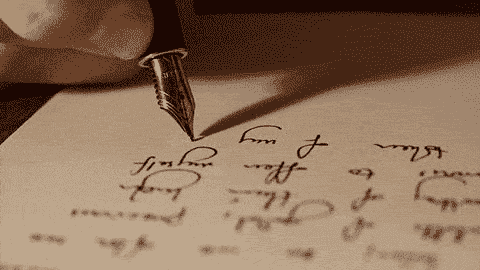
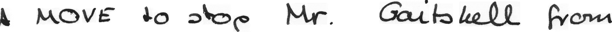
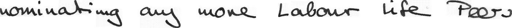
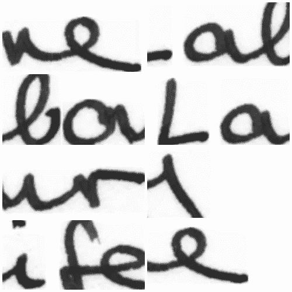
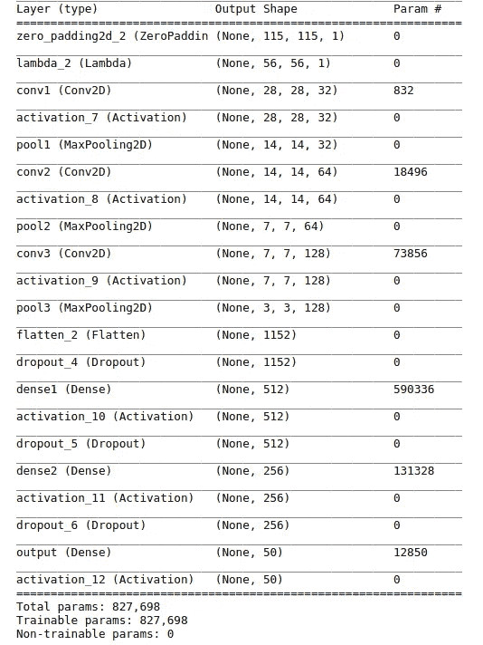
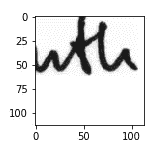
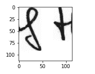

# 使用 Tensorflow 和 Keras 的手写识别

> 原文：<https://towardsdatascience.com/handwriting-recognition-using-tensorflow-and-keras-819b36148fe5?source=collection_archive---------3----------------------->

由于个人书写风格的巨大差异，手写识别(也称为按书写者对每个手写文档进行分类)是一个具有挑战性的问题。解决这一问题的传统方法是提取语言相关特征，如不同字母的曲率、b/w 字母的间距等。然后用 SVM 这样的分类器来区分作家。在博客中，我想展示一种基于深度学习的方法来识别这些特征。我们将把小块手写图像传递给 CNN，并用 softmax 分类损失进行训练。

为了证明这种技术的有效性，让我们用它来对英文手写文本进行分类。

你可以在我的 [Github repo](https://github.com/priya-dwivedi/Deep-Learning/blob/master/handwriting_recognition/English_Writer_Identification.ipynb) 上找到完整的代码

**获取我们的数据**

IAM 手写数据库是最大的英文手写图像数据库。它有 1539 页由 600 多位作者撰写的扫描文本。出于本演示的目的，我们将选取拥有最多数据量的前 50 名作家。对于每个作家来说，数据库是他们写的单个句子的集合。请参见以下一个 writer 的示例:

Sample sentences

神经网络不需要对原始数据进行太多的预处理。因此，我们不会对这些图像进行任何修改，然而，我们不是将完整的图像传递给神经网络，而是传递小块的文本。

**生成补丁数据**

我们希望神经网络能够理解个人作家的写作风格，我们更希望这个神经网络是文本独立的(可以在任何语言上工作)。因此，我们不是传递单个的句子或单词，而是传递随机的文本块。这是通过从每个句子中随机裁剪 113×113 大小的补丁来完成的。下图是 8 个这样的补丁的拼贴画。

Collage of 8 patches

我们可以编写一个生成器函数来移动每个句子，并从中生成随机的图像块。对于每个图像，我们将把补丁的数量限制为可以生成的总补丁的 30%。关于如何编写这个生成器函数的更多信息，请查看我的 [Github repo](https://github.com/priya-dwivedi/Deep-Learning/blob/master/handwriting_recognition/English_Writer_Identification.ipynb) 。

**模型和结果**

为此，我们在 Keras 中使用 Tensorflow backend 构建了一个卷积神经网络(CNN)。我们将使用具有多个卷积和 maxpool 层、几个密集层和一个具有 softmax 激活的最终输出层的标准 CNN。在卷积层和致密层之间使用 RELU 激活，并使用 Adam 优化器优化模型。

模型的大小需要与数据的大小成比例。对于这个问题，三个卷积最大池层块和几个密集层就足够了。请参见下面的模型摘要:

CNN Model Summary

经过一点超参数调整后，我们在测试数据集上损失了 **94%** ,而该模型从未接触过该数据集。

见下面两个补丁，模型归类为同一作家。“t”的形状看起来非常相似，因此也可以直观地感觉到它们属于同一个作者。

**总结**

使用深度学习的手写识别是一种非常强大的技术，原因如下:

*   它会自动识别深层的强大功能
*   我们提供随机补丁的方法使模型文本独立
*   高预测精度使得在实际应用中使用它成为可能

参考

1.  [深度作家为文字独立作家鉴定](https://arxiv.org/pdf/1606.06472.pdf)
2.  [IAM 手写数据库](http://www.fki.inf.unibe.ch/databases/iam-handwriting-database)

SpringML 是谷歌云平台的首要合作伙伴，专注于机器学习和大数据分析。我们已经在多家财富 500 强企业中实施了预测和分析解决方案。请联系了解更多:[info@springml.com](mailto:info@springml.com)，[www.springml.com](http://www.springml.com/)