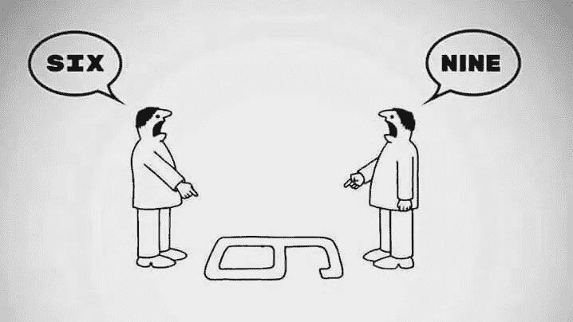
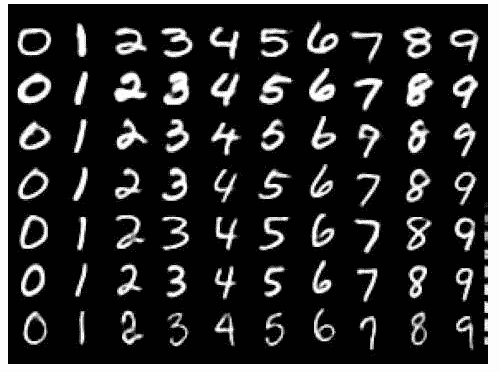
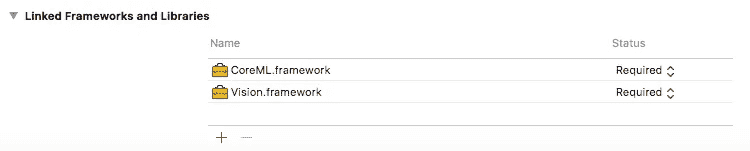
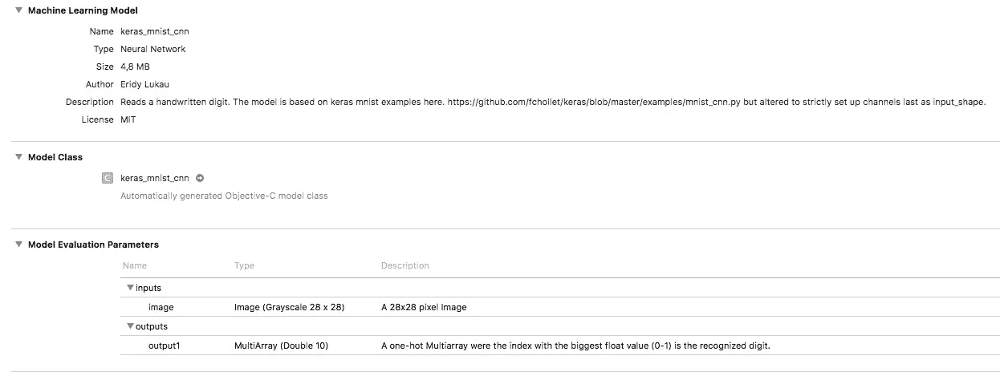
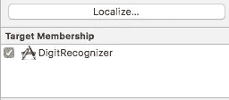
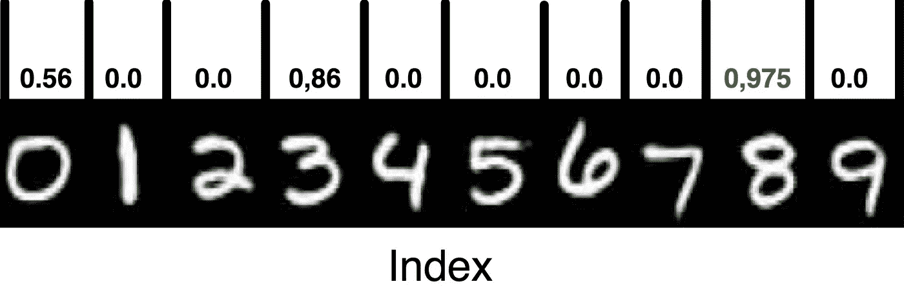
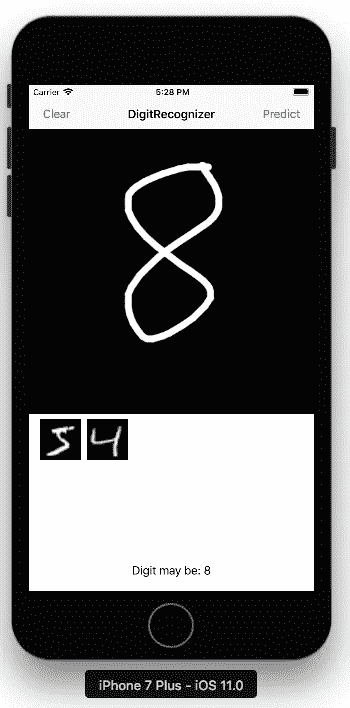

# 使用 Keras 在 iOS 上使用 MNIST 进行手写数字识别

> 原文：<https://towardsdatascience.com/handwritten-digit-recognition-with-mnist-on-ios-with-keras-e85e194f9fa5?source=collection_archive---------1----------------------->

# *或者:如何在 iOS 中使用一个 Keras 深度学习神经网络？*

本教程展示了在 Tensorflow 上使用 [Keras](https://keras.io) 构建和训练的卷积神经网络模型的使用。我将展示如何将该模型集成到 iOS 中，并通过 apple 为 iOS11 引入的新 CoreML 和 Vision Api 在代码中访问该模型(本教程中为 Objective-C)。我在 mnist 数据集上训练了这个模型，以便创建一个可以识别手写数字的应用程序。

> **对于那些 TL；博士:我感觉你- >** [**下面是代码！**](https://github.com/boaerosuke/digitrecognition_ios)

对于那些不熟悉 Tensorflow 和 Keras 的人，我建议从那里开始尝试一些教程和代码，然后再回到这里。

对于那些对深度学习主题完全陌生的人，我肯定会推荐你去看看 [Sentdex](https://www.youtube.com/watch?v=oYbVFhK_olY) 、 [Siraj](https://www.youtube.com/channel/UCWN3xxRkmTPmbKwht9FuE5A) 来自 [Machine Learning Mastery](http://machinelearningmastery.com/blog/) 或 [deepschool.io](http://www.deepschool.io) 的家伙们的一些不错的 Keras 教程，然后再回到这里。

在我们开始之前:这里有一些关于我如何为这个教程设置我的工作站的提示。在继续学习本教程之前，请确保您的计算机上已经运行了所有这些程序。安装过程可能需要一些时间，所以请确保你没有和你的另一半计划冲突😉

**本教程的先决条件:**

*   [Tensorflow(版本 1.2.1)](https://www.tensorflow.org/install/)
*   Python 2.7
*   [Keras 2(版本 2.0.6)](https://keras.io)
*   [coremltools(版本 0.5.1)](https://pypi.python.org/pypi/coremltools)
*   MacOS Sierra 10.12.4+
*   Xcode 9 Beta(开发者帐户可用)
*   iOS 11 测试版(如果你想在 iPhone 上测试，可以选择。模拟器完全足够)

## 好吧，如果你做到了这一点，有些东西你会很熟悉，这真的很好！

## KERAS + MNIST 数据集

> 如何在 Keras 中加载和训练 MNIST 数据集？

Keras 框架已经提供了一个可以下载的 MNIST 数据集。它包含 60，000 张手写图像，可用于训练神经网络。请参见 MNIST 数据集中手写数字的一些示例。

Handwritten Digits from the MNIST dataset

您可以自由选择构建您自己的模型，并实现您自己的卷积网络或您在 Keras 中构建的任何其他网络或模型。但是为了加快速度，[下载](https://github.com/fchollet/keras/blob/master/examples/mnist_cnn.py)Keras github 仓库中的卷积网络 mnist 示例。这是一个完全可行的例子，可以用来玩和学习。它下载 mnist 数据集并重塑矩阵，以适应神经网络。我在我的 Mac 上训练了这个模型，花了将近一个小时，因为我没有安装带 GPU 支持的 TensorFlow。

如果您下载了 **cnn_example_mnist.py** ，请确保进行以下更改:

## 1.检查输入形状

数据的 **input_shape** 应该定义为***channels _ last****。*这将确保 CoreML 能够识别模型的输入数据，从而能够将 **CIImages** 传递给模型。否则你需要知道如何将一个 **UIImage** 转换成一个 **MLMultiarray** 来将你的图像传递给模型。

由于模型将在 **28x28 大小的图像**上训练，请记住，我们将在稍后的应用程序代码中采用该大小的图像。

## 2.保存模型

> 如何在 Keras 中保存我训练好的 mnist 模型？

在您训练您的模型之前，请确保它将在完成训练后自动保存。在代码的最后添加这一行。

Keras 提供这个调用来保存训练好的模型。如果你已经完成了，你就可以运行这个脚本了。它将下载，训练和保存您的新模型在同一个目录中。

## KERAS + coremltools

> 如何将我训练好的 keras .h5 模型转换成 CoreML？mlmodel？

幸运的是，苹果支持用 Keras 构建的机器学习模型。然而，本教程发布时的 coremltools 版本并不正式支持 Keras 2.0.6。但它仍然有效！我面临的唯一问题是将**输出 _ 描述**定义为与 ***输出 1*** 不同的东西。

> 如果你知道如何解决这个问题，请写在评论中，我会更新代码

**谈论模型的输出:**模型将输出一个*独热数组*，其槽数与我们拥有的类数一样多。在 iOS 中，输出将是一个 MLMultiArray，它相当于 Numpy 数组。

复制这段代码并编辑作者字段。coreml_model 使得向模型中添加一些元信息成为可能，这样如果你分享你的模型，那些支持你的模型的人就知道如何使用它。稍后我们将看到这将如何在我们的 Xcode 项目中显示。

如果您在转换由某些字段引起的模型时遇到问题，您也可以省去它们，只使用***coreml _ model . save(' keras _ mnist _ CNN . ml model ')***

> **此时你应该已经转换了。您目录中的 mlmodel。如果有，就好好享受，休息一下。**

## **。mlmodel + Xcode**

1.  现在开始一个新的 Xcode 项目，选择**单视图应用**
2.  想怎么命名就怎么命名，并确保语言设置为**目标-C**
3.  现在在你的**项目导航器左侧**点击你的项目。在 **General** 下向下滚动到**链接的框架和库。**这是您添加 CoreML 框架和 Vision 框架的地方。

4.点击 **cmd+b** 来测试你的项目是否设置正确，是否可以正确构建。如果成功，只需拖动新创建的。mlmodel 到项目中。Xcode 9 能够将其识别为 mlmodel。如果您在项目导航器中单击它，它将如下所示:

看到我们在 coremltools 脚本中传递的信息了吗？很酷吧？

**注意:如果您的 Xcode 无法识别型号，并向您显示类似这张图片的内容，那么您可能没有使用 Xcode 9**

如果你的模型的输入是一个多阵列而不是一个图像，那么你应该仔细检查你的模型的输入形状是否真的被设置到**通道最后**，如上所述**。**

您还应该确保在转换脚本中正确初始化了 coremlmodel，并正确设置了 **input_names=['image']** 和**image _ input _ names = ' image '**。

Xcode 应该自动生成 mlmodel 的 Objective-C 模型类。如果不是:

> 为什么 Xcode 没有生成我的 Objective-C 模型类？

我还不知道，可能是个 bug。但是要修复它，只需点击右边的复选框，将模型添加到目标中。这将触发构建过程并生成模型类。

## 绘图应用程序

你可以选择[在 github](https://github.com/boaerosuke/digitrecognition_ios) 上下载我的代码，然后摆弄这些代码，或者参考位于 raywenderlich.com[的旧的黄金绘图应用教程，然后完全自己构建它(这是我一直推荐的)。](https://www.raywenderlich.com/18840/how-to-make-a-simple-drawing-app-with-uikit)

在这一点上，你应该通过检查我的代码或自己构建应用程序来理解如何用手指在嵌入在 UIImageView 中的 UIImage 上书写。

## **图像预测**

对于下一步，我们首先从清单开始:

*   您已经在 Xcode 项目中正确设置了模型
*   模型输入是 28x28 灰度图像
*   模型输出是一个大小为 10 倍的多阵列
*   如上所述，您已经将 CoreML 框架和 Vision 框架导入到您的项目中
*   您有一个 UIImageView，可以用手指在上面进行绘制

**预测过程如下:**导入 **CoreML.h** 和 **Vision.h** 的头文件以及自动生成的模型类的头文件:

当我测试应用程序时，我发现如果我们在将图像传递到视觉框架之前，自己将图像缩小到 28x28，我们会获得更好的预测结果。尽管框架会自动为我们进行缩放。您可以使用这个助手方法无缝地将 UIImage 缩放到所需的大小:

在我们缩放了 **UIImage** 之后，它需要被转换成 **CIImage** 这是我们需要的格式，以便将其传递给视觉框架。

在缩放和转换图像之后，我们使用 **MLModel** 类来初始化我们自己创建的模型，作为它的 **MLModel** 版本。这将被传递给我们的 **VNCoreMLModel** ，它将被 Vision 框架使用。

既然我们已经创建了图像和模型，我们需要构建预测请求。我们将使用 **VNCoreMLRequest** 并用我们新构建的 **VNCoreMLModel** 初始化它。该请求用 completition handler 初始化，该处理器接收我们的深度学习模型的预测结果。

现在棘手的是:

> 如何从 CoreML Vision framework 获得一个热门的多阵列预测结果？

当任务完成时，completition 处理程序中的 **VNRequest** 在其*结果数组*属性中携带结果。在大多数情况下，数组中的每个结果都是所谓的**VNCoreMLFeatureValueObservation。这就是我们要找的东西。这个观察类包含一个 **MLFeature** ，我们可以通过观察 *featureValue* 属性检索它。而那个*特征值*的**多数组值**就是我们想要的 10 长度双多数组输出 1。**

*瞧！*🎉

由于在我们的多阵列中有 10 个从 0 到 9 的神经元，与其他神经元相比，激发最多的神经元也具有最高的 double 值。该神经元在多阵列中的位置表示模型预测的数量。因此，如果最高值在索引 8 处，则预测数也是 8，以此类推。

One-Hot Array Values

现在，我们已经准备好了请求，也知道了如何获得结果，我们已经准备好了图像，我们可以组合所有内容并开始执行请求。

我们初始化一个 **VNImageRequestHandler** ，它接受我们之前创建的 **CIImage** 和一个包含图像选项的字典(我创建字典是为了将它传递给处理程序，但将它留空，因为我认为这里不需要选项)。

我们现在可以在新创建的请求处理器上调用 *performRequests* ,并将放入数组中的请求传递给它。

就是这样！VNImageHandler 将启动请求并调用 completition 处理程序，让我们知道我们的模型在想什么。

## 下面是完整的 predictDigit 方法:

现在，如果我们测试应用程序，它可能会检测到至少一些我们在屏幕上绘制的数字，但不是所有的数字。请随意改进模型或使用更好的模型。请在评论中告诉我们。

为了测试问题，我添加了原始 mnist 数据集的两个图像。它们总是被正确预测。

> 为什么要用黑色背景和白色来画画？

这纯粹是为了改进预测。mnist 数据集主要是深色背景上的白色数字。即使输入图像被转换成灰度，我们对训练集的输入越熟悉，得到的结果就越好。但是，如果我们只是在另一个训练集上训练我们的模型，使它独立于颜色，这可以得到改善。但就目前而言，我认为在 iOS 上尝试深度学习是一个良好的开端。

# 下一步是什么？

尝试示例应用程序。使用 Keras 构建您自己的模型，并将其传递给示例应用程序。你现在已经有了解决几个机器学习问题的工具。关于核心 ML 的更多信息和一个将 **caffemodel** 集成到 iOS 的例子，我强烈推荐[gal Foppolo](https://medium.com/towards-data-science/introduction-to-core-ml-conversion-tool-d1466bf10018)的教程。

另一个类似的项目可以在[这里](https://github.com/hwchong/MNIST_DRAW)找到。这个程序使用从 UIImage 到 MLMultiarray 的转换作为输入，并使用这里的相同模型接收可比较的结果，所以也去看看这个程序吧！

## 希望这篇教程对 iOS 上刚接触深度学习和神经网络的人有所帮助。现在继续制作你自己的机器学习应用程序吧！

 [## boaerosuke/digitre cognition _ IOs

### digitrecognition_ios -使用 Tensorflow/Keras 的深度学习:基于 mnist-dataset 和卷积的数字识别…

github.com](https://github.com/boaerosuke/digitrecognition_ios)