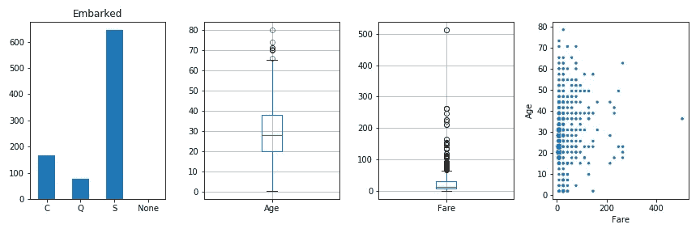
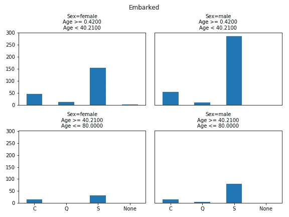
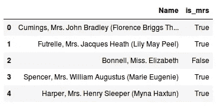
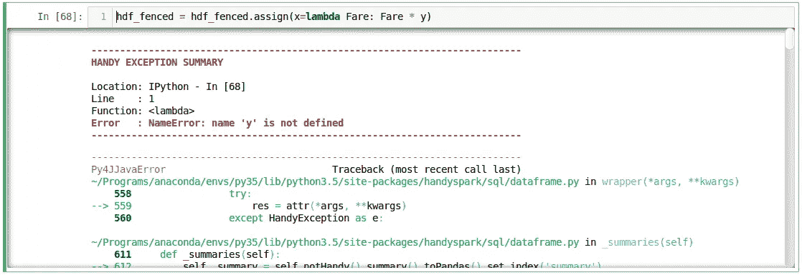
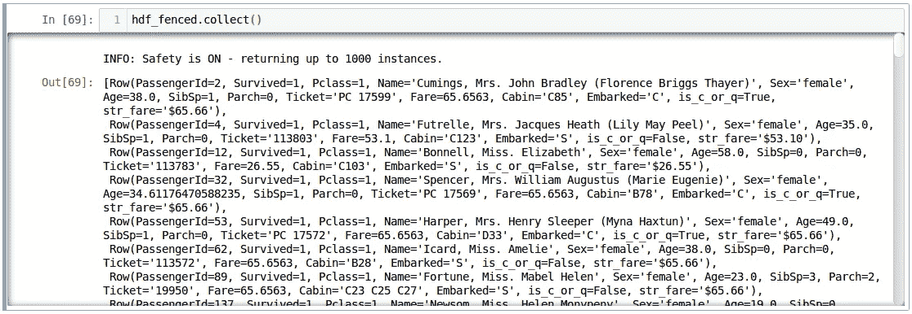

# HandySpark:让熊猫般的能力点燃数据框架

> 原文：<https://towardsdatascience.com/handyspark-bringing-pandas-like-capabilities-to-spark-dataframes-5f1bcea9039e?source=collection_archive---------5----------------------->


“Panda statues on gray concrete stairs during daytime” by [chuttersnap](https://unsplash.com/@chuttersnap?utm_source=medium&utm_medium=referral) on [Unsplash](https://unsplash.com?utm_source=medium&utm_medium=referral)

# TLDR；

**HandySpark** 是一个新的 Python 包，旨在改善 *PySpark* 的用户体验，特别是当涉及到**探索性数据分析**时，包括**可视化**功能。

> 更新(2019 年 3 月 9 日):版本 **0.2.0** 今天发布，包括分层操作的性能改进和 BinaryClassificationMetrics 的扩展版本——更多详细信息，请查看发布说明[此处](https://github.com/dvgodoy/handyspark/releases/tag/v0.2.0a1)。

使用 Google Colab 亲自尝试一下:

[](https://colab.research.google.com/github/dvgodoy/handyspark/blob/master/notebooks/Exploring_Titanic.ipynb) [## 谷歌联合实验室

### 使用 HandySpark 探索泰坦尼克号

colab.research.google.com](https://colab.research.google.com/github/dvgodoy/handyspark/blob/master/notebooks/Exploring_Titanic.ipynb) 

检查存储库:

[](https://github.com/dvgodoy/handyspark) [## dvgodoy/handyspark

### HandySpark -带来熊猫般的能力来激发数据帧

github.com](https://github.com/dvgodoy/handyspark) 

# 介绍

**Apache Spark** 是最流行的集群计算框架。约有 **30%的工作清单** ( [链接](/the-most-in-demand-skills-for-data-scientists-4a4a8db896db))将其列为必备技能。

大多数数据科学家使用 **Python** 和**熊猫**、事实上的标准*来操作数据。因此，他们想要使用**py Spark**——Spark Python API，当然还有 **Spark DataFrames** ，这是合乎逻辑的。*

但是，从**熊猫**到**星火数据帧**的过渡可能不像人们希望的那样顺利…

# 动机

两年来，我一直在数据科学务虚会上使用 Apache Spark 向 100 多名学生教授应用机器学习。

我的学生经常对 **PySpark** 的一些*怪癖*感到困惑，还有一些时候，在使用传统的 *Pandas/Scikit-Learn* 组合时，对*缺少一些科学家认为理所当然的功能*数据感到困惑。

我决定通过**开发**一个 Python 包来解决这些问题，这个包将使**PySpark**中的探索性数据分析变得更加容易……

# HandySpark 简介

**HandySpark** 非常容易安装并集成到您的 *PySpark* 工作流程中。只需 3 个步骤就能让你的数据框成为**手办框**:

1.  使用`pip install handyspark`安装**手动停车**
2.  用`from handyspark import *`导入**手动停车**
3.  用`hdf = df.toHandy()`将你的*数据框*变成**手持框**

导入 **HandySpark** 后，方法`toHandy`作为扩展被添加到 *Spark 的数据框架*中，所以你可以直接调用它。

让我们快速浏览一下你可以用 **HandySpark** :-)

## 1.获取数据

不再需要从`Row`对象中进行繁琐的列选择、收集和手动提取！

现在你可以像在熊猫身上一样获取数据，使用`**cols**`:

`hdf.cols['Name'][:5]`

```
0                              Braund, Mr. Owen Harris
1    Cumings, Mrs. John Bradley (Florence Briggs Th...
2                               Heikkinen, Miss. Laina
3         Futrelle, Mrs. Jacques Heath (Lily May Peel)
4                             Allen, Mr. William Henry
Name: Name, dtype: object
```

简单多了，对吧？结果就是一个*熊猫系列！*

> 请记住，由于 Spark 中数据的分布式性质，**只可能获取任何给定 **HandyFrame** 的顶部行**——所以，不，您仍然*不能*做类似于`[3:5]`或`[-1]`等等的事情…只有`[:N]`。

还有其他类似熊猫的方法:

`hdf.cols['Embarked'].value_counts(dropna=False)`

```
S      644
C      168
Q       77
NaN      2
Name: Embarked, dtype: int64
```

如果你还没有猜到，上面的例子(以及这篇文章中的所有其他例子)是使用著名的**泰坦尼克号**数据集构建的:-)

## 2.绘图数据

缺乏一种简单的可视化数据的方法总是困扰着我的学生。而且，当人们在网上搜索使用 *PySpark* 绘制数据的例子时，更糟糕的是**T42:*许多许多教程只是简单地将整个数据集转换成熊猫*然后以传统方式绘制。**

求求你，**千万别这么做**！它肯定可以处理玩具数据集，但如果用于真正大的数据集(如果您使用 Spark，很可能会处理这些数据集)，它会失败得很惨。

**HandySpark** 通过*使用 Spark 的分布式计算能力*正确计算统计数据，然后将结果转化为图表，从而解决了这个问题。然后，事情变得很简单:

```
fig, axs = plt.subplots(1, 4, figsize=(12, 4))
hdf.cols['Embarked'].hist(ax=axs[0])
hdf.cols['Age'].boxplot(ax=axs[1])
hdf.cols['Fare'].boxplot(ax=axs[2])
hdf.cols[['Fare', 'Age']].scatterplot(ax=axs[3])
```



Plotting with HandySpark!

是的，甚至还有**散点图**！这怎么可能呢？！ **HandySpark** 将两个特征分别分成 30 个箱，计算 900 个组合中每一个的频率，并绘制相应大小的圆。

## 3.分层

如果您想使用**分割-应用-组合**方法执行**分层**操作，该怎么办？可能想到的第一个想法是使用 **groupby** 操作…但是 **groupby** 操作会在 Spark 中触发**可怕的数据洗牌**，所以应该避免使用。

**HandySpark** 通过相应地过滤行，对数据的每个子集执行计算，然后组合结果来处理这个问题。例如:

```
hdf.stratify(['Pclass']).cols['Embarked'].value_counts()Pclass  Embarked
1       C            85
        Q             2
        S           127
2       C            17
        Q             3
        S           164
3       C            66
        Q            72
        S           353
Name: value_counts, dtype: int64
```

您还可以通过利用**桶**或**分位数**对象，用非分类列对其进行**分层。然后在**分层图**中使用它:**

```
hdf.stratify(['Sex', Bucket('Age', 2)]).cols['Embarked'].hist()
```



Stratified histogram

## 4.输入缺失值

> “你应该估算缺失的值”

不过，首先要做的是。有多少缺失值？

```
hdf.isnull(ratio=True)PassengerId    0.000000
Survived       0.000000
Pclass         0.000000
Name           0.000000
Sex            0.000000
Age            0.198653
SibSp          0.000000
Parch          0.000000
Ticket         0.000000
Fare           0.000000
Cabin          0.771044
Embarked       0.002245
Name: missing(ratio), dtype: float64
```

好了，现在我们知道有 3 列缺少值。让我们去掉`Cabin`(毕竟，它的 77%的值都丢失了)，把注意力放在另外两列值的插补上:`Age`和`Embarked.`

> 在版本 2.2.0 发布[插补器](http://spark.apache.org/docs/2.3.2/api/python/pyspark.ml.html#pyspark.ml.feature.Imputer)转换器之前，缺失值的插补无法集成到 Spark *管道*中。但是它仍然不能处理分类变量(如`Embarked`)，更不用说分层插补了…

让我们看看 **HandySpark** 如何帮助我们完成这项任务:

```
hdf_filled = hdf.fill(categorical=['Embarked'])
hdf_filled = (hdf_filled.stratify(['Pclass', 'Sex'])
              .fill(continuous=['Age'], strategy=['mean']))
```

首先，它使用**最常见的值**来填充**分类**列中缺失的值。然后，**根据`Pclass`和`Sex`对数据集**进行分层，以**计算`Age`的平均值**，该平均值将用于插补。

它使用了哪些值进行插补？

```
hdf_filled.statistics_{'Age': {'Pclass == "1" and Sex == "female"': 34.61176470588235,
  'Pclass == "1" and Sex == "male"': 41.28138613861386,
  'Pclass == "2" and Sex == "female"': 28.722972972972972,
  'Pclass == "2" and Sex == "male"': 30.74070707070707,
  'Pclass == "3" and Sex == "female"': 21.75,
  'Pclass == "3" and Sex == "male"': 26.507588932806325},
 'Embarked': 'S'}
```

到目前为止，一切顺利！是时候**将**整合到一个火花*管道*中，生成一个**自定义变压器**与`**transformers**`:

```
imputer = hdf_filled.transformers.imputer()
```

**估算器**对象现在是一个成熟的**可序列化 PySpark 转换器**！那是什么意思？你可以随意在你的*管道*和*保存/加载*中使用:-)

## 5.检测异常值

> “你不能通过！”

我们不应该让多少异常值通过？

```
hdf_filled.outliers(method='tukey', k=3.)PassengerId      0.0
Survived         0.0
Pclass           0.0
Age              1.0
SibSp           12.0
Parch          213.0
Fare            53.0
dtype: float64
```

目前只有 [***Tukey 的***](https://en.wikipedia.org/wiki/Outlier#Tukey's_fences) **方法**可用(我正在做 *Mahalanobis* *距离*！).该方法采用可选的 ***k*** 参数，您可以将其设置为更大的值(如 3)以允许更宽松的检测。

以`Fare`列为例。根据 Tukey 的方法，有 *53 个异常值*。咱们**栅栏**他们！

```
hdf_fenced = hdf_filled.fence(['Fare'])
```

*下*和*上*栅栏值是多少？

```
hdf_fenced.fences_{'Fare': [-26.7605, 65.6563]}
```

记住，如果你愿意，你也可以进行**分层击剑** :-)

您可能已经猜到了，您也可以**将**这一步集成到您的*管道*中，生成相应的**转换器**:

```
fencer = hdf_fenced.transformers.fencer()
```

## 6.熊猫功能

在 Spark 2.3 中，[熊猫 UDF](https://databricks.com/blog/2017/10/30/introducing-vectorized-udfs-for-pyspark.html)发布了！这对我们 *PySpark* 用户来说是一个**重大改进**，因为我们终于可以克服传统*用户定义函数*(UDF)带来的*性能瓶颈*。**牛逼**！

**HandySpark** 更进一步，为你做所有繁重的工作:-)你只需要使用它的`**pandas**`对象和*voilà*——熊猫的许多功能立即可用！

例如，让我们使用`[isin](https://pandas.pydata.org/pandas-docs/stable/generated/pandas.DataFrame.isin.html)`，就像你使用普通的*熊猫系列*一样:

```
some_ports = hdf_fenced.pandas['Embarked'].isin(values=['C', 'Q'])
some_portsColumn<b'udf(Embarked) AS `<lambda>(Embarked,)`'>
```

但是，记住 Spark 有**懒评**，所以结果是一个**列表达式**，它利用了**熊猫 UDF**的力量。剩下唯一要做的就是实际上**将**结果分配到一个新列，对吗？

```
hdf_fenced = hdf_fenced.assign(is_c_or_q=some_ports)
# What's in there?
hdf_fenced.cols['is_c_or_q'][:5]0     True
1    False
2    False
3     True
4     True
Name: is_c_or_q, dtype: bool
```

你说得对！ **HandyFrame** 有一个非常方便的**赋值**方法，就像在*熊猫*里一样！

**而且这还不是全部**！来自*熊猫*的特殊化`**str**`和`**dt**`物品同样可用！例如，如果一个给定的字符串包含另一个子字符串，您希望**查找**该怎么办？

```
col_mrs = hdf_fenced.pandas['Name'].str.find(sub='Mrs.')
hdf_fenced = hdf_fenced.assign(is_mrs=col_mrs > 0)
```



有关所有支持功能的完整列表，请查看[库](https://github.com/dvgodoy/handyspark)。

## 7.您自己的 UDF

天空才是极限！您可以创建**常规 Python 函数**并使用**赋值**创建新列:-)，它们将为您变成**熊猫 UDF**！

您的函数(或`lambda`)的参数应该有您想要使用的列的名称。比如说`Fare`的`log`:

```
import numpy as np
hdf_fenced = hdf_fenced.assign(logFare=lambda Fare: np.log(Fare + 1))
```

您也可以使用接受多列作为参数的函数。请记住，默认的**返回类型**，即新列的数据类型，将与使用的第一列相同(在示例中为`Fare`)。

也可以指定**不同的返回类型**——请查看[库](https://github.com/dvgodoy/handyspark)中的示例。

## 8.更好的例外

Spark 异常是 **loooong** …无论什么时候出现故障，错误*都会通过看似无限的层冒出*！

我总是建议我的学生将*一直向下滚动到*，然后向上滚动，试图找出问题的根源……但是，**不再是了**！

**HandySpark** 将解析错误，并在**顶部** :-)向您显示一个**漂亮而醒目的红色摘要**，它可能不完美，但肯定会有所帮助！



Handy Exception

## 9.安全第一

一些数据帧操作，如`collect`或`toPandas`将*触发*检索数据帧的所有*行！*

为了防止这些动作的不良副作用， **HandySpark** 实现了一个**安全**机制！它将自动**限制输出**为 1000 行:



Safety mechanism in action!

当然，你可以用`**set_safety_limit**`指定一个**不同的极限**或者豁出去告诉你的**手柄**到**忽略**安全使用`**safety_off**`。关闭安全机制对**单次动作**有好处，因为它会在返回请求的无限结果后**返回**。

# 最后的想法

我的目标是**改善 PySpark 用户体验**并允许从*熊猫*到 *Spark 数据帧*的**更平滑的** **过渡**，使得执行**探索性数据分析**和**可视化**数据更加容易。不用说，这是一项正在进行的工作，我已经计划了更多的改进。

如果你是使用 *PySpark* 的数据科学家，我希望你尝试一下 **HandySpark** 并**让我知道你对它的想法:-)**

[](https://github.com/dvgodoy/handyspark) [## dvgodoy/handyspark

### HandySpark -带来熊猫般的能力来激发数据帧

github.com](https://github.com/dvgodoy/handyspark) 

*如果你有什么想法、评论或者问题，请在下方留言或者联系我* [*推特*](https://twitter.com/dvgodoy) *。*