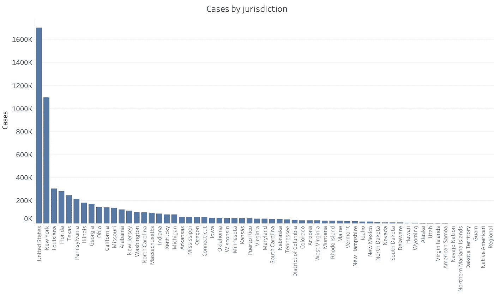
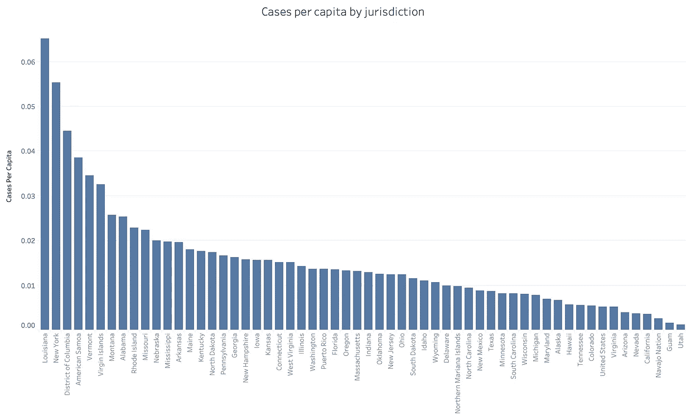
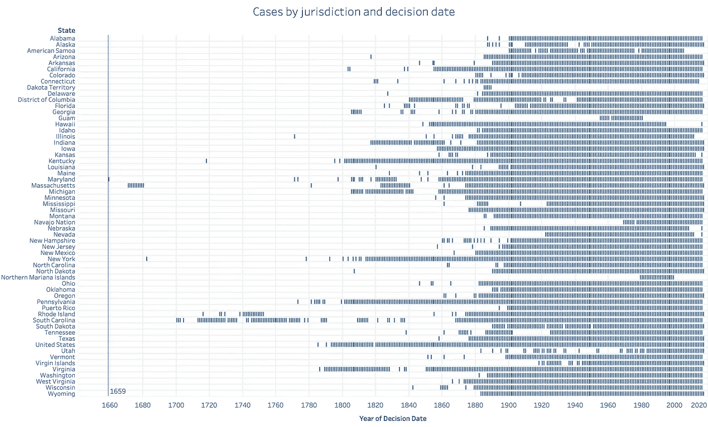
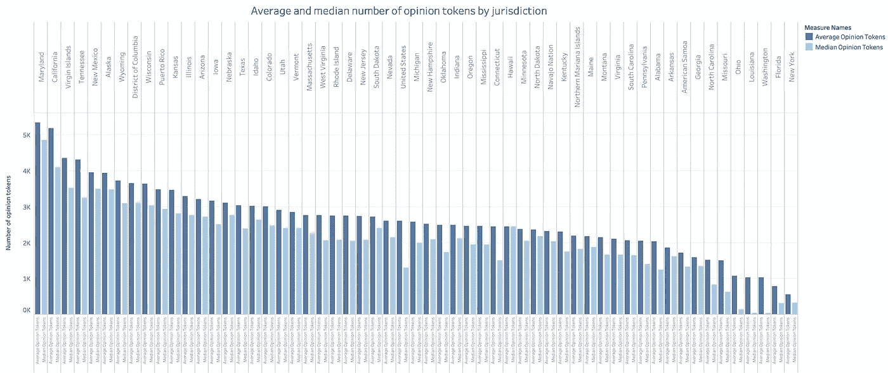
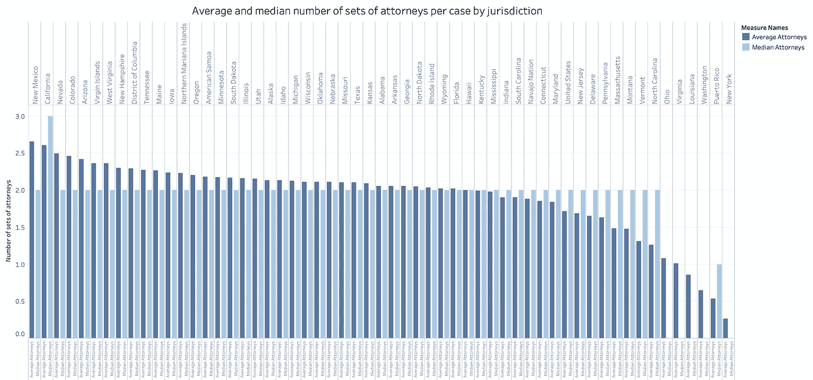

# 哈佛判例法系统访问项目数据

> 原文：<https://towardsdatascience.com/harvard-caselaw-access-project-data-by-the-numbers-4f95f5b2b30a?source=collection_archive---------20----------------------->

2018 年 10 月 31 日，哈佛法学院图书馆的[图书馆创新实验室](https://lil.law.harvard.edu/)将近 650 万份美国法院案例[免费在线提供](https://case.law/)。这为法律技术领域的初创企业、老牌公司和研究人员提供了一个前所未有的机会，将机器学习方法应用于大量法律文档。

这篇文章提供了数据集中所有案例的案例摘要统计。统计数据基于截至 2018 年 11 月 15 日所有辖区*的手动批量下载。正如哈佛判例法团队所确认的那样，一些批量文件不包括最新的 2018 年数据，并将很快更新——我将及时更新这篇帖子。*

总共有 **6，454，632 个案例**，分布在 **61 个司法管辖区**，包括“美国”(即联邦案例)和一些没有数据的司法管辖区(“美洲原住民”和“地区”)。

“美国”管辖区有超过 170 万起案件，其次是纽约州近 110 万起，路易斯安那州略多于 30 万起。按辖区划分的案件数量分布如下图所示。

Distribution of the number of cases by jurisdiction.

相对于 2017 年的州人口，**路易斯安那州的人均病例数最高**，其次是纽约和哥伦比亚特区。

Cases per capita and jurisdiction.

**大多数案件发生在 1990 年以后**，这意味着它们的相关裁决日期大约在 1990 年或更近。在此之前，数据相当稀少，可以追溯到马里兰州的一个案件，判决日期为 1659 年。达科他州包括 1885 年到 1889 年之间的案例——该州实际上从 1861 年到 1889 年就存在了。关岛的领土包括 1955 年到 1980 年的案件，1969 年到今天的纳瓦霍部落和 1979 年到 1999 年的北马里亚纳群岛。按管辖区和判决日期年份划分的案件分布如下图所示。

Cases by jurisdiction and decision date year.

案件通常包含意见，意见是由一名法官(或一组法官)作出的书面解释，描述了裁决的理性和法律原则。意见根据手头的案例解释法律，因此为法律学者提供了一个有趣的机会。**马里兰州和加利福尼亚州的法官倾向于撰写最长的意见，平均每份意见超过 5000 个标记。**按管辖区降序排列的单一意见中包含的标记的平均数和中位数如下图所示。

Average and median number of tokens contained in a single opinion by jurisdiction in decreasing order.

最后，每个案件的律师人数一般为 2 人，每方一人。不过，新墨西哥州和加利福尼亚州的案件平均有超过 2.5 组律师，而路易斯安那州、华盛顿、波多黎各和纽约的案件平均只有不到一名律师。注意，每组代理人可能由任意数量的代理人组成，我在这里没有画出。每个案件和司法管辖区的平均和中位数律师人数如下图所示。

Average and median number of sets of attorneys per case and jurisdiction.

特别是哈佛案例数据库的“观点”部分为有趣的发现提供了更多的机会。这篇文章提供了对这个丰富的法律数据集的第一手见解。它有望为计划使用这些数据的数据科学家提供一个开端。

> 你将使用哈佛判例法数据做什么？