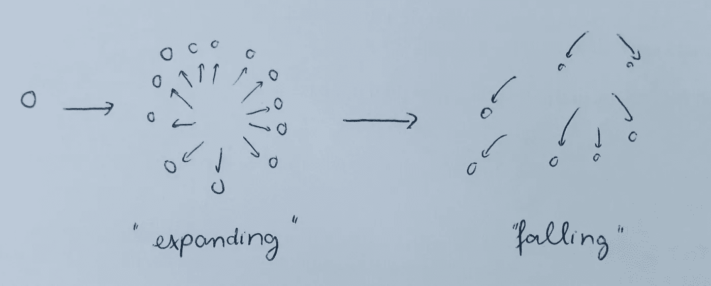
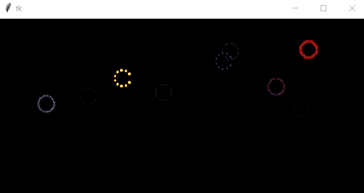

# 我如何用 Python 和 Tkinter 构建我自己的梅西烟火秀

> 原文：<https://towardsdatascience.com/having-your-own-fun-how-to-build-your-own-macys-firework-show-with-python-and-tkinter-79cc31631b44?source=collection_archive---------4----------------------->

*用一些数学印章和几行代码*

Image source: [Pixabay](https://pixabay.com/)

# **故事(或缺少故事):**

我要坦白一件事。

我没有看梅西百货 7 月 4 日的烟火秀。

> “什么？但是你确实住在曼哈顿”

事实上，独立日那天我根本没有走出我的公寓。你看，从我还是个孩子的时候起，我就从来没有热衷过假日公共活动。人群中喇叭的声音和人们的尖叫，成千上万人的香水和体味的不洁聚集！！！我有没有提到在活动结束后，你和其他 100 个人一起坐在地铁车厢里的痛苦？就我个人而言，我度过了一个非常棒的 7 月 4 日假期——在我的空调房里看了《布鲁克林 99》的第二季，还看了一些好书。

> “哈哈，随你怎么说，老兄！这太令人难过了”

总之，有一次，我开始觉得无聊了。所以我想，与其千里迢迢跑到皇后区或布鲁克林去欣赏焰火(或者把自己塞进东河沿岸成千上万的人群中)，我真的可以通过制作一些焰火模拟来增加我一天的情趣。应该是个有趣的项目，有点高中物理概念(“抛体运动和重力，有人吗？”)，一些仔细的可视化规划，以及一点点玩 Python 代码的乐趣。

At the end of this tutorial, you will be able to code up a simple firework show such as this. Imaged modified by Python code from original vector from [4vector](https://4vector.com/free-vector/vector-night-city-under-4185).

# 规划概念:

首先，说实话。我不是专业的平面设计师，也没有工具可以制作出《变形金刚》*《复仇者联盟》*《复仇者联盟》*的 CG 效果。所以，请原谅我，如果你期待一个全面的设计效果教程，如霓虹灯风车，旋转喷泉或跳动的心脏。*

然而，我们实际上将创建一个烟火表演，尽管是一个简单的表演，用不到 100 行 Python 代码。

这个想法相对简单

在这里，我通过从屏幕上的一个点发送一个 ***x*** 数量的粒子来模拟爆炸。粒子将“膨胀”，这意味着它们将以恒定的速度运动，同时保持彼此之间的均匀角度。这使得我们可以将爆炸模拟成一个不断扩大的圆圈。经过一段时间后，粒子将进入“脱落”阶段，在重力的作用下，它们将开始落到地面上。

# 用 Python 和 Tkinter 设计:基础

不要一次扔掉所有的数学印章，让我们同时一路构建我们的代码。首先，确保您已经安装并导入了 **Tkinter** 。Tkinter 是 Python 标准 GUI 的首选，它广泛用于各种不同的应用程序和项目开发。

除了 **Tkinter** 之外，我还导入了 **PIL** 来执行一些图像处理(如果你喜欢界面的漂亮背景的话)，以及其他一些包，如**时间**、**随机**和**数学**。它们将使我们控制烟火粒子行为的工作变得容易得多。

应用程序的基本设置如下所示:

为了初始化 **Tkinter** ，我们必须创建一个 **Tk()** root 小部件，这是一个带有标题栏和窗口管理器提供的其他装饰的窗口。必须在创建任何其他小部件之前创建根小部件，并且只能有一个根小部件。

这行代码包含**标签**小部件。Label 调用的第一个参数是父窗口的名称，在我们的例子中是“root”。关键字参数“text”指定要显示的文本。还有其他可以调用的小部件:**按钮**、**画布**等。

接下来的两行代码很重要。pack 方法告诉 **Tkinter** 让窗口的大小适合给定的小部件。进入 **Tkinter** 事件循环，由 **root.mainloop()** 调用，该窗口才会出现。我们的脚本将保留在事件循环中，直到我们关闭窗口。

# 将爆炸转化为代码:

现在，我们设计一个对象来表示 fireworks 事件中的每个粒子。我确保每个粒子都有一些重要的属性来控制它的外观和运动:大小、颜色、位置和速度等等。

到目前为止一切顺利。如果我们回到最初的想法，我们必须确保每次爆炸中的每个粒子都必须经历 3 个不同的阶段(“膨胀”、“脱落”和“消失”)。因此，我们可以将额外的运动函数添加到粒子类中，如下所示:

I use some pretty straightforward projectile motion formula to calculate motion of each particle

当然，这也意味着我们要定义一个粒子应该活多久，应该“自由落体”多久。在找到视觉效果最好的一个之前，我只是尝试了一系列的值。

# 用 Tkinter 模拟

现在，这对于概念化一个粒子的运动是很好的。但是显然，一个烟花不仅仅是由一个粒子组成的，一场烟花表演也不仅仅是由一次爆炸组成的。我们的下一步是指示 **Python** 和 **Tkinter** 以可控的方式连续拍摄我们的粒子。

> 从 1 个粒子开始，现在我们需要将我们的想法扩展到每个烟花多个粒子，以及屏幕上的多个烟花

这是我的解决方案:我们创建一个 list 列表，其中每个子列表是一个焰火，它本身包含一个粒子列表。列表中的每一个粒子都应该有相同的 *x，y 坐标*，*大小*，*颜色*，*初始速度。*

我们的下一步是确保我们的粒子属性定期更新。在这里，我决定让粒子每 0.01 秒更新一次状态，1.8 秒后停止更新。(这意味着一个寿命为 1.6 秒的粒子将有 1.2 秒的“膨胀”，0.4 秒的脱落，以及 0.2 秒的休眠，然后 **Tkinter** 将其完全移除)

We go through every explosion points and update every particles coming from that point

现在，我们只需要将最后 2 个 gists 组合成一个函数，这个函数可以被 **Tkinter** 调用。姑且称之为**模拟()。**该功能将显示所有项目，并在我们指定的时间内更新每个项目的属性。在我们的主代码中，我们将在()之后使用警报处理程序**调用这个函数，它将等待一段特定的时间，然后调用这个函数。**

I ask Tkinter to wait 100 units of time (1 second) before calling simulate()

给你，我们刚刚编码了我们自己的烟火表演

一旦你更熟悉 Tkinter，你可以通过添加更多的颜色，用一个好的背景图像使我们的表演有层次感等等来添加你自己的风格。

我所有的代码都在我的 Github [页面](https://github.com/tuangauss/Various-projects/blob/master/Python/fireworks.py)上。你可以在[https://github.com/tuangauss](https://github.com/tuangauss)找到我的其他项目

查看我的其他媒体文章:

*   [用 Python 和 Networkx 可视化网络](/catching-that-flight-visualizing-social-network-with-networkx-and-basemap-ce4a0d2eaea6)
*   [贝叶斯统计如何说服我去健身房](/how-bayesian-statistics-convinced-me-to-hit-the-gym-fa737b0a7ac)