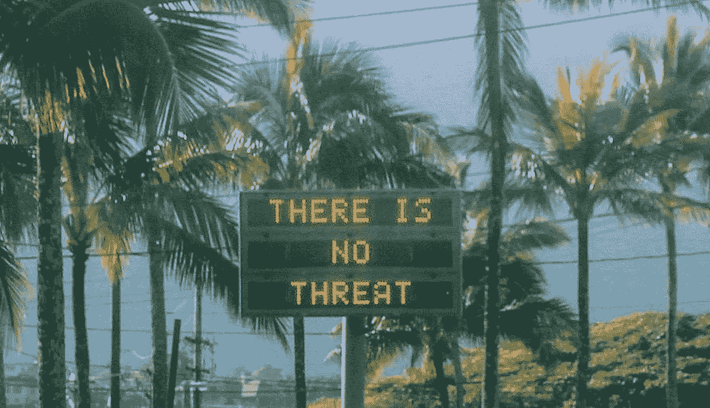
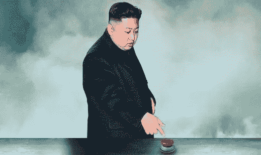
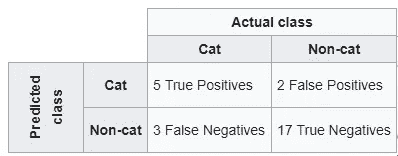
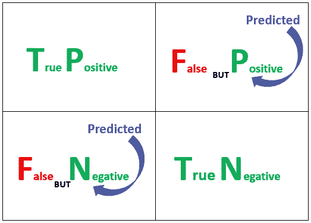
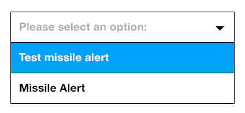

# 从混淆矩阵中消除混淆——夏威夷假导弹警报

> 原文：<https://towardsdatascience.com/hawaii-false-missile-alert-removing-confusion-from-confusion-matrix-75b53f8caab9?source=collection_archive---------8----------------------->

“导弹接近，每个人都跑去找掩护”。人们向他们所爱的人发送最后的告别信息。家庭成员聚在一起祈祷。母亲紧抓着孩子，而父亲赶紧带着全家人安全逃到地下室。想象一下，当每个夏威夷人在 2018 年 1 月 13 日收到接近的弹道导弹警报时，他们会面临的混乱和混乱状态。

**谈天堂里的烦恼！！**

鉴于目前特朗普总统称朝鲜独裁者为“火箭人”的推特威胁，许多夏威夷人有所有合理的理由相信这一警告。谢天谢地,“火箭人”没有按下小小的核按钮，可能是因为特朗普有一个更大的按钮！！

Source : [Pantip](https://pantip.com/topic/33665326)

谢天谢地，结果证明是一场“虚惊”。除了轻微的车祸，一个人不幸心脏病发作，更不用说[pornhub 浏览量的急剧下降](http://www.news.com.au/technology/online/social/pornhub-saw-increase-in-traffic-from-hawaii-after-the-ballistic-missile-threat-was-declared-false/news-story/9f7f2d30d27ea284ae12f9d08e0471a4)和 porn hub 浏览量的突然飙升(川普的说法是“比以往任何时候都强”)，没有太大的损失。

如果导弹警报是真的呢？光是想想就够吓人的了。

在第二次世界大战期间，英国和盟国每天都经历着同样的困惑和恐惧。需要做点什么。

英国开发了 ROC 曲线作为[链家项目](https://en.wikipedia.org/wiki/Chain_Home)的一部分。目标是辨别哪一架是飞来的敌机，哪一架是海鸥或鹅。

受试者工作曲线(ROC)是一个图形，描述了具有不同阈值的二元分类系统的诊断能力。这是真阳性率对假阳性率的曲线图。

Image Source : [Statsitcs how to](http://www.statisticshowto.com/receiver-operating-characteristic-roc-curve/)

我知道术语“误报率”和“真报率”现在可能会让一些人感到困惑，但我购买 ROC 图片的原因是因为它将有助于在文章的后面讲述一些关于导弹警报 UI 设计的有趣内容。

## **混淆矩阵中的混淆是什么原因造成的？**

在我看来，当我们把预测类放在左边，实际类放在上面时，混乱就产生了，如下图所示。

Source : Wikipedia

我们的人类大脑会进入“与下面的“T9”相匹配”的模式，并由于纯粹的认知负担而变得混乱。

## 如何消除困惑？

我必须承认，在建立和解释各种分类模型时，我也曾经在假阳性和假阴性之间感到困惑，直到我开发了自己的技术来终生记住它。这对我有用，也许对你也有用。

获得正确的 TP、TN、FP、FN 是至关重要的，因为它们被证明在计算 TPR(又名敏感性)、TNR(又名特异性)和许多其他方面是至关重要的。我可能会写一篇文章，用真实的例子来说明如何计算这些比率而不被弄糊涂。

但是首先要做的是，消除困惑的步骤。

**第一步**:永远记住“预测”这个词

**第二步**:从右往左读(阿拉伯人和波斯人可能会觉得更容易)

**第三步**:如果单词是 FP，你要把它读成**预测正但假**

同样，假设单词是 FN，你会把它读作**预测为负但为假**

我不想深究 TP(真阳性)和 TN(真阴性)，因为它们是不言自明的。

## 夏威夷导弹预警系统设计错误吗？

许多文章已经写了关于用户界面有多糟糕以及任何人都很容易犯这个错误。选项以下拉列表的形式出现

Source : [Imgur](https://imgur.com/gallery/ybpwQ)

*   “试射导弹警报”
*   “导弹警报”

**系统设计的很差吗？**

带着数据科学家的帽子，我的答案是**不**。

原因如下:

## UI 被设计成一场真阳性(TP)和假阳性(FP)的战斗

还记得我之前说过的 ROC 曲线吗？在生死关头，你需要时刻保持警惕。在真阳性和假阳性的较量中，**赢家永远是你**。想想吧。最坏的情况是什么。

**只有两种可能**:

1.  真正的肯定:一枚真正的导弹正在靠近，你躲起来
2.  **误报:没有导弹**接近，但是系统**说是**，你躲避

无论哪种情况，你都要躲起来。你安全了！！

## 如果这场战斗是假阴性(FN)和真阴性(TN)之间的较量呢

这是一场你想永远支持真正的否定的战斗。为什么？

**再来两种可能**:

1.  假阴性:一枚真正的导弹正在接近，然而系统显示天空中没有一点点。你不采取庇护和……..(永恒的沉默)
2.  没有导弹接近，也没有警报。你安全了！！

所以不管是谁设计的 UI 都做得很好。这将拯救更多的生命。

**底线**:生命或死亡情况警报系统应该总是设计有**真阳性(TP)** 和**假阳性(FP)** 选项。

如果你喜欢我的文章，给它几个掌声，你也可以通过下面的评论让我知道你对这篇文章的想法。

您可以通过以下方式联系我:

[Linkedin](http://www.linkedin.com/in/venkat-raman-Analytics)[Twitter](https://twitter.com/venksaiyan)[我的博客:分析洛卡](https://analyticsloka.blog/blog/)