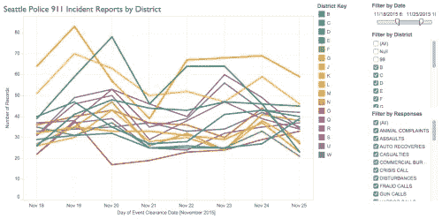
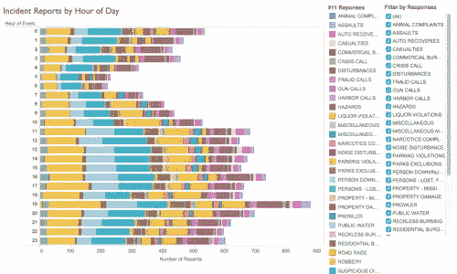
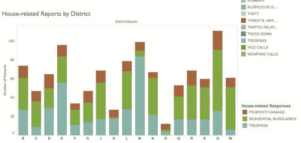

# HCDE 210 冲刺 4 —可视化

> 原文：<https://towardsdatascience.com/hcde-210-sprint-4-visualization-60a969acbcd9?source=collection_archive---------5----------------------->

*2015 年 12 月 7 日*

*Graph of Incident Reports by District:* “Where are the safest neighborhoods to raise my kids?”[**view here**](https://public.tableau.com/views/SeattlePolice911IncidentReports/Dashboard1?:embed=y&:display_count=yes)

Tableau 是一个用户友好的程序，允许用户创建流体数据表示。我们在第节中介绍了它的基础知识，使用西雅图自行车架上的数据以有效的方式将定性和定量结合起来。一旦我们对 Tableau 的理解充满信心，我们就可以继续处理 sprint 数据、**西雅图警方 911 事件响应数据。**我将我的用户群定义为在西雅图寻找好社区的准房主。

*Graph of Incident Reports by Hour of Day:* “When do crimes peak in Seattle?”

我认为大多数人都想住在犯罪率相对较低的地区，并且会将低事故报告与更安全的社区联系起来。此外，我认为每个购房者对某些犯罪都有自己的敏感程度。根据这些假设，我确定数据集最重要的部分是地区/部门、事故数量和事故类型。

*Graph of House-related Reports by District:* “How safe is my house if I choose to buy a house in Seattle?”

当我进行多次迭代时，我意识到有很多方法可以传递相同的数据。事实上，似乎另一个用户群也可以使用相同的图表来满足他们自己的需求(例如:企业、投资者、业主)。这种灵活性让我怀疑我是否没有为我的用户组创建足够具体的可视化。另一方面，我想知道可视化是否应该对每个人开放。也许有些用户群会有更具体的需求，但也许其他用户群可能在他们想看和想知道的方面有所重叠。这引发了几个问题:我们应该创造只有特定群体才能理解的可视化吗？或者可视化应该对所有人开放，甚至是指定用户组之外的人？尽管如此，撇开问题不谈，因为 sprint 涉及到一个用户组，我认为保持它与该组相关是很重要的。如果我回到这个项目，我认为基于用户组中的角色(例如:“家庭”、“大学生”、“年轻的工作成年人”、“退休人员”)创建过滤器会很有趣

## **这项任务有什么挑战性？**

这项任务最具挑战性的部分是找到一种方法来清晰地表示大量的数据。我必须对每个图形进行多次迭代，然后才能决定它应该是什么类型的图形(线条、条形图等)，以及 x 轴和 y 轴上应该有什么属性以及其他哪些属性应该作为细节添加。意识到与识别和传达关键属性相关的挑战，我真的开始欣赏文章和信息图中呈现的信息和简洁的可视化。

## 可以从这些数据中受益的另一个用户群是什么？

好奇某个城市如何随时间变化的城市规划者，可能是另一个对了解城市如何随时间变化感兴趣的用户群体。他们可能会问类似“人们通常住在哪里？市区？农村？郊区？，”“人口有什么变化？目前的人口统计是什么？、“人们是如何与周围环境互动的？商店？交通？公共空间？”例如，对于研究西雅图的城市规划者来说，这个 sprint 中可视化的数据可能特别有趣。他们可能想比较 10 年、20 年、50 年前到现在的 911 事件数量，以评估西雅图的城市化如何影响其公民的心理健康和/或查看城市化与犯罪率之间是否有任何其他关系。此外，他们可以按地区过滤事件报告的数量，并使用这些数据来分析西雅图的哪些社区在遏制犯罪方面成功或不太成功。城市规划者将需要一个广泛的事件报告数据库，但这样的可视化将有助于他们更好地了解我们日益发展的文明世界的城市趋势。利用他们对世界的更好的理解，他们可以为规划高效和充满活力的城市做出贡献。

*最初发表于*[*【hcde-tiffany.tumblr.com】*](http://hcde-tiffany.tumblr.com/post/134758309177/sprint-4-visualization)*。*