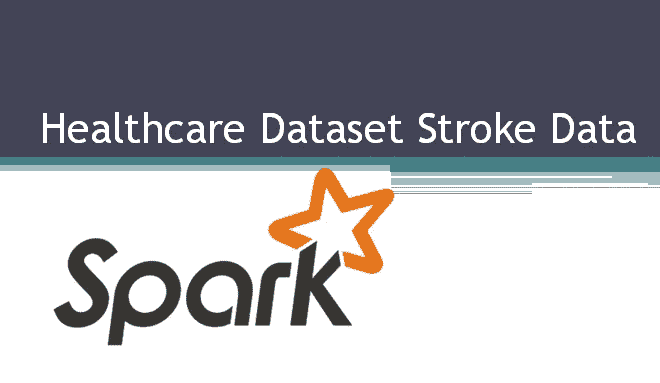
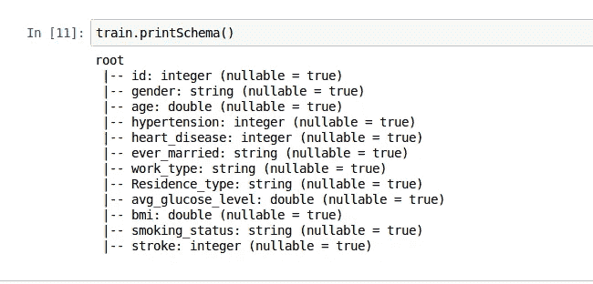
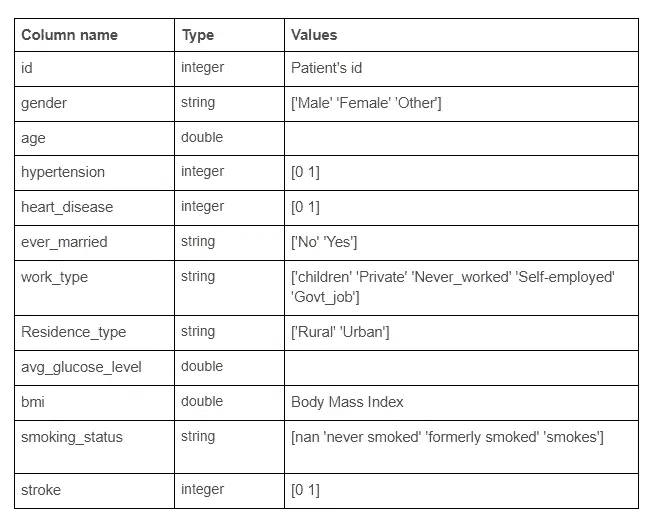
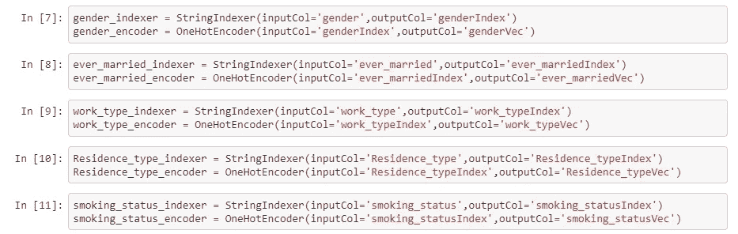

# 带 Spark 的医疗数据集

> 原文：<https://towardsdatascience.com/healthcare-dataset-with-spark-6bf48019892b?source=collection_archive---------5----------------------->



**Spark** 是来自 Apache 的开源项目。它也是大数据和机器学习最常用的分析引擎。

这篇文章将重点介绍如何快速开始使用 Spark 开发预测算法。

我选择了来自 kaggle.com 的“医疗保健数据集中风数据”数据集，这是世界上最大的数据科学家和机器学习社区。

**内容:**

根据世界卫生组织，缺血性心脏病和中风是世界上最大的杀手。

来自官方网站的信息:[http://www . who . int/news-room/fact-sheets/detail/the-top-10-causes of death](http://www.who.int/news-room/fact-sheets/detail/the-top-10-causes-of-death)

我们需要做的是利用患者给定的信息来预测中风概率。这是一个分类问题，我们将尝试预测某个观察值属于某个类别的概率(在我们的案例中是中风的概率)。

有很多算法来解决分类问题，我将使用决策树算法。

**设置火花并获取数据**

```
**from** **pyspark.sql** **import** SparkSession
**import** **pyspark.sql** **as** **sparksql**
spark = SparkSession.builder.appName('stroke').getOrCreate()train = spark.read.csv('train_2v.csv', inferSchema=**True**,header=**True**)
```

# **探索数据**

导入数据后要执行的第一个操作是获取数据外观的一些信息。可以使用以下命令:

*   df.printSchema()
*   df.describe()
*   df.dtypes



```
train.groupBy('stroke').count().show()+------+-----+
|stroke|count|
+------+-----+
|     1|  783|
|     0|42617|
+------+-----+
```

从这个观察可以看出。这是一个**不平衡数据集，**其中属于一个类的观测值数量明显低于属于其他类的观测值数量。在这种情况下，预测模型可能会有偏差且不准确。有不同的策略来处理不平衡的数据集，因此这超出了本文的范围，我将重点讨论 Spark。要查找有关不平衡数据集的更多信息:

[https://www . analyticsvidhya . com/blog/2017/03/不平衡-分类-问题/](https://www.analyticsvidhya.com/blog/2017/03/imbalanced-classification-problem/)

这里我们有许多病人的临床测量数据(如高血压、心脏病、年龄、家族病史)，以及每个病人是否患过中风的信息。在实践中，我们希望这种方法能够根据临床测量结果准确预测未来患者的中风风险。



# **分析**

使用基本操作进行简要分析。有几种方法可以做到:

*   数据帧为结构化数据操作提供了特定于领域的语言，可以通过属性或索引来访问数据帧的列。
*   以编程方式运行 SQL 查询并将结果作为数据帧返回

例如，要了解哪种类型的工作有更多的中风病例，我们可以做以下工作:

```
*# create DataFrame as a temporary view*
train.createOrReplaceTempView('table')
```

SQL 查询

```
spark.sql("SELECT work_type, count(work_type) as work_type_count FROM table WHERE stroke == 1 GROUP BY work_type ORDER BY work_type_count DESC").show()+-------------+---------------+
|    work_type|work_type_count|
+-------------+---------------+
|      Private|            441|
|Self-employed|            251|
|     Govt_job|             89|
|     children|              2|
+-------------+---------------+
```

看来私活是这个数据集中最危险的工种。

让我们找出谁参与了这次临床测量。

```
spark.sql("SELECT gender, count(gender) as count_gender, count(gender)*100/sum(count(gender)) over() as percent FROM table GROUP BY gender").show()+------+------------+-------------------+
|gender|count_gender|            percent|
+------+------------+-------------------+
|Female|       25665|  59.13594470046083|
| Other|          11|0.02534562211981567|
|  Male|       17724|  40.83870967741935|
+------+------------+-------------------+
```

所有参与中风研究的人中，59%是女性，只有 40%是男性。

根据该信息，有可能检索关于多少女性/男性患有中风信息:

```
spark.sql("SELECT gender, count(gender), (COUNT(gender) * 100.0) /(SELECT count(gender) FROM table WHERE gender == 'Male') as percentage FROM table WHERE stroke = '1' and gender = 'Male' GROUP BY gender").show()+------+-------------+--------------------+
|gender|count(gender)|          percentage|
+------+-------------+--------------------+
|  Male|          352|1.986007673211464...|
+------+-------------+--------------------+ spark.sql("SELECT gender, count(gender), (COUNT(gender) * 100.0) /(SELECT count(gender) FROM table WHERE gender == 'Female') as percentage FROM table WHERE stroke = '1' and gender = 'Female' GROUP BY gender").show()+------+-------------+--------------------+
|gender|count(gender)|          percentage|
+------+-------------+--------------------+
|Female|          431|1.679329826612117...|
+------+-------------+--------------------+
```

1.68%的女性和近 2%的男性曾患过中风。

我们还可以看到年龄是否对中风有影响，以及年龄带来的风险。

```
spark.sql("SELECT age, count(age) as age_count FROM table WHERE stroke == 1 GROUP BY age ORDER BY age_count DESC").show()+----+---------+
| age|age_count|
+----+---------+
|79.0|       70|
|78.0|       57|
|80.0|       49|
|81.0|       43|
|82.0|       36|
|70.0|       25|
|77.0|       24|
|74.0|       24|
|76.0|       24|
|67.0|       23|
|75.0|       23|
|72.0|       21|
|68.0|       20|
|59.0|       20|
|69.0|       20|
|71.0|       19|
|57.0|       19|
|63.0|       18|
|65.0|       18|
|66.0|       17|
+----+---------+
only showing top 20 rows
```

我可以用**过滤**运算，计算出 50 年后人们的中风病例数。

```
train.filter((train['stroke'] == 1) & (train['age'] > '50')).count()result: 708
```

我们可以看到**年龄**是发生中风的一个重要风险因素。

# **清洗数据**

探索的下一步是处理分类值和缺失值。smoking_status 和 bmi 参数缺少值。

我将用“无信息”的值填写 **smoking_status** ，用平均值填写 **bmi** 参数。

```
*# fill in missing values*
train_f = train.na.fill('No Info', subset=['smoking_status'])*# fill in miss values with mean*
**from** **pyspark.sql.functions** **import** mean
mean = train_f.select(mean(train_f['bmi'])).collect()
mean_bmi = mean[0][0]
train_f = train_f.na.fill(mean_bmi,['bmi'])
```

**大多数 ML 算法**不能直接处理**分类数据**。编码允许期望连续特征的算法使用分类特征。

string indexer-> onehotencode-> vector assembler

```
**from** **pyspark.ml.feature** **import** (VectorAssembler,OneHotEncoder,
                                StringIndexer)
```



它不需要事先知道一个特性中有多少类别，由 **StringIndexer** 和 **OneHotEncoder** 的组合来处理。

下一步是创建一个组装器，它将给定的列列表组合成一个向量列来训练 ML 模型。我将使用在 one_hot_encoding 之后得到的向量列。

```
assembler = VectorAssembler(inputCols=['genderVec',
 'age',
 'hypertension',
 'heart_disease',
 'ever_marriedVec',
 'work_typeVec',
 'Residence_typeVec',
 'avg_glucose_level',
 'bmi',
 'smoking_statusVec'],outputCol='features')
```

然后我们将创建一个决策树对象。为此，我们需要导入决策树分类器。

```
**from** **pyspark.ml.classification** **import** DecisionTreeClassifierdtc = DecisionTreeClassifier(labelCol='stroke',featuresCol='features')
```

到目前为止，我们有一个包含许多阶段的复杂任务，需要执行这些阶段来处理数据。为了包装所有火花，ML 表示这样一个工作流，作为一个**管道**，它由一系列按照特定顺序运行的**管道阶段**组成。

```
**from** **pyspark.ml** **import** Pipelinepipeline = Pipeline(stages=[gender_indexer, ever_married_indexer, work_type_indexer, Residence_type_indexer,
                           smoking_status_indexer, gender_encoder, ever_married_encoder, work_type_encoder,
                           Residence_type_encoder, smoking_status_encoder, assembler, dtc])
```

下一步是**拆分**数据集进行训练和测试。

```
train_data,test_data = train_f.randomSplit([0.7,0.3])
```

我现在要做的是拟合模型。为此，我将使用创建的管道和 train_data

```
model = pipeline.fit(train_data)
```

之后，转换测试数据。

```
dtc_predictions = model.transform(test_data)
```

现在是时候评估一个模型了

```
**from** **pyspark.ml.evaluation** **import** MulticlassClassificationEvaluator*# Select (prediction, true label) and compute test error*
acc_evaluator = MulticlassClassificationEvaluator(labelCol="stroke", predictionCol="prediction", metricName="accuracy")dtc_acc = acc_evaluator.evaluate(dtc_predictions)print('A Decision Tree algorithm had an accuracy of: **{0:2.2f}**%'.format(dtc_acc*100))
```

决策树算法的准确率为 98.08%

正如在开始时所定义的，不平衡数据集的预测模型可能具有误导性的准确性。

# **结论**

Apache Spark 是一个开源框架，它非常简洁易用。