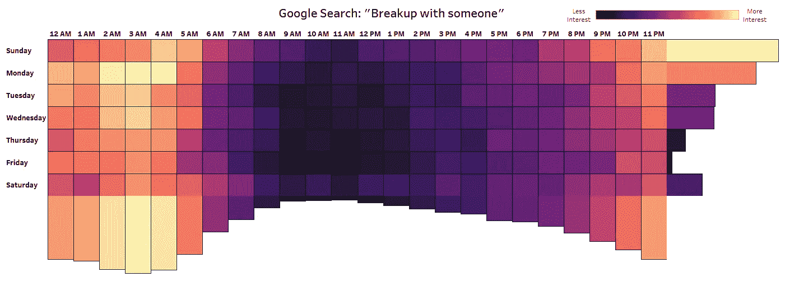
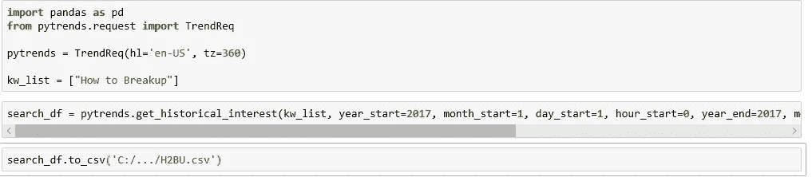
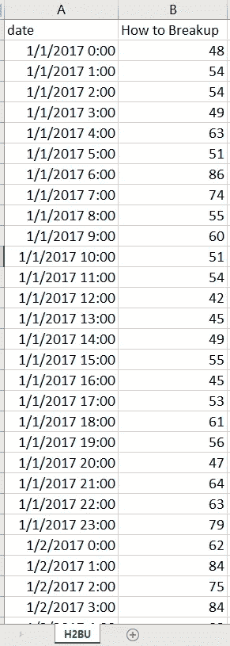
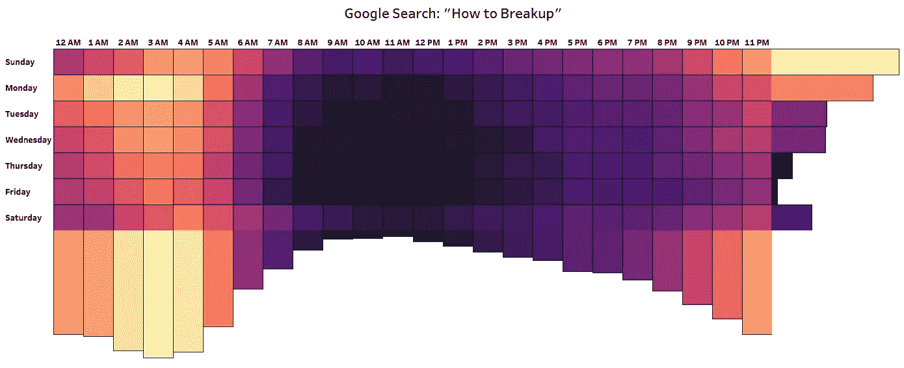

# 分手和谷歌趋势搜索数据

> 原文：<https://towardsdatascience.com/heartbreak-monday-blues-and-pytrends-f1a398591a79?source=collection_archive---------4----------------------->

## 周一忧郁症的病例？周末结束时打破高峰的兴趣。

Photo by [Elizabeth Tsung](https://unsplash.com/photos/BGLR0IIeYi4?utm_source=unsplash&utm_medium=referral&utm_content=creditCopyText) on [Unsplash](https://unsplash.com/search/photos/holding-hands?utm_source=unsplash&utm_medium=referral&utm_content=creditCopyText)

有过糟糕的周末吗？这是否导致你想要离开你的关系？为什么人们不在周一凌晨 2-4 点睡觉？

根据谷歌趋势数据，在美国，分手的相对兴趣在周一凌晨 3 点达到峰值。好像周一的忧郁还不够忧郁！

Visualization by Shelby Temple; Data Source Google Trends; Made with PyTrends and Tableau

## 分手具有周期性

> “什么东西一年上升两次，一次在复活节，另一次在圣诞节前两周，在每周一有一个小高峰，然后在整个夏天变平？”

David McCandless 在他的 TED 演讲中向他的听众提出了这个问题，[数据可视化之美。](https://www.ted.com/talks/david_mccandless_the_beauty_of_data_visualization?language=en#t-434768)

根据脸书的状态更新，答案是分手高峰期。

根据 10，000 个报废的脸书状态，他们发现春假有一个清仓，第二个分手高峰将导致寒假。出现的另一种模式是每周一的周期性高峰。

受此启发，我决定使用谷歌趋势数据来探索人们在哪天和什么时间搜索分手细节。

## **谷歌趋势**

我们生活在一个美好的新时代，在这个时代，我们不再需要仅仅依赖于调查产生的数据集。我们现在可以通过观察人们在互联网上做什么来衡量他们的行为。

谷歌趋势是一个伟大的公共工具，可以看到人们在互联网上做什么。在 Google Trends 网站上，你可以根据时间或地理来衡量人们对某个搜索主题的兴趣。您还可以比较多达五个不同的搜索主题。

然而，这个数据有一个关键的细微差别。它并不衡量总体查询量。它衡量的是在同一时间和地点，一个主题的谷歌搜索相对于所有其他搜索的标准化相对份额。关于如何收集、处理和解释这些数据的更多细节，这里有两个有用的链接:

[什么是谷歌趋势数据，它意味着什么？](https://medium.com/google-news-lab/what-is-google-trends-data-and-what-does-it-mean-b48f07342ee8)

[趋势数据如何调整](https://support.google.com/trends/answer/4365533?hl=en)

## **PyTrends**

由 [General Mills](https://github.com/GeneralMills/pytrends) 为您带来的(没错，就是为您带来 Cheerios 和 Lucky Charms 的同一批人)PyTrends 是 Python 中的一个非官方伪 API 包，它可以轻松创建新的 Google Trend 数据集，并将它们直接放入一个表格中。

*“非官方-相扑-API-什么-现在？”*不用担心，我会把这个分解。

从互联网上获取数据的两种最令人兴奋的方式是通过网络抓取或网络应用编程接口。[API 有一个更广泛的定义](https://en.wikipedia.org/wiki/Application_programming_interface)，但是在本文中，让我们将它们定义为:一种**预期的**数据推送方式，就像你可以浏览互联网一样。

Web APIs 始终是首选方法，因为它们被设计为在通话结束时将数据推送给您。他们有大量的文档和任何变化的更新。

网络抓取本质上是应该有一个 API，但公司不想构建它。您直接从发送到 web 浏览器的 html 代码中提取数据。这是不太可取的，因为如果网站改变了网页抓取代码可以很容易地打破，你不会知道为什么。网络抓取是一种意想不到的获取数据的方式。网站的建立并没有考虑到这一点。

[显然，玛丽莎·梅耶尔和谷歌确实打算在 2007 年为 Trends 开发一个 API](https://www.cnet.com/news/google-trends-api-coming-soon/)——但显然，“即将到来”在这个上下文中意味着“永远不会”。

PyTrends 是非官方的。这意味着它没有得到谷歌的认可。这是一个伪 API，意味着它的行为与 API Python 包完全一样，然而它实际上是幕后的网络抓取。

如果您有兴趣使用或了解关于该软件包的更多信息，请点击以下链接:

[通用磨坊 PyTrends GitHub](https://github.com/GeneralMills/pytrends)

看看吧！我用 6 行代码创建了一个谷歌趋势数据集，涵盖 2017 年全年，按天按小时搜索包含“如何分手”的内容。

谷歌趋势给你一个搜索兴趣指数。这是一个从 0 到 100 的分数，100 是最高的搜索兴趣。

在这种情况下，我将地理限制在美国。

## **解读结果**

Visualization by Shelby Temple; Data Source Google Trends; Made with PyTrends and Tableau

Visualization by Shelby Temple; Data Source Google Trends; Made with PyTrends and Tableau

为了创建这些重点表格，我采用了 2017 年全年每小时和每天的平均兴趣。

如前所述，Google Trends 数据并没有显示成交量的变化。它衡量给定时间和地点的所有搜索的份额变化。不能得出分手搜索最多的是发生在周一凌晨 3 点。一个更准确的结论是，如果有人在周一凌晨 3 点搜索，那么这个搜索很有可能是关于分手的。

*“那么搜索查询量呢？”*

谷歌在谷歌广告中有一个不同的工具叫做关键词规划器。这是一款商业产品，面向希望开展付费搜索营销活动的企业。他们也有谷歌广告的官方 API。不幸的是，这不是一个像谷歌趋势的公共工具。

标准化是一个细微的差别，但它是由设计。数量经常根据人口数量或在谷歌上的搜索次数而上下浮动。谷歌的数据编辑西蒙·罗杰斯在这篇媒体文章中写道:

> “这种标准化真的很重要:在谷歌上搜索的人数不断变化——2004 年的搜索量比现在小得多，所以原始的搜索数字无法让你比较当时和现在的搜索。通过标准化我们的数据，我们可以获得更深入的见解:比较不同的日期、不同的国家或不同的城市。”

下次你有一个有趣的问题或想法想要探索。我建议从 Google Trends 和它提供的搜索数据入手。此外，记得这个周末对你的另一半格外友好。如果你想成为一个混蛋，那就等到周五上午 11 点。