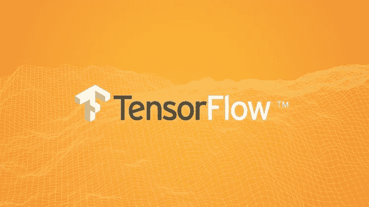
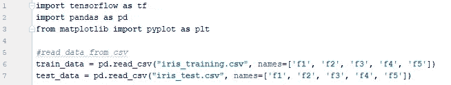
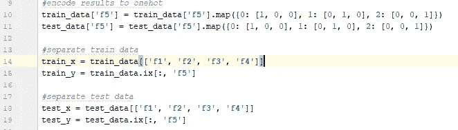
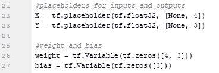
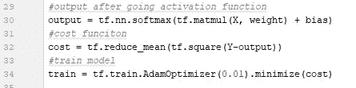
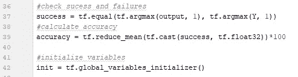
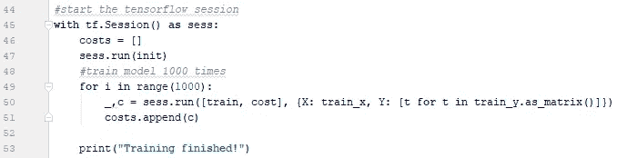
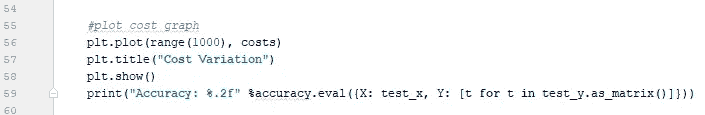
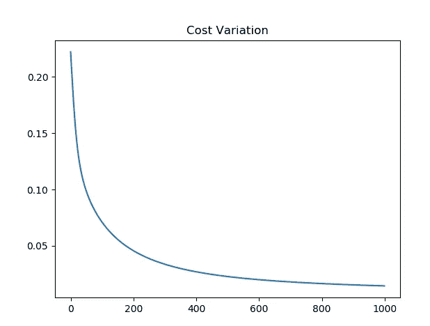

# TensorFlow 中的 Hello World

> 原文：<https://towardsdatascience.com/hello-world-in-tensorflow-973e6c38e8ed?source=collection_archive---------6----------------------->

TensorFlow 是 Google 开发的用于机器学习的开源软件库。它能够在所有 Linux、Windows 和 MacOS 平台的 CPU 和 GPU 上运行。Tensorflow 可用于设计、实现和训练深度学习模型，这些模型的灵感来自大脑的结构和功能。

在这篇文章中，我将给出一个使用 TensorFlow 实现一个简单的神经网络的分步指南。著名的 Iris flower 数据集用于训练，然后将给定的花分类到正确的类型。

Iris 数据集包含 3 种类型的花，如“Setosa”、“Versicolor”和“Virginica”。为了识别每种花的类型，给出了花的 4 个特性，即萼片长度、萼片宽度、花瓣长度和花瓣宽度。我们将使用这些因素实现一个神经网络来识别正确的类型。

首先，我们将使用训练数据集来训练我们的模型，然后我们将使用测试数据集来测试它的准确性。你可以从[这里](http://download.tensorflow.org/data/iris_training.csv)下载训练数据集，从[这里](http://download.tensorflow.org/data/iris_test.csv)下载测试数据集。

**第一步**

首先，我们需要读入数据。csv 文件并导入它们。熊猫图书馆可以用来轻松处理这一点。

Importing data

Pandas 中的 read_csv()函数将读取文件并将内容加载到指定的变量中。作为函数的参数，我们需要指定文件的路径，names 参数可用于指定每个文件的列名。

**第二步**

在数据集中，每种类型的花被编码为 0、1 和 2。我们需要使用一个热方法将它们编码为[1，0，0]、[0，1，0]和[0，0，1]。这将使得训练和优化网络变得容易，因为来自网络的输出也以一种热格式生成。

然后我们需要定义训练集的 x，y 和测试集的 x，y

Encoding classes and data separation

**第三步**

然后是定义输入(X)、输出(Y)的占位符以及定义网络的权重和偏差的时候了。这里我们有 4 列输入，因为数据集有 4 个特征和 3 列输出，以映射 3 种类型的花。占位符的形状应该满足这一点。此外，权重矩阵的形状必须是 4x3，偏差必须是 3 的向量，以将输入映射到输出(无隐藏层)。

Defining weights, bias and placeholders

**第四步**

然后，我们需要通过激活函数发送输出，这里我使用了 tensorflow 中可用的 soft-max 函数。为了训练模型，我们需要计算成本，即模型产生的输出中有多少误差。在这里，我们计算其均方误差。然后，我们可以使用 AdamOptimizer 来训练模型，从而降低成本。

Training tensor definition

**第五步**

经过训练以检查我们的模型有多准确后，我们需要将我们的模型预测与实际结果进行比较。然后我们可以通过计算我们得到了多少正确的结果来计算我们的模型的准确性。

Calculate accuracy

这里我们检查由我们的模型生成的输出是否等于实际结果(Y)。该模型将为每种类型的花计算一个值，该值可以被认为是每种类型的概率。我们选择最有可能的类型。 **argmax** 函数将返回最大值的索引。请记住，结果是一个热格式，这种方法将很容易让我们检查正确性。

在这之后，我们必须开始训练模型。在此之前，我们需要首先初始化所有的全局变量，而**global _ variables _ initializer**函数就是为此服务的。

**第六步**

现在让我们训练我们的模型。每个张量执行都必须在 tensorflow 的一个会话中完成。因此，在培训之前，我们需要创建一个会话，在完成所有工作后，我们需要关闭该会话。

Training model

添加上述代码块是为了创建 tensorflow 会话，该代码块中的所有内容都将拥有该会话。此外，该代码块能够在一切完成时自动关闭会话。

首先，执行变量初始化张量，然后训练模型 1000 次。当训练时，我们需要将训练数据集指定为 X，将相应的结果指定为 Y，因为训练张量期望它们执行。在这里，当传递 Y 时，我已经迭代并创建了一个新的数组，以确保它具有与我们上面定义的相同的形状。在每次迭代中，跟踪成本以绘制图表来查看实际的训练。

**最后一步**

最后，当训练过程结束时，绘制成本变化图，并通过测试数据集检验模型的准确性。

Plot graph and check accuracy

经过 1000 次训练迭代后，有可能获得 **96.67%** 的准确度，这确实令人印象深刻，成本变化图显示了通过降低每次迭代的成本，模型得到了显著发展。

Cost reduction due to training

**以下是程序的完整代码**

这篇文章将有助于 tensorflow 的新手通过这个简单的例子理解它的概念，并将成为潜入海洋的开始。

继续读

干杯！