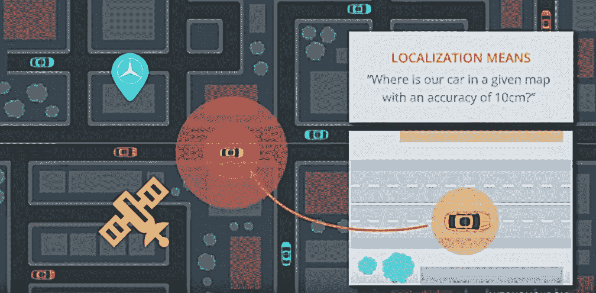
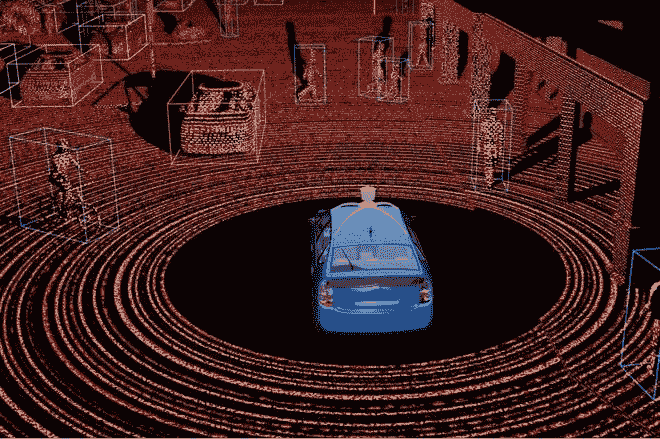
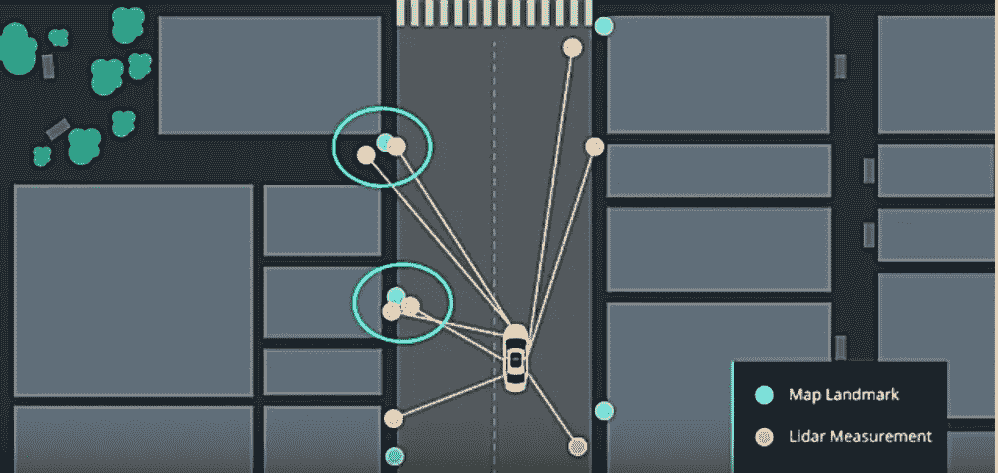
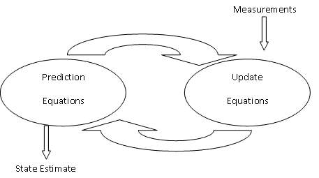

# 高精度跟踪自动驾驶汽车

> 原文：<https://towardsdatascience.com/helping-a-self-driving-car-localize-itself-88705f419e4a?source=collection_archive---------2----------------------->

*第六章:用数据做酷事！*

*定位*，或者知道“我在哪里”对于自动驾驶汽车来说至关重要。每时每刻它都需要知道自己在世界的哪个角落。当我们开车时，我们使用 GPS 和地图应用程序来知道我们的车在哪里。但是 GPS 的精度是 1-3 米，有时更高。这不适用于自动驾驶汽车，因为这是车道的宽度。汽车可能偏离车道，这是很危险的。自动驾驶汽车需要更高的精度——小于 10 厘米。在这里，我们将讨论一种称为粒子过滤器的技术，它可以用来帮助汽车在地图中定位自己。

我实现了一个粒子过滤器，可以跟踪一辆平均 x 误差和 y 误差小于 0.07 的汽车。我已经用 C++分享了我的 [**GitHub**](https://github.com/priya-dwivedi/CarND-Kidnapped-Vehicle-Project) 的链接和完整代码。

下面是一个视频，展示了粒子过滤器在模拟环境中跟踪汽车的过程。圆形点是地图上的地标，绿线是从汽车到这些地标的激光传感器。蓝色圆圈是追踪汽车的最近的粒子。请注意粒子与实际汽车的轨迹有多接近。

粒子过滤器是如何工作的。首先，我们有一张世界地图。该地图具有地标，可以是房屋、建筑物、灯柱等。我们知道这些地标在地图上的位置

1.  我们用随机放置在地图周围的 N 个粒子初始化我们的地图。把这些微粒想象成汽车可能的位置。开始时，我们不知道汽车在地图上的位置，所以所有粒子被赋予相同的权重，这意味着它们有相同的概率来表示汽车的真实位置
2.  在每个时间步，汽车移动。我们的传感器告诉我们汽车行驶的速度和角度。我们将每个粒子移动与汽车相同的距离和方向。这被称为**预测**步骤
3.  现在进入**测量**步骤。使用激光雷达，我们测量汽车到地图上已知地标的距离。

激光雷达使用激光进行测量，并生成周围世界的点云，为汽车提供相当准确的 x 位置和 y 位置值。然而，激光雷达在恶劣的天气条件下或传感器变脏时不是很准确。

下面是激光雷达点云的图像

LIDAR point cloud

现在到了关键的一步。对于每个粒子，我们计算该粒子和地图中已知地标之间的距离。我们比较这个距离与来自汽车的激光雷达测量值的接近程度，并使用它来分配粒子的权重。更接近实际汽车的粒子将被赋予更高的权重。

应用激光雷达测量时需要注意几个实际问题:

I)数据关联-多个激光雷达测量可以与每个地标相关联。如果是这种情况，我们使用最近邻选择距离地标最近的激光雷达读数作为激光雷达读数，如下图所示

Data Association

ii)变换-当从汽车上进行激光雷达测量时，它们的 x 和 y 位置将参考汽车，这被称为汽车的局部坐标。这些需要通过考虑汽车/粒子的位置来转换成全局“地图”坐标

4.我们对粒子进行重新采样，使得具有较高权重的粒子(因此更有可能接近汽车的真实位置)被挑选出来，而具有较低权重的粒子被丢弃。

然后我们回到步骤 2，重复这个过程。

这项技术可以很快帮助我们定位汽车。

这里有个有趣的问题？—我们如何将这项技术用于行驶在城市 A 和城市 B 之间的真正自动驾驶汽车？粒子滤波器假设我们有一张世界地图，上面有许多地标的已知位置。我们如何确定数百个地标的位置并将其输入汽车？

谷歌汽车使用的一种方法是将汽车摄像头的图像与谷歌地图街景的图像进行匹配。这被用来生成地标和定位汽车。一些供应商也在用这些信息制作详细的世界地图

总的来说，建立我的第一个粒子过滤器并用它来定位是一次很棒的经历。

PS:我住在多伦多，我希望将职业生涯转向深度学习。如果你喜欢我的帖子，并能把我联系到任何人，我将不胜感激:)。我的电子邮件是 priya.toronto3@gmail.com

**其他著述**:【https://medium.com/@priya.dwivedi/】T2

**参考文献:**

[Udacity](https://www.udacity.com/) 无人驾驶汽车 Nano Degree——我感谢 Udacity 和巴斯蒂安·特龙给我机会成为他们新的无人驾驶汽车项目的一部分。这是一次非常有趣的旅程。我使用的大部分代码都是在课堂讲课中建议的。这里的图片和视频参考也在讲座中分享