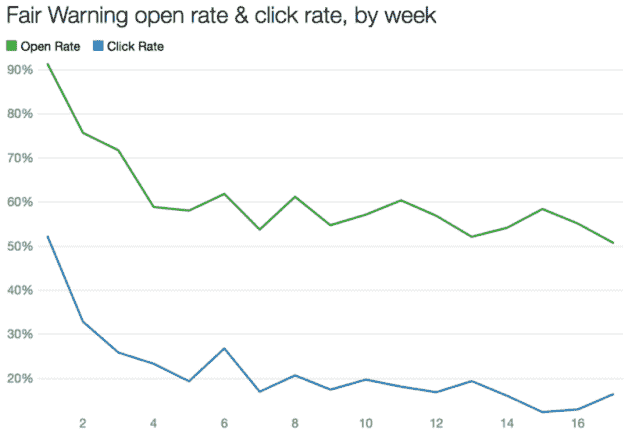
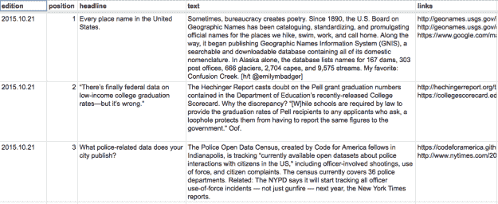
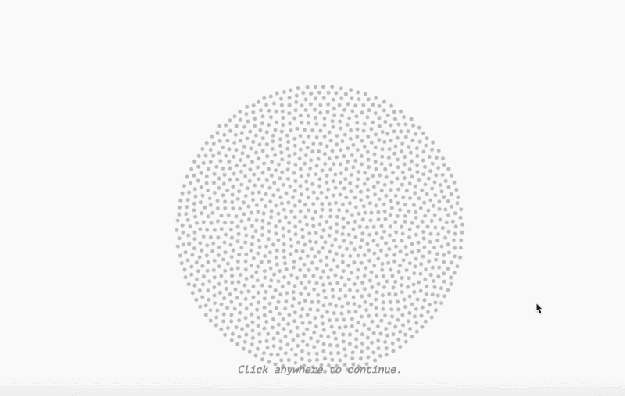
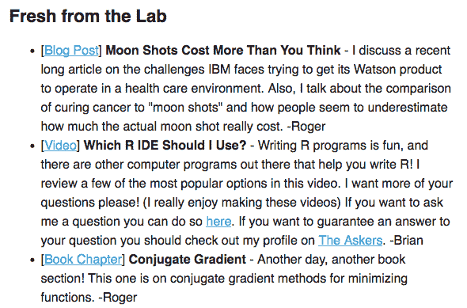

# 这里有 9 封关于数据的电子邮件简讯…我想你至少会喜欢其中的 4 封

> 原文：<https://towardsdatascience.com/here-are-9-email-newsletters-about-data-i-think-youll-like-at-least-4-of-them-20fb8412d803?source=collection_archive---------3----------------------->

*这是* [*首次发表在网络新闻博客*](https://onlinejournalismblog.com/2017/09/19/email-newsletters-about-data-journalism/) 上

*Sophie Warnes doesn’t just round up data journalism in her emails, she* [**does* data journalism *about* her emails*](https://medium.com/@sophiewarnes/16-weeks-of-fair-warning-2bc273ed9bd9)

随着第一批 [MA 数据新闻学](http://www.bcu.ac.uk/media/courses/data-journalism)学生本月开始他们的课程，我一直在推荐他们应该关注的领域的一些**电子邮件简讯**——我想我也应该在这里分享一下。

这里有 9 封关于数据的电子邮件简讯——如果我错过了，请告诉我。

# 1.索菲·沃恩斯的合理警告

Sophie Warnes 是一名数据记者(也是我以前的学生),曾为各种头衔工作过，最近在英国国家统计局任职。自二月份以来，她的时事通讯《公平警告》一直在提供英国和国际数据新闻的每周综述，这引起了她的注意。

她还[分享了她在媒体](https://medium.com/@sophiewarnes/16-weeks-of-fair-warning-2bc273ed9bd9)上发布电子邮件简讯[的经历，其中简讯是交叉发布的](https://medium.com/@sophiewarnes/latest)。

# 2.杰里米·辛格·文:数据是复数

*Each issue of the Data Is Plural newsletter is recorded in a Google spreadsheet*

近两年来，BuzzFeed News 的数据编辑 Jeremy Singer-Vine**一直在发布他的每周时事通讯——突出有用/好奇的数据集(主要集中在美国)。所有电子邮件的列表可以作为电子表格获得。[订阅这里](http://tinyletter.com/data-is-plural)。**

# 3.朱塞佩·索拉索:其他新闻

朱塞佩·索拉索 [称自己](http://puntofisso.net/)是一个“开放数据、标准&透明政策的书呆子”，但他也是伦敦大学圣乔治学院的学者，也是一系列令人印象深刻的[作品](https://medium.com/@puntofisso/i-calculated-the-average-face-of-a-uk-member-of-parliament-and-heres-what-i-found-37f31b72b5d9?source=user_profile---------1----------------)的创造者[数据新闻](http://swing.puntofisso.net/) [作品](http://parli-n-grams.puntofisso.net/)。

自 2014 年以来，他的简讯 [In Other News](http://puntofisso.us5.list-manage.com/subscribe?u=77ecabbd32e97a6caa9d7d40b&id=f06739fb93) 一直在收集数据极客感兴趣的各种链接。

# 4.安迪·迪金森:媒体工厂公报

安迪·迪金森的兴趣领域是开放数据和超本地数据新闻的使用。媒体工厂公报涵盖这两个领域，以及国家和国际数据工作和学术研究。

# 5.杨彼得:1801 年

*Peter Yeung’s newsletters feature lots of gifs — such as this one on a piece of Indian data journalism about dowries*

《泰晤士报》(英国)数据记者彼得·杨(Peter Yeung)在 7 月份发布了自己的电子邮件简讯，重点报道了世界各地一些最有趣的数据新闻。像索菲·沃恩斯一样，他也在媒体上出版每一期。

你可以[在这里](https://medium.com/@peteryeung/1801-newsletter-facial-recognition-uncertain-graphs-and-a-pie-chart-made-of-pie-2c1f6332824b)阅读第一期，[在这里](https://twitter.us16.list-manage.com/subscribe?u=088b912cf6976d4efabca7bbc&id=5587b07be6)订阅邮件。

# 6.开放知识国际通讯

开放知识基金会(OKFN)已经在开放数据领域工作了一段时间，他们的时事通讯[利用全球合作伙伴和项目网络来提供事件、计划、报告和工具的更新。](https://okfn.us9.list-manage.com/subscribe?u=73f922f8e68e21a10efa21f02&id=32d370a7fc)

# 7.数据面:“数据和鸡蛋”

data face 将自己描述为“一群对体育、政治、音乐、环境以及两者之间的一切都感兴趣的数据迷。”他们制作了一份[时事通讯](http://thedataface.com/newsletter/)，报道他们“前一周最喜欢的数据驱动的故事……依靠丰富的可视化和交互性来启发读者。”

# 8.约翰·霍普金斯数据科学实验室:周一早上的数据科学

*The* [*latest newsletter*](http://us16.campaign-archive2.com/?u=5ea551600fcdf84334e5aa6b0&id=ba9299bb43) *from The Johns Hopkins Data Science Lab features discussion about AI and a review of R tools*

对于真正的数据极客，[约翰·霍普金斯数据科学实验室的周一早间数据科学](https://jhudatascience.us16.list-manage.com/subscribe?u=5ea551600fcdf84334e5aa6b0&id=26c0b7221a)提供了与数据科学、统计相关的博客帖子、播客和视频的定期链接

# 9.希瑟·克劳斯:数据助理

Heather Krause 是“[打造数据故事](https://knightcenter.utexas.edu/blog/00-18722-sign-online-course-crafting-data-stories-and-get-your-backstage-pass-data-journalism-p)”和[“数据探索和讲故事:通过探索性分析和可视化在数据中寻找故事”](https://knightcenter.utexas.edu/blog/00-17853-learn-how-find-stories-data-register-now-free-online-course-data-exploration-and-story)的讲师，也是 Datassist 的创始人和首席数据科学家。这并不容易找到，但在[的底部，Datassist 主页](http://idatassist.com/)是一个订阅他们每月时事通讯的链接，重点是实用技巧和有用的链接。