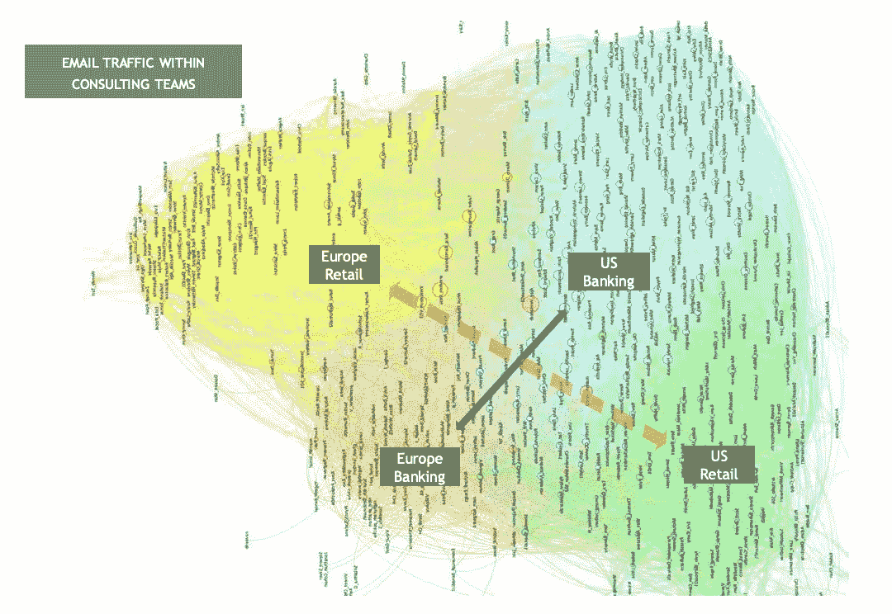
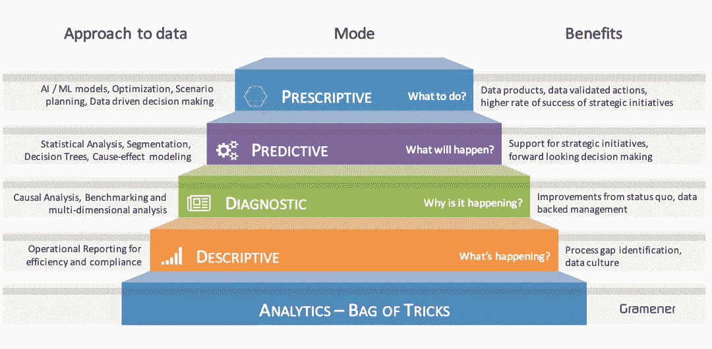
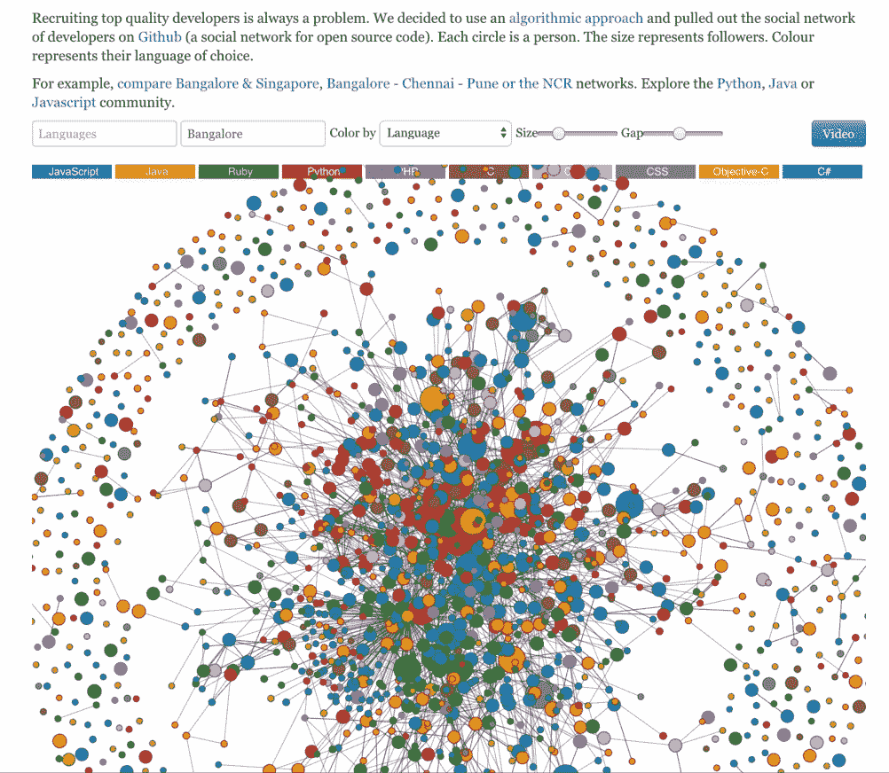
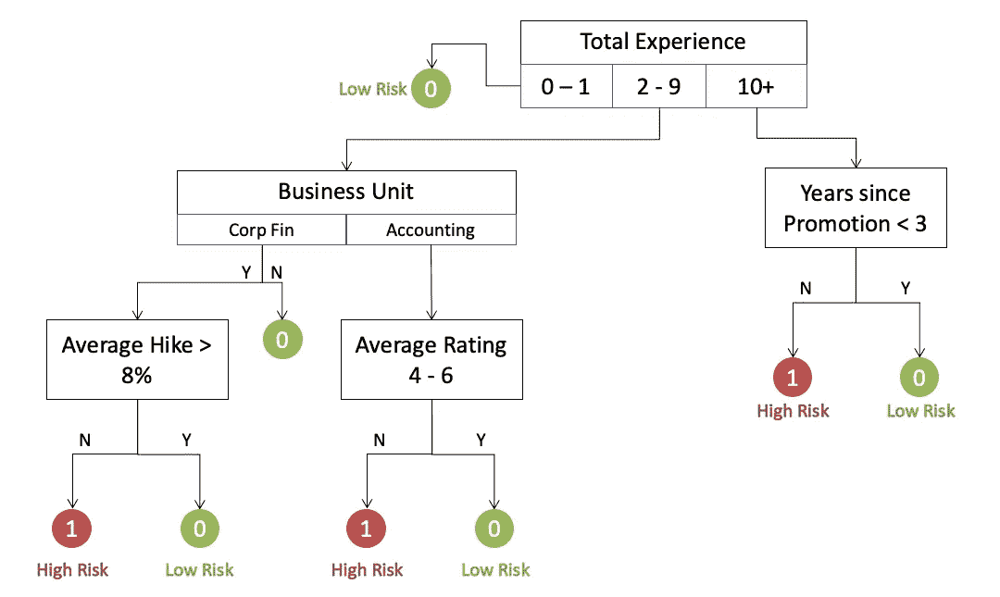
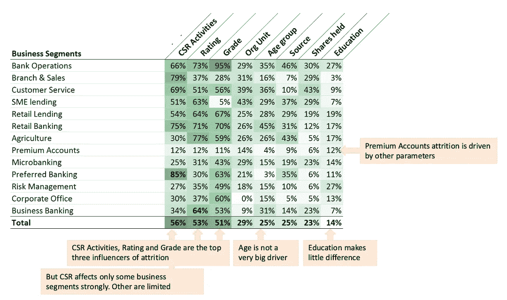

# 以下是分析如何重塑人力资源

> 原文：<https://towardsdatascience.com/heres-how-analytics-is-reinventing-human-resources-1ad283fe7014?source=collection_archive---------6----------------------->

Photo by JehyunSung on Unsplash

## 使用真实世界的洞察力展示 ace 人才分析的 3 个步骤

您知道旧金山和纽约拥有美国最丰富的 JavaScript 人才库吗？根据公开的 Github 数据，西雅图是 C#程序员的首选之地？

在印度，班加罗尔是顶尖的编码人才中心，其中 Java 拥有最多的 Github 库。这与美国大多数城市的模式形成鲜明对比，在美国，Java 排在第四位，在 Javascript、Python 和 Ruby 之后。

这些都是对 HR 人才团队有用的见解。员工敬业度有哪些有趣的发现？

一家领先的亚洲零售银行发现，员工股票期权(ESOP)是年度评估中对员工绩效影响最大的因素，特别是在某些业务部门。该银行还发现，参与企业社会责任活动的员工流失风险最小。

## 数据驱动的人才管理

诸如此类的见解表明，数据有助于揭示表面上看不见、但更强大的人类行为潜流。

数据分析可以成为更好地了解员工及其参与度的有力工具。它可以改变人力资源职能的长度和宽度。它可以派上用场，以减少招聘偏见，改善员工关系，找到性能的驱动因素，并帮助管理自然减员。

人力资源流程捕获大量数据。它们始于最初的接触，并在员工不再积极参与后延续很久。这些数据可以提供特别有价值的可操作见解。如果有合适的外部资源，它可以变成一座金矿。

## 关于更智能的人力资源职能的三条建议

以下是迈向更聪明的人才管理之旅的 3 个成功步骤。为了说明每一点，我使用了来自真实世界商业案例研究的数据故事，这些数据故事来自我们在 [Gramener](https://gramener.com/) 的工作。

## **1。数据从来都不是限制，发挥你的数据源的创造力**

缺乏数据或精选来源是组织中的常见抱怨。这通常被认为是人力资源更加数据化的缓慢进展的原因。人们引用 excel 表格是如何驱动整个功能的。或者说，尽管数字化已经进行了几十年，但整合一个员工的观点是多么困难。

在每一个这样的情况下，我们都看到，如果一个人变得有创造力，解决方案是存在的。org 系统生成了大量的数据踪迹。想象一下生物识别、闭路电视监控、内部网日志或支持传感器的智能办公室。所有这些数据都可以在不侵犯隐私或道德的情况下获得。

一家领先的全球咨询公司努力在其部门内共享最佳实践。对电子邮件收件人列表的分析(不使用任何内容)显示了清晰的模式。与其他部门不同，美国和欧洲的零售团队很少互动。其中一项行动是成立跨区域团队，促进交流。

Network traffic showing the exchange of emails amongst global teams in a Consulting firm

# 2.使用完整的数据科学工具箱，而不仅仅是高级分析

分析领域的对话总是从人工智能驱动的算法开始。人们谈论*预测*行为，甚至在理解他们的员工想要什么之前。在金字塔底部，甚至在[分析工具箱](https://hackernoon.com/the-ai-hierarchy-of-needs-18f111fcc007)中，也有一个与*财富的[概念](https://www.strategy-business.com/article/11518?gko=9b3b4)相似的概念。*

为了获得最大的业务影响，重要的是从简单开始，发现*“发生了什么”*和*“为什么会发生”*。一个人可以像水晶球一样凝视未来，去发现将会发生什么或者它将如何被影响。利用自下而上的全分析光谱是有价值的。

Classes of analytical techniques and the questions of interest

将近十年前，在 Gramener，我们对在哪里建立产品团队感到困惑。我们转向 Github 寻求一个简单的、数据驱动的解决方案，并且吃我们自己的狗粮。分析显示，与班加罗尔相比，大多数印度城市都相形见绌。

这座城市为高度网络化的 Python/Javascript 极客提供了一个充满活力的生态系统。有大量的人才，有足够的空间供将来推荐。那就是我们去的地方。

Github network of coders in Bangalore. Check full [demo](https://gramener.com/codersearch/) on the Gramener website

## **3。工具并不重要，重要的是方法**

在开始分析计划时，组织会争先恐后地决定合适的工具。这通常是一个经典的分析案例——瘫痪优化工具的选择。假设是工具决定了可以创造的魔法的范围。一些好消息和坏消息。

好消息是，你不需要花哨的工具或昂贵的投资。坏消息是方法的质量决定了分析的真正价值。因此，它更加主观和依赖于人。正确的过程可能是一个推动者，但很大程度上取决于你的团队的质量。

与数据科学的任何应用一样，人力资源分析的价值在于解决方案。算法需要尽可能多的上下文和计算能力。例如，在构建预测员工流失的模型时，从所有可用的因素开始。然后，人们必须通过调查相关性和关系来仔细删减列表。

Decision tree model to predict employee churn at a Financial organization

以一家大型零售银行为例，该银行希望建立一个客户流失模型来管理员工流失。虽然决策树更容易解释，但逻辑回归的准确性更高。考虑到可解释性的需要，我们建议银行远离黑箱模型。

通过展示每个因素及其减少损耗的可能性，使解决方案变得可行。从下表可以明显看出,“参与 CSR 活动”是人员流失的最大影响因素之一。这因业务部门而异，其中“首选银行”的影响最大。

Factors that influenced attrition in a Bank, higher percentage indicates bigger impact

## 摘要

人力资源分析可以为组织带来巨大的价值。要充分利用这种力量并实现优势，您必须:

*   创造性地识别新的情报数据来源
*   利用完整的分析工具箱，从描述性见解开始
*   将业务背景和方法放在中心位置，以推动计划

为了确保这些建议真正被公开，要保持模型的可解释性和分析结果的可解释性。这是赢得决策者信心的关键。它还可以帮助人力资源利益相关者熟悉领导洞察驱动的干预。

*这是我最近在纽约的* [*机器人& AI Meet*](https://www.youtube.com/watch?v=r9vt8kupqkw) *上* [*talk*](https://www.slideshare.net/kesarifms/how-analytics-is-reinventing-human-resources) *的数据故事摘录。*