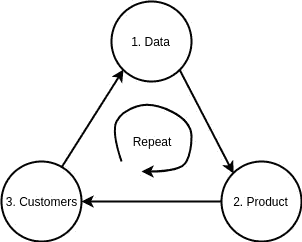

# 以下是你如何在业务中利用深度学习的方法

> 原文：<https://towardsdatascience.com/heres-how-to-leverage-deep-learning-in-your-startup-9204666a3272?source=collection_archive---------4----------------------->

深度学习是镇上的热门话题，这是理所当然的！它使许多新的创新成为可能，并赋予我们解决许多现实世界问题的能力。解决人们的问题为他们提供价值，并向客户提供良好的价值，这正是强大、盈利的企业的基础。

我们知道深度学习非常适合各种任务:语音识别、图像分类、聊天机器人和许多其他任务！但是我们如何利用 T2 的力量呢？你**如何在你的**业务**中使用** it？在我指导您如何做到这一点时，我们将使用下面的流程图来直观地展示这一过程。

# **步骤#1:** **获取您的数据**

将深度学习集成到您的业务中的第一步是获取非常重要的数据！使深度学习能够如此好地解决有价值问题的主要**来源**是**数据**。最好的深度学习模型是基于 s *监督学习*的，即它们需要大量的**标记数据**来实现如此高的性能。简而言之:如果我们想让我们的深度学习机器工作，我们需要给它大量的**燃料**；那个燃料是**数据。**

我有一些好消息要告诉你:大多数时候，这些数据都是现成的！已经有许多**公开** **可用**标记的数据集，收集用于深度学习模型的训练，以应用于常见应用。有大量的数据用于分类图像，翻译语言，聊天机器人，无人驾驶汽车，以及更多可以用于您的应用程序的数据！这里有一个关于一些流行的深度学习数据集的快速资源:[http://bit.do/Deep-Learning-Datasets](http://bit.do/Deep-Learning-Datasets)

现在，如果在极少数情况下，您有一个真正特定的**定制** **应用程序**，但没有大型公共数据集，该怎么办呢？…那我们就自己做吧！数据收集不再像以前那样具有挑战性。**网** - **刮**工具在这种情况下会非常好用。阿德里安·罗斯布鲁克有一个很棒的教程，教你如何自动抓取谷歌图片来构建你自己的数据集[http://bit.do/Scrape-Your-Dataset](http://bit.do/Scrape-Your-Dataset)。要标注大量数据，你可以像亚马逊的机械土耳其人一样使用**crowd****sourcing**！这里的目标是获得足够的数据来构建你的**最小** **可行** **产品(MVP)** 。

您可能想知道需要多少数据。衡量你需要多少数据的一个好方法是看一个类似的任务，看看别人用了多少数据来解决这个问题。那会给你一个很好的大概数字。除此之外，越多通常越好(只要你没有得到递减的回报！)!

# 第二步:构建你的深度学习产品

现在你已经有了你的标签数据，你可以完全构建你的产品。使用这些数据，你可以训练你的深度学习模型来执行一项任务，这项任务最终会为你的客户提供价值。深度学习模型在倾向于展示大量模式的重复性任务上最有效。因此，将重点放在自动化任务上，这些任务在所需的知识和执行上都非常重复，但通常也需要大量的人力或特定的技能。这样，你就**最大化了******价值**你给了你的客户一些东西，如果没有你的**深度学习驱动的产品**，他们就不会拥有这些东西。**

# ****步骤#3:客户驱动的正反馈循环****

**在这个阶段，你已经完成了在业务中利用深度学习的几个关键步骤。你已经收集了你的数据，并用它来训练深度学习模型。然后，您使用该模型来推动您的产品，实现出色的性能并提供价值。现在进入过程中最强大的部分:正向****反馈** **循环**。****

****你开始向顾客交付你的产品。有的喜欢，有的讨厌，都是一个学习的过程！非常重要的是，你的新客户现在也是一个新的数据来源，可以进一步**改进**你的深度学习模型和它们支持的产品！这里的关键是**高效** **采集******新** **数据**。******

****当您第一次构建您的 MVP 时，您可能已经使用了公开可用的数据集，或者为您的定制产品收集了您自己的数据集。在这两种情况下，你的数据足以构建一个 MVP，但可能不足以**优化** **你的** **产品**。如果您使用公共数据集，该数据可能不够具体。也许你正在为你的家建造一个人脸识别安全系统，只有当系统识别出这个人的脸时，它才会开门。如果你使用的数据集只包含清晰的面部图片，那么它可能会在雨天或夜间失效；你让你的顾客被困在雨中！在另一种情况下，您已经收集了自己的数据集，您的目标是获得足够的数据来构建 MVP。在这两种情况下，你的模型都可能受益于拥有**远** **多** **数据**；一次又一次的研究证明，**多** **数据** **有助于** **提高** **深度** **学习** **车型**:[https://arxiv.org/abs/1707.02968v2](https://arxiv.org/abs/1707.02968v2)。****

****现在你的产品在付费客户手中，他们是你新数据的**最佳** **来源**！您的客户会定期使用您的产品，通过这种使用，您可以获得更多的数据。还记得那次在雨中失败的人脸识别吗？为什么不利用这些失败来帮助**训练**你的深度学习模型表现得更好呢！你可以收集那些失败的案例，比如在下雨和晚上的时候，给它们贴上标签，然后使用新的数据来微调你的模型！每次你的系统犯了一个错误，它都会给你提供一个很好的机会:获取新的数据，标记它，然后训练你的模型从错误中学习。你甚至可以在成功的案例中这样做，收集数据并强化模型在这些情况下的表现。****

****这整个过程创造了一个**积极** **反馈** **循环**，你的客户是驱动它的人。更多的数据让你得到更好的产品，更好的产品让你得到更多的客户，而这些客户让你得到如此宝贵的数据来推动你的深度学习产品！****

# ****最后的话****

****所以你有它！通过这个过程，你可以建立一个支持防御业务的产品。一个由持续的数据循环推动的产品。由深度学习驱动的产品，为您的客户提供巨大价值。****