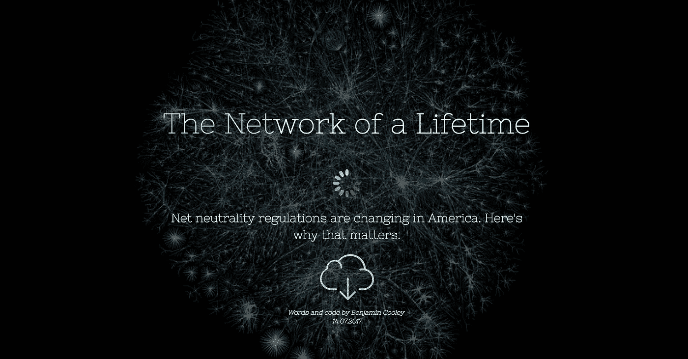
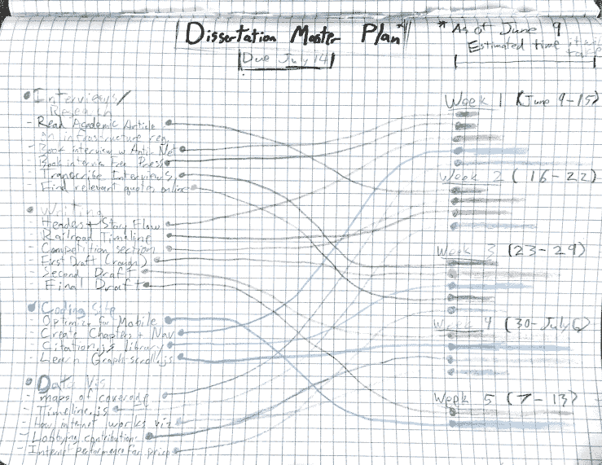
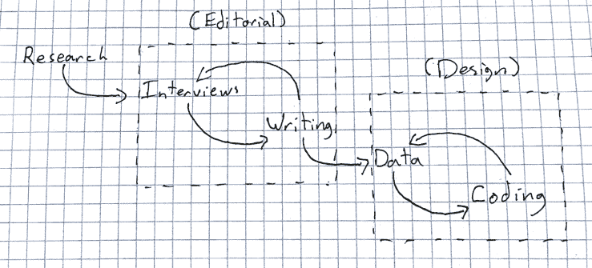
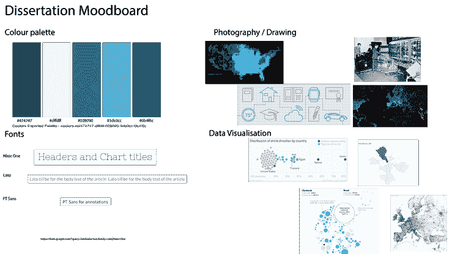
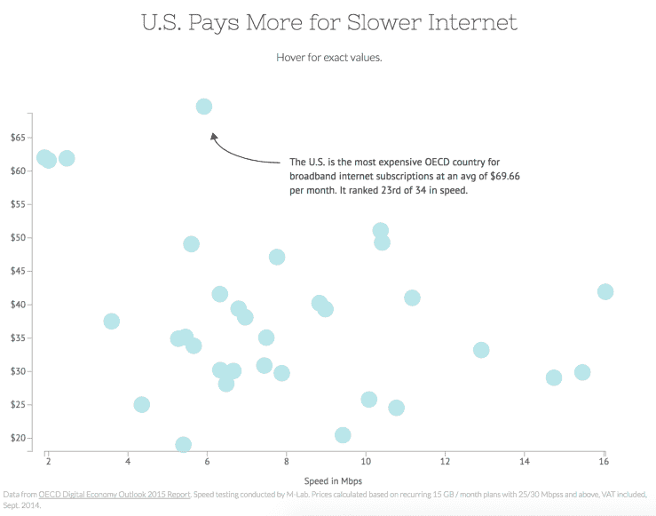
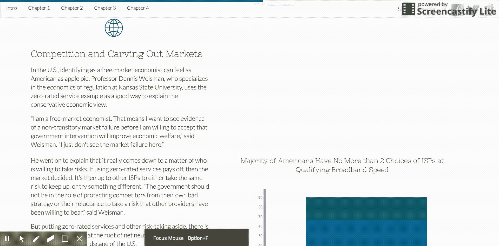
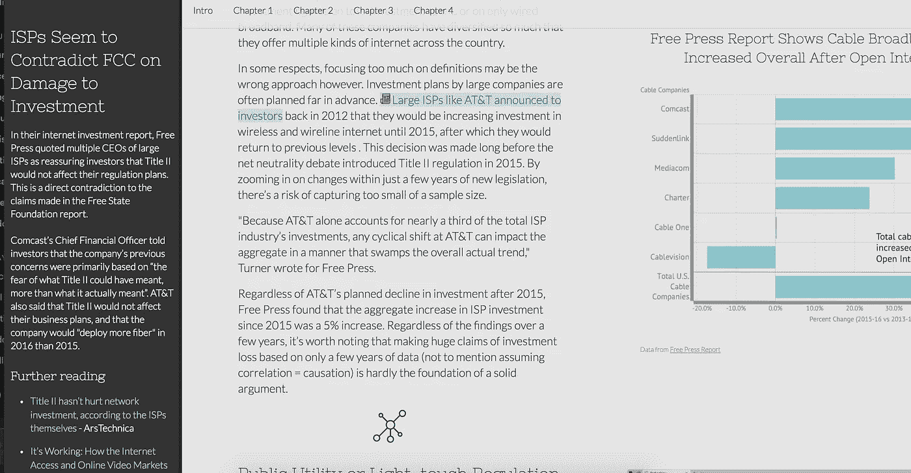

# 以下是我从编写、编码和设计我自己的长篇数据驱动专题故事中学到的东西

> 原文：<https://towardsdatascience.com/heres-what-i-learned-from-writing-coding-and-designing-my-own-longform-data-driven-feature-story-e8500ff10b43?source=collection_archive---------6----------------------->

“不择手段。”这个短语在历史上有了新的含义，从第一次出现在让-保罗·萨特的戏剧中，到出现在马尔科姆·Ⅹ关于民权运动的演讲中。

当我想到这个短语时，它是在一个完全不同的环境中。去年 9 月，我走进伦敦大学金史密斯校区，开始了我数字新闻硕士课程的第一天。在接下来的一年里，我和我的同学将学习如何使用数据可视化、多媒体视频和网络应用程序为网络创作身临其境的故事。我们的计算机教授告诉我们，如果我们坚持一个原则，我们永远不会走远:

> 不择手段。

加长版？从你想要结束的地方开始，然后用你自己的方式进行破解、测试、实验和编码(即使会变得很乱)。这就是我们学会的。

三个月前，我开始将我在课程中学到的一切汇编成一个故事:一篇长篇数据驱动的专题文章，从头开始编码(没有模板)。

最终结果来自于数小时的研究、采访、清理数据集、搜索 d3.js 示例、在代码不起作用时拔掉头发、喝几升咖啡和工作许多个深夜。

我的文章《一生的网络》讲述了美国网络中立性的变化，以及这些法规如何影响消费者使用互联网。我开始创作一个故事，其中包括整个作品的数据分析和可视化，滚动是主要的用户交互。

我不知道完成后会有什么感觉:我努力了这么久的东西，突然变得“完成”并到达终点。

现在，几个星期后，完成这个大型项目的压力已经消失了。我想分享一些我一路走来学到的最重要的东西。对于这种项目，新闻编辑室通常会让多个人来做这项工作:一名记者、一名数据记者、一名网站开发人员，也许还有一名文字编辑。这篇文章是关于我通过必须同时成为所有这些人而学到的东西。

# 用一个总计划提前规划你的计划

我知道这个项目需要我同时做很多不同的事情。大型项目有许多阶段和任务——计划和组织是必不可少的。所以在我开始写作或编码的几周前，我给自己制定了一个总体计划。这是草图，作为我的项目进度监视器。

我把每项任务分成一个类别，然后在截止日期前的几周内把它们分开。然后，在每个星期的开始，我会看到我想在那一周完成什么，以及哪一天我可以开始工作。

显然，这并不总是完美的……一些任务最终花费了比预期长得多的时间，而另一些则通过在网上找到一个快速的解决方案来检查。但是估计每项任务需要的时间是管理整个项目的关键。如果某项任务花费的时间比我预计的时间长得多，就需要做出一个艰难的决定:要么坚持到底，要么找一个更简单的方法来完成它。

# 尽早测试，经常测试

在这个项目开始的时候，我认为这个作品的创作过程大概是这样的:

除了我的总体规划之外，事情本该如此发展。但事实上，最终的重叠比我预期的要多得多。新闻不会为任何人停止。在我的最后一周，我仍然在研究关于网络中立的最新文章，这导致了故事中某些段落的添加或删除。我一边写代码，一边创建数据可视化，一边记录采访等。这是混乱的，并且不像上面的图表那样线性。

但更重要的是，在测试代码的最后两周，采用这种方法让我陷入了困境。由于我把大部分代码留到了最后，我发现自己在过去几天里忙着在不同的设备和浏览器上测试我的网页。

这导致了一个巨大的难题，如何让所有不同的图形和数据在移动设备上看起来清晰。回过头来看，我应该在创建网站的时候就开始测试，使用不同的设备，从移动布局优先的方法开始，而不是调整桌面来适应移动设备。

# 总是从情绪板开始

在这个项目的早期，我就开始拼凑一个情绪影响板来塑造页面的外观和感觉。这是我从在创意设计机构工作的人那里学到的一种做法。我粘贴了 NYT、FiveThirtyEight 和 Quartz 等出版商提供的我最喜欢的互动故事的链接和截图，以保存一些灵感。

从这个情绪板上，我将这些影响正式化，以创建适用于整个网页的规则。我的情绪板包括字体选项、一套调色板、笔画粗细、数据可视化示例和摄影风格。

这些预设也让我开始为我的设计选择赋予意义。例如，因为我有一个设置好的调色板，所以我可以将某些颜色定义为网页中图表的强调色，或者将某种字体仅用作注释。

值得注意的是，这个过程发生在我开始为这个网站写任何代码之前。一旦我开始编码，CSS 样式很容易开始应用，因为我已经在情绪板上决定了。这也确保了我的文本、图像和图形在整个故事中的一致性。

# 有意识地进行互动

交互性是我反复思考了很久的一个问题。这是新闻媒体正在进行的辩论，尤其是在数据可视化方面。但在阅读了该领域一些最聪明的人的言论后，我决定基于英国《金融时报》互动新闻主管马丁·斯塔贝(尽管最初是由布莱恩·博耶在推特上发布的)采纳的一条箴言，实施一种极简主义的互动方法。

如果一个图表不能从交互中获益，我就用 Tableau 构建它，用 Adobe Illustrator 添加注释来讲述故事。它可能不是华而不实的，但它加载速度快，显示数据有效，只是简单地完成工作。对我来说，问题变成了:用户能从悬停/点击/缩放中真正受益多少？如果回答不多，我把互动元素剪掉了。

也就是说，并不是所有的图表都是静态的。例如，我创建了一个大型散点图，显示 34 个不同国家的互联网价格和速度。交互性在这里似乎更有意义，这样用户就可以在他们感兴趣的国家的价值观上徘徊。所以这个我用了 d3.js。但由于焦点是美国泡沫的价值，我添加了一个注释来展示这些。

NYT 的图形编辑阿奇·谢(Archie Tse)对采用这种方法来注释数据中的要点有一个很好的引用。

> 如果你做了一个工具提示或者鼠标经过，假设没有人会看到它。—阿奇·谢

如果没有人看到其他泡沫的确切数值，这张图表仍然能传达我的信息。

我尝试实现的另一种交互形式是滚动。现在，这还没有达到像[布丁](https://pudding.cool/)或 [NYT 图形团队](https://twitter.com/nytgraphics)这样的人制作的滚动故事的规模。但是因为用户自然会向下滚动页面，所以我尝试用这种方式在图形和页面元素之间转换。

# 给语境和意义提供机会

因为我正在讨论一个技术性很强的话题，所以我知道某些术语和话题需要解释。但与此同时，我不想用我文章的一半来解释零评级服务和内容分发网络等术语的含义。

我不得不假设一些人对网络中立的话题很熟悉，而另一些人对这场辩论还很陌生。所以我决定借鉴出版商最近使用的策略，在整个故事中提供额外的背景。一个很好的例子是《华盛顿邮报》的[“知识地图”功能](https://www.washingtonpost.com/pr/wp/2015/07/16/the-washington-post-tests-new-knowledge-map-feature/?utm_term=.5994118dcc7c)，它突出显示某些文本，当点击时，会打开一个包含相关背景信息的框。

在我自己的文章中，我采用了类似的方法，对用户可能想了解更多信息的人、术语或问题使用亮色。为了与常规链接区分开来，我还在高亮部分添加了一个小的报纸图标，以此来表示这将在网页中显示额外的信息。由于我为我的站点使用了 Uikit 框架，所以我通过滑动画布外 div 在页面上显示了这些上下文框。

Screenshot of context feature

# 无情地对待你的先入之见

在我开始这个项目之前，我对最终的故事有一个很大的计划。我在网上收藏并保存了一些精彩的故事，作为我的基准。这将是有史以来最伟大、最好、最惊人的视觉数据故事。

但现实是:我不是一名职业开发人员。大约一年半前，我才开始做一些简单的编码工作。我也不是设计师。我是一名数据记者，在我的工具箱里有几项关键技能来创作一个具有视觉冲击力的故事。所以我兜了一圈，回到我的课程口号:

> 不择手段。

当我开始构建我的故事时，我调整了我的志向以适应我的时间表和能力。这并不意味着当事情变得困难时我就放弃了；我花了大量的时间调试和搜索堆栈溢出来解决我的编码问题。有时我会取得重大突破。

但其他时候，我不得不无情地对待自己，并找到一种不那么“令人印象深刻”的方式来建立一些东西。我学会了挑战自己，学习新的技能和语言，同时也知道何时放弃，寻找不同的方式来实现我的目标。最后，故事总是要占据中心舞台，而不是华而不实的技术元素。

这最后一点可能是我学到的最重要的一点，但这篇文章绝不是详尽无遗的。在创建这个功能的整个过程中，我学到了很多关于时间管理、调试代码和为 web 编写长格式功能的知识。

但我知道我并不孤单。视觉新闻和用数据讲故事正在媒体中兴起，这些技能正迅速从可选变为推荐。我希望我在黑进一个数字专题故事的过程中所学到的这些经验可以帮助那些需要做同样事情的人。

终生的[网络是使用以下工具/资源创建的:](http://igor.gold.ac.uk/~bcool001/portfolio/dissertation/network-of-a-lifetime.html)

*   Uikit
*   卷轴魔法
*   jQuery
*   D3.js
*   C3.js
*   （舞台上由人扮的）静态画面
*   Adobe Illustrator

好奇更多？[取得联系。](https://benjamincooley.me/contact/)

*原载于 2017 年 7 月 28 日*[*Benjamin cooley . me*](https://benjamincooley.me/2017/07/28/heres-what-i-learned-from-writing-coding-and-designing-my-own-longform-data-driven-feature-story/)*。*