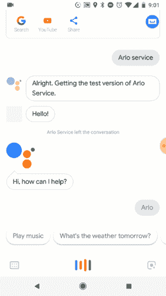
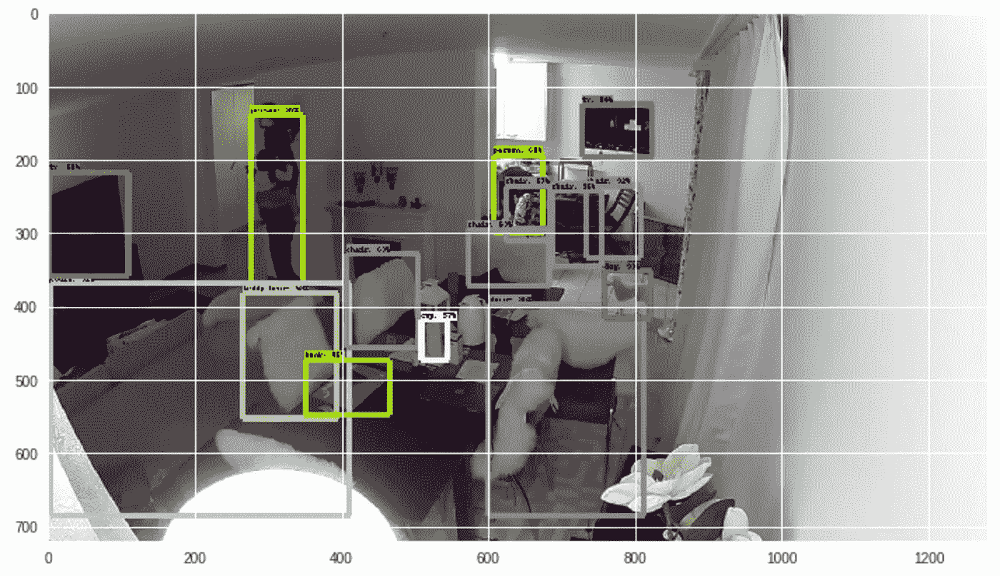

# 嘿谷歌，我的宠物在哪里？张量流对象检测贡献

> 原文：<https://towardsdatascience.com/hey-google-where-is-my-pet-tensorflow-object-detection-contribution-9c1d1fdd0443?source=collection_archive---------8----------------------->

使用[谷歌助手](https://assistant.google.com/) /Google Home 是每天让我的家居生活更加灵活的东西。

我们还知道，计算机视觉学科为家庭安全领域提供了越来越多的支持。除了手动/半手动监控的传统元素之外，安全摄像机还有许多使用案例。借此机会，我想分享一个我家安全系统的经验。

# 挑战

我想与我的 Google Assistant/Google Home 系统交互以给出指令…并使用我的 cam 安全系统和 TensorFlow 的功能创建一些东西来定位我的宠物。

# 这个提议

所以，让我们使用谷歌助手动作，TensorFlow，计算机分析的力量，与相机系统的集成和云处理的力量。用这个…减少问题，只说一句话。

嘿谷歌，我的宠物在哪里？

example architecture

*作为摄像系统，我使用了[爱洛](https://www.arlo.com/)。[顺便说一下非常好的硬件，具有灵活的硬件和非常稳定。].在混凝土[阿洛](https://www.arlo.com/) Pro 2。

此实施的预计步骤顺序如下:

1.  通过 [Google Assistant](https://assistant.google.com/) 【跨 Google Home 或通过电话】进入服务。在家庭环境中灵活使用语音指令非常方便[ [Article](https://nickbortolotti.blogspot.ch/2018/01/google-assistant-simpleness-of.html) 关于此组件的更多信息。].该实现将与组件***ArloCamService***的 webhook 连接。[ [Github](https://github.com/nbortolotti/ArloCamService) ]
2.  “ArloCamService”服务负责定位可用的相机，拍摄照片并发送给***TensorPhotoXRay***[Github](https://github.com/nbortolotti/TensorPhotoXRay)。*在该组件中，我们分析图像并提取检测中最有把握的对象。
3.  然后只剩下确定是否存在与所寻找的项目的匹配，并将该消息返回给用户。

让我们看看示例实现是如何工作的:

testing implementation using Google Assistant

# ArloCamService 会发生什么？

该组件与爱洛相机系统连接，在本例中，我们仅使用照片。

*在这个组件上还有很多工作要做，但是对于我们的例子来说，它是功能性的。【 [Github](https://github.com/nbortolotti/ArloCamService) 】。[文章](https://nickbortolotti.blogspot.ch/2018/01/an-service-option-to-interact-with-arlo.html)提供了关于该组件的更多信息。

# **张量光电射线会发生什么？**

该组件接收照片，用通用模型或个性化模型对其进行分析。

这是一个直观的例子:

然后它提供一个标签列表和它们的信任值，这里有一个例子。

> [{ "人":97}、{ "椅子":95}、{ "人":95}、{ "沙发":92}、{ "椅子":82}、{ "电视":81}、{ "电视":81}、{ "椅子":79}、{ "狗":76}、{ "书":65}]

*在这个组件上还有很多工作要做，但是对于我们的例子来说，它是功能性的。[ [Github](https://github.com/nbortolotti/TensorPhotoXRay) ]

很多时候，我们有非常好的技术，或者非常好的技术，但是这些技术本身缺乏区别意义。添加一些元素并混合，我们可以为每天都在寻找更智能解决方案的用户创造出一些令人惊叹的东西。

这种实现将计算机视觉与在家庭环境中做出不同贡献的目标相结合。你能想到其他的用例吗？我希望你和我一样喜欢这个实施方案。