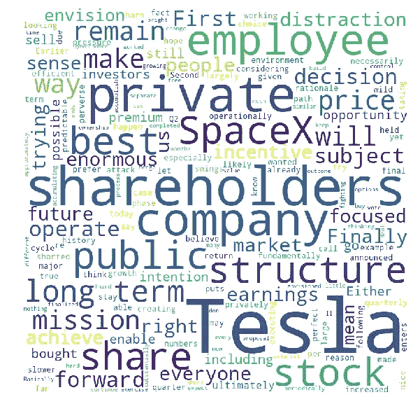
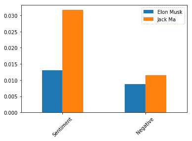
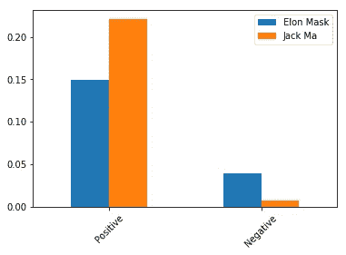

# 隐藏在文本之下:马云退休信与埃隆·马斯克私有化信分析

> 原文：<https://towardsdatascience.com/hidden-beneath-texts-analytics-of-jack-ma-retirement-letter-and-elon-musk-s-privatization-letter-85ec2af4a2db?source=collection_archive---------9----------------------->

9 月 10 日对于中国互联网行业来说是一个非常重要的日子。首富、阿里巴巴董事局主席马云发出了他的退休信，宣告中国最大互联网帝国的新时代即将到来。

一个月前，特斯拉首席执行官埃隆·马斯克(Elon Musk)也发出了一封震惊股市的信。在信中，他表达了将特斯拉私了的意图。最终私有化计划没有做成，但还是在商业圈引起了一些涟漪。

我刚刚想到，这两封信对股市造成了如此大的影响，它们被不同的媒体广泛报道。我只是想知道我是否可以尝试破解这两封信的文本数据。通过一些简单有趣的文本分析和我在夏天学到的技巧，我想在文本下面提供一些发现。这两位伟大的首席执行官是正面还是负面看待他们的帝国？从这两封信中可以看出对阿里巴巴和特斯拉的主要关注点和愿景是什么？这些想法真的很吸引我。所以我只是在网上找到文本，开始破解数据，看看我是否能从中挖掘出一些黄金。

*阿里巴巴马云退休信*:【https://www.bloomberg.com/technology】T2

*特斯拉埃隆马斯克私有化函*:[http://fortune . com/2018/08/07/Tesla-Elon-Musk-Letter-to-employees-Tesla-stock-tsla/](http://fortune.com/2018/08/07/tesla-elon-musk-letter-to-employees-tesla-stock-tsla/)

# 步骤 0:加载所需的包

准备步骤是加载一些包。我使用 python 包 NLTK 进行文本分析，使用 WordCloud 制作一些可视化的图形。

```
import pandas as pd
import nltk
from nltk.tokenize import RegexpTokenizer
from nltk.sentiment.vader import SentimentIntensityAnalyzer
from wordcloud import WordCloud, STOPWORDS 
import matplotlib.pyplot as plt
```

# 步骤 1:加载数据和文本字典

对于文本情感分析，我使用了两种方法进行分析。第一个是 Loughran 和 McDonald 正面和负面词典(LMD)，它广泛用于商业演讲、文档或公告的情感分析。另一个是 NLTK 包中内置的 SentimentIntensityAnalyzer。

下面的代码是我如何在 LMD 加载。(词典文本文件很容易在网上找到)

```
# Positive Words Dictionary
with open('LM_pos_words.txt', 'r') as f:
    pos = f.read().replace('\n',',')
tokenizer = RegexpTokenizer(r'\w+')
pos_token = tokenizer.tokenize(pos)
pos_token = [word.lower() for word in pos_token]# Negative Words Dictionary
with open('LM_neg_words.txt', 'r') as f:
    neg = f.read().replace('\n',',')
tokenizer = RegexpTokenizer(r'\w+')
neg_token = tokenizer.tokenize(neg)
neg_token = [word.lower() for word in neg_token]
```

在加载了所需的文本字典后，马云和埃隆马斯克的信件文本也需要加载。我们用记号赋予器来看你，两个字母里有很多单词。

```
## Load in Jack Ma's retirement Letter
with open('Jack Ma_retire.txt', 'r',encoding="cp1252") as f:
    lines = f.read().replace('\n', '')tokenizer = RegexpTokenizer(r'\w+')
tokens = tokenizer.tokenize(lines)
len(tokens)
# It contains 1036 words## Load in Elon Musk's Privatization Letter
with open('Elon_private.txt', 'r',encoding="cp1252") as f:
    lines_17 = f.read().replace('\n', '')

tokenizer = RegexpTokenizer(r'\w+')
tokens17 = tokenizer.tokenize(lines_17)
len(tokens17)
# It contains 634 words
```

# 第二步:信件中的信息

我决定为字母绘制一些简单的单词云。从词云可以突出一些信息。它可能揭示了一个领导者对自己公司的一些看法和想法。

首先，我们需要设置停用词，这有助于消除文本中的一些噪音。

```
stopwords = set(STOPWORDS)
```

然后我们为马云的退休信和埃隆马斯克的信构建词云。

```
# Jack Ma's letter
wordcloud_ma = WordCloud(width = 600, height = 600, 
                background_color ='white', 
                stopwords = stopwords, 
                min_font_size = 10).generate(lines)plt.figure(figsize = (8, 8), facecolor = None) 
plt.imshow(wordcloud_ma) 
plt.axis("off") 
plt.tight_layout(pad = 0) 
plt.show()# Elon Musk's letter
wordcloud_elon = WordCloud(width = 600, height = 600, 
                background_color ='white', 
                stopwords = stopwords, 
                min_font_size = 10).generate(lines_17)plt.figure(figsize = (8, 8), facecolor = None) 
plt.imshow(wordcloud_elon) 
plt.axis("off") 
plt.tight_layout(pad = 0) 
plt.show()
```

图表如下所示:


Jack Ma’s letter- Word Clouds



Elon Musk’s letter-Word Cloud

在这两个图表中，两家公司的名称都被突出显示。对于不同的部分，我们可以看到，杰克强调了一些词，如“文化”、“人才”、“使命”、“合作伙伴”和“人”，而埃隆·马斯克更强调“股东”、“员工”、“结构”、“股票”、“私有”和“保留”

我们可以看到这封信与目标读者的巨大不同。尽管这两封信都是公开的，但不知何故，杰克更多地瞄准了阿里巴巴的内部人才和外部合作伙伴。他非常强调未来的使命，这可能预示着阿里巴巴将继续在互联网行业的使命和火炬。

然而，埃隆·马斯克主要是先针对股东，然后才是员工。在信中，他似乎被动地说服利益相关者，他可能会为他们做一些最好的建议，一切将保持不变(T2 )( T4 )()的结构(T5)。

# 第三步:LMD 的情感分析

然后我开始对 LMD 进行情感分析。开始时，我试图去掉停用词和数字文本。

```
# Clean the stop word and number of Jack Ma's letter
fdist = nltk.FreqDist(tokens)
stop_word = []
for word, freqency in fdist.most_common(10):
    stop_word.append(word)

tokens_n_s = [word for word in tokens if word not in stop_word]
tokens_n_s = [word for word in tokens_n_s if not word.isnumeric()]
tokens_n_s = [word.lower() for word in tokens_n_s]
```

然后，我们可以开始计算字母的积极和消极的话。

```
token_pos_ma = [word for word in tokens_n_s if word in pos_token]
token_neg_ma = [word for word in tokens_n_s if word in neg_token]len(tokens_n_s)    # 758
len(token_pos_ma)  # 31
len(token_neg_ma)  # 7
```

情感计算如下所示:

```
Sentiment%: (# of Positive - # of Negative) / # of text(cleaned)
Negative%: # of Negative / # of text(cleaned)
```

我应用了与埃隆·马斯克的信相似的代码，并绘制了下面的结果。



从图表中，我们可以看出，有了 LMD 文本词典。马云信中的积极情绪远远高于埃隆·马斯克。负面情绪颇为相似。

我们可以通过信件查阅。杰克对公司的未来发展非常乐观；然而，埃隆·马斯克可能对特斯拉有一些负面和悲观的看法。

# 步骤 4:使用 NLTK 情感分析器进行情感分析

为了给出一个更具可比性的视角，我决定用 NLTK 内置的分析器进行情感分析，以掌握两封信的积极和消极情感。

```
sid = SentimentIntensityAnalyzer()# Jack Ma's letter
scores = sid.polarity_scores(lines)
for key in sorted(scores):
    print('{0}: {1}, '.format(key, scores[key]), end='')## compound: 0.9997, neg: 0.007, neu: 0.771, pos: 0.221,# Elon Musk's letter
scores_elon = sid.polarity_scores(lines_17)
for key in sorted(scores_elon):
    print('{0}: {1}, '.format(key, scores_elon[key]), end='')## compound: 0.9975, neg: 0.039, neu: 0.812, pos: 0.149,
```

结果如下所示:



反差巨大。对马云信的正面情绪高于埃隆马斯克，负面情绪低于埃隆马斯克。从这两个使用不同方法的图表中，我们可以从文本和分析中得出结论。在这封信发布的时候，特斯拉可能会遇到一些问题，而阿里巴巴仍在朝着良好的方向发展。

# 一些反映

将这两个文本进行比较是一个随机的想法，对我来说令人惊讶的是，分析展示了一些有趣的发现。希望你喜欢阅读，这些文章给你一些不同的视角来看这些公告。有时候，信不仅仅是信。它可能会给你公司未来的一些提示。

```
If you like the article, feel free to give me 5+ claps
If you want to read more articles like this, give me 10+ claps
If you want to read articles with different topics, give me 15+ claps and leave the comment hereThank for the reading
```