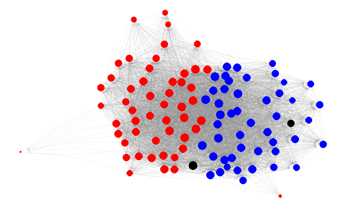
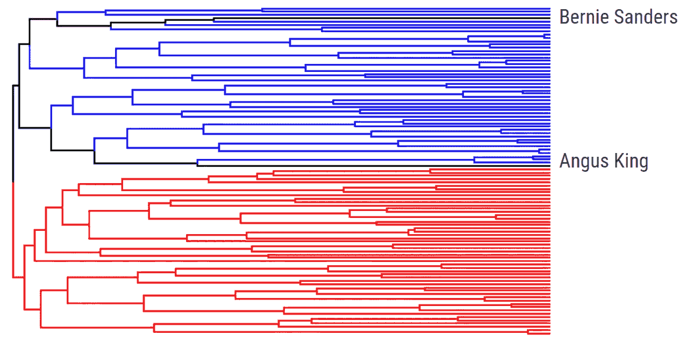
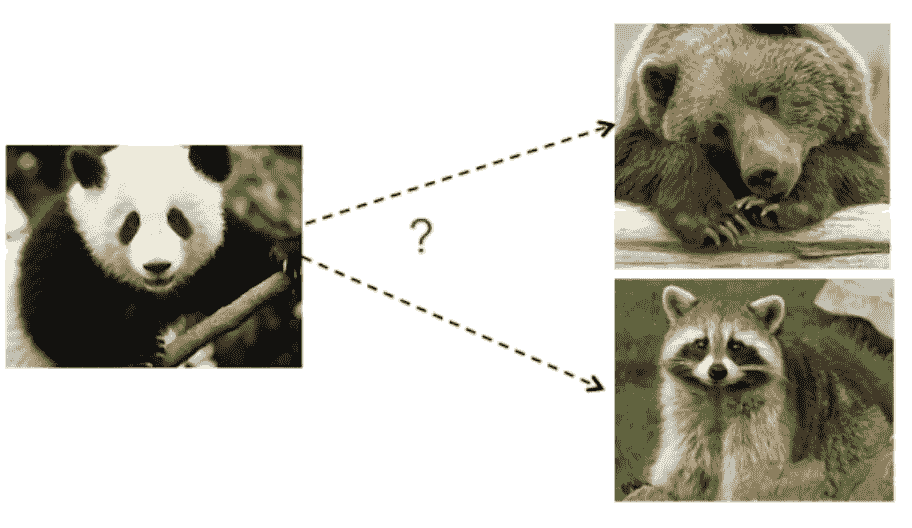
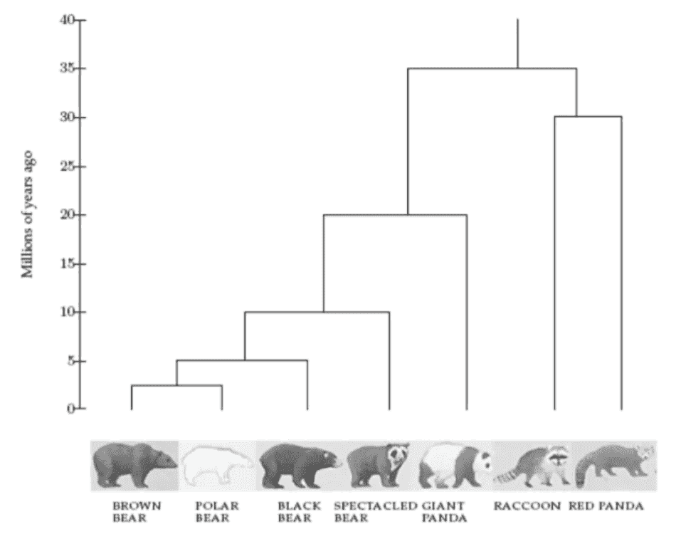
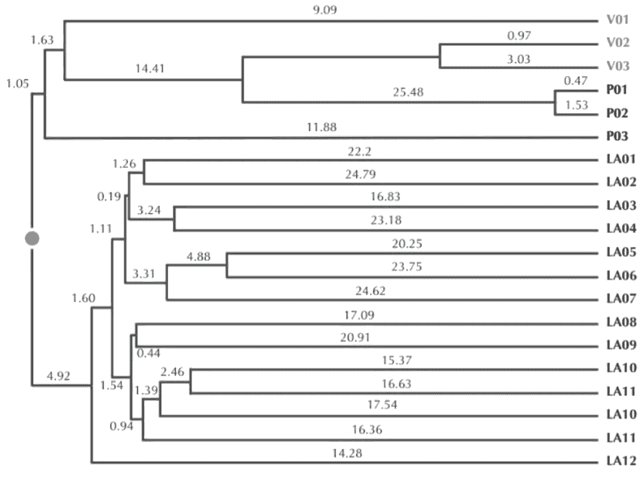
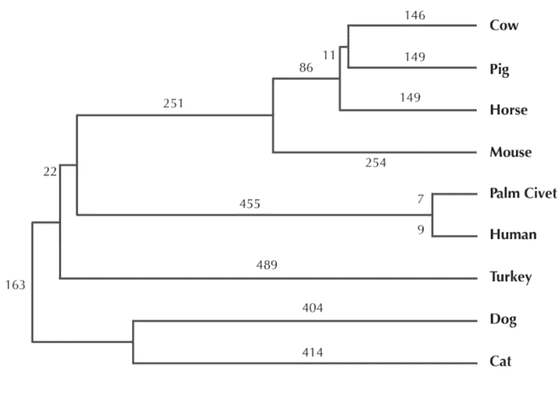
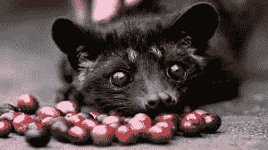

# 层次聚类及其应用

> 原文：<https://towardsdatascience.com/hierarchical-clustering-and-its-applications-41c1ad4441a6?source=collection_archive---------3----------------------->

聚类是数据科学中最著名的技术之一。从[客户细分](/clustering-algorithms-for-customer-segmentation-af637c6830ac)到[异常值检测](https://www.datadoghq.com/blog/outlier-detection-algorithms-at-datadog/)，它有着广泛的用途，以及适合不同用例的不同技术。在这篇博文中，我们将看看层次聚类，这是聚类技术的层次化应用。

# 使聚集

用一句话来说，聚类就是提取相似数据对象的自然分组。

Republican and Democrat clusters of senators

关于集群，有几个常见的想法:

*   聚类应该自然地出现在数据中。
*   聚类应该发现数据中隐藏的模式。
*   聚类中的数据点应该是相似的。
*   两个不同聚类中的数据点不应相似。

用于聚类的常见算法包括 K 均值、DBSCAN 和高斯混合模型。

# 分层聚类

如前所述，层次聚类依赖于使用这些聚类技术来寻找聚类的层次结构，其中该层次结构类似于树结构，称为树状图。

> 层次聚类是基于组相似性的数据的层次分解

## 查找分层聚类

有两种顶级方法可以找到这些层次聚类:

*   **聚集**聚类使用*自下而上*的方法，其中每个数据点从自己的聚类开始。然后，通过将两个最相似的聚类放在一起并合并，贪婪地将这些聚类结合在一起。
*   **分裂式**聚类使用一种*自顶向下*的方法，其中所有数据点都在同一个聚类中开始。然后，您可以使用 K-Means 之类的参数聚类算法将该分类分成两个分类。对于每个集群，您进一步将它分成两个集群，直到达到所需的集群数量。

这两种方法都依赖于在所有数据点之间构建相似性矩阵，这通常通过余弦或 Jaccard 距离来计算。

# 层次聚类的应用

## 1)美国参议员通过 Twitter 聚集

*我们能通过 Twitter 找到政党路线吗？*

继有争议的[“Twitter 情绪预测股市”论文](https://www.sciencedirect.com/science/article/pii/S187775031100007X)之后，研究人员一直将 Twitter 视为极具价值的数据来源。在这个例子中，我们使用 Twitter 将美国参议员分组到他们各自的党派中。

我们的数据很简单:我们只看哪个参议员跟着哪个参议员。它定义了一个图结构，以参议员为节点，以随从为边。

在这个图中，我们使用了由 [Pons 等人](https://www-complexnetworks.lip6.fr/~latapy/Publis/communities.pdf)提出的 Walktrap 算法，该算法在图中进行随机遍历，并通过从一个参议员开始到某个参议员的次数来估计参议员相似度。

在获得这些相似性之后，我们可以使用凝聚聚类来找到树状图。

*Reds are Republicans, Blues are Democrats, Blacks are independent*

为了衡量我们的聚类效果如何，我们可以用聚会的颜色来给结果着色。正如你所看到的，民主党人和共和党人从顶部非常明显地分裂，显示了这种方法的成功。

你可能也注意到了两条黑线，代表独立参议员。这些都是有点棘手的评估，但参议员伯尼·桑德斯和参议员安格斯金党团与民主党，这意味着这是自然的，他们在民主党的分支树。

## 2)通过系统进化树绘制进化图

*我们如何将不同的物种联系在一起？*

在 DNA 测序可靠之前的几十年里，科学家们努力回答一个看似简单的问题:大熊猫更接近熊还是浣熊？

如今，我们可以利用 DNA 测序和系统聚类来寻找动物进化的[进化树](https://en.wikipedia.org/wiki/Phylogenetic_tree):

1.  生成 [DNA 序列](https://en.wikipedia.org/wiki/DNA_sequencing)
2.  计算所有序列之间的[编辑距离](https://en.wikipedia.org/wiki/Edit_distance)。
3.  基于编辑距离计算 DNA 相似性。
4.  构建系统进化树。

这项实验的结果是，研究人员能够把大熊猫放在离熊更近的地方。

## 3)通过系统发生树追踪病毒

*我们能找到病毒爆发的源头吗？*

追踪病毒爆发及其来源是一项重大的健康挑战。追踪这些疫情的源头可以为科学家提供更多的数据，说明疫情开始的原因和方式，从而有可能挽救生命。

像艾滋病毒这样的病毒具有很高的突变率，这意味着同一种病毒的 DNA 序列的相似性取决于它传播的时间。这可以用来追踪传播途径。

这种方法[在一个法庭案例](http://www.pnas.org/content/99/22/14292)中被用作证据，在该案例中，与对照组相比，发现受害者的艾滋病毒链与被告患者的更相似。

V1–3 are victim’s strands, P1–3 are accused patient’s, and LA1–12 are the control group

一项类似的研究也是为了寻找给人类带来 SARS 病毒的动物:

所以人类从果子狸身上感染了 SARS 病毒…对吗？

[image source](https://www.lifegate.com/people/news/kopi-luwak-coffee-asian-palm-civets)

> “有了手头的数据，我们可以看到病毒是如何利用不同的宿主的，按照这个顺序，从**蝙蝠到人类再到果子狸**。所以果子狸实际上是从人类那里感染了非典**——[科学日报](https://www.sciencedaily.com/releases/2008/02/080219150146.htm)**

# **结论**

**分层聚类是一种强大的技术，它允许您从数据相似性中构建树结构。现在，您可以看到不同的子分类之间的关系，以及数据点之间的距离。请记住，这些相似性并不意味着因果关系，就像棕榈果子狸的例子一样，您将拥有另一个工具。**

## **参考**

1.  **Anasse Bari 博士的大数据科学(NYU)讲座幻灯片**
2.  **生物信息学(Bogazici 大学)Arzucan Ozgur 博士的讲稿**