# R 中分类数据的层次聚类

> 原文：<https://towardsdatascience.com/hierarchical-clustering-on-categorical-data-in-r-a27e578f2995?source=collection_archive---------0----------------------->

这是我第一次尝试在真实数据上执行客户聚类，这是一次宝贵的经历。虽然网上关于使用数值变量进行聚类的文章和博客文章很多，但我花了一些时间来寻找分类数据的解决方案，如果你想到这一点，这确实不那么简单。分类数据聚类的方法仍在开发中——我将在另一篇文章中尝试这两种方法。

另一方面，我也遇到过这样的观点，对分类数据进行聚类可能不会产生合理的结果——这在一定程度上是正确的(在 CrossValidated 上有一个[惊人的讨论)。在某一点上，我想“我在做什么，为什么不把它全部分成几组呢？”但是群组分析并不总是明智的，特别是在您获得更多级别的分类变量的情况下，您可以轻松浏览 5-7 个群组，这可能很容易，但是如果您有 22 个变量，每个变量有 5 个级别(比如，这是一个离散分数为 1，2，3，4，5 的客户调查)，并且您需要了解您有哪些独特的客户群，您将有 22×5 个群组。没人想这么做。聚类似乎是有用的。所以这篇文章是关于分享我希望在开始研究集群时遇到的事情。](https://stats.stackexchange.com/questions/218604/with-categorical-data-can-there-be-clusters-without-the-variables-being-related)

聚类过程本身包含 3 个不同的步骤:

1.  计算相异度矩阵——可以说是聚类中最重要的决定，你所有的后续步骤都将基于你所做的相异度矩阵。
2.  选择聚类方法
3.  评估集群

这篇文章是初级水平的，涵盖了基础知识和 r 中的实现。

D issimilarity Matrix
可以说，这是你聚类的主干。相异矩阵是一种数学表达式，表示数据集中的点彼此之间的差异或距离，因此您可以稍后将最接近的点分组在一起或分离最远的点，这是聚类的核心思想。

这是数据类型差异非常重要的步骤，因为相异矩阵是基于各个数据点之间的距离。虽然很容易想象数字数据点之间的距离(例如，还记得[欧几里德距离](https://en.wikipedia.org/wiki/Euclidean_distance)？)，分类数据(R 中的因子)似乎不那么明显。

为了计算这种情况下的相异度矩阵，你需要一个叫做高尔距离的东西。我不会进入它的数学，但我在这里提供了一个[链接](http://venus.unive.it/romanaz/modstat_ba/gowdis.pdf)和[链接](https://www.rdocumentation.org/packages/cluster/versions/2.0.6/topics/daisy)。为此，我更喜欢使用`**cluster** package`中的`daisy()`和`metric = c("gower")`。

```
#----- Dummy Data -----#
# the data will be sterile clean in order to not get distracted with other issues that might arise, but I will also write about some difficulties I had, outside the codelibrary(dplyr)# ensuring reproducibility for sampling
set.seed(40)# generating random variable set
# specifying ordered factors, strings will be converted to factors when using data.frame()# customer ids come first, we will generate 200 customer ids from 1 to 200
id.s <- c(1:200) %>%
        factor()
budget.s <- sample(c("small", "med", "large"), 200, replace = T) %>%
            factor(levels=c("small", "med", "large"), 
            ordered = TRUE)origins.s <- sample(c("x", "y", "z"), 200, replace = T, 
             prob = c(0.7, 0.15, 0.15))area.s <- sample(c("area1", "area2", "area3", "area4"), 200, 
          replace = T,
          prob = c(0.3, 0.1, 0.5, 0.2))source.s <- sample(c("facebook", "email", "link", "app"), 200,   
            replace = T,
            prob = c(0.1,0.2, 0.3, 0.4))## day of week - probabilities are mocking the demand curve
dow.s <- sample(c("mon", "tue", "wed", "thu", "fri", "sat", "sun"), 200, replace = T,
         prob = c(0.1, 0.1, 0.2, 0.2, 0.1, 0.1, 0.2)) %>%
         factor(levels=c("mon", "tue", "wed", "thu", "fri", "sat", "sun"), 
        ordered = TRUE)# dish 
dish.s <- sample(c("delicious", "the one you don't like", "pizza"), 200, replace = T)

# by default, data.frame() will convert all the strings to factors
synthetic.customers <- data.frame(id.s, budget.s, origins.s, area.s, source.s, dow.s, dish.s)#----- Dissimilarity Matrix -----#library(cluster) 
# to perform different types of hierarchical clustering
# package functions used: daisy(), diana(), clusplot()gower.dist <- daisy(synthetic.customers[ ,2:7], metric = c("gower"))# class(gower.dist) 
## dissimilarity , dist
```

用相异矩阵完成。这对于 200 次观察来说是非常快的，但是如果你有一个大的数据集，计算起来可能会非常昂贵。

实际上，您很可能必须首先清理数据集，执行从字符串到因子的必要转换，并注意丢失的值。在我自己的例子中，数据集包含丢失值的行，每次都很好地聚集在一起，使我认为我找到了宝藏，直到我看了这些值(哼！).

C 聚类算法
你可能听说过有 *k-means* 和*分层*聚类。在本文中，我主要关注后者，因为它是一种更具探索性的类型，并且可以采用不同的方法:您可以选择遵循*聚集*(自下而上)或*分裂*(自上而下)的聚类方式。

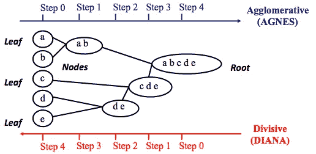

*Credits:* [*UC Business Analytics R Programming Guide*](http://uc-r.github.io/hc_clustering)

凝聚聚类将从 *n 个*聚类开始，其中 *n* 是观察值的数量，假设它们中的每一个都是自己单独的聚类。然后，算法将尝试找到最相似的数据点，并将它们分组，因此它们开始形成聚类。

相比之下，分裂聚类将反其道而行之——假设所有的 *n* 个数据点是一个大的聚类，并将最不相似的分成不同的组。

如果你正在考虑使用其中的哪一个，尝试所有的选项总是值得的，但总的来说，*凝聚聚类在发现小簇方面更好，*并且被大多数软件使用；*分裂聚类——发现更大的聚类*。

我个人喜欢先看看树状图——聚类的图形表示，以决定我将坚持哪种方法。正如你将在下面看到的，一些树状图将会非常平衡，而其他的看起来会很混乱。

```
# The main input for the code below is dissimilarity (distance matrix)
# After dissimilarity matrix was calculated, the further steps will be the same for all data types
# I prefer to look at the dendrogram and fine the most appealing one first - in this case, I was looking for a more balanced one - to further continue with assessment#------------ DIVISIVE CLUSTERING ------------#
divisive.clust <- diana(as.matrix(gower.dist), 
                  diss = TRUE, keep.diss = TRUE)
plot(divisive.clust, main = "Divisive")
```

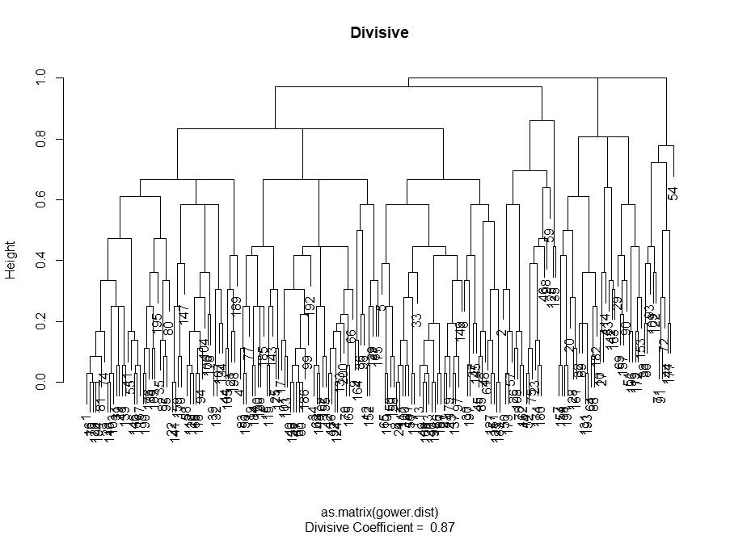

```
#------------ AGGLOMERATIVE CLUSTERING ------------#
# I am looking for the most balanced approach
# Complete linkages is the approach that best fits this demand - I will leave only this one here, don't want to get it cluttered# complete
aggl.clust.c <- hclust(gower.dist, method = "complete")
plot(aggl.clust.c,
     main = "Agglomerative, complete linkages") 
```

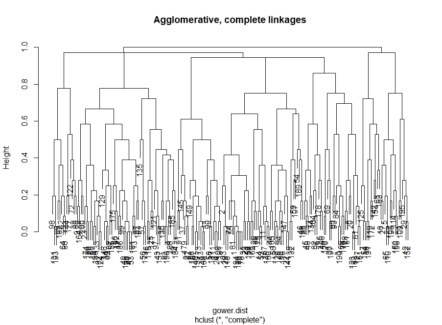

A 选择聚类
在这里，您将在不同的聚类算法和不同数量的聚类之间做出选择。正如评估经常发生的那样，可能的方式不止一种，辅以 ***你自己的判断*** 。它是粗体和斜体，因为你自己的判断 ***很重要*** —聚类的数量应该有实际意义，数据分组的方式也应该有意义。使用分类变量时，您可能最终会得到无意义的聚类，因为它们的值的组合是有限的-它们是离散的，组合的数量也是如此。可能，您也不希望集群数量非常少——它们很可能太过笼统。最后，一切都取决于你的目标和你分析的目的。

从概念上讲，当创建聚类时，您会对不同的数据点组感兴趣，这样，在聚类内它们之间的距离(*或紧密度*)最小，而组之间的距离(*间隔*)尽可能大。这直观上很容易理解:点与点之间的距离是从相异度矩阵导出的它们相异度的度量。因此，聚类的评估是围绕紧密性和分离性的评估而建立的。

这里我将采用两种方法，并说明其中一种可能会产生无意义的结果:

*   *肘法*:当聚类的紧密度，或者说组内的相似性对你的分析最重要的时候，就开始使用肘法。
*   *剪影法*:作为数据一致性的一种度量，[剪影图显示一个聚类中的每个点与相邻聚类中的点的接近程度。](http://www.sthda.com/english/articles/29-cluster-validation-essentials/97-cluster-validation-statistics-must-know-methods/#silhouette-coefficient)

在实践中，它们很可能会提供不同的结果，这些结果在某一点上可能会令人困惑-不同数量的聚类将对应于最紧密/最明显分离的聚类，因此判断和理解数据实际上是什么将是做出最终决策的重要部分。

还有一堆测量值，你可以根据自己的情况进行分析。我将它们添加到代码本身。

```
# Cluster stats comes out as list while it is more convenient to look at it as a table
# This code below will produce a dataframe with observations in columns and variables in row
# Not quite tidy data, which will require a tweak for plotting, but I prefer this view as an output here as I find it more comprehensive library(fpc)cstats.table <- function(dist, tree, k) {
clust.assess <- c("cluster.number","n","within.cluster.ss","average.within","average.between",
                  "wb.ratio","dunn2","avg.silwidth")
clust.size <- c("cluster.size")
stats.names <- c()
row.clust <- c()output.stats <- matrix(ncol = k, nrow = length(clust.assess))
cluster.sizes <- matrix(ncol = k, nrow = k)for(i in c(1:k)){
  row.clust[i] <- paste("Cluster-", i, " size")
}for(i in c(2:k)){
  stats.names[i] <- paste("Test", i-1)

  for(j in seq_along(clust.assess)){
    output.stats[j, i] <- unlist(cluster.stats(d = dist, clustering = cutree(tree, k = i))[clust.assess])[j]

  }

  for(d in 1:k) {
    cluster.sizes[d, i] <- unlist(cluster.stats(d = dist, clustering = cutree(tree, k = i))[clust.size])[d]
    dim(cluster.sizes[d, i]) <- c(length(cluster.sizes[i]), 1)
    cluster.sizes[d, i]

  }
}output.stats.df <- data.frame(output.stats)cluster.sizes <- data.frame(cluster.sizes)
cluster.sizes[is.na(cluster.sizes)] <- 0rows.all <- c(clust.assess, row.clust)
# rownames(output.stats.df) <- clust.assess
output <- rbind(output.stats.df, cluster.sizes)[ ,-1]
colnames(output) <- stats.names[2:k]
rownames(output) <- rows.allis.num <- sapply(output, is.numeric)
output[is.num] <- lapply(output[is.num], round, 2)output
}# I am capping the maximum amout of clusters by 7
# I want to choose a reasonable number, based on which I will be able to see basic differences between customer groups as a resultstats.df.divisive <- cstats.table(gower.dist, divisive.clust, 7)
stats.df.divisive
```

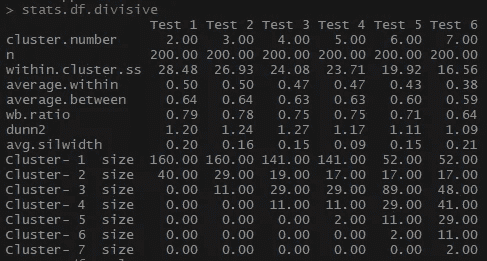

看，average.within，即聚类内观察值之间的平均距离，正在缩小，聚类 SS 内也是如此。平均轮廓宽度有点不直接，但相反的关系仍然存在。

看看星团的大小是多么不成比例。我不会仓促地处理星团中无与伦比的观测数据。其中一个原因是，数据集可能不平衡，一些观察组将在分析中超过所有其他组-这不好，很可能导致偏差。

```
stats.df.aggl <-cstats.table(gower.dist, aggl.clust.c, 7) #complete linkages looks like the most balanced approach
stats.df.aggl
```

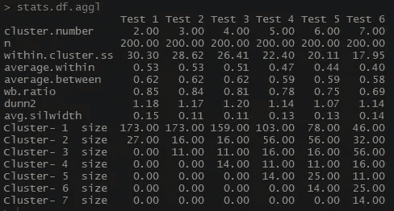

请注意，在每组的观察数量上，更加平衡的聚集完全联系层次聚类是如何进行比较的。

```
# --------- Choosing the number of clusters ---------## Using "Elbow" and "Silhouette" methods to identify the best number of clusters
# to better picture the trend, I will go for more than 7 clusters.library(ggplot2)**# Elbow
# Divisive clustering**
ggplot(data = data.frame(t(cstats.table(gower.dist, divisive.clust, 15))), 
  aes(x=cluster.number, y=within.cluster.ss)) + 
  geom_point()+
  geom_line()+
  ggtitle("Divisive clustering") +
  labs(x = "Num.of clusters", y = "Within clusters sum of squares (SS)") +
  theme(plot.title = element_text(hjust = 0.5))
```

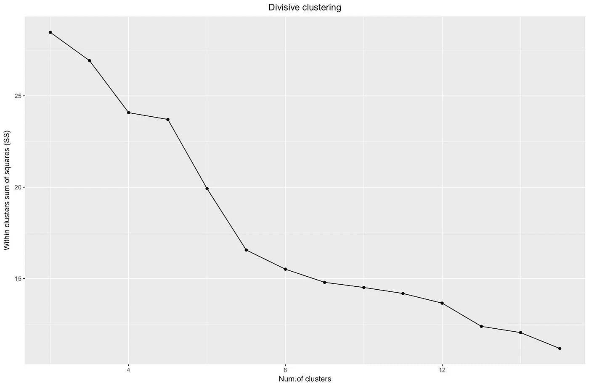

所以，我们制作了“肘”图。它显示了平方和(作为观察值接近程度的一种度量:平方和越低，分类内的观察值越接近)随着分类数的不同而变化。理想情况下，我们应该在肘部看到一个与众不同的“弯曲”,在那里分裂星系团只会使 SS 略微下降。在下图的情况下，我会选择 7 左右。虽然在这种情况下，一个聚类将只包含 2 个观察值，但让我们看看凝聚聚类会发生什么。

```
# Agglomerative clustering,provides a more ambiguous picture
ggplot(data = data.frame(t(cstats.table(gower.dist, aggl.clust.c, 15))), 
  aes(x=cluster.number, y=within.cluster.ss)) + 
  geom_point()+
  geom_line()+
  ggtitle("Agglomerative clustering") +
  labs(x = "Num.of clusters", y = "Within clusters sum of squares (SS)") +
  theme(plot.title = element_text(hjust = 0.5))
```

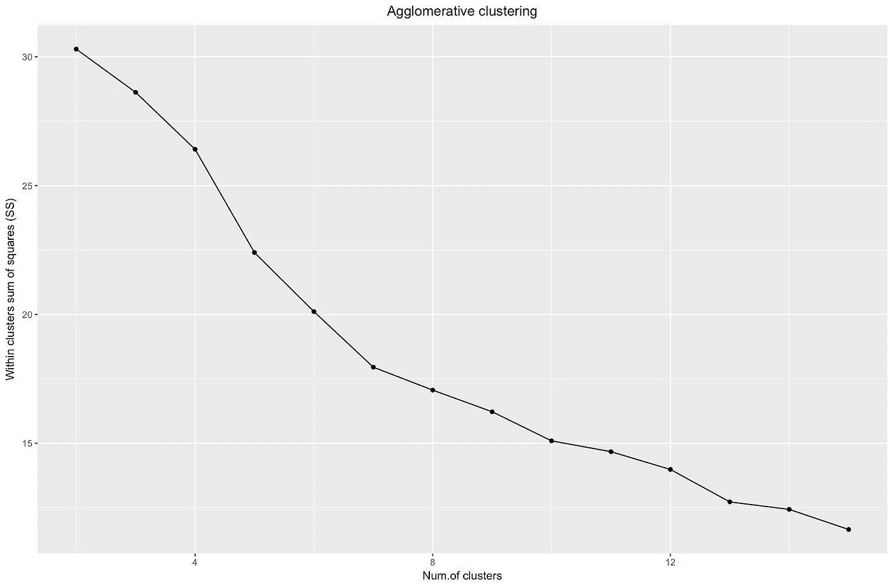

凝聚型“肘”看起来与分裂型相似，只是凝聚型看起来更平滑，而“弯”不那么突兀。与分裂聚类类似，我会选择 7 个聚类，但在这两种方法之间进行选择，我更喜欢凝聚方法产生的聚类的大小——我想要大小相当的东西。

```
**# Silhouette**ggplot(data = data.frame(t(cstats.table(gower.dist, divisive.clust, 15))), 
  aes(x=cluster.number, y=avg.silwidth)) + 
  geom_point()+
  geom_line()+
  ggtitle("Divisive clustering") +
  labs(x = "Num.of clusters", y = "Average silhouette width") +
  theme(plot.title = element_text(hjust = 0.5))
```

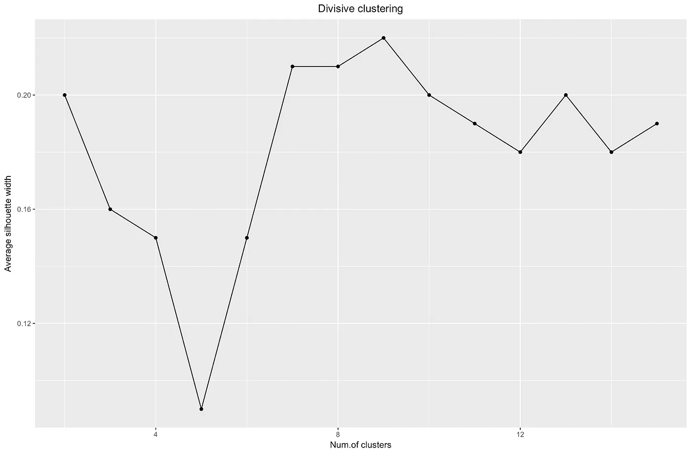

当谈到轮廓评估时，规则是您应该选择使轮廓系数最大化的数字，因为您希望聚类足够独特(远)以被认为是独立的。

轮廓系数的范围在-1 和 1 之间，1 表示类内一致性良好，-1 表示不太好。

从上面的图中可以看出，您不会选择 5 个集群，而会选择 9 个。

作为比较，对于“简单”的情况，轮廓图可能看起来像下图。我们还不完全是，但几乎是。

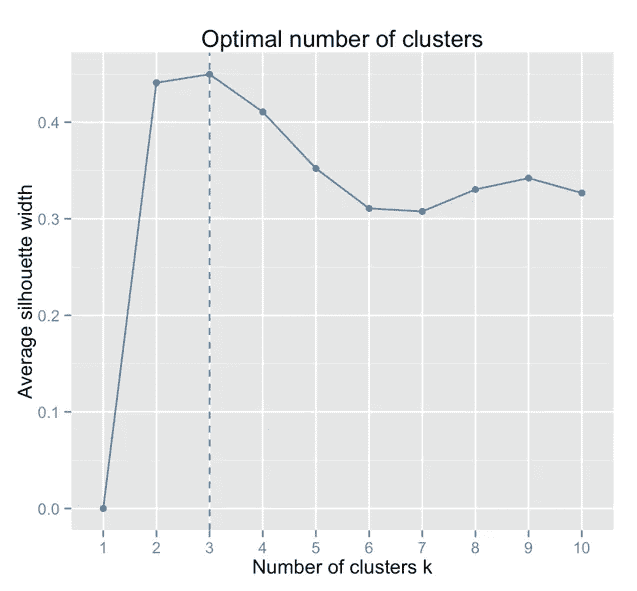

*Credits:* [*Data sailors*](http://data-sailors.com/2016/10/17/let-the-machine-find-optimal-number-of-clusters-from-your-data/)

```
ggplot(data = data.frame(t(cstats.table(gower.dist, aggl.clust.c, 15))), 
  aes(x=cluster.number, y=avg.silwidth)) + 
  geom_point()+
  geom_line()+
  ggtitle("Agglomerative clustering") +
  labs(x = "Num.of clusters", y = "Average silhouette width") +
  theme(plot.title = element_text(hjust = 0.5))
```

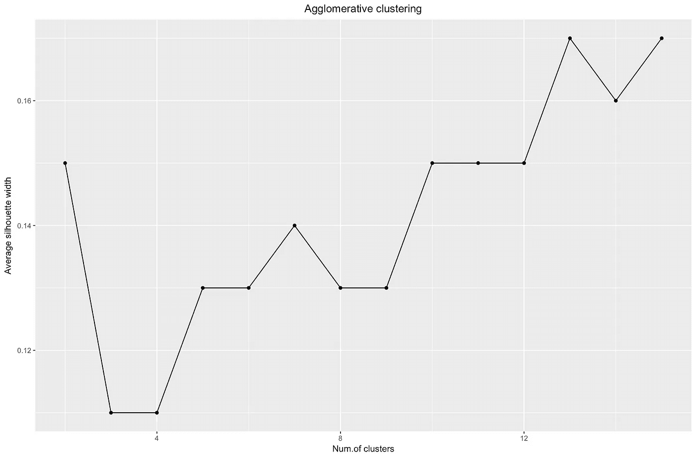

上面的剪影宽度图是在说“你打破的数据集越多，聚类就变得越有特色”。最终，您将得到单个数据点——您不希望这样，如果您尝试使用更大的 k 作为聚类数，您将会看到它。例如，在 *k=30，*我得到了下面的图:

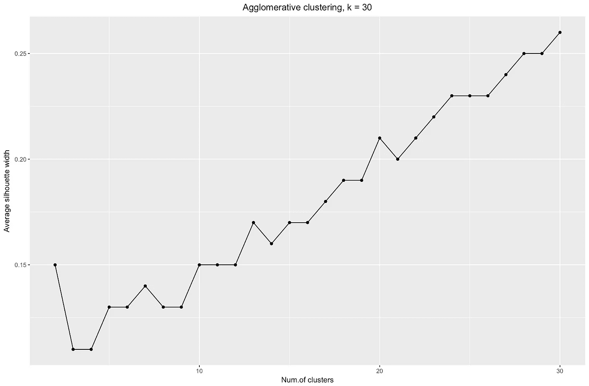

所以:你分割得越多，效果越好，但是我们不能分割到单独的数据点(记住我们在上面的图中有 30 个集群，只有 200 个数据点)。

综上所述，在我看来，这种情况下的凝聚聚类看起来更加平衡——聚类大小或多或少是可比的(看看分裂部分中只有 2 个观察值的那个聚类！)，我会选择通过这种方法获得的 7 个聚类。让我们看看它们的样子，并检查里面有什么。

该数据集由 6 个需要在 2D 或 3D 中可视化的变量组成，所以是时候接受挑战了！分类数据的性质也造成了一些限制，因此使用一些预定义的解决方案可能会变得棘手。我想 a)了解观察值如何聚集，b)了解观察值如何跨类别分布，因此我创建了 a)彩色树状图，b)每个聚类内每个变量的观察值计数热图。

```
library("ggplot2")
library("reshape2")
library("purrr")
library("dplyr")*# let's start with a dendrogram*
library("dendextend")dendro <- as.dendrogram(aggl.clust.c)dendro.col <- dendro %>%
  set("branches_k_color", k = 7, value =   c("darkslategray", "darkslategray4", "darkslategray3", "gold3", "darkcyan", "cyan3", "gold3")) %>%
  set("branches_lwd", 0.6) %>%
  set("labels_colors", 
      value = c("darkslategray")) %>% 
  set("labels_cex", 0.5)ggd1 <- as.ggdend(dendro.col)ggplot(ggd1, theme = theme_minimal()) +
  labs(x = "Num. observations", y = "Height", title = "Dendrogram, k = 7")
```

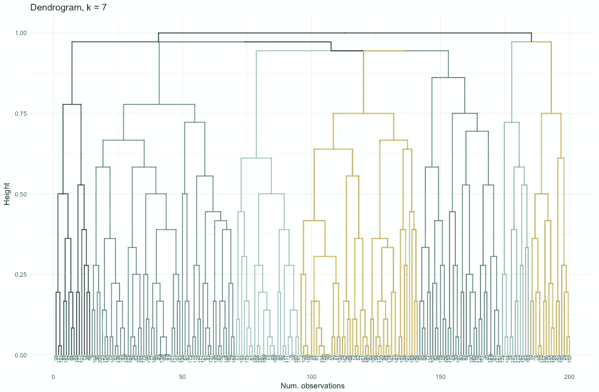

```
*# Radial plot looks less cluttered (and cooler)*
ggplot(ggd1, labels = T) + 
  scale_y_reverse(expand = c(0.2, 0)) +
  coord_polar(theta="x")
```

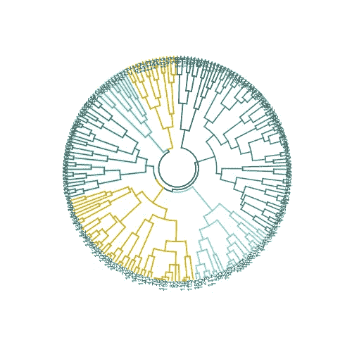

```
*# Time for the heatmap
# the 1st step here is to have 1 variable per row
# factors have to be converted to characters in order not to be dropped*clust.num <- cutree(aggl.clust.c, k = 7)
synthetic.customers.cl <- cbind(synthetic.customers, clust.num)cust.long <- melt(data.frame(lapply(synthetic.customers.cl, as.character), stringsAsFactors=FALSE), 
                  id = c("id.s", "clust.num"), factorsAsStrings=T)cust.long.q <- cust.long %>%
  group_by(clust.num, variable, value) %>%
  mutate(count = n_distinct(id.s)) %>%
  distinct(clust.num, variable, value, count)*# heatmap.c will be suitable in case you want to go for absolute counts - but it doesn't tell much to my taste*heatmap.c <- ggplot(cust.long.q, aes(x = clust.num, y =        factor(value, levels = c("x","y","z",                                                                   "mon", "tue", "wed", "thu", "fri","sat","sun",                                                       "delicious", "the one you don't like", "pizza",                                                             "facebook", "email", "link", "app",                                                             "area1", "area2", "area3", "area4",                                                             "small", "med", "large"), ordered = T))) +

  geom_tile(aes(fill = count))+
  scale_fill_gradient2(low = "darkslategray1", mid = "yellow", high = "turquoise4")*# calculating the percent of each factor level in the absolute count of cluster members*
cust.long.p <- cust.long.q %>%
  group_by(clust.num, variable) %>%
  mutate(perc = count / sum(count)) %>%
  arrange(clust.num)heatmap.p <- ggplot(cust.long.p, aes(x = clust.num, y = factor(value, levels = c("x","y","z",
      "mon", "tue", "wed", "thu", "fri","sat", "sun",                                                                     "delicious", "the one you don't like", "pizza",                                             "facebook", "email", "link", "app",                                             "area1", "area2", "area3", "area4",                                           "small", "med", "large"), ordered = T))) +

geom_tile(aes(fill = perc), alpha = 0.85)+
  labs(title = "Distribution of characteristics across clusters", x = "Cluster number", y = NULL) +
  geom_hline(yintercept = 3.5) + 
  geom_hline(yintercept = 10.5) + 
  geom_hline(yintercept = 13.5) + 
  geom_hline(yintercept = 17.5) + 
  geom_hline(yintercept = 21.5) + 
  scale_fill_gradient2(low = "darkslategray1", mid = "yellow", high = "turquoise4")heatmap.p
```

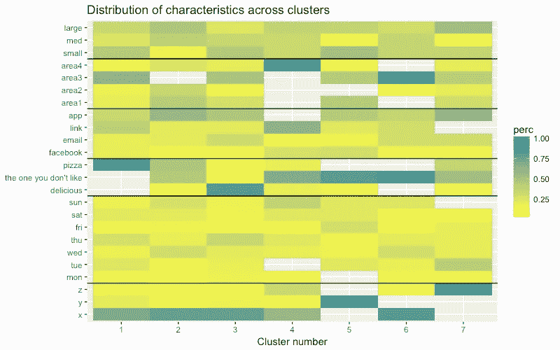

有了热图，您可以看到初始因素(我们已经开始使用的变量)中每个因素级别有多少观察值。较深的蓝色对应于一个集群中相对较多的观测值。在此图中，您还可以看到，一周中的每一天/购物篮大小在每个箱中都有几乎相同数量的客户，这可能意味着这些对于分析来说不是决定性的，并且*可能会被省略。*

C 丢失音符
在这篇文章中，我们已经经历了相异矩阵计算，尝试了凝聚和分裂的层次聚类方法，并且用“肘”和“剪影”方法看了一下聚类评估。

在这篇文章中，我们经历了相异度矩阵计算，尝试了凝聚和分裂的层次聚类方法，并对聚类评估进行了研究。

分裂式和凝聚式层次聚类是开始探索的好地方，但是如果您的目标是成为一名聚类大师，请不要止步于此——还有更多的方法和技术出现在那里。与数值数据聚类相比，主要区别在于相异矩阵的计算。从评估的角度来看，并不是所有的标准聚类评估方法都会产生可靠和合理的结果——剪影方法可能会被淘汰。

最后，我做这个练习已经有一段时间了。到目前为止，我看到了我的方法背后的一些缺点，我欢迎任何反馈。我的分析中的一个普遍缺陷在于聚类本身之外— *我的数据集在很多方面都是不平衡的*，这个问题仍然没有得到解决。我可以看到它对聚类的影响:有 70%的客户属于一个因素级别(在这种情况下是国籍)，这个组控制了大多数产生的聚类，使得很难找出其他因素级别之间的差异。平衡数据集和比较聚类结果是我接下来要尝试的，我会写一篇单独的文章来讨论这个问题。

最后，如果你想克隆，这里有 github 的链接:[https://github.com/khunreus/cluster-categorical](https://github.com/khunreus/cluster-categorical)

希望你喜欢它！

*以下是我发现有用的资源:*

分层聚类教程(数据准备、聚类、可视化)，总的来说，这个博客可能对那些对 R:[http://uc-r.github.io/hc_clustering](http://uc-r.github.io/hc_clustering)和[https://uc-r.github.io/kmeans_clustering](https://uc-r.github.io/kmeans_clustering)的商业分析感兴趣的人有用

聚类验证:[http://www . sth da . com/English/articles/29-cluster-validation-essentials/97-cluster-validation-statistics-must-know-methods/](http://www.sthda.com/english/articles/29-cluster-validation-essentials/97-cluster-validation-statistics-must-know-methods/)

文档分类示例(分层和 k-means):[https://eight 2 late . WordPress . com/2015/07/22/a-gentle-introduction-to-cluster-analysis-using-r/](https://eight2late.wordpress.com/2015/07/22/a-gentle-introduction-to-cluster-analysis-using-r/)

denextend 包相当有趣，允许比较不同方法之间的集群结构:[https://cran . r-project . org/web/packages/dend extend/vignettes/introduction . html # the-set-function](https://cran.r-project.org/web/packages/dendextend/vignettes/introduction.html#the-set-function)

不仅有树状图，还有聚类图:[https://www . r-statistics . com/2010/06/cluster gram-visualization-and-diagnostics-for-cluster-analysis-r-code/](https://www.r-statistics.com/2010/06/clustergram-visualization-and-diagnostics-for-cluster-analysis-r-code/)

结合聚类热图和树状图:[https://JC Oliver . github . io/learn-r/008-gg plot-dendrograms-and-heat maps . html](https://jcoliver.github.io/learn-r/008-ggplot-dendrograms-and-heatmaps.html)

我个人有兴趣尝试一下在[https://www.ncbi.nlm.nih.gov/pmc/articles/PMC5025633/](https://www.ncbi.nlm.nih.gov/pmc/articles/PMC5025633/)引入的方法，他们的 GitHub 库:[https://github.com/khunreus/EnsCat](https://github.com/khunreus/EnsCat)