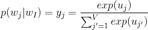
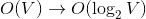
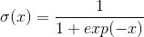
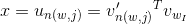
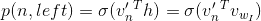
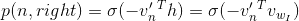
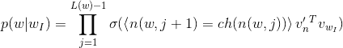
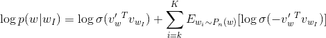
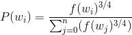

# 分层软最大值和负采样:值得讲述的简短笔记

> 原文：<https://towardsdatascience.com/hierarchical-softmax-and-negative-sampling-short-notes-worth-telling-2672010dbe08?source=collection_archive---------0----------------------->

感谢观众对我上一篇(也是唯一一篇)致力于[单词嵌入](https://medium.com/@hol_io/word-embeddings-exploration-explanation-and-exploitation-with-code-in-python-5dac99d5d795)的帖子的意外和非常愉快的关注，我很高兴再写一篇:更短更易读。严格地说，这是上一篇文章的延续，因为这里讨论的主题是对方法的更详细的解释，这些方法用于生成单词嵌入，特别是用于使用 softmax 函数计算最后的激活层。Softmax 产生多项式概率分布；我们将接收到的输出向量视为单词的向量表示(上下文单词或简单的输出单词，取决于我们使用的模型)。为什么我们需要新的练习来输出我们的单词向量？他们给了我们什么好处？他们的表现如何，有什么不同？让我们开始这个故事吧，我想我们会明白的。

## 直觉和先决条件

我之前说过，softmax(归一化指数函数)是输出层函数，它激活我们的每一个节点，作为神经网络计算的最后一步。它用于计算至少两种不同类型的常见单词嵌入: [word2vec](https://arxiv.org/pdf/1411.2738.pdf) 和 [FastText](https://arxiv.org/pdf/1607.04606.pdf) 。此外，它与 sigmoid 和 tanh 函数一起，是许多情况下神经网络架构的激活步骤。softmax 的公式如下:

其中，激活的输出向量的每个元素是给定我们的输入单词 *I* 的情况下，该单词等于词汇表中第 *j 个*单词的概率。此外，值得一提的是，输出向量的元素之和等于 *1* ，并且它的每个元素都被映射到一个范围*【0，1】*。

以直接方式计算的该算法的计算复杂度是我们的词汇表的大小， *O(V)* 。实践告诉我们，我们可以通过使用二叉树结构来充分减少它，为什么不呢？

## 分级 softmax

这种方法背后的主要动机是，我们评估的是以 2 为底的对数 *V* 而不是 *V* :

这是算法所需的计算复杂度和运算数量的戏剧性变化。我们用二叉树的用法来做，其中树叶代表单词的概率；更具体地，索引为 *j* 的 leave 是第 *j 个*字的概率，并且在输出 softmax 向量中具有位置 *j* 。

每一个单词都可以通过从根到内部节点的路径到达，内部节点表示沿着这条路径的概率质量。这些值是通过使用简单的 sigmoid 函数产生的，只要我们计算的路径仅仅是这些概率质量函数的乘积，这些函数定义为:

在我们的具体案例中 *x* 是什么？它是通过我们正在使用的单词的输入和输出矢量表示的点积来计算的:

其中 *n(w，j)* 是从根到 *w* 路径上的第 *j 个*节点，我们正在计算。更多关于输入和输出单词表示的解释可以在我之前的文章中找到。

实际上，我们可以用概率代替 sigmoid 符号；对于每个内部节点，我们选择一个任意的子节点(左或右),并将正 sigmoid 函数值赋给其中一个(通常是左子节点)。通过保留这些约束，sigmoid 函数可以被视为:

对于节点 *n* 的左子节点，同样对于节点 *n* 的右子节点:

我们已经收集了最终函数计算的所有部分，包括前面的所有步骤，以及对我们选择的任意节点(右或左)的布尔检查:

其中，尖括号表示布尔检查大小写是真还是假； *L(w)* 是树的深度； *ch(n)* 是节点 *n* 的子节点。

如果树有根节点、2 个内部节点和叶节点，很明显我们正在执行 3 步计算，这足以减少我们正在做的操作的数量。

## 负采样

负采样思想是基于噪声对比估计的概念(类似于生成性对抗网络)，它坚持认为，一个好的模型应该通过逻辑回归来区分伪信号和真实信号。此外，负采样目标背后的动机类似于随机梯度下降:不是每次都改变所有的权重，同时考虑到我们拥有的所有成千上万个观察值，我们只使用其中的 *K* 个，并且也显著提高了计算效率(取决于负样本的数量)。

一次观察的负采样目标看起来像:

正如我们所看到的，与随机梯度下降的不同之处在于，我们考虑的不仅仅是一个观察值，而是其中的 K 个。

我们使用的概率分布是噪声分布(将在后面更详细地描述)。我们使用这种噪声分布的原因是我们试图解决区分真实数据和虚假数据的挑战。

合适的噪声分布是一元分布 *U(w)* 定义为:

其中 *3/4* 为实验得出的值； *f(w)* 是该词在语料库中的出现频率。

如果我们说的是取自 word2vec 理论的 skip-gram 模型，那么负样本就是词，不是上下文词；正面的例子当然是语境词。

## 结论

我不能称这篇文章为一篇有价值的文章，至少因为我花了不超过一个小时来写这篇文章；网上还有很多更详细的帖子专门针对不同类型的 softmax，包括差异化 softmax，CNN-softmax，目标采样等。比如，塞巴斯蒂安·鲁德的这篇文章。我试图尽可能多地关注复杂公式的简单解释和给定算法的优点，这使得它们在给定的领域中最受欢迎。正如从文本中所理解的，所提到的方法更多地从数学公式和机器学习方法的角度进行描述，然后从实际实施的角度进行描述(通常，这些算法已经在标准 gensim/tensorflow 库中采用)。