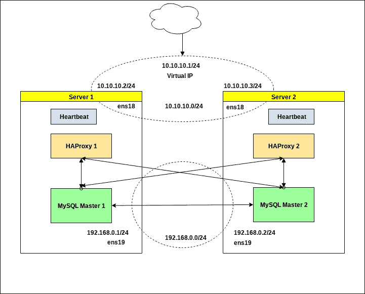

# 使用 HAProxy 和 Heartbeat 实现负载平衡的高可用性 MySQL 集群。

> 原文：<https://towardsdatascience.com/high-availability-mysql-cluster-with-load-balancing-using-haproxy-and-heartbeat-40a16e134691?source=collection_archive---------1----------------------->

你好，在这篇文章中，我想分享一些从两个主 MySQL 节点构建高可用性 MySQL 数据库集群的经验，该集群具有基于 HAProxy & Heartbeat 的负载平衡和故障转移功能。

在大多数现代项目中，数据库可用性是生死攸关的问题。好的解决方案是从一个以上的 MySQL 服务器创建一个分布式数据库集群，它可以负责负载平衡、故障转移功能和数据复制。此外，您可以拆分传入的请求并处理高负载。

在这个例子中，我将展示从两个主节点创建一个 MySQL 集群，主要思想是创建一对具有相同配置的服务器和一个用于接收请求的虚拟 IP。即使完全失去其中一个节点，该群集也将继续工作。

我们将使用两台服务器(虚拟或裸机),上面安装一对 MySQL masters 和一对 HAProxy，主虚拟 IP 将配置 Heartbeat。请注意，在本例中，一个时间段内仅使用一个 HAProxy，第二个 HAProxy 将处于热储备状态。MySQL 服务器将循环使用负载平衡类型。



> 选择具有两个服务器的模式是为了使示例更简单。当然，如果您有额外的服务器，您可以创建更复杂的配置，将 HAProxy 与 Heartbeat 放在外部 LB 集群中等等。但是无论如何，这个例子对于在你的项目中构建一个强大的数据库集群来说已经足够了。

## 0。正在准备。

首先，我们需要为 MySQL 复制和 HAProxy with Heartbeat 选择几个子网，最好将它们分开，如果您的服务器有几个网络接口，也将这些子网放在不同的接口上。

**192 . 168 . 0 . 0/24**-DB 流量网络

MySQL1 的 **192.168.0.1** IP，MySQL2 的 **192.168.0.2** IP。

**10.10.10.0/24** -心跳网络& HAProxy。

**10.10.10.1** 虚拟 IP 用于取请求，**10 . 10 . 2**主 IP 用于**服务器 1** ， **10.10.10.3** 主 IP 用于**服务器 2** 。

> 事实上/29 子网就足够了:)

## **1。用主-主复制配置 MySQL 服务器。**

首先，我们需要在两台服务器上安装 MySQL:

```
# apt-get update && apt-get upgrade -y# apt-get install mysql-server mysql-client
```

然后在第一个和第二个节点上编辑 **/etc/mysql/my.cnf** ，以启用 mysql 服务器之间的复制，并使它们使用来自 192.168.0.0/24 子网的 IP:

服务器 1 配置。

```
[mysqld]bind-address    = 192.168.0.1server_id           = 1
log_bin             = /var/log/mysql/mysql-bin.log
log_bin_index       = /var/log/mysql/mysql-bin.log.index
relay_log           = /var/log/mysql/mysql-relay-bin
relay_log_index     = /var/log/mysql/mysql-relay-bin.index
expire_logs_days    = 10
max_binlog_size     = 100M
log_slave_updates   = 1
auto-increment-increment = 2
auto-increment-offset = 1
```

Server2 配置。

```
[mysqld]bind-address    = 192.168.0.2server_id           = 2
log_bin             = /var/log/mysql/mysql-bin.log
log_bin_index       = /var/log/mysql/mysql-bin.log.index
relay_log           = /var/log/mysql/mysql-relay-bin
relay_log_index     = /var/log/mysql/mysql-relay-bin.index
expire_logs_days    = 10
max_binlog_size     = 100M
log_slave_updates   = 1
auto-increment-increment = 2
auto-increment-offset = 2
```

然后重新启动它们，并确保 MySQL 叶在指定的 IP:

```
server1# systemctl restart mysqlserver1# netstat -ntlpActive Internet connections (only servers)
Proto Recv-Q Send-Q Local Address           Foreign Address         State       PID/Program name    
tcp        0      0 192.168.0.1:3306        0.0.0.0:*               LISTEN      9057/mysqldserver2# systemctl restart mysqlserver2# netstat -ntlpActive Internet connections (only servers)
Proto Recv-Q Send-Q Local Address           Foreign Address         State       PID/Program name    
tcp        0      0 192.168.0.2:3306        0.0.0.0:*               LISTEN      8740/mysqld
```

现在将为数据库之间的复制创建一个用户，你可以使用 **pwgen** 实用程序来生成足够强的密码。连接到每个 MySQL 服务器，并使用来自对方服务器的 IP 创建该用户:

```
server1# mysql -u root -pMariaDB> GRANT REPLICATION SLAVE ON *.* TO 'replicauser'@'192.168.0.2' IDENTIFIED BY 'somestrongpassword';server2# mysql -u root -pMariaDB> GRANT REPLICATION SLAVE ON *.* TO 'replicauser'@'192.168.0.1' IDENTIFIED BY 'somestrongpassword';
```

检查**复制用户**是否可以访问每台 MySQL 服务器。

```
server1# mysql -u replicauser -p -h 192.168.0.2
Enter password: somestrongpassword
Welcome to the MariaDB monitor.  Commands end with ; or \g.bla bla....server2# mysql -u replicauser -p -h 192.168.0.1
Enter password: somestrongpassword
Welcome to the MariaDB monitor.  Commands end with ; or \g.bla bla....
```

好了，现在我们可以继续配置 MySQL 服务器之间的复制。从那时起，最好从两个 MySQL 服务器打开两个控制台，因为我们需要根据另一个服务器的输出输入命令。

获取服务器 1 上的 MySQL 主服务器状态:

```
server1# mysql -u root -pMariaDB> SHOW MASTER STATUS;+------------------+----------+--------------+------------------+
| File             | Position | Binlog_Do_DB | Binlog_Ignore_DB |
+------------------+----------+--------------+------------------+
| mysql-bin.000002 |      531 |              |                  |
+------------------+----------+--------------+------------------+
1 row in set (0.00 sec)
```

我们需要这个输出中的**文件**和**位置**信息。打开 server2 上的 MySQL 控制台，配置与第一台服务器的从属关系。

```
server2# mysql -u root -pMariaDB> STOP SLAVE;MariaDB> CHANGE MASTER TO master_host='192.168.0.1', master_port=3306, master_user='replicauser', master_password='somestrongpassword', master_log_file='mysql-bin.000002', master_log_pos=531;MariaDB> START SLAVE;
```

现在从 server2 查询主服务器状态，并在第一台服务器上为 MySQL 配置从服务器关系。

```
server2# mysql -u root -pMariaDB> SHOW MASTER STATUS;+------------------+----------+--------------+------------------+
| File             | Position | Binlog_Do_DB | Binlog_Ignore_DB |
+------------------+----------+--------------+------------------+
| mysql-bin.000002 |      531 |              |                  |
+------------------+----------+--------------+------------------+
1 row in set (0.00 sec)server1# mysql -u root -pMariaDB> STOP SLAVE;MariaDB> CHANGE MASTER TO master_host='192.168.0.2', master_port=3306, master_user='replicauser', master_password='somestrongpassword', master_log_file='mysql-bin.000002', master_log_pos=531;MariaDB> START SLAVE;
```

好了，如果一切都做对了，我们必须在 MySQL 主服务器之间建立一个有效的复制。您可以创建一些测试数据库并检查这一点。

```
server1# mysql -u root -pMariaDB> CREATE DATABASE TESTDB;
MariaDB> CREATE TABLE TESTDB.REPLICA (`id` varchar(40));
```

然后检查该数据库是否也出现在第二台服务器上:

```
server2# mysql -u root -pMariaDB> SHOW TABLES IN TESTDB;
+------------------+
| Tables_in_TESTDB |
+------------------+
| REPLICA          |
+------------------+
1 row in set (0.00 sec)
```

正如您所看到的，TESTDB**base 被成功地复制到了 server2。我们刚刚完成了创建故障转移集群的第一阶段。**

## 2.**在两台服务器上配置 HAProxy。**

在第二阶段，我们将在两台服务器上安装和配置两个完全相同的 HAProxy，用于平衡 MySQL 服务器之间的传入请求。

首先，我们需要在我们的 MySQL 服务器上添加额外的用户(用户必须在没有任何密码的情况下创建)，该用户将由 HAProxy 用于检查 MySQL 服务器的健康状态。

```
server1# mysql -u root -pMariaDB> CREATE USER 'haproxy_check'@'%';
MariaDB> FLUSH PRIVILEGES;
```

您可以在我们的任何 MySQL 服务器上创建这个用户，因为我们在它们之间配置了一个复制。使用以下命令检查用户是否已添加:

```
server1# mysql -u root -p -e "SELECT User, Host FROM mysql.user"
Enter password: 
+---------------+-------------+
| User          | Host        |
+---------------+-------------+
| haproxy_check | %           |
| replicauser   | 192.168.0.2 |
| root          | localhost   |
+---------------+-------------+server2# mysql -u root -p -e "SELECT User, Host FROM mysql.user"
Enter password: 
+---------------+-------------+
| User          | Host        |
+---------------+-------------+
| haproxy_check | %           |
| replicauser   | 192.168.0.1 |
| root          | localhost   |
+---------------+-------------+
```

此外，让我们创建一个具有 root 权限的用户，以便稍后进行一些测试请求:

```
server1# mysql -u root -pMariaDB> CREATE USER 'haproxy_root'@'%' IDENTIFIED BY 'password';
MariaDB> GRANT ALL PRIVILEGES ON *.* TO 'haproxy_root'@'%';
```

现在是安装 HAProxy 的时候了:

```
server1# apt-get install haproxy
server2# apt-get install haproxy
```

保存原始配置并创建新配置:

```
server1# mv /etc/haproxy/haproxy.cfg{,.back}
server1# vi /etc/haproxy/haproxy.cfg
```

接下来，在两台服务器上添加此配置:

```
global
    user haproxy
    group haproxydefaults
    mode http
    log global
    retries 2
    timeout connect 3000ms
    timeout server 5000ms
    timeout client 5000mslisten stats
    bind 10.10.10.1:9999
    stats enable
    stats hide-version
    stats uri /stats
    stats auth statadmin:statadminpasslisten mysql-cluster
    bind 10.10.10.1:3306
    mode tcp
    option mysql-check user haproxy_check
    balance roundrobin
    server mysql-1 192.168.0.1:3306 check
    server mysql-2 192.168.0.2:3306 check
```

可以看到，两个 HAProxy 服务都将使用 10.10.10.1，共享 IP 地址。这个虚拟 ip 将在服务器之间移动，因此我们需要使用一些技巧并启用**net . IP v4 . IP _ non local _ bind**sysctl 选项，以允许系统服务绑定在非本地 IP 上。

将此选项添加到文件 **/etc/sysctl.conf** 中:

```
*server1# vi /etc/sysctl.conf*net.ipv4.ip_nonlocal_bind=1*server2# vi /etc/sysctl.conf*net.ipv4.ip_nonlocal_bind=1
```

那就跑

```
*sysctl -p*
```

之后，我们可以在两台服务器上启动 HAProxy:

```
server1# systemctl start haproxy
server2# systemctl start haproxy
```

检查它们是否在共享 IP 10.10.10.1 上启动:

```
server1# netstat -ntlp Active Internet connections (only servers) 
Proto Recv-Q Send-Q Local Address Foreign Address State PID/Program name 
tcp 0 0 192.168.0.1:3306 0.0.0.0:* LISTEN 918/mysqld 
tcp 0 0 10.10.10.1:3306 0.0.0.0:* LISTEN 802/haproxy 
tcp 0 0 10.10.10.1:9999 0.0.0.0:* LISTEN 802/haproxy 
tcp 0 0 10.10.10.2:22 0.0.0.0:* LISTEN 785/sshdserver2# netstat -ntlpActive Internet connections (only servers) 
Proto Recv-Q Send-Q Local Address Foreign Address State PID/Program name 
tcp 0 0 192.168.0.2:3306 0.0.0.0:* LISTEN 918/mysqld 
tcp 0 0 10.10.10.1:3306 0.0.0.0:* LISTEN 802/haproxy 
tcp 0 0 10.10.10.1:9999 0.0.0.0:* LISTEN 802/haproxy 
tcp 0 0 10.10.10.3:22 0.0.0.0:* LISTEN 785/sshd
```

一切看起来都很好，两台服务器都是使用虚拟 IP 启动的，我们还在 9999 端口上配置了一个统计页面，因此您可以使用 statadmin:statadminpass 在[http://10 . 10 . 10 . 1:9999/stats](http://10.10.10.1:9999/stats)上检查 HAProxy 状态。

## 3.**使用共享 IP 配置心跳。**

在最后一个阶段，我们需要在两台服务器上配置 Heartbeat 服务，并创建共享的 IP，它将用于处理传入的请求。如果其中一台服务器发生问题，这个 IP 将在服务器之间迁移。

在两台服务器上安装 Heartbeat:

```
server1# apt-get install heartbeat
server1# systemctl enable heartbeatserver2# apt-get install heartbeat
server2# systemctl enable heartbeat
```

现在我们需要为它创建一些配置文件，它们对于 server1 和 server2 来说基本相同。

创建一个 **/etc/ha.d/authkeys** ，在这个文件中心跳存储数据来认证对方。两个服务器上的文件将是相同的:

```
server1# vi /etc/ha.d/authkeysauth 1
1 md5 securepassserver2# vi /etc/ha.d/authkeysauth 1
1 md5 securepass
```

将 **securepass** 改为您的强安全密码。此外，该文件只需要由 root 用户拥有，因此:

```
server1# chmod 600 /etc/ha.d/authkeys
server2# chmod 600 /etc/ha.d/authkeys
```

接下来将在两台服务器上为 Heartbeat 创建一个主配置，对于 server1 和 server2 会有一点不同，创建 **/etc/ha.d/ha.cf** :

服务器 1

```
server1# vi /etc/ha.d/ha.cf#       keepalive: how many seconds between heartbeats
#
keepalive 2
#
#       deadtime: seconds-to-declare-host-dead
#
deadtime 10
#
#       What UDP port to use for udp or ppp-udp communication?
#
udpport        694
bcast  ens18
mcast ens18 225.0.0.1 694 1 0
ucast ens18 10.10.10.3
#       What interfaces to heartbeat over?
udp     ens18
#
#       Facility to use for syslog()/logger (alternative to log/debugfile)
#
logfacility     local0
#
#       Tell what machines are in the cluster
#       node    nodename ...    -- must match uname -n
node    server1
node    server2
```

服务器 2

```
server1# vi /etc/ha.d/ha.cf#       keepalive: how many seconds between heartbeats
#
keepalive 2
#
#       deadtime: seconds-to-declare-host-dead
#
deadtime 10
#
#       What UDP port to use for udp or ppp-udp communication?
#
udpport        694
bcast  ens18
mcast ens18 225.0.0.1 694 1 0
ucast ens18 10.10.10.2
#       What interfaces to heartbeat over?
udp     ens18
#
#       Facility to use for syslog()/logger (alternative to log/debugfile)
#
logfacility     local0
#
#       Tell what machines are in the cluster
#       node    nodename ...    -- must match uname -n
node    server1
node    server2
```

您可以通过在您的服务器上运行`uname -n`来获得这个配置的**节点**名称。

最后，我们需要在服务器 1 和服务器 2 上创建 **/etc/ha.d/haresources** 文件。文件是相同的，在这个文件中，我们将默认声明我们的共享 IP 地址和主节点:

```
server1# vi /etc/ha.d/haresourcesserver1 10.10.10.1server2# vi /etc/ha.d/haresourcesserver1 10.10.10.1
```

毕竟，让我们在两台服务器上启动我们的心跳服务，您必须看到，在服务器 1 上，我们已经启动了虚拟 IP:

```
server1# ip a 
....
2: ens19: <BROADCAST,MULTICAST,UP,LOWER_UP> mtu 1500 qdisc pfifo_fast state UP group default qlen 1000
    link/ether bla:bla:bla:bla brd ff:ff:ff:ff:ff:ff
    inet 192.168.0.1/24 brd 192.168.0.255 scope global ens19
       valid_lft forever preferred_lft forever
    inet6 fe80::bla:bla:bla:bla/64 scope link 
       valid_lft forever preferred_lft forever
3: ens18: <BROADCAST,MULTICAST,UP,LOWER_UP> mtu 1500 qdisc pfifo_fast state UP group default qlen 1000
    link/ether bla:bla:bla:bla:bla:bla brd ff:ff:ff:ff:ff:ff
    inet 10.10.10.2/24 brd 10.10.10.255 scope global ens18
       valid_lft forever preferred_lft forever
    inet 10.10.10.1/24 brd 10.10.10.255 scope global secondary 
....
```

好了，现在我们在 server1 上分配了虚拟 IP，HAProxy 监听它，所以我们可以检查它是如何工作的，发出测试请求。从一些外部服务器运行以下命令:

```
# mysql -h 10.10.10.1 -u haproxy_root -p -e "show variables like 'server_id'"Enter password: 
+---------------+-------+
| Variable_name | Value |
+---------------+-------+
| server_id     | 1     |
+---------------+-------+# mysql -h 10.10.10.1 -u haproxy_root -p -e "show variables like 'server_id'"Enter password: 
+---------------+-------+
| Variable_name | Value |
+---------------+-------+
| server_id     | 2     |
+---------------+-------+
```

一切正常，你可以看到我们的 MySQL 服务器之间的“循环”平衡。现在，我们需要检查故障转移，例如当服务器 1 离线时。转到并重新启动或关闭服务器 1，检查虚拟 IP 是否已移动到服务器 2，对 MySQL 服务器的请求是否仍然正常，但现在服务器 2 上只有 MySQL 会响应:

```
server2# ip a 
....
2: ens19: <BROADCAST,MULTICAST,UP,LOWER_UP> mtu 1500 qdisc pfifo_fast state UP group default qlen 1000
    link/ether bla:bla:bla:bla brd ff:ff:ff:ff:ff:ff
    inet 192.168.0.2/24 brd 192.168.0.255 scope global ens19
       valid_lft forever preferred_lft forever
    inet6 fe80::bla:bla:bla:bla/64 scope link 
       valid_lft forever preferred_lft forever
3: ens18: <BROADCAST,MULTICAST,UP,LOWER_UP> mtu 1500 qdisc pfifo_fast state UP group default qlen 1000
    link/ether bla:bla:bla:bla:bla:bla brd ff:ff:ff:ff:ff:ff
    inet 10.10.10.3/24 brd 10.10.10.255 scope global ens18
       valid_lft forever preferred_lft forever
    inet 10.10.10.1/24 brd 10.10.10.255 scope global secondary 
....
```

再次检查 MySQL 请求:

```
# mysql -h 10.10.10.1 -u haproxy_root -p -e "show variables like 'server_id'"Enter password: 
+---------------+-------+
| Variable_name | Value |
+---------------+-------+
| server_id     | 2     |
+---------------+-------+# mysql -h 10.10.10.1 -u haproxy_root -p -e "show variables like 'server_id'"Enter password: 
+---------------+-------+
| Variable_name | Value |
+---------------+-------+
| server_id     | 2     |
+---------------+-------+
```

在服务器 1 恢复在线后，虚拟 IP 将被移回服务器 1。

我们做到了，我们刚刚配置并测试了我们的 MySQL 集群，它现在已经准备好为请求提供服务。

祝你好运。