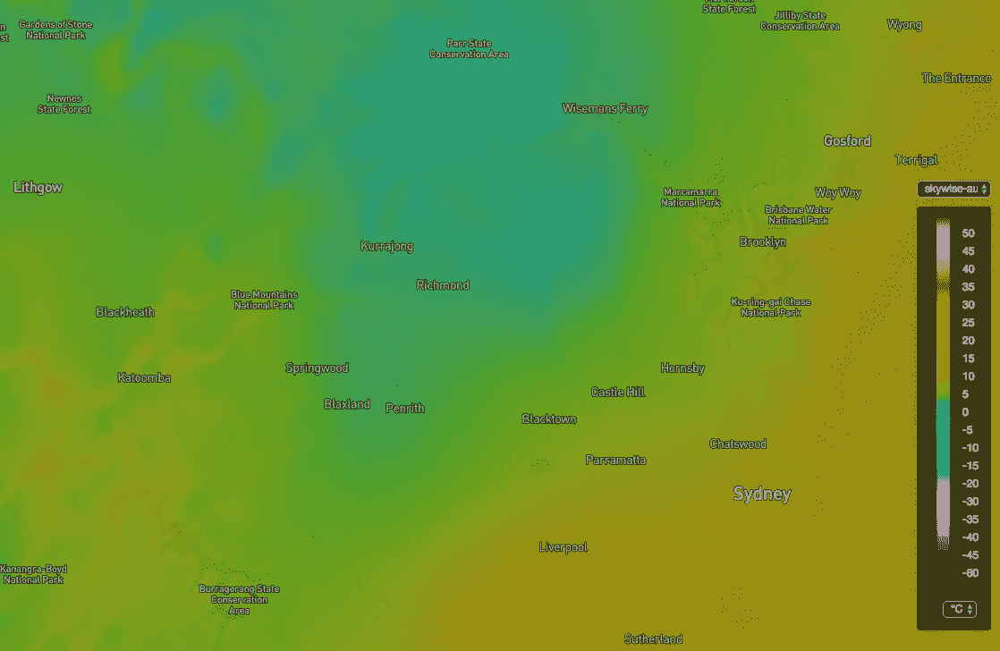
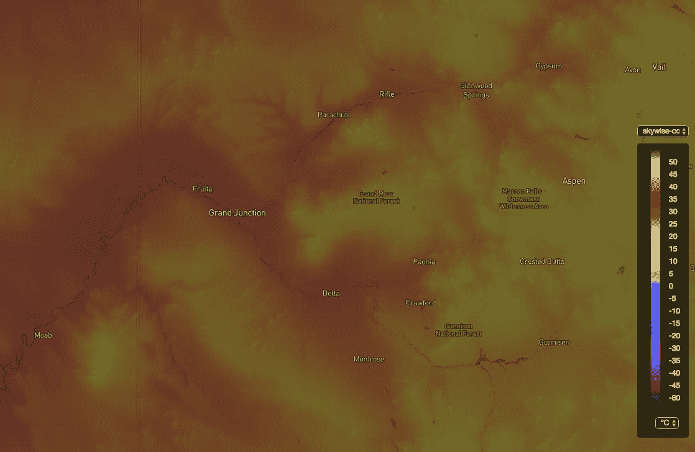

# 带有 R 的高分辨率天气数据

> 原文：<https://towardsdatascience.com/high-resolution-weather-data-with-r-410e5e5f12e5?source=collection_archive---------3----------------------->

我们在 [WeatherDecTech](https://medium.com/u/6e55e5c37908?source=post_page-----410e5e5f12e5--------------------------------) 遇到的一个棘手问题是客户需要大量天气数据，但没有科学数据格式的经验。

自从我们的高分辨率分析数据(NetCDF 格式)发布以来，这个问题越来越频繁地出现。虽然我们过去提供过 CSV 文件，但是这种方法有很多限制。



Australian High Resolution Hourly Temperature

最大的问题是 CSV 文件的大小通常是 NetCDF 的 20-30 倍。因此，查看我们对 10 个变量一年的每小时分析数据，NetCDF 分布可能为 750GB，而同等 CSV 数据为 20TB。

使用 NetCDF 数据的其他好处在其[常见问题解答](http://www.unidata.ucar.edu/software/netcdf/docs/faq.html)中有最佳描述:

> NetCDF 数据是:
> 
> *自诩*。netCDF 文件包含有关它所包含的数据的信息。
> 
> *便携*。netCDF 文件可以由具有不同存储整数、字符和浮点数方式的计算机访问。
> 
> *可扩展*。可以有效地访问大型数据集的小子集。
> 
> *可追加*。可以将数据附加到结构正确的 netCDF 文件中，而无需复制数据集或重新定义其结构。
> 
> *可共享*。一个编写器和多个读取器可以同时访问同一个 netCDF 文件。
> 
> *可建*。该软件的当前和未来版本将支持对所有早期形式的 netCDF 数据的访问。

虽然好处是显而易见的，但这仍然不能使格式变得容易使用。为了解决这些可访问性问题，我又写了 2 个 R 包。第一个是一个瘦 API 包装器，它允许你以一种方便的方式下载数据:[skywisedataferrer](https://github.com/wdtinc/SkyWiseDataTransferR)

用法很简单:

```
> Authorize('app_id', 'app_key')
> DataTransfer('skywise-conus-surface-analysis', directory = '.')
```

第二个是用于处理 NetCDF 文件的库: [SkyWiseNetCDFR](https://github.com/wdtinc/SkyWiseNetCDFR)

```
# extract the temperature grid
> grid <- ExtractGrid(fileName, "temperature")

# find the data value at a certain lat / lon
> val <- GetValueAtPoint(35, -97, grid)# Extract a subset of the grid
> vals <- mapply(GetValueAtPoint, lats, lons, MoreArgs = list(grid))
```

如果你想访问这些数据，请访问 WDT 进行注册或联系销售。



CONUS High Resolution Temperature