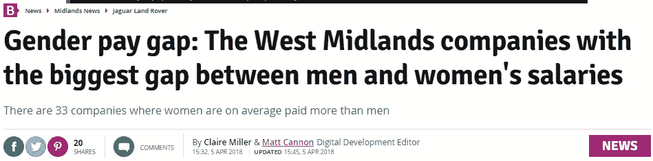
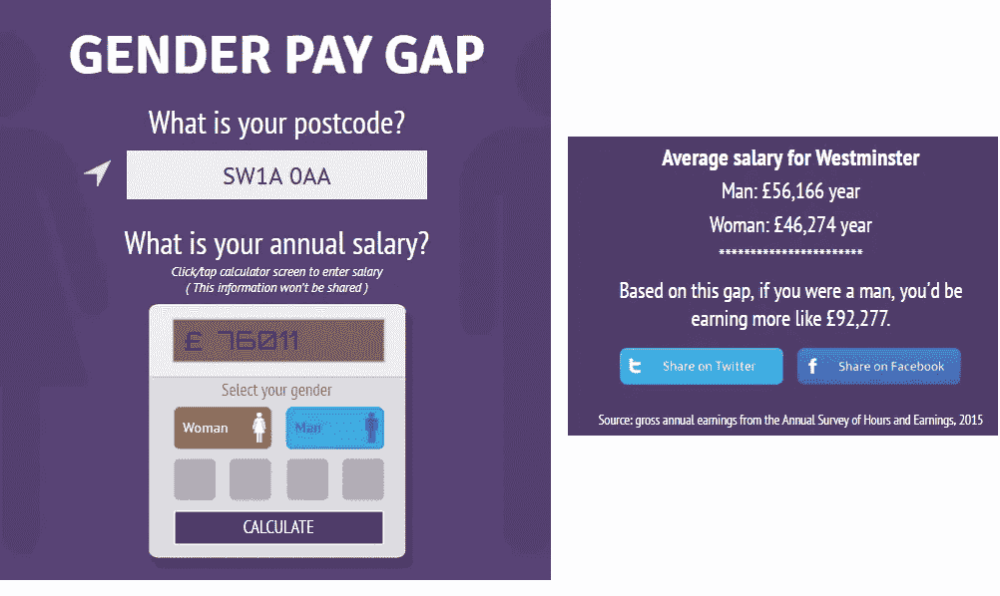
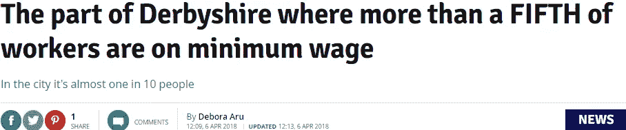
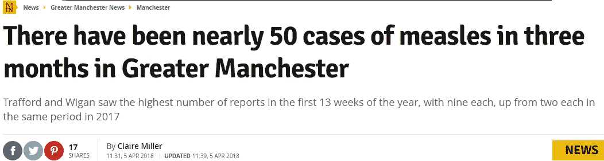
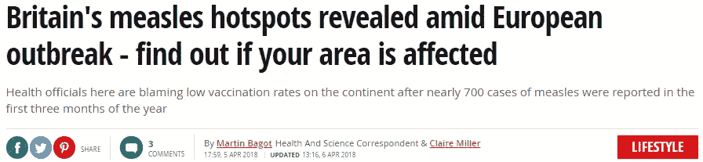
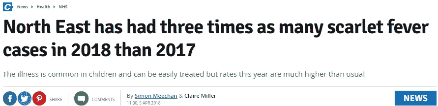
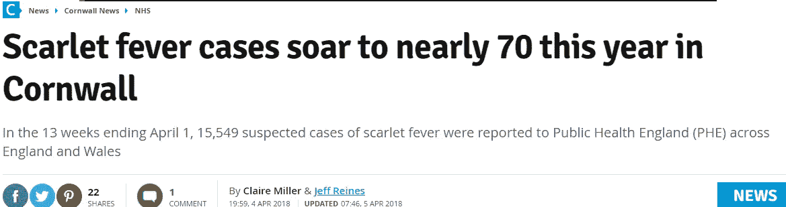
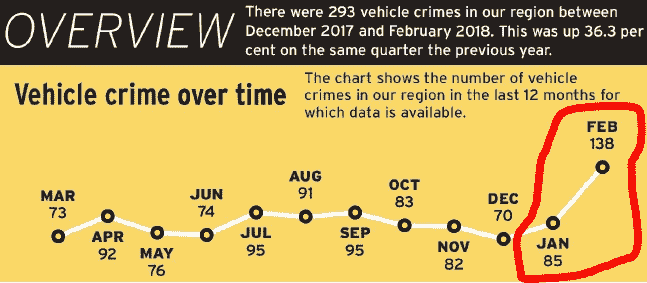
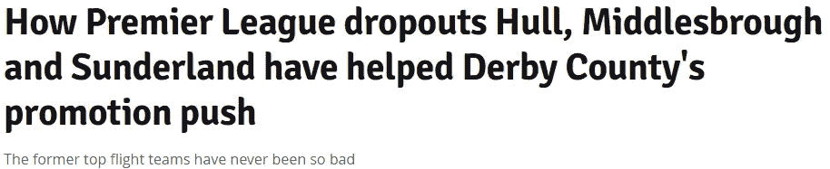

# 本周三位一体镜像数据单元的亮点

> 原文：<https://towardsdatascience.com/highlights-from-the-trinity-mirror-data-unit-this-week-58ba5ecb48b7?source=collection_archive---------9----------------------->

以性别薪酬差距、传染病、自动化在新闻中的作用以及我通常对德比郡的春季抱怨为特色，只有数据支持。(算是吧。)

# 打破性别薪酬差距

所以我们都看到了本周的全国头条新闻，揭示了性别薪酬差距最大和最小的公司。与此同时，数据部门的 [Claire Miller](https://twitter.com/clairemilleruk) 正忙于提取 Trinity Mirror 图书的本地列表，将每家公司注册地址的邮政编码与我们覆盖的每种图书的读者足迹列表进行匹配。

结果呢？一个重要的全国性故事变成了一个重要的地方性故事 x 40(这是 Claire 摘录的许多地方性电子表格)。你可以在这里看到一个例子:

Read this story [here](https://www.birminghammail.co.uk/news/midlands-news/gender-pay-gap-west-midlands-14495805)

如果你对全国的性别工资差异感兴趣，你可能也会喜欢我们上个月做的这个互动。输入你的工资、邮编和性别，找出你的平均收入比男人(或女人)多(或少)多少。

Try this interactive [here](https://www.manchestereveningnews.co.uk/news/greater-manchester-news/gender-pay-gap-women-wage-14380874)

# …公司只支付最低工资

上面的例子很好地说明了在本地化的数据集中寻找故事并不一定要挑出最好的、最差的、进步最快的等等。

这是一个数据记者很容易陷入的陷阱:故事必须主要是一个*数据*故事；它必须涉及某种比较，无论是与其他地区或另一个时间点。

嗯，不。这些比较*可能就是故事。但它们可能只是故事的有用背景。*

有时，数据在任何地方都讲述着大致相同的故事。或者，更准确地说:有时，出于完全相同的原因，不止一个地方对关于 *X* 的相同数据感兴趣，不管它是否显示其中一个地方在 *X* 处更好或更差。

这是本周的另一个例子:Deb Aru 分解了支付员工最低工资的公司的数据。

Read this story [here](https://www.derbytelegraph.co.uk/news/local-news/part-derbyshire-more-fifth-workers-1426040)

显然，如果一个地方有全国最差的数据，那显然是新闻专线。但在大多数地方，大多数时候，(当地)读者主要不是问:“在支付高于最低工资方面，我所在的地区与英国其他地区相比如何？”相反，他们在问:“在我所在的地区，有多少人的工资不超过最低工资？”

# 传染病继续激增

Claire 对什么地方的数据集已经发布，什么时候发布，有着难以置信的了解；作为该团队事实上的新闻编辑，她还保留了一份精心挑选的日记，记录了未来几天和几周将要公布的数据。

结果是，她总是第一个在定期发布的本地数据集中发现趋势和突发事件，否则可能会被忽视。

一个很好的例子是她对猩红热和麻疹病例的法医监测。令人担忧的是，最近几个月病例一直在上升——这一趋势在本周的新数据中得以延续。

这里是她写的关于麻疹的两个故事，包括一个将伯明翰、加的夫和利兹确定为最新爆发热点的全国版本:

Read this story [here](https://www.manchestereveningnews.co.uk/news/greater-manchester-news/been-nearly-50-cases-measles-14494545)

Read this story [here](https://www.mirror.co.uk/lifestyle/health/britains-measles-hotspots-revealed-amid-12309593)

这里有两个她写的关于猩红热的当地故事:

Read this story [here](https://www.chroniclelive.co.uk/news/health/north-east-three-times-many-14494087)

Read this story [here](https://www.cornwalllive.com/news/cornwall-news/scarlet-fever-cases-soar-nearly-1419737)

# 自动新闻

有时你会在本地数据集中找到新闻；有时它会跳出来打你的脸。

我之前提到过[我们的一个副业项目是如何为 Trinity Mirror](https://medium.com/@davidottewell_45215/trinity-mirror-data-unit-weekly-highlights-4c37c98f8537) 的周刊提供自动打印页面的。他们告诉我们他们覆盖的邮政编码、地方当局、健康信托等；我们用它从常规发布的数据集中提取本地信息，通过图形模板运行，页面显示为 pdf。

本周的主题是车辆犯罪，当我在全国各地校对网页时，有一件事引起了我的注意。这是一个康沃尔作品的页面:

如果我们把左上角放大一点:

这是一个重要的，潜在的高新闻价值的上涨，我们目前正在检查。这也是我们*只*发现的一个上升，因为我校对了*自动生成的一个页面*。

好吧，这是人为干预。尽管如此，这是“机器人新闻”让我兴奋的一点:编程的前景是获取常规数据，并提醒记者有重大新闻价值的变化。

# 官方:今年英超和英冠垃圾

如果你——像我一样——是德比郡的球迷，你会知道其他人称为“复活节假期”的那段时间是另一回事。也就是:“德比的崩溃和所有晋级的希望再次破灭的时候”。

今年应该是我们的一年。不过话说回来，*每*年都应该是我们的一年。特别烦的是 2017/18 赛季的总冠军感觉有点，嗯，垃圾。

但是是吗？嗯，本周该小组的 Rob Grant 指出的一个因素是去年从英超降级的球队相对糟糕的表现。

米德尔斯堡、赫尔和桑德兰目前分别排名第六、第十八和第二十三。如果他们在那里结束，这将是自 2004/05 赛季冠军更名以来最差的总成绩。

Read this story [here](https://www.derbytelegraph.co.uk/sport/football/football-news/how-premier-league-dropouts-hull-1416787)

不过，英超联赛的观众不应该太得意。随着富人越来越富，穷人越来越穷，英格兰顶级联赛大肆吹嘘的“竞争力”可能正在减弱。

我们的体育数据记者 David Dubas-Fisher 本周对这一问题进行了研究，发现以 3 个或更多进球获胜的英超比赛数量将达到 1958/59 赛季以来的最高水平。

# 我们这周做的其他事情

在报纸报道方面，《哈德斯菲尔德审查员》对我上周提到的安妮·高克对被看护儿童的调查进行了大篇幅报道:

与此同时,《曼彻斯特晚报》将我们对逃学率的研究放在了其奥尔德姆版的头版:

我们的摄像师 Mark Magill 第一次使用了他的“摇头管理器”，它最终将成为我们为各种三一镜报制作的视频生成工具的基础:

哦，我在 Twitter 上进行了一次有趣的讨论，讨论的基础是我快速制作的一张地图，上面显示了每个住宅的平均市政税账单，而不是通常用于讨论这个问题的“D 级”税率。如果你对此感兴趣(面对现实吧，如果你已经读到这里，你是我最好的选择)，你可以点击这里:

祝你周末愉快。