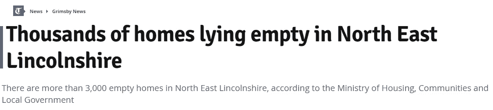
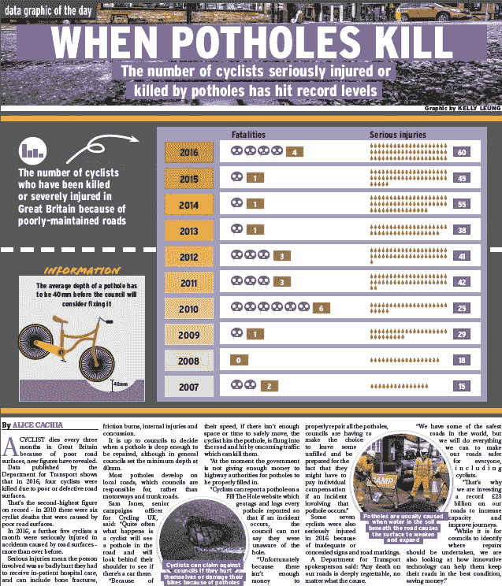
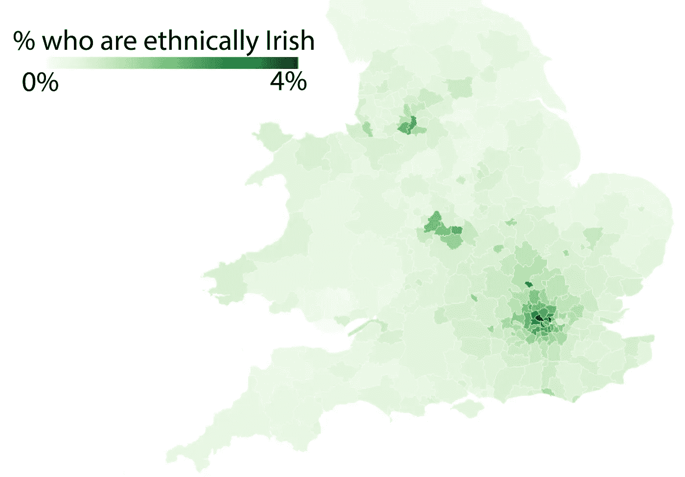

# 本周三位一体镜像数据单元的亮点

> 原文：<https://towardsdatascience.com/highlights-from-the-trinity-mirror-data-unit-this-week-b39d05dbeee0?source=collection_archive---------6----------------------->

圣帕特里克节前夕快乐！这里是我们本周披露的一些独家数据，以及它们出现的一些标题的链接。

# 学校:更少的钱+更多的学生+失败的学校=一个重要的问题

学校是怎么回事？在托尼·布莱尔时代，教育是头等大事:“教育，教育，教育”。这是每个父母都非常关心的事情(因此也是大多数成年人关心的事情)。然而，当政客们——相当正确地——谈论 NHS 的现金危机时，对困扰我们教育系统的问题的讨论却少得多。

本周，我们做了一些数据工作，预测未来几个月和几年需要的学校数量。

事实证明，像伯明翰这样的城市——那里的人口，特别是年轻人口，增长极快——到 2021 年 9 月将需要 12000 个名额，到今年 9 月需要 5000 个。

Read the story [here](https://www.birminghammail.co.uk/news/midlands-news/schools-breaking-point-outrageous-number-14415796)

当然，不仅仅是伯明翰。数据单元的克莱尔·米勒也为许多其他地方写了基本相同的故事，包括 T2 利兹 T3、T4 巴斯 T5 和剑桥 T7。

与此同时，学校可花的钱越来越少，正如克莱尔本周所展示的，许多失败的学校多年来一直在努力寻找学院的赞助。

# 世界上两个商店扒手…

该小组的安妮·高克做了一些分析，发现在美国部分地区，入店行窃的比率急剧上升。原因？嗯，你可以振振有词地将这种低层次的贪婪犯罪与紧缩、工资停滞和生活成本上升联系起来。

但是这些数字并不能方便地与被剥夺联系起来，而且在任何情况下，店主自己都有另一种解释:法律的改变意味着警察不会调查价值低于 200 英镑的物品的失窃。

Read the story [here](https://www.birminghammail.co.uk/news/midlands-news/shoplifting-rising-sharply-west-midlands-14417904)

# 自从法院裁定收养应该是最后的解决办法后，收养率直线下降

多年来，委员会和机构已经花费了大量的时间、金钱和努力来促进收养。

尽管如此，我们本周透露，在上一个财政年度，英国大部分地区找到永久新家的被照看儿童数量显著下降。

我是说意义重大。例如:布里斯托尔有 25 例这样的收养，低于前一年的 45 例，而赫尔的数量从 2013/14 年的 90 例下降到今年的 45 例。在整个东北部，2013/14 年度有 390 起，但 2016/17 年度只有 300 起。

收养机构表示，关键的变化是由最高法院和上诉法院做出的两项法院裁决，这两项裁决明确表明了将孩子归还给亲生父母、大家庭或养父母的偏好。

你可能会说这是件好事。这可能确实是一件好事。但是我们也发现接受看护的儿童数量并没有下降。因此，我们不能假设一个快乐的结局:事实上，数据中没有充分的理由认为儿童错过了被收养的机会，因为他们被送回了亲生父母身边。

# 4 空房子，价格上涨

因此，我们看了一下关于空置房屋数量的新数据，它在全国范围内发出了相当严峻的信号——特别是当无家可归者的比率回到自 2004 年峰值以来从未见过的水平时。

你可能会认为让房屋空置可能意味着需求不足和随之而来的供应过剩，从而导致价格下跌。不幸的是，情况似乎并非如此:例如，在格里姆斯比，有 3000 多套空置房产，但平均价格仍是平均工资的 5 倍。

Read the story [here](https://www.grimsbytelegraph.co.uk/news/grimsby-news/thousands-homes-lying-empty-north-1320356)

# 5 其他材料

安妮·高克(Annie Gouk)表示，在像 T2 肯特(Kent)和 T4 利兹(Leeds)这样的地方，宗教和种族仇恨犯罪达到了创纪录的水平(这是多么反常的一件好事)，而黛比·阿鲁(Deb Aru)透露，尽管求助需求不断增加，但在雷丁(Reading)这样的地方，性健康支出却下降了一半。

在体育方面， [David Dubas-Fisher](https://twitter.com/dubasfisher) 和 [Carlos Novoa](https://twitter.com/carlosfpn) 为切尔滕纳姆金杯重建了他们的“使用数据挑选你的马”小工具，而*它再次让我非常失望*。

你仍然可以在不同的 Trinity Mirror 网站上试用这个小工具(看看你是否能反向工程出真正的赢家，因为我不知道我能不能做到)，例如这里的或这里的或这里的。

本周我最喜欢的一个版面是这个，Alice Cachia 和 Kelly Leung 披露了越来越多的骑自行车的人死于路面坑洼:

最后，这是我做的一张奖金图，显示了每个地方政府中自称是爱尔兰裔的人的比例。

结论:如果你想度过一个美好的圣帕特里克节，去伯明翰、曼彻斯特或伦敦吧。

祝你周末愉快。