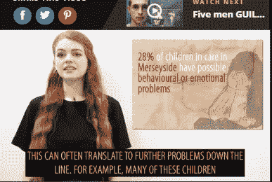
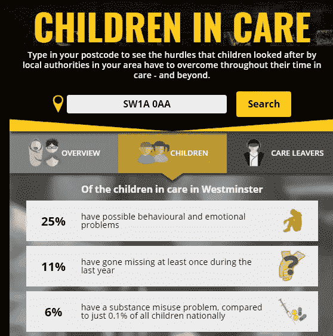
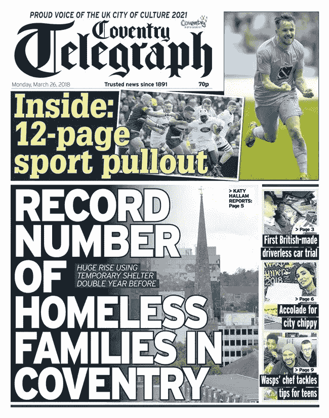
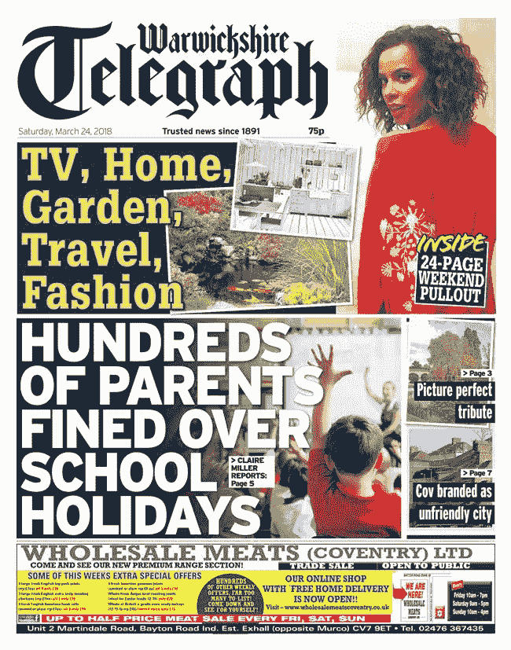
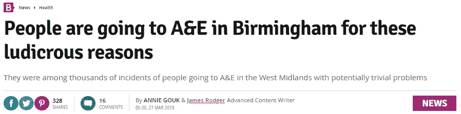
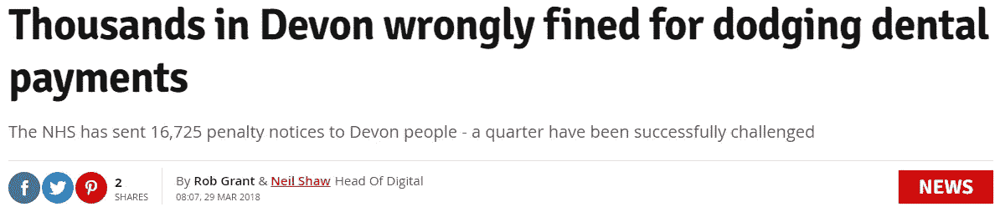
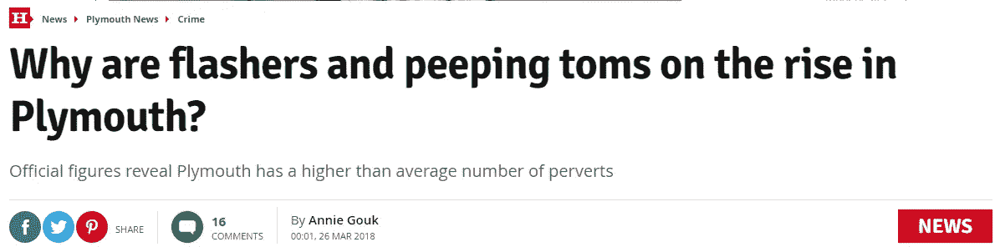
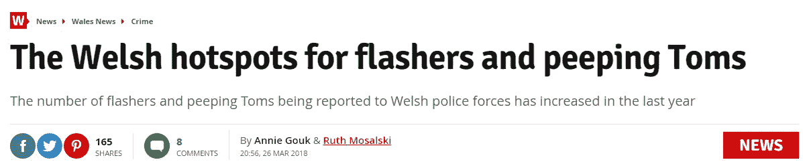
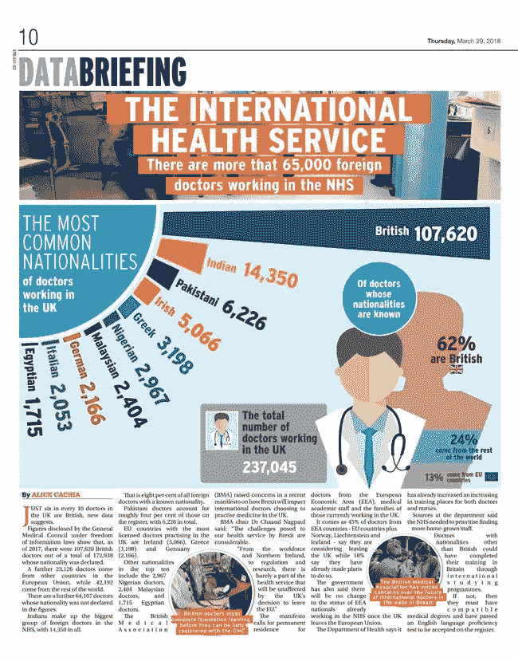

# 本周三位一体镜报数据单元的亮点是:对被看护儿童的深入调查，查明有逃学问题的学校，以及揭露一波“不加区别的”国民保健服务罚款

> 原文：<https://towardsdatascience.com/highlights-from-the-trinity-mirror-data-unit-this-week-deep-dive-investigation-into-children-in-5da3ef7cc0e0?source=collection_archive---------8----------------------->

上周没有综述，但我们从上周五开始就一直很忙，所以我将把这限制在我们自那以来所做的一些事情上。

# 被照管的儿童:一个深入的数据项目

数据记者 Annie Gouk 对围绕重要社会问题的当地数据进行了多次“深度”调查。你可以在这里看到她以前围绕种族不平等[的一些作品，或者在这里](https://www.manchestereveningnews.co.uk/news/greater-manchester-news/racial-inequality-manchester-hard-facts-12730531)看到性别差距[的不同方面。](http://genderdivide.chroniclelive.co.uk/index.html?reload)

本周——实际上是今天——我们发表了她对在看护环境中长大的儿童的生活机会的最新调查。除此之外，还有一些令人震惊的新闻:例如，利兹只有 5%的被看护儿童会被收养，而默西塞德被看护的儿童被判有罪的可能性是其他儿童的两倍。

View this video [here](https://www.liverpoolecho.co.uk/news/liverpool-news/children-care-twice-likely-convicted-14474535)

但这不仅仅是新闻热线。Annie 还讲述了一系列 explainer 视频(你可以在下面的链接中找到)，视频采访案例研究，并与编码器 Carlos Novoa 和设计师 Kelly Leung 合作，创建了一个邮政编码搜索互动，让读者可以获得他们当地受照顾儿童的大量数据。这一点很重要:你越是将新闻个性化，读者的反应就越强烈。

通过安妮在这里开始的线索，你可以看到许多三一出版社的报道:

# 无家可归——猜猜看，它正在上升

在全国范围内，无家可归者——不要与露宿街头混淆——自 2010 年以来一直在攀升，并在 21 世纪初达到顶峰。

任何不是因为自己的过错而失去家园的人正式成为无家可归者，重新安置他们的责任落在了当地议会的肩上。众所周知，地方议会受到了预算大幅削减的打击。结果，你得到了一场完美的风暴:更多的人失去了他们的房子，而议会却没有足够的资金和人员来为他们寻找新的房子。

Rob Grant 对最新的无家可归人数做了一些地方层面的分析，发现在许多地区无家可归人数不再攀升，而是直线上升。在城市中尤其如此。例如，在考文垂，Rob 发现在临时住所的无家可归家庭的数量在一年内几乎翻了一番，为《每日电讯报》提供了这样的头版:

你可以在这里阅读完整的故事，或者谷歌其他版本的 Rob 写的该集团的其他标题。

与此同时，该部门的 Deb Aru 正在调查无家可归的家庭在处理他们的住房福利申请时如何面对邮政编码抽签。(见她为伯明翰[写的故事这里](https://www.birminghampost.co.uk/news/regional-affairs/west-midlands-councils-risking-homelessness-14458931)举例。)随着越来越多的人宣布无家可归，资金短缺的议会无力应对官僚主义，等待的时间越来越长。如我所说:一场完美风暴。

# 逃学的孩子，父母被罚款

本周，我们查看了大量与逃学和其他父母/孩子不良行为相关的数据集。这是影响最大的两个。

首先，克莱尔·米勒分析了全国各地因带孩子在学期中度假而被罚款的父母人数。

这在沃里克郡引起了轰动，从利兹到莱斯特，从萨默塞特到克罗伊登，各种头衔都有很棒的台词。

其次，我们对政府的旷课数据做了一些法医分析，这让我们能够找出每一个三位一体镜像区域中未经授权缺勤率最高的学校。

事实证明，这些故事非常受读者欢迎，有许多版本——包括这个给[肯特](https://www.kentlive.news/news/kent-news/schools-kent-highest-unauthorised-absence-1380095)的版本——在最受欢迎的故事排行榜上名列前茅(顺便说一句，肯特学校的校长把它的位置归结为[对假期的零容忍政策](https://www.kentlive.news/news/kent-news/head-teacher-explained-hartsdown-academy-1396424))。你可以通过搜索找到我们做的各种其他版本，例如赫尔[这里](https://www.hulldailymail.co.uk/news/education/truancy-figures-hull-schools-2018-1361600)或者伯明翰[这里](https://www.birminghammail.co.uk/news/midlands-news/schools-birmingham-best-worst-attendance-14454534)。

# 打嗝去 A 和 E

你不会的，对吧？好吧，根据英国国民健康保险制度公布的新数据和安妮的分析，如果你这样做了，那么你会在去年的其他 42 人中。

总共有 22，000 人去了 A 和 E，他们有明显的轻微抱怨，包括打喷嚏、喉咙痛(默西塞德郡有 76 人这样做)，以及鼻塞(大曼彻斯特有 30 人这样做)。

正如一位顾问向安妮指出的那样，这些人不是我们 NHS 面临压力的根源。许多人试图从其他地方获得帮助，但都失败了。但是他们在医院的出现，充其量是一个迹象，表明整个系统正在努力在正确的时间，正确的地点，以正确的方式对待人们。

你可以在这里阅读安妮为伯明翰写的版本——这是出版当天阅读量最大的新闻报道。

# 患者推翻“不分青红皂白”的 NHS 牙科罚款

罗布透露了英国国家医疗服务体系是如何发出数万张罚款通知，要求支付牙科服务费用的——尽管事实证明，有问题的病人有权享受免费医疗。

以德文郡为例:[在发出的 16，000 张罚单中，四分之一被成功质疑](https://www.devonlive.com/news/devon-news/thousands-devon-wrongly-fined-dodging-1397051)。类似的比例在[巴斯](https://www.somersetlive.co.uk/news/somerset-news/exclusive-nhs-wrongly-demanding-payment-1397509)、[莱斯特](https://www.leicestermercury.co.uk/news/health/nhs-wrongly-demanding-payment-dentistry-1397394)、[纽卡](https://www.chroniclelive.co.uk/news/north-east-news/you-paying-visit-dentist-could-14472225)、[伯明翰](https://www.birminghammail.co.uk/news/health/nhs-wrongly-demanding-payment-dentistry-14469254)——基本上到处都被成功挑战。

英国牙科协会对这种情况很不高兴，他告诉罗伯:“可悲的是，根除欺诈的强硬言论与完全不加区别的罚款方式齐头并进。”

# 暴露狂和偷窥者数量的增加 TOMS

安妮一直在做一项数据调查，以了解“偷窥”犯罪的数量是否一直在上升，这种犯罪是指像“穿裙子”这样的闪光和性间谍犯罪。

令人沮丧的是，事实证明，他们已经做到了，几乎遍布全国。

Read the story [here](https://www.plymouthherald.co.uk/news/plymouth-news/flashers-peeping-toms-rise-plymouth-1382093)

Read the story [here](https://www.walesonline.co.uk/news/wales-news/welsh-hotspots-flashers-peeping-toms-14457965)

乐观的解释是，这反映出警方对这些犯罪的认识和采取行动的意愿有所提高。

但是，正如妇女平等党对安妮说的那样:“不管这是因为更多的人站出来，更多的犯罪意识，还是更多的事件，要解决这个问题，我们必须明白，偷窥和暴露犯罪是暴力侵害妇女和女孩行为的一部分。”

你可以看到《安妮故事》的其他版本，比如在这里阅读和在这里阅读的《诺丁汉(那里的人数翻了一番)】。

# 我们做的其他新闻

随着周末寒流的预测，我们开始关注是否会有破纪录的天气出现。提供了关于[令人担忧的极右极端主义崛起的地方数据和分析](https://www.derbytelegraph.co.uk/news/local-news/rising-right-wing-extremism-referrals-1388959)；揭示了在包括伯明翰在内的一些地区，阿拉伯语和乌尔都语现在比德语更受欢迎。并展示了议会如何削减预防酗酒的开支，尽管酗酒使住院人数创下纪录。

我已经没有空间来容纳我们所做的所有体育内容了，为此我向我们杰出的体育数据记者大卫·杜巴斯·费舍尔道歉——我会在下周首先提到它。我将以我们本周做的一份日报来结束这篇文章，关于在英国国民医疗服务系统工作的外国医生的数量。祝你周末愉快。

