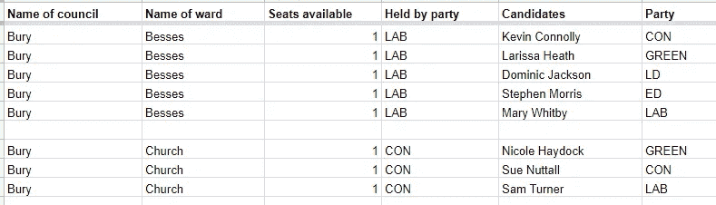
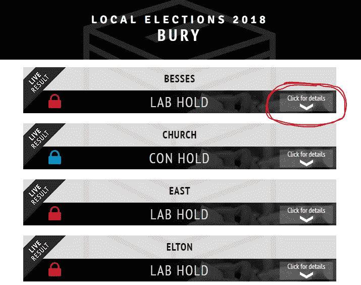
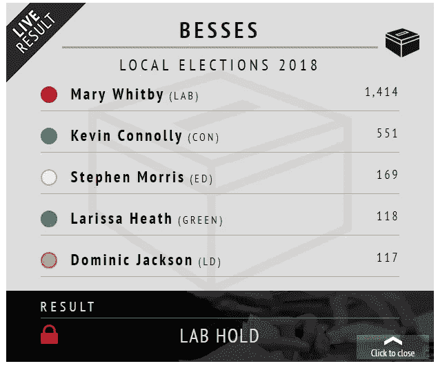
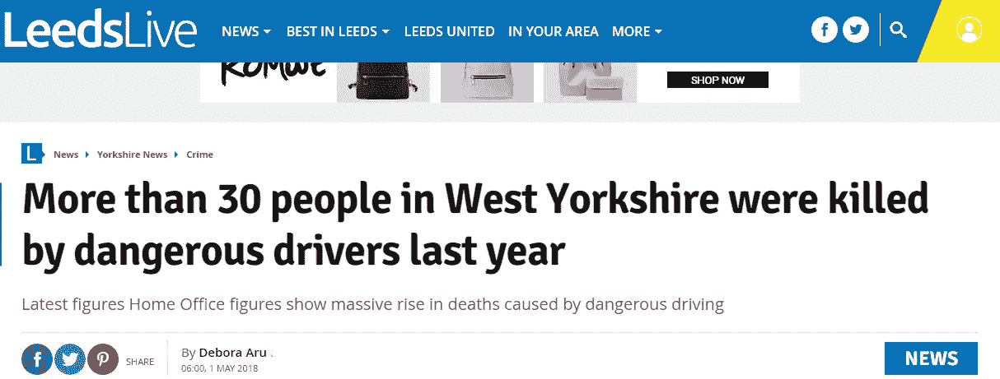
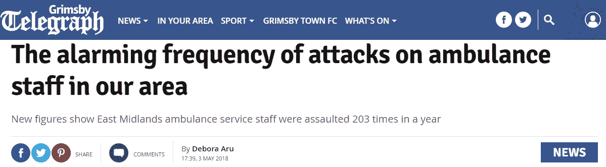
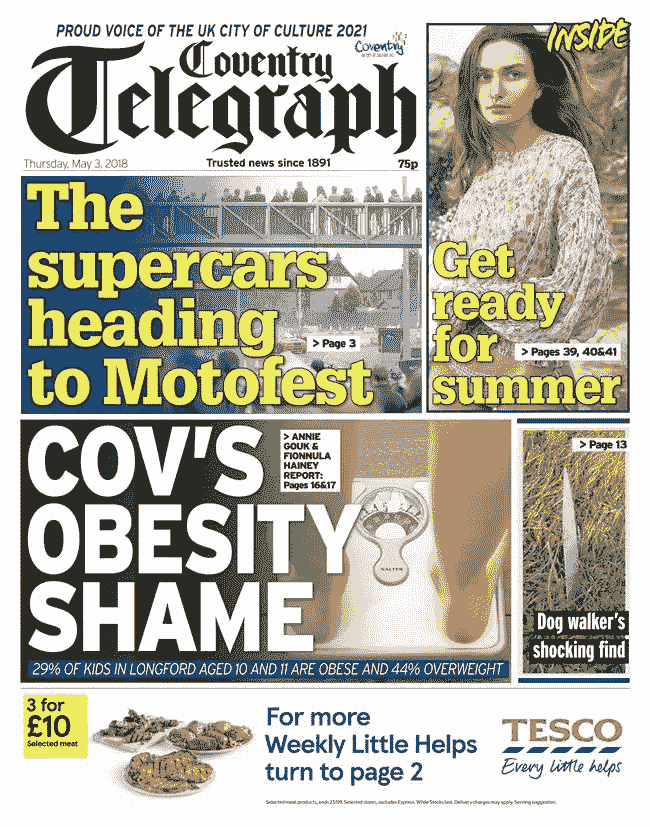
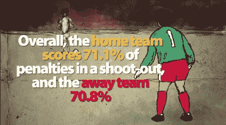
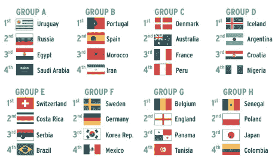
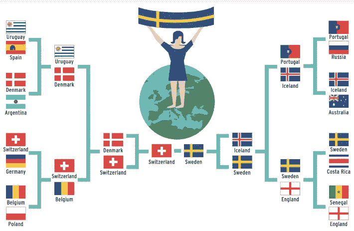

# 本周三位一体镜报数据单元的亮点:选举、危险司机和超市抢劫

> 原文：<https://towardsdatascience.com/highlights-from-the-trinity-mirror-data-unit-this-week-elections-dangerous-drivers-and-e2f82c0f4959?source=collection_archive---------10----------------------->

现在是下午 2 点，我在过去的 30 个小时里几乎没有睡觉，因为一个熟悉的朋友:议会选举。

它们并不迷人，但它们确实很重要——而且不仅仅是政治观点的风向标。议会不只是清空垃圾箱。他们照顾老人、脆弱的成年人和面临虐待风险的儿童。他们负责学校和图书馆。他们给无家可归的人提供了栖身之所。虽然读者不一定关心议会政治，但他们非常关心议会选举结果。

我们对待地方选举的方式一直是问我们如何为我们的网站增加最大的价值。对我来说，这是关于确保他们能以最快和最好的格式显示结果。有了大选，每个席位的结果都不难得到。在地方选举中，实际上只有一名当地记者在计票。

这是一个主要的竞争优势——如果你能利用它的话。

为了方便起见，我们与记者合作，在 Google Sheets 中建立候选人名单，看起来有点像这样:

然后，我们使用这些电子表格中的数据来支持移动友好的结果小工具。当晚，计票处(或新闻编辑室)的记者只需填写每位候选人获得的票数——因为是谷歌表单，所以可以合作完成。我们的系统将候选人按投票顺序排列，识别出获胜者，并计算出获胜者所在的政党是获胜还是保持领先。

结果几乎立即显示出来，如下所示:

你可以在这里看到这个特殊的结果小工具。今年，我们制作了超过 50 个，用于整个集团的标题，它们确实总是做得非常好。我们*确实*花时间提供其他工具(投票份额、总席位、波动等)，以及夜间分析。然而，没有什么比让人们得到他们真正想要的信息更重要:他们的选区和他们的委员会的结果。

当我埋头于选举电子表格时，团队的其他成员却一如既往地忙碌着。

[黛比·阿鲁](https://twitter.com/Deb_Aru)利用公开犯罪表对危险驾驶进行了一些局部分析，得出了明显的结果。

Read the full story [here](https://www.leeds-live.co.uk/news/yorkshire-news/more-30-people-west-yorkshire-14596689)

例如，在利兹，违法行为在过去的五年里增加了三倍，包括 31 起危险驾驶致死的案件。

道路安全慈善机构 Brake 告诉 Deb，这种增长是“令人震惊的”，并呼吁在道路交通执法方面进行新的投资，同时进行更严厉的判决。(我们以前写过交通警察是如何被削减的。)

Deb 还忙着写一份信息自由请求，显示全国范围内袭击救护车工作人员的数量在上升。仅举一个例子:在东中部地区，有 203 起袭击事件，包括 7 起性侵犯——其中两起看到受害者受到持刀威胁。在全国范围内，袭击事件的数量在一年内从 3495 起上升到 3701 起。

Read the full story [here](https://www.grimsbytelegraph.co.uk/news/alarming-frequency-attacks-ambulance-staff-1530193)

UNISON 首席官员艾伦·洛夫豪斯告诉 Deb，这样的攻击使得“已经压力很大的工作几乎无法忍受”，并且“导致许多人离开他们热爱的工作”。

你可以在这里阅读格里姆斯比[或拉夫堡](https://www.grimsbytelegraph.co.uk/news/alarming-frequency-attacks-ambulance-staff-1530193)[的故事。](https://www.loughboroughecho.net/news/local-news/violence-to-ambulance-staff-revealed-14608600)

随着阿斯达-塞恩斯伯里合并的消息传出，罗布·格兰特决定搜集两家公司的大型商店的地址，以了解它们在同一邮政编码区的出现频率。答案？很多。[这是威尔士的数据](https://www.walesonline.co.uk/business/business-news/welsh-places-asda-sainsburys-what-14599105)，这是布里斯托尔的数据。

Sainsbury's 已经表示没有关闭商店的计划，但是——正如 GlobalData 的 Patrick O'Brien 指出的——监管机构也可能会对一家有两家商店的公司采取措施。

印刷方面,《考文垂电讯报》大肆报道了我上周提到的安妮·高克的儿童肥胖分析:

Read the full story [here](https://www.coventrytelegraph.net/news/coventry-news/almost-30-children-area-cov-14594550)

在体育方面，[大卫·杜巴斯-费舍尔](https://twitter.com/dubasfisher?lang=en)发现主队在点球大战中绝对没有优势，分析了[英格兰低级别联赛中电视转播最多的球队](https://www.birminghammail.co.uk/sport/football/football-news/aston-villa-tv-leeds-newcastle-14607856)，并观察了[降级球队重返冠军宝座的频率](https://www.chroniclelive.co.uk/sport/how-likely-sunderland-come-straight-14606483)(没有你想象的那么频繁)。

我把这个留给你，来自我们本周的报纸，它回答了一个问题:如果世界杯是基于言论自由的评级，它会如何发展？剧透:英格兰在四分之一决赛中被淘汰。但是，他们不总是这样吗？

