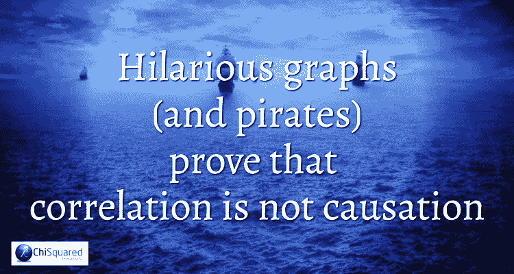
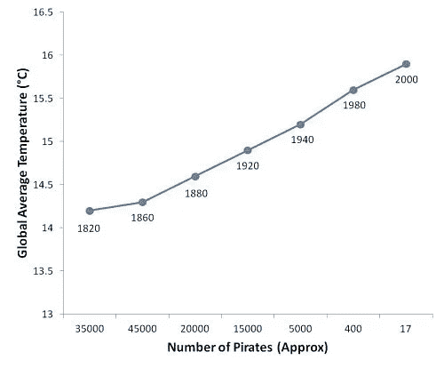
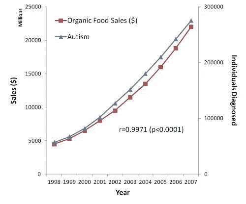
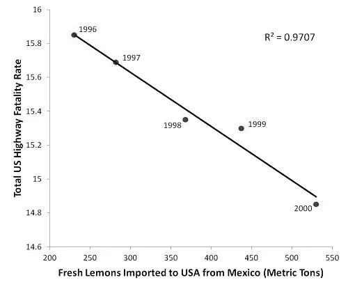

# 滑稽的图表(和盗版)证明了相关性不是因果关系

> 原文：<https://towardsdatascience.com/hilarious-graphs-and-pirates-prove-that-correlation-is-not-causation-667838af4159?source=collection_archive---------6----------------------->

## [现实世界中的 DS](/data-science-in-the-real-world)

## 说到讲故事，我们有一个问题。

然而这不是我们的错——作为人类**我们生来就注定要寻找模式并解释为什么会发生**。这个问题并没有随着我们的成长而消失，而是随着我们认为自己越聪明而变得越糟糕。我们说服自己，现在我们更老了，更明智了，*更聪明了*，我们的结论比年轻时更接近事实(风吹得越快，风车叶片转得越快，而不是相反)。

即使真正聪明的人看到了一种模式，并坚持对其做出解释，即使他们没有足够的信息来得出这样的结论。他们没办法。

这就是做人的道理。我们寻求对发生在我们周围的事件的解释。如果某件事不符合逻辑，我们会试图找到它可能有意义的原因。如果有什么不对劲，我们会弥补。

# 事后谬误

听说过拉丁语表达 *Post Hoc，Ergo Propter Hoc* ，意思是“在这之后，因此因为这”？这是“相关性并不意味着因果关系”这句话的基础，在统计学中也被称为“事后谬误”，因为这是一个我们都经常陷入的非常熟悉的陷阱。这是一个想法，当观察到事情按顺序发生时，我们推断首先发生的事情一定引起了接下来发生的事情。

事后谬误是导致足球经理只在比赛日穿紫色袜子的原因。他曾经穿着它们参加比赛，他的球队赢了。很明显，是袜子干的。现在他担心如果*不穿它们去比赛，球队可能会输。该死的那些发臭的紫色袜子(他也不敢洗，怕神奇的仙尘洗出来)。*

Post Hoc 也是雨人成为部落不可或缺的原因——他们相信他们的雨人可以让它下雨。雨人发现了远处酝酿的云，他跳舞直到它倾盆而下。通常不需要超过三四天的舞蹈，直到不可避免的事情发生。“雨人舞，水从天而降”。对雨人来说，印第安人不会说拉丁语是件好事，否则他就真的有麻烦了…

# 后海盗假设

对于后特设谬误的幽默观点，让我们看看 Pastafarianism。这是最近最流行的。没听说过？这是这个街区最新、发展最快的宗教之一。全称是 Pastafarian Sparrowism，是一种“充满活力的宗教，它试图通过先知杰克·斯派洛船长的一生，将飞行中的意大利面条怪兽短暂的爱带给我们所有人”。说真的，他们不是在开玩笑。嗯，事实上，他们是。他们提倡轻松的宗教观，反对在公立学校教授智能设计和神创论。他们还坚持认为**海盗是最初的牧民**。

为了证明相关性并不意味着因果关系，创始人 Bobby Henderson 提出了全球变暖是自 19 世纪以来海盗数量减少的直接影响的论点，并附有这张图表:

Pirates Caused Global Warming. Honest…

哇，看那条直线，我听到你们都说——海盗数量的下降和全球气温的上升之间显然有关联，所以这里肯定有*和*之间的因果联系，不是吗？是的，你们都陷入了事后谬误(我就知道你会)。

仅仅因为图中有一条直线**并不一定意味着一件事导致了另一件事**，特别是当你随机抓住两个看似不相关的变量，并把它们放在一起，看看它们之间是否存在某种微妙的关联。

以海盗和全球变暖为例，仔细看看 x 轴上的标签。注意到奇怪的事情了吗？除了相邻数据点的比例都不正常这一事实之外，还有一个问题是，其中有几个数据点已经被幽默地打乱，以故意欺骗。

我不知道你怎么想，但我是个信徒！一旦我写完这本书，我就放弃在公海上当海盗的统计数据。如果这是我做的最后一件事，我会阻止全球变暖。

可能会是…

**我们中断这篇博文，为您带来突发新闻……**

这篇博文摘自诙谐的新书**真相、谎言和统计**

下面是简介:

海盗、猫、墨西哥柠檬和北卡罗来纳律师。奶酪消费，人造黄油和从渔船上掉下来淹死。这本书什么都有。在这本令人大开眼界的书中，获奖的统计学家和作家李·贝克揭示了统计骗子用来欺骗、蒙蔽和愚弄粗心大意者的关键伎俩。作为一个外行人写的指南，用数据和统计来说明撒谎、欺骗和欺骗，没有一页是乏味的！一本书的八个机智章节的过山车，这可能是你今年会读到的最有趣的统计学书籍。

发现统计欺骗和有说服力的误导的令人兴奋的世界。

**点击下面的链接，立即获得这本书……**

 [## 真相、谎言和统计数据

### 你被当成傻瓜了吗？一本书的 8 个机智章节的过山车，这可能是最…

www.chi2innovations.com](https://www.chi2innovations.com/truth-lies-and-statistics-book/) 

# 器质性自闭症相关性难题

如果你在网上看看，有各种各样的幽默图表可以证明事后谬误。在过去 20 年左右的时间里，反疫苗运动有了巨大的增长，特别是在美国，并且已经“发现”了各种各样的**虚假相关性**，这些相关性“证明”疫苗接种计划和自闭症之间存在因果联系。与此同时，为了揭穿这些最荒诞的理论，其他同样荒谬的相关性也出现了。

有一篇发表的文章显示了美国有机食品的销售和自闭症诊断之间的相关性:

Organic Food Causes Autism. Oh My…

这对情节线之间有着非常紧密的相关性，甚至伴随着一个**非常大的 r 值**(接近 1)和一个**非常小的 p 值**(接近 0)。建议是——如果我们相信相关性*意味着因果关系——有机食品和自闭症之间的相关性比目前存在的任何其他理论都更密切，因此它*一定是原因。除了相关性*不一定意味着因果关系，有机食品不会导致自闭症。那太荒谬了。这就是这些图表的全部意义。你所需要做的就是找到任何一对在同一时间段内增加的变量，用相同的 x 轴和不同的 y 轴将它们绘制在图表上，调整 y 轴刻度，直到曲线结合，然后——嘣——关联！如果，由于某种巧合和命运的魔力，存在一种*统计上的*相关性，那么就公布与之相伴随的 p 值作为额外的证明。**这只是证明了相关性的存在，但并不能证明一件事导致了另一件事**。有可能，但也有可能不会…***

# 柠檬死亡相关收敛

我也很欣赏这种相关性，它证明了墨西哥柠檬是美国道路上死亡的主要原因。等等，什么？我一定错过了那天的新闻——墨西哥柠檬正在杀死美国人？你打赌！

看看从墨西哥进口到美国的新鲜柠檬数量与 1996 年到 2000 年间美国高速公路上的总死亡率的关系图:

Mexican Lemons Kill Americans!

天啊，天啊，看看 R 的平方值——它真的*必须*为真。尽管图表似乎在告诉我们，美国的墨西哥柠檬越多，交通事故死亡人数就越少，但不可避免的结论是，墨西哥柠檬杀死了美国人！我们应该做些什么呢？我们应该进口更多的墨西哥柠檬吗(相关性告诉我们这是我们应该做的)？或者我们应该完全禁止墨西哥柠檬？毕竟，如果街上没有墨西哥柠檬，他们就不会再杀害更多的美国人。

真是一派胡言！我不在乎*和*是否有关联，**没有任何迹象表明柠檬会导致事故**。如果有，你不认为在卡车进入美国之前，柠檬会在墨西哥道路上造成事故吗？西西里柠檬怎么样？它们会导致意大利和整个欧洲的交通死亡吗？

哦，关联的力量。只要你的观众不明白相关性并不一定意味着因果关系，你就可以让他们相信几乎任何事情。

你忘了你的那本书了吗？别担心，它就在这里等着你:

 [## 真相、谎言和统计数据

### 你被当成傻瓜了吗？一本书的 8 个机智章节的过山车，这可能是最…

www.chi2innovations.com](https://www.chi2innovations.com/truth-lies-and-statistics-book/) 

*原载于*[*chi2innovations.com*](https://www.chi2innovations.com/blog/discover-stats-blog-series/graphs-prove-correlation-not-causation/)*。*