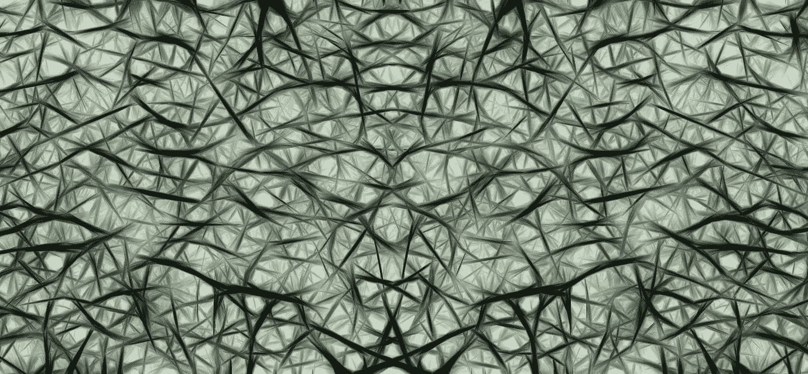
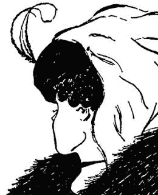

# Hinton++

> 原文：<https://towardsdatascience.com/hinton-1e6d26a64bd6?source=collection_archive---------2----------------------->

杰弗里·辛顿有所发现。他的机器智能模型依赖于他称之为“[胶囊](https://arxiv.org/abs/1710.09829)”的神经元簇，这是对我们自己的大脑如何理解世界的最好解释，因此也是对机器如何理解世界的最好解释。然而，总有改进的余地。胶囊未能解释我们对*扭曲*的理解——当面对不合语法的句子时，我们可以说出“蹒跚学步的*是什么意思*，当他的特征不对齐时，我们可以看到“如何*重新排列*土豆头先生”。**胶囊仅识别面部，例如，当其部件的姿态*正确*时，没有关于如何修复变形的建议**。我会试着对他的作品做些调整。

**打住，什么是胶囊？**

如果你没听说过胶囊也没关系。它们并不是一个新的话题——它们从 70 年代就藏在杰弗里·辛顿的脑海里了！从本质上来说，胶囊是一种克服几何变化的尝试。当我们观察一张纸上的正方形时，我们认出它是正方形，即使页面*翻转*或*倾斜远离我们*。那个正方形的“像素”发生了戏剧性的变化，而我们对“正方形”的 ***概念*** 保持不变。

人工神经网络不像我们一样用静态的“方块”来思考。辛顿创造了胶囊，这样 CNN 可以保持正方形的静态概念，即使这些正方形倾斜和旋转。人脸，汽车，任何东西都一样。胶囊通过记录辛顿所说的“姿势”来补偿几何失真。

一个物体的**姿态**描述了*在视野中的位置*，它的*如何倾斜*，它的*相对大小*，以及*如何倾斜*。总的来说，这些特性描述了当 3D 对象被简化为 2D 图像，并且这些对象在视场中移动时出现的失真。辛顿的核心见解是这样的:如果我看到一张脸，但那张脸是*倾斜和旋转的*，那么那张*同样的*倾斜和旋转被应用到*脸的每一个部分*。所以，如果我看到一张 2D 倾斜嘴巴的照片，我希望看到*同样倾斜的眼睛和鼻子*！

Hinton 的每个胶囊都在寻找脸部的*部分*——一个胶囊寻找鼻子，另一个寻找眼睛，第三个胶囊希望找到嘴。当这些胶囊中的每一个找到它们的物体的实例时，它们就会亮起来，说“我找到了一只眼睛/鼻子/嘴！”他们记录下各自目标的**姿态**，并将信息传递给*高层胶囊*，即面部胶囊。当面部胶囊接收到来自嘴巴、鼻子和眼睛胶囊的信号时，**它会比较它们的姿势**。一张真实的脸应该有相同的眼睛、鼻子和嘴的姿态数据。**如果三个姿势都一致**，那么脸部胶囊就会亮起，表示“我找到了一张脸”。这就是全部了。

我们示例中的面部胶囊有自己的姿势，它向检测上半身的更高层胶囊发送信号。如果肩膀，脖子和头发的胶囊都亮了，并且都同意一个姿势，那么更高层的胶囊也亮了。这种一致的级联反应一直持续到整个人被识别出来，并且类似的胶囊为每一种物体运作。主要思想是较大的对象由较小的对象组成，那些较小的对象*期望彼此同意它们的相对排列*。到目前为止，Hinton 的胶囊工作得相当好，分离和识别重叠的手写数字，精确度远远超过现有的神经网络。然而…

**“我记得好像不太对劲……”**

当他们期望的协议没有出现时，辛顿的胶囊绊倒了。如果眼睛完全侧着，嘴巴上下颠倒，那么“面部胶囊”就不会出现。面部胶囊是无声的，就好像根本没有**面部部分*，*** 一样，即使这些部分存在并且没有对齐。相比之下，*我们*会看着错位的面部特征说“这是一张*脸*，但是眼睛是横着的，嘴是上下颠倒的。”我们自己的“脸”神经元亮了，还有眼睛和嘴巴的神经元，*尽管它们的姿势不一致*！哎呀。

所以，让我们好好想想。我们大脑的某个部分看到了眼睛、鼻子和嘴巴，并且*它们想要压缩这些信息*。**最简单的压缩**就是称那堆混乱的东西为‘一张脸’，即使这些特征没有对齐。我们的大脑径直向前，点亮了“脸”神经元。然而，我们的大脑并不止于此。他们*回去* ***检查*** 那压缩。“我把这种疯狂叫做脸，但是*真的是脸*吗？”我们的大脑似乎将“面部期望”*投射回更低的层次*，询问:“如果这是一张**正常的面部**，那么嘴巴、鼻子和眼睛的**正常姿势**会是什么样的？”

当姿势投影发生时，大脑使用它在压缩时确定的“脸”的姿势。“如果这个*真的是一张脸，在我认为的方向上，那么嘴应该在这里，朝向这个方向，眼睛应该在这里和这里，朝向这个方向……”脸部的压缩产生了对其部分*姿势的*预期！*

眼睛和嘴巴的*实际*姿势是**与这些部位的**预期姿势的*比较。这就是我们的大脑记录错误的时候！“我看到了嘴、鼻子和眼睛，这让我相信有一张脸， ***，但我认为这张脸对这些部分来说会有不同的姿势*** 。”我们的大脑记下这些错误，然后*记住*它们。额外的神经元必须被激活，以记录相对于预期的扭曲——嘴相对于脸对“嘴”的*预期*是颠倒的，眼睛相对于脸对“眼睛”的*预期*是侧向的。那些失真是附加的“相对姿态”数据。此外，我们的大脑**会跟踪这些扭曲**，同时还有检测脸部的神经元，这样我们就能在以后记住它们！*

因此，将辛顿的胶囊与我们自己的大脑相比较，如上:

胶囊看到眼睛、鼻子和嘴，记录它们的姿势，并将这些姿势发送给面部神经元。面部神经元检查这些姿势是否一致；因为姿势*不同意*，**辛顿的脸部神经元*不*火**。它决定*根本没有脸*！

然而，我们的大脑模型记录了眼睛、鼻子和嘴巴的存在，并将这些信号发送给面部神经元。**脸部神经元*发出*的信号**，它停留在一个让*最小化不协调的脸部姿势*。也就是说，我们的大脑采取每个部分的姿势，并粗略地问，“如果所有这些部分组成一张脸，那么什么样的脸姿势最有可能？”然后，他们**将那个姿势**向下投射到眼睛、鼻子和嘴巴。因为嘴和眼睛的姿势不同于面部姿势，*额外的“扭曲”神经元被触发*，记录产生眼睛和嘴姿势的面部姿势的**变化**。我们的大脑说“*有一张脸*，但是它的部分是扭曲的。”我们，不像辛顿的胶囊，记得照片有什么问题。

**猪脑猴脑**

除了最小化姿势之间的不协调，我们的大脑也最小化相互竞争的解释之间的不协调。这个不和谐的概念有一个生物学上的对等物。我们的大脑向前发送许多信号，每个信号都在说“看我发现了什么！”然而，这些信号关注的是我们注意力的同一点，它们不可能都是正确的。所以，我们的大脑根据不和谐通过迭代抑制，在那些信号中找到最强的**。想象一下:你看着一幅画，这幅画可以被理解为一个披着披肩的老妇人或一个戴着帽子的年轻女子…**

在任何时候，这些解释中的一种都会胜出。然而，我们的大脑可以在两种观点之间跳跃。不知何故，写着“老女人的眼睛”的信号和写着“年轻女人的耳朵”的信号竞争。假设这幅画是彩色的——在一种颜色中,“耳朵”和年轻女子的脸颊一样晒成褐色，老妇人的幻觉消失了；在另一种颜色中,“眼睛”是带有一点绿色的白色，对年轻女性的诠释不屑一顾。每个观点依次强化，另一个因为*不和谐*而被压制。(“那可能是一只眼睛——等等，不，是肤色的。”或者“那可能是一只耳朵——等等，不，它有白色的巩膜和绿色的虹膜。”)

**具体一点！**

看着这种视错觉，我们的大脑触发了神经元，在某种程度上，这些神经元与年轻和年老的女性都相对应。在最高层次的意识中，只能存在一种解释。所以，当两种解释到达时，我们的大脑开始 ***抑制*** *一些导致每种解释的信号，直到一种解释比另一种解释被抑制得更多*。大脑提取一些活跃的神经元，然后让它们安静下来。对于“年轻女人”的解释，我们看到她的鼻子，她的耳朵，下巴和项链。对“老女人”来说，那些相同的点被记录为眼睑、眼睛、鼻子和嘴。每一部分都有相互竞争的解释，我们的大脑开始忽略一个而偏爱另一个——相反，把年轻女性的下颌线称为鼻子，以观察那个*是否会减少不和谐*，或者把老女人的眼睛变成耳朵，希望解决分歧。

这种“击倒”或“逆转”输入直到分歧消失的概念，应用于 Hinton 的胶囊和姿势，可能看起来像这样:“我看到一碗水果”/“我看到一张笑脸”……“他们不可能都是对的……这是一只眼睛，还是一个苹果？我称它为一只眼睛，看看一种解释是否比另一种更有效，使用我的假设“……”是的，如果那个苹果是一只眼睛，那么这很可能是一张脸，而不是一个水果盘。从根本上说，这一过程要求高级神经元**向低级神经元**发回信号，低级神经元选择一个信号或另一个信号，低级神经元**重新传输它们的信号**，直到低级神经元与它们的高级解释产生最小的分歧。

从土豆头先生的例子可以看出，分歧可能不会完全消失。每一个较低级别的神经元传输它对所见事物的猜测——“眼睛”、“鼻子”、“嘴巴”，以及每一部分的*姿势*。这些部分和姿势传递到更高层，在那里它们点亮“脸”神经元…然而，这些部分的姿势不一致！嘴巴倒过来，眼睛完全侧着！我们的大脑不会丢弃“脸”神经元的信号——它们只是试图找到一种方法*来最小化这种分歧*。“或许是整张脸上下颠倒，解释了倒口？不，那不可能是对的，因为鼻子是正面朝上的，而眼睛的位置是正脸的正确位置。”“或者，是脸侧着，解释了不寻常的眼睛？不，因为那会把嘴和鼻子放在完全错误的位置。”所以，我们的大脑说"**脸*确实是*竖直的，因为那个方向导致*最小的不一致*，但是脸的*部分*方向错误。**“姿势不一致，而这种不一致并没有消失——我们的大脑只是尽可能地将这种不一致最小化。

**接下来是什么？**

一旦我们的大脑将分歧最小化，并确定了一个更高层次的解释，他们就会执行额外的一步:他们**将更高层次解释的*期望*投射回更低的层次。这是与 Hinton 的胶囊的一个关键区别，对于迈向通用机器智能至关重要。**

土豆头先生的脸虽然扭曲了，但整个脸的姿势是“平均的”。在具有相同平均姿势的正常人脸上，每个部分都有*关联姿势*——“一张直立的脸应该有直立的眼睛、鼻子和嘴巴”。我们的大脑从土豆脑袋先生那里取了一个平均的姿势，一个最小化分歧的姿势，然后把这个姿势投射回零件的*预期*姿势。只要预期的姿势与观察到的姿势不一致，我们的大脑就会记下:“对于这张直立的脸，我本以为会看到一张直立的嘴，但这张嘴是颠倒的！”(这种方法确保数据得到**接近最优的压缩**；我们的大脑会跟踪“主要观点”以及任何“特殊情况”。)后来，当我们回想我们所看到的东西时，我们不记得 ***只记得*** 看到一张脸——我们 ***也*** 记得它的嘴是倒着的。胶囊目前不记得这样的扭曲。

因此，我们在较高层次的抽象和较低层次的特征之间有两种方式的*回响*:1)竞争抽象(‘年轻女人’/‘老女人’)之间的任何‘平局’通过**抑制他们的一些输入直到平局被打破来解决**(即最小化不和谐)；2)一旦一个抽象被认同(“直立的脸”)，它的**理想化的期望**被投射回较低的层(“直立的眼睛、鼻子、嘴”)，以找到任何分歧仍然存在的地方(“颠倒的嘴”)。我们的大脑会暂时忘记*失去*的抽象概念，但它们会记住我们的高层期望*与低层观察*不一致的地方。我们记得只看到了年轻女子或老妇人，而我们记得土豆头先生的嘴是上下颠倒的。

**在实践中**

我建议对辛顿的胶囊做一个简单的修复。通过随机梯度下降的反向传播仍然适用。仍然像 Hinton 描述的那样比较姿态向量。我们只需要对网络的*前馈激活*进行修改。

通常情况下，人工神经网络像方阵一样前进，从网络的最低层步进到最高层，从不后退。然而，我描述的模型有许多向后和向前运动的实例——当竞争的抽象抑制输入，直到确定一个单一的解释，当较高层的“平均姿态”向后投射，以确定其输入的姿态与预期不同的地方。这种神经网络 ***与*** 相呼应。

因此，在得出最终答案之前，网络从低到高被激发*，甚至激活*输出层*中的多个神经元。从输出层向后移动，网络*抑制*中间层神经元，直到单个输出神经元占主导地位。(“是啊，是个老女人。”)然后，该输出通过网络将其姿态期望*发送回*，以记录理想期望与观察值不同的地方*。*(“是一张脸，但嘴巴倒过来了。”)输出层激活和低水平失真的结合是网络“真正”看到的，也是我们的神经网络应该“记住”的……不过，有效地存储这些记忆本身就是一个棘手的问题。这个我以后再说。*