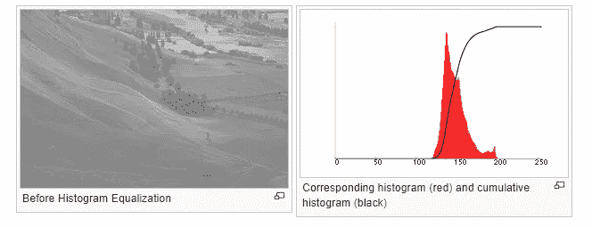
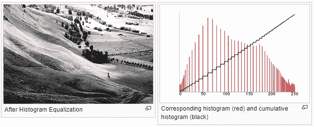
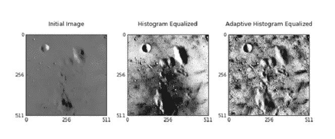
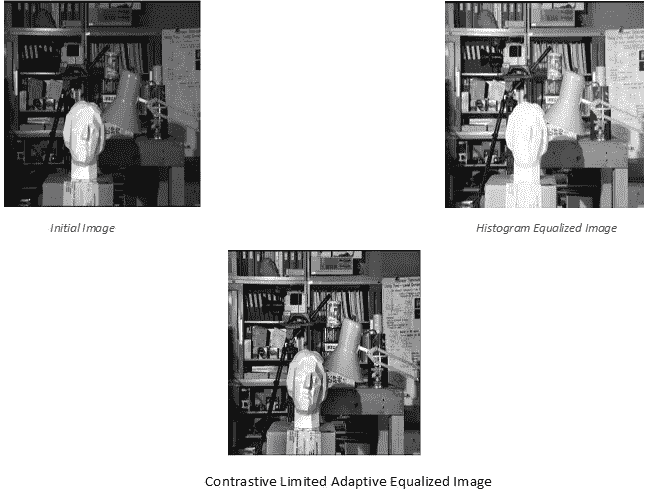
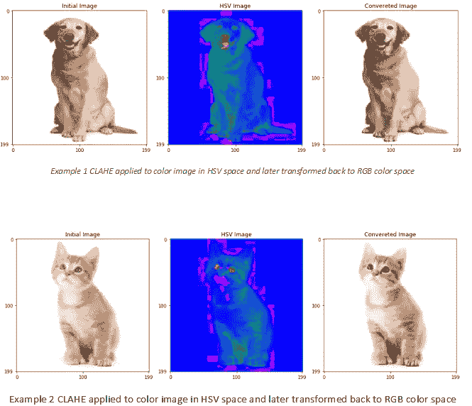

# 直方图均衡

> 原文：<https://towardsdatascience.com/histogram-equalization-5d1013626e64?source=collection_archive---------1----------------------->

图像对比度增强

# 柱状图

直方图是图像强度分布的图形表示。简而言之，它代表了所考虑的每个亮度值的像素数。

在上图中，X 轴代表色阶(左边为黑色，右边为白色)，Y 轴代表图像的像素数。这里，直方图显示了每个亮度级别(从黑到白)的像素数量，当像素越多时，特定亮度级别的峰值越高。

# 直方图均衡

直方图均衡化是一种用于提高图像对比度的计算机图像处理技术。它通过有效地扩展最频繁的强度值来实现这一点，即扩展图像的强度范围。当可用数据由相近的对比度值表示时，这种方法通常会提高图像的整体对比度。这允许较低局部对比度的区域获得较高的对比度。

图像的颜色直方图表示每种颜色分量中的像素数量。直方图均衡化不能单独应用于图像的红色、绿色和蓝色分量，因为它会导致图像的色彩平衡发生巨大变化。然而，如果图像首先被转换到另一个颜色空间，如 HSL/HSV 颜色空间，则该算法可以被应用到亮度或值通道，而不会导致图像的色调和饱和度的改变。

# 自适应直方图均衡

自适应直方图均衡化与普通直方图均衡化的不同之处在于，自适应方法计算几个直方图，每个直方图对应于图像的不同部分，并使用它们来重新分配图像的亮度值。因此，它适用于提高图像每个区域的局部对比度和增强边缘的清晰度。

# 对比有限自适应均衡

对比度受限 AHE (CLAHE)在对比度限制方面不同于自适应直方图均衡。在 CLAHE 的情况下，对比度限制过程被应用于从其导出变换函数的每个邻域。开发 CLAHE 是为了防止自适应直方图均衡化可能引起的噪声过度放大。

# 实验结果

源代码

[https://github . com/shree 6791/Deep-Learning/blob/master/CNN/Cats % 20 和%20Dogs/ca_do.py](https://github.com/shree6791/Deep-Learning/blob/master/CNN/Cats%20and%20Dogs/ca_do.py)