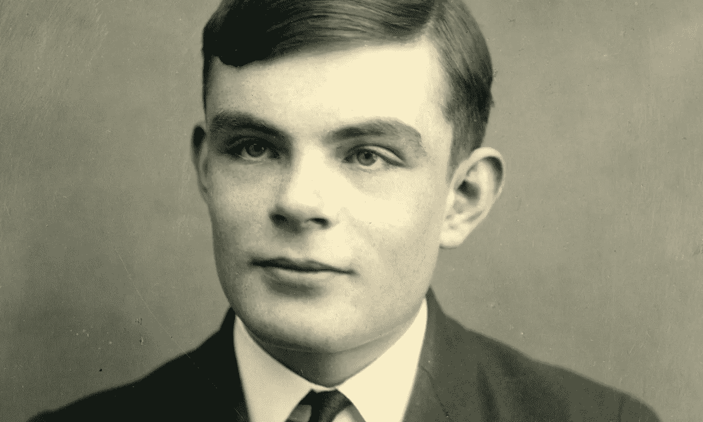
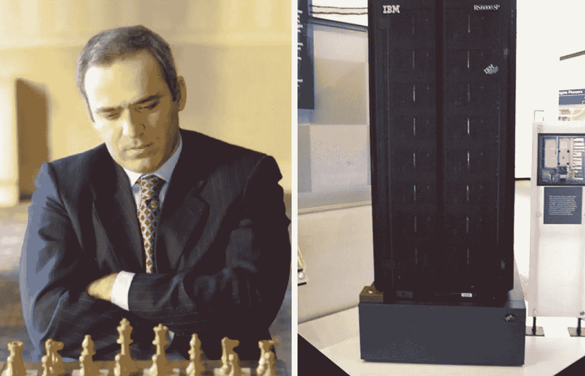

# 人工智能的历史

> 原文：<https://towardsdatascience.com/history-of-ai-484a86fc16ef?source=collection_archive---------1----------------------->

***早期***

第二次世界大战期间，著名的英国计算机科学家艾伦·图灵致力于破解德国军队用来安全发送信息的“谜”码。艾伦·图灵和他的团队创造了用于破译恩尼格玛密码的炸弹机器。

英格玛和庞贝机器奠定了机器学习的基础。根据图灵的说法，一台可以在人类不知道它是机器的情况下与人类交谈的机器将赢得“模仿游戏”，可以说是“智能的”。

Alan Turing in 1927.

1956 年，美国计算机科学家约翰·麦卡锡组织了达特茅斯会议，会上首次采用了“人工智能”一词。研究中心在美国各地涌现，探索人工智能的潜力。研究人员艾伦·纽厄尔和希尔伯特·西蒙在推动人工智能成为可以改变世界的计算机科学领域方面发挥了重要作用。

***认真对待人工智能研究***

1951 年，一台名为 Ferranti Mark 1 的机器成功地使用了一种算法来控制跳棋。随后，Newell 和 Simon 开发了通用问题求解算法来解决数学问题。同样在 50 年代，通常被称为人工智能之父的约翰·麦卡锡开发了 LISP 编程语言，这在机器学习中变得非常重要。

在 20 世纪 60 年代，研究人员强调开发算法来解决数学问题和几何定理。20 世纪 60 年代末，计算机科学家致力于机器视觉学习，并在机器人中开发机器学习。第一个“智能”人形机器人 WABOT-1 于 1972 年在日本制造。

***艾特斯***

然而，尽管几十年来这种资金充足的全球努力，计算机科学家发现在机器中创造智能非常困难。为了取得成功，人工智能应用(如视觉学习)需要处理大量数据。计算机还不够发达，无法处理如此大量的数据。政府和企业对人工智能失去了信心。

因此，从 20 世纪 70 年代中期到 90 年代中期，计算机科学家面临着人工智能研究资金的严重短缺。这些年被称为“人工智能冬天”。

***新千年，新机遇***

20 世纪 90 年代末，美国企业再次对人工智能产生了兴趣。日本政府公布了开发第五代计算机的计划，以推进机器学习。人工智能爱好者认为，很快计算机将能够像人一样进行对话、翻译语言、解释图片和推理。1997 年，IBM 的“深蓝”计算机成为第一台击败国际象棋世界冠军加里·卡斯帕罗夫的计算机。

Garry Kasparov & IBM’s Deep Blue.

21 世纪初互联网泡沫破裂时，一些人工智能资金枯竭了。然而，机器学习继续前进，这在很大程度上要归功于计算机硬件的改进。企业和政府在狭窄的领域成功地使用了机器学习方法。

计算机处理能力和存储能力的指数增长使得公司第一次能够存储大量的数据。在过去的 15 年里，亚马逊、谷歌、百度和其他公司利用机器学习获得了巨大的商业优势。除了处理用户数据以了解消费者行为，这些公司还继续致力于计算机视觉、自然语言处理和一系列其他人工智能应用。机器学习现在嵌入到我们使用的许多在线服务中。因此，今天，技术部门驱动着美国股市。

—

[沙恩雷](http://www.shaanray.com)

关注 [Lansaar Research](https://medium.com/lansaar) on Medium，了解最新的新兴技术和新的商业模式。