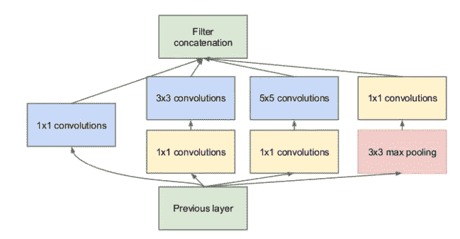
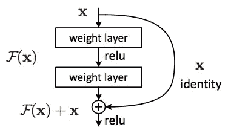
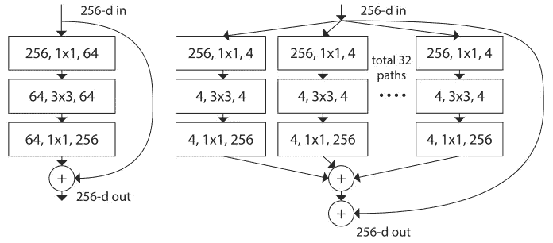
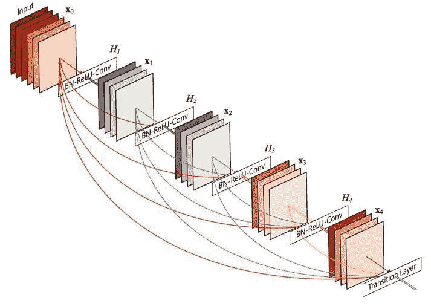
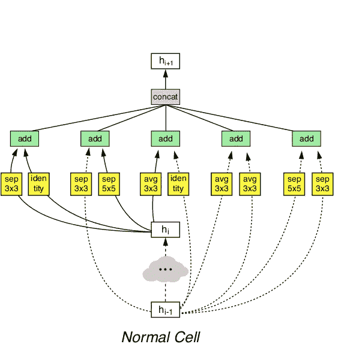
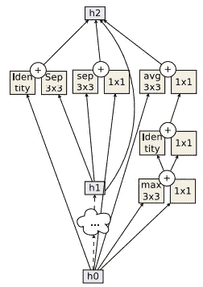

# 简单码中卷积块的历史

> 原文：<https://towardsdatascience.com/history-of-convolutional-blocks-in-simple-code-96a7ddceac0c?source=collection_archive---------6----------------------->


我尽量定期看 ML 和 AI 相关的论文。这是跟上最新发展的唯一方法。作为一名计算机科学家，我经常在阅读科学描述文本或公式的数学符号时碰壁。我发现用明码理解要容易得多。因此，在本文中，我想引导您浏览 Keras 中最近实现的架构中重要卷积模块的精选列表。

当你在 GitHub 上寻找流行架构的实现时，你会惊讶于它们包含了多少代码。包含足够数量的注释并使用额外的参数来增强模型是一个很好的实践，但同时这会分散对架构本质的注意力。为了进一步简化和缩短代码片段，我将使用一些别名函数:

```
def conv(x, f, k=3, s=1, p='same', d=1, a='relu'):
  return Conv2D(filters=f, kernel_size=k, strides=s, 
                padding=p, dilation_rate=d, activation=a)(x)def dense(x, f, a='relu'):
  return Dense(f, activation=a)(x)def maxpool(x, k=2, s=2, p='same'):
  return MaxPooling2D(pool_size=k, strides=s, padding=p)(x)def avgpool(x, k=2, s=2, p='same'):
  return AveragePooling2D(pool_size=k, strides=s, padding=p)(x)def gavgpool(x):
  return GlobalAveragePooling2D()(x)def sepconv(x, f, k=3, s=1, p='same', d=1, a='relu'):
  return SeparableConv2D(filters=f, kernel_size=k, strides=s, 
                padding=p, dilation_rate=d, activation=a)(x)
```

我发现去掉模板代码后，代码可读性更好了。当然，这只有在你理解了我的单字母缩写后才有效。让我们开始吧。

# 瓶颈块

卷积层的参数数量取决于内核大小、输入滤波器的数量和输出滤波器的数量。你的网络越宽，一个 3x3 的卷积就越贵。

```
def bottleneck(x, f=32, r=4):
  x = conv(x, f//r, k=1)
  x = conv(x, f//r, k=3)
  return conv(x, f, k=1)
```

瓶颈块背后的思想是使用廉价的 1x1 卷积以一定的速率 *r* 减少通道的数量，从而使下面的 3x3 卷积具有更少的参数。最后，我们通过另一个 1x1 卷积再次拓宽了网络。

# 初始模块

Inception 模块引入了并行使用不同操作并合并结果的思想。这样，网络可以学习不同类型的过滤器。

```
def naive_inception_module(x, f=32):
  a = conv(x, f, k=1)
  b = conv(x, f, k=3)
  c = conv(x, f, k=5)
  d = maxpool(x, k=3, s=1)
  return concatenate([a, b, c, d])
```

这里，我们将使用内核大小为 1、3 和 5 的卷积层与最大池层合并。这个片段展示了一个初始模块的简单实现。实际的实现将它与上面的瓶颈思想结合起来，这使得它稍微复杂一些。



Inception Module

```
def inception_module(x, f=32, r=4):
  a = conv(x, f, k=1)
  b = conv(x, f//3, k=1)
  b = conv(b, f, k=3)
  c = conv(x, f//r, k=1)
  c = conv(c, f, k=5)
  d = maxpool(x, k=3, s=1)
  d = conv(d, f, k=1)
  return concatenate([a, b, c, d])
```

# 残余块



ResNet 是由微软的研究人员推出的一种架构，它允许神经网络拥有任意多的层，同时仍然提高了模型的准确性。到现在为止，你可能已经习惯了，但在 ResNet 之前，情况并非如此。

```
def residual_block(x, f=32, r=4):
  m = conv(x, f//r, k=1)
  m = conv(m, f//r, k=3)
  m = conv(m, f, k=1)
  return add([x, m])
```

想法是将初始激活添加到卷积块的输出中。这样，网络可以通过学习过程决定输出中使用多少新卷积。注意，初始模块连接输出，而残差块将它们相加。

# ResNeXt 块

根据它的名字，你可以猜测 ResNeXt 和 ResNet 有密切的关系。作者将术语*基数*引入卷积块，作为宽度(信道数量)和深度(层数)的另一个维度。

基数是指一个块中出现的并行路径的数量。这听起来类似于以并行发生的 4 个操作为特征的 inception 块。然而，基数 4 将简单地使用相同的操作 4 次，而不是并行使用不同类型的操作。

如果它们做同样的事情，为什么要把它们放在一起呢？好问题。这个概念也被称为分组卷积，可以追溯到最初的 AlexNet 论文。虽然，当时它主要用于将训练过程分割到多个 GPU，而 ResNeXt 使用它们来提高参数效率。

```
def resnext_block(x, f=32, r=2, c=4):
  l = []
  for i in range(c):
    m = conv(x, f//(c*r), k=1)
    m = conv(m, f//(c*r), k=3)
    m = conv(m, f, k=1)
    l.append(m)
  m = add(l)
  return add([x, m])
```

这个想法是把所有的输入通道分成组。卷积将只在它们专用的通道组内起作用，而不是跨越所有的通道。人们发现，每一组将学习不同类型的功能，同时增加重量的效率。

想象一个瓶颈模块，首先使用压缩率 4 将 256 个输入通道减少到 64 个，然后将它们作为输出恢复到 256 个通道。如果我们想要引入基数 32 和压缩率 2，我们将使用 32 个 1x1 卷积层，每个并行 4 (256 / (32*2))个输出通道。之后，我们将使用 32 个 3×3 卷积层和 4 个输出通道，然后是 32 个 1×1 卷积层，每个卷积层有 256 个输出通道。最后一步包括添加这 32 条并行路径，在添加初始输入以创建剩余连接之前，为我们提供单个输出。



**Left**: ResNet Block — **Right**: RexNeXt Block of roughly the same parameter complexity

这需要消化很多东西。使用上面的图像来获得正在发生的事情的可视化表示，也许可以复制片段来自己在 Keras 中构建一个小网络。我复杂的描述可以用这简单的 9 行代码来概括，是不是很牛逼？

顺便说一下，如果基数等于通道的数量，我们将得到一个叫做*深度可分卷积*的东西。自从引入 Xception 体系结构以来，这种方法越来越受欢迎。

# 密集块



密集块是残差块的极端版本，其中每个卷积层获得块中所有先前卷积层的输出。首先，我们将输入激活添加到一个列表中，之后我们进入一个循环，该循环遍历一个块的深度。每个卷积输出也连接到列表，以便后续迭代获得越来越多的输入特征地图。这种方案一直持续到达到所需的深度。

```
def dense_block(x, f=32, d=5):
    l = x
    for i in range(d):
        x = conv(l, f)
        l = concatenate([l, x])
    return l
```

虽然需要几个月的研究才能得到一个和 DenseNet 一样好用的架构，但实际的构建模块可能就是这么简单。令人着迷。

# 挤压激励块

SENet 在短时间内是 ImageNet 上最先进的技术。它建立在 ResNext 之上，专注于对网络的信道信息进行建模。在常规卷积层中，对于点积计算中的加法操作，每个信道将具有相同的权重。


Squeeze- and Excitation Module

SENet 推出了一个非常简单的模块，可以添加到任何现有的架构中。它创建了一个微小的神经网络，学习如何根据输入对每个过滤器进行加权。如您所见，它本身不是卷积块，但因为它可以添加到任何卷积块中，并可能提高其性能，所以我想将其添加到组合中。

```
def se_block(x, f, rate=16):
    m = gavgpool(x)
    m = dense(m, f // rate)
    m = dense(m, f, a='sigmoid')
    return multiply([x, m])
```

每个通道被压缩成一个单一的值，并送入一个两层的神经网络。根据频道分布，该网络将学习根据频道的重要性对其进行加权。最后，这个权重与卷积激活相乘。

SENets 引入了微小的计算开销，同时潜在地改进了任何卷积模型。在我看来，这个街区没有得到应有的重视。

# 纳斯内特正常细胞

这就是事情变得有点糟糕的地方。我们正在离开人们提出简单而有效的设计决策的空间，进入一个设计神经网络架构的算法世界。NASNet 在设计上令人难以置信，但实际架构相对复杂。我们所知道的是，它在 ImageNet 上工作得非常好。



作者手动定义了不同类型的卷积层和池层的搜索空间，每个层都有不同的可能设置。他们还定义了这些层如何并行、顺序排列，以及如何添加或连接。一旦定义了这一点，他们就建立了一个基于递归神经网络的强化学习(RL)算法，如果特定的设计提案在 CIFAR-10 数据集上表现良好，就会得到奖励。

最终的架构不仅在 CIFAR-10 上运行良好，还在 ImageNet 上实现了最先进的结果。NASNet 由一个正常细胞和一个还原细胞组成，它们一个接一个重复出现。

```
def normal_cell(x1, x2, f=32):
    a1 = sepconv(x1, f, k=3)
    a2 = sepconv(x1, f, k=5)
    a = add([a1, a2])
    b1 = avgpool(x1, k=3, s=1)
    b2 = avgpool(x1, k=3, s=1)
    b = add([b1, b2])
    c2 = avgpool(x2, k=3, s=1)
    c = add([x1, c2])
    d1 = sepconv(x2, f, k=5)
    d2 = sepconv(x1, f, k=3)
    d = add([d1, d2])
    e2 = sepconv(x2, f, k=3)
    e = add([x2, e2])
    return concatenate([a, b, c, d, e])
```

这就是你如何在 Keras 中实现一个普通的单元。除了这种图层和设置的完美结合之外，没有什么新的东西。

# 反向剩余块

到现在为止，你已经听说过瓶颈块和可分卷积。让我们把它们放在一起。如果你运行一些测试，你会注意到，因为可分卷积已经减少了参数的数量，压缩它们可能会损害而不是提高性能。


作者提出了这样一个想法，即实际上做与瓶颈剩余块相反的事情。他们使用廉价的 1×1 卷积来增加通道的数量，因为下面的可分离卷积层已经大大减少了参数的数量。它在添加到初始激活之前关闭通道。

```
def inv_residual_block(x, f=32, r=4):
  m = conv(x, f*r, k=1)
  m = sepconv(m, f, a='linear')
  return add([m, x])
```

这个难题的最后一部分是可分离卷积后没有激活函数。相反，它被直接添加到输入中。这种模块在应用于架构中时非常有效。

# 阿米巴网正常细胞



Normal Cell of AmoebaNet

有了 AmoebaNet，我们可以了解 ImageNet 的当前技术水平，也可能了解一般的图像识别。像 NASNet 一样，它是由一种算法设计的，使用与以前相同的搜索空间。唯一不同的是，他们用一种通常被称为进化的遗传算法取代了强化学习算法。不过，深入研究其工作原理超出了本文的范围。故事的结尾是，通过进化，作者能够找到一个比 NASNet 计算成本更低的更好的解决方案。它在 ImageNet 上获得了 97.87%的前 5 名准确率，这是单一架构中的第一个。

查看代码，这个代码块没有添加任何您没有见过的新内容。你为什么不试着在图片的基础上实现新的正常单元，看看你是否能跟上。

# 结论

我希望这篇文章让您对重要的卷积块有了一个坚实的理解，并且实现它们可能比您想象的要容易。要更详细地了解这些体系结构，请查看它们各自的论文。你会注意到，一旦你掌握了一篇论文的核心思想，理解其余部分就容易多了。还请注意，实际的实现通常会将批处理规范化添加到组合中，并根据激活函数的应用位置而有所不同。欢迎在评论中提问。

PS:我在考虑用简单的代码创建一个包含所有这些块和架构的存储库。这对你们有些人有帮助吗？