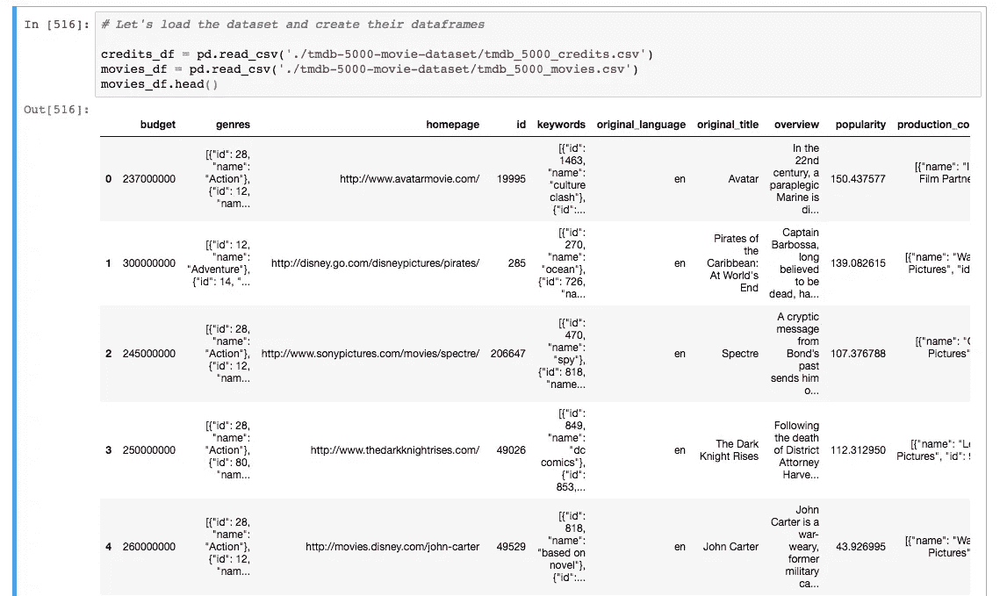
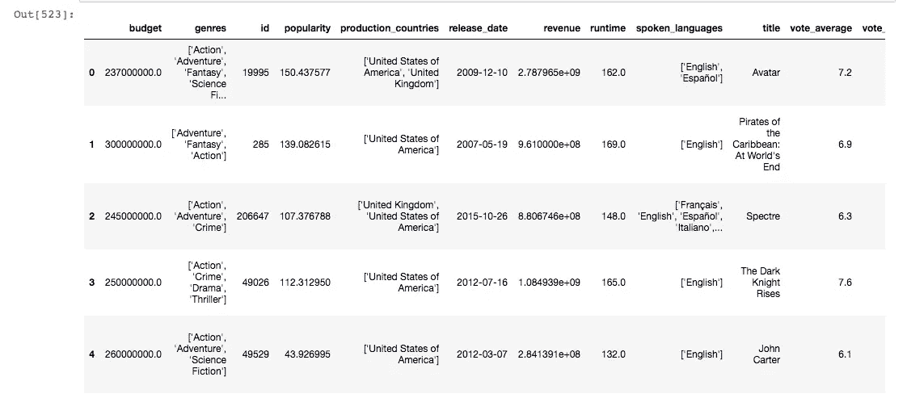
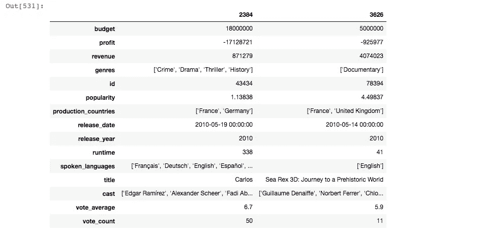
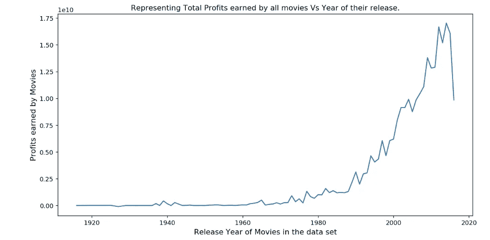

# 探索性数据分析指南

> 原文：<https://towardsdatascience.com/hitchhikers-guide-to-exploratory-data-analysis-6e8d896d3f7e?source=collection_archive---------3----------------------->

# 如何用 python 调查数据集？


*   “我如何在数据科学/机器学习/数据分析领域获得 kickstart？”
*   “当您拥有数据集时，我应该采取哪些初始步骤来建立与数据集的连接？”
*   "在探索性分析过程中，如何定义一组针对数据集的问题？"

如果你正在寻找上述任何一个问题的答案，那么这个博客系列将真正帮助你开始。

那么，什么是探索性数据分析(EDA)？

探索性数据分析(EDA)是数据科学的一个重要组成部分，它允许您开发您的数据看起来像什么以及它们可能回答什么样的问题的要点。

最终，EDA 是重要的，因为它允许研究者做出重要的决定，什么是有趣的，什么可能不值得继续，从而利用变量之间的关系建立一个假设。

# 一点背景知识

这是一个由两部分组成的系列，我们将查看来自 Kaggle 的电影数据集，并对数据进行一些探索性分析。

我们将在本教程中使用 python。我建议您在继续阅读之前先复习一下 python 基础知识。我将向您介绍我在数据集上执行 EDA 的步骤。

TMDB 电影数据集可以在[这里](https://www.kaggle.com/tmdb/tmdb-movie-metadata/)找到。收集数据有不同的方法，我们将在另一篇文章中讨论。作为一名数据分析师，我的工作是能够提出一系列问题，解读字里行间的含义，并找到这些问题的答案。

我把它分成了三个部分

1.  **清洗:**检查收集到的数据是否有问题，比如缺失数据或测量错误、列的数据类型等。)
2.  **定义问题**:识别特别有趣或意想不到的变量之间的关系。
3.  使用有效的可视化方式来传达我的结果(将在第[第二部分](/hitchhikers-guide-to-exploratory-data-analysis-part-2-36ab72201e1d)中介绍)

我用过 [jupyter 笔记本](http://jupyter.org/)，因为我发现它们最适合数据清理、转换、数值模拟和数据可视化。Jupyter Notebook 的另一个优势是，您可以使用用于建模和可视化数据集的 Jupyter 笔记本，并将其用作技术演示的幻灯片。

这篇文章的代码可以在我的 Github 上找到:

[](https://github.com/harshitcodes/tmdb_movie_data_analysis) [## harshi codes/tmdb _ movie _ data _ analysis

### 探索性数据分析开始挖掘这些问题，包括剧情、演员、剧组、预算和…

github.com](https://github.com/harshitcodes/tmdb_movie_data_analysis) 

第一步是创建一个虚拟环境，您将在其中安装所有的软件包。下面是使用 pip 为我们安装 4 个包的命令。

```
pip install numpy pandas seaborn matplotlib
```

1.  Numpy:用 Python 进行科学计算的基础包。
2.  [Pandas](https://pandas.pydata.org/) :为 [Python](https://www.python.org/) 编程语言提供高性能、易于使用的数据结构和数据分析工具的库。
3.  Matplotlib :一个 Python 2D 绘图库，它以多种硬拷贝格式和跨平台的交互环境生成出版物质量数字。
4.  [Seaborn](https://seaborn.pydata.org/index.html) :基于 [matplotlib](https://matplotlib.org/) 的 Python 数据可视化库。它提供了一个高层次的界面来绘制有吸引力的和信息丰富的统计图形。

导入你需要清理、压缩和可视化的 python 包。我已经导入了包，第二部分(作为 **pd** )只是为了方便，这样我就不用写“ **pandas** ”。命令“每次我用它的时候。

从路径加载数据:

这里，我使用了 pandas 的 read_csv 函数，该函数返回一个快速有效的 **DataFrame** 对象，用于集成索引的数据操作。我有两个来自 **movies_df** 和 **credits_df 的数据帧。**

**movies_df.head()** 将显示数据帧的前 5 行。您可以将想要查看的行数传递给 head 方法。看看我们得到的数据框架:



在我们开始寻找这些数据中隐藏的答案之前，我们必须清理数据，为分析做准备。

# **#1 数据清理过程**

**数据清理**是整个**数据**准备过程的第一步，也是非常关键的一步，是对杂乱的、原始的**数据**进行分析、识别和修正的过程。当分析组织**数据**以做出战略决策时，你必须从彻底的**数据清理**过程开始。

1.  我们需要删除未使用的列，如 id，imdb_id，vote_count，production_company，keywords，homepage 等。从实际相关且简明的数据中做出决策总是更容易。
    以下是从数据帧中删除冗余列的方法:

2.移除行中的副本(如果有):

3.数据库中的一些电影具有零预算或零收入，这意味着它们的价值没有被记录或一些信息丢失。我们将从数据帧中丢弃这些条目:

4.为了方便地操作这些列，使用 python 对象是很重要的。将发布日期列转换为日期格式，并从日期中提取年份，这将有助于我们分析年度数据。

5.类似地，使用 numpy 的 int64 方法将预算和收入列的格式更改为整数。

6.在检查数据集时，我们看到**流派、关键词、生产公司、生产国家、口语**都是 JSON 格式，这将在操作数据帧时生成。现在让我们将这些列展平成一种易于解释的格式。

我们将把它们转换成字符串，然后再转换成列表。编写一个通用函数来解析 JSON 列。

清理后，数据如下所示:



# **#2** 确定变量/特征之间的关系

这里的主要目标是识别和建立可以帮助你建立假设的关系。我们必须定义一些能帮助我们建立一些关系的问题。

此时，我在研究这个数据集时产生了以下问题。您可能会提出一系列不同的问题，这些问题没有在下面列出:

1.  哪 5 部电影最贵？两个极端之间的比较？探索最昂贵的电影，它可以告诉你，根据它们的性能和产生的收入，它们是否值得花在它们身上的钱。

2.由于我们需要比较 3 个问题中的最小值和最大值，我们可以编写一个通用函数来完成这项工作，并重用它。

2.最赚钱的 5 部电影？最小利润和最大利润的比较。这种比较有助于我们识别失败和成功的不同方法。如果我从产生的收入中减去预算，它将给出我获得的利润。

3.大多数人谈论电影。

4.电影平均播放时间？两个极端之间的比较。



5.分级在 7 级以上的电影

6.我们哪一年的电影最赚钱？
这将有助于你提出一些更深层次的问题，比如电影在哪些年份表现不佳，在哪些年份表现良好。这些都是初步的问题，这些问题引出了提供更深层次见解的问题。

让我们看看这些年来盈利电影的传播情况



为了找出盈利电影数量最多的年份，我们使用了 idxmax 方法:

这会给我们 2014 年。你可以在 Ipython 笔记本[这里](https://github.com/harshitcodes/tmdb_movie_data_analysis/blob/master/tmdb_data_analysis.ipynb)查看这些代码片段的所有输出。

现在，我们已经分析了这个数据集包含的内容，是时候尝试构建一个可以根据所选的特征/变量预测电影成功率的故事了。因此，我们需要确定使电影盈利的因素。

以下是一系列问题，可以引导我们朝着理想的方向前进

1.  最成功的类型——柱状图解释了每种类型电影的出现频率。
2.  电影中的常见演员——显示每个演员的电影谱的图。
3.  盈利电影的平均预算——分配的平均预算是多少
4.  最赚钱电影的平均时长。
5.  最赚钱电影的语言。

以上所有问题的答案将帮助我们建立我们的假设，即 ***“制作一部卖座、赚钱的电影的秘诀是什么？”***

在[的下一篇文章](/hitchhikers-guide-to-exploratory-data-analysis-part-2-36ab72201e1d)中，我将讨论如何利用 Matplotlib 和 seaborn 库**来可视化(此过程中的第三步)**上述问题的答案。

我们将在下一部分(下面的链接)用所有的发现和想象来结束调查。

[](/hitchhikers-guide-to-exploratory-data-analysis-part-2-36ab72201e1d) [## 探索性数据分析指南(下)

### 如何使用 Python 调查数据集？学习如何使用可视化来回答一些重要的问题。

towardsdatascience.com](/hitchhikers-guide-to-exploratory-data-analysis-part-2-36ab72201e1d) 

# Harshit 的数据科学

通过 Harshit 的数据科学频道，我计划推出几个涵盖整个数据科学领域的系列。以下是你应该订阅[频道](https://www.youtube.com/channel/UCH-xwLTKQaABNs2QmGxK2bQ)的原因:

*   该系列将涵盖每个主题和副主题的所有必需/要求的高质量教程。
*   解释了为什么我们在 ML 和深度学习中做这些事情的数学和推导。
*   与谷歌、微软、亚马逊等公司的数据科学家和工程师以及大数据驱动型公司的首席执行官的播客。
*   项目和说明，以实现迄今为止所学的主题。

你可以在 [LinkedIn](https://www.linkedin.com/in/tyagiharshit/) 、 [Twitter](https://twitter.com/tyagi_harshit24) 或 [Instagram](https://www.instagram.com/upgradewithharshit/?hl=en) 上与我联系(在那里我谈论健康和福祉。)

注意:在这些黑暗的时期，自我隔离为自我提升腾出了一些空间，我们可以利用这些空间来发展新的技能、爱好，并帮助未来的自己。