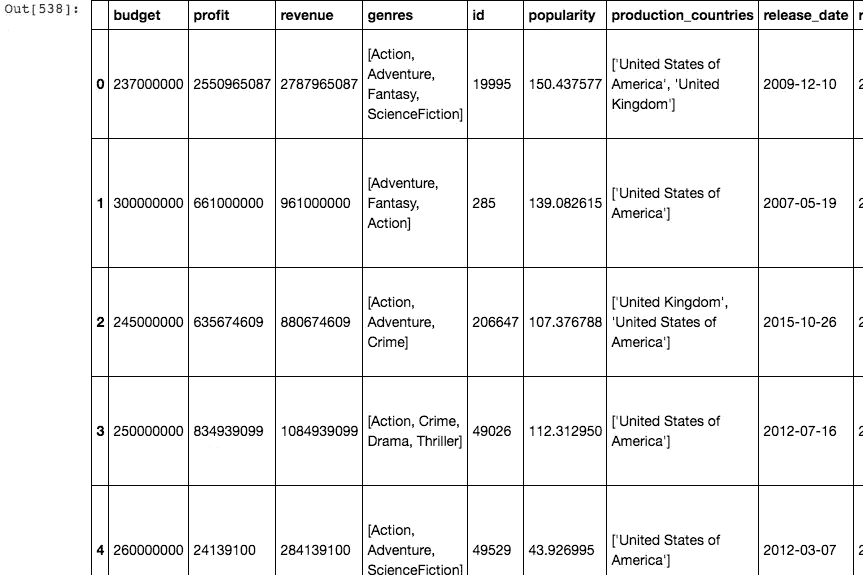
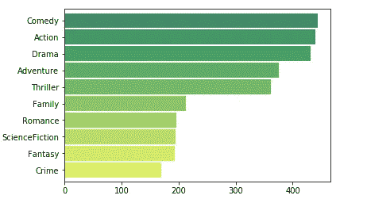
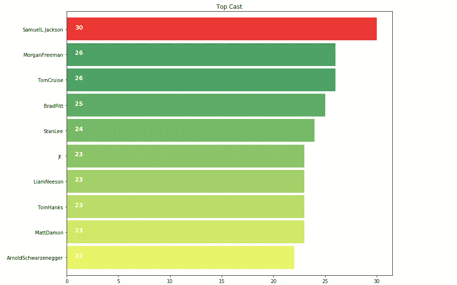
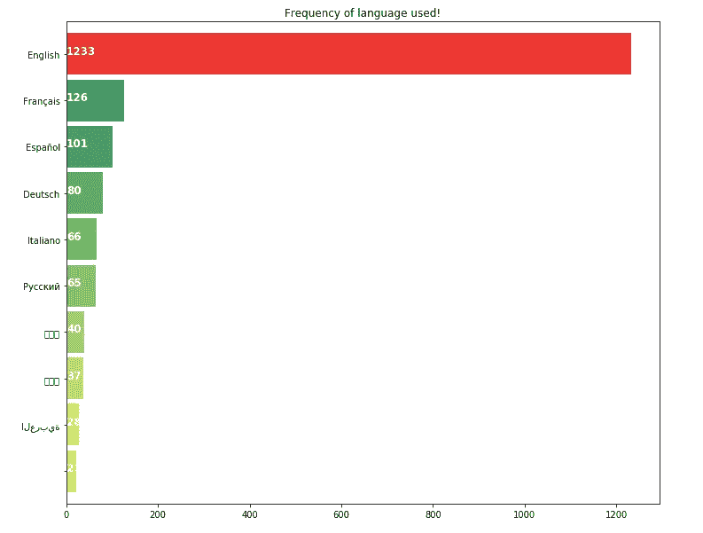

# 探索性数据分析指南(下)

> 原文：<https://towardsdatascience.com/hitchhikers-guide-to-exploratory-data-analysis-part-2-36ab72201e1d?source=collection_archive---------12----------------------->

如果您已经到达这里，我相信您已经完成了我们讨论过的[第 1 部分](/hitchhikers-guide-to-exploratory-data-analysis-6e8d896d3f7e)

1.  数据清理过程
2.  确定变量之间的关系，并在数据集上定义探索性问题

从我们离开的地方继续，我们现在开始学习可视化如何帮助我们理解数据帧中的数字和模式。我们将使用 Matplotlib——据我和业内一些最好的数据科学家所说，这是最好的 Python 数据可视化库。

重温我们需要回答的问题，

1.  最成功的流派。
2.  电影中频繁的演员阵容。
3.  盈利电影的平均预算。
4.  最赚钱电影的平均时长。
5.  所有盈利电影中使用的语言范围。

深入思考这些问题，你会发现我们需要所有盈利电影的清单。我们现在必须把研究范围缩小到赚钱的电影。这将有助于我们分析什么样的成分组合能产生一部轰动一时的电影。

我想到的下一个问题是，我们如何决定一部电影是否盈利？为此，我选择了一个随机的(但合理的)5000 万美元的利润数字，这是任何电影在盈利电影桶中占有一席之地的标准。

我是这样操纵电影的 _df:

我得到了利润数据框架，它包含了所有利润≥5000 万美元的电影。

来到**问题#1**

我们在利润数据帧的类型列中有类型列表，我们必须格式化这些字符串，这样我们就可以很容易地得到所有盈利电影中每个类型的数量:

流派栏现在看起来像这样

我们打算绘制一个条形图，帮助我们了解每种类型的电影在盈利电影中的成功之处，并对它们进行排名。

在我们开始绘制图表之前，我们需要了解一些事情。

Subplots: Matplotlib 有 Subplots 的概念，subplots 是一组较小的轴，它们可以一起存在于单个图形中。这些可以是插图、网格图或其他更复杂的布局。

[Seaborn](https://seaborn.pydata.org/introduction.html#introduction) :基于 Matplotlib 用 python 编写的数据可视化库。重点是统计图表。该库是可视化[单变量](https://seaborn.pydata.org/examples/distplot_options.html#distplot-options)和[双变量](https://seaborn.pydata.org/examples/joint_kde.html#joint-kde)和分布图的良好资源，但 seaborn 有助于构建[多图网格](https://seaborn.pydata.org/examples/faceted_histogram.html#faceted-histogram)，让您轻松构建[复杂的](https://seaborn.pydata.org/examples/pair_grid_with_kde.html#pair-grid-with-kde)可视化。

我们在这里的问题是绘制出每种类型在所有盈利电影中的出现频率。我已经创建了一个熊猫系列，我可以使用 plot.barh()方法绘制它，下面是我是如何做到的:

我创建了一个列表，所有的流派都从“流派”列添加到这个特定的列表中，并扩展了列表 1。然后，我创建了一个系列，在这个系列上我使用了 value_counts()方法，该方法返回一个系列，其中包含每个流派的计数，如上面的要点所示。绘制这个数列给我们一个这样的柱状图

多田…！

从上面的柱状图我们可以看出，喜剧是所有盈利电影中最常见的类型。如果你想在好莱坞或其他电影行业赚点钱，这可以告诉你应该选择哪种类型。

**问题 2**

在类似的行中，我们能够得到盈利电影中最常见演员的类似情节，如下所示:

看看酒吧情节，塞缪尔·杰克逊是大多数电影成功背后的支柱。

**问题 3**

同样，我们有每种语言在盈利电影中的使用频率。

正如我们所料，英语是世界上最通用的语言。这很容易，但我们有证据。

除了这些可视化，我们还有其他非常有趣的情节要看。如果你有兴趣了解更多关于这些情节和设计模式所传达的信息，你可以浏览下面的链接。这将帮助你选择最恰当的方式来传达你的发现。

 [## 选择一个好的图表

### 这里有一些我们想出来的帮助你考虑使用哪个图表。它的灵感来自《基因》中的表格…

extremepresentation.typepad.com](http://extremepresentation.typepad.com/blog/2006/09/choosing_a_good.html) 

我们需要一些平均值(如问题 4、5 和 6 中所要求的)来总结我们的研究并阐明我们的假设。使用均值函数计算:

1.  平均运行时间
2.  平均收益
3.  平均预算

一旦你有了这个，你就能建立你的假设，在我们的例子中如下:

> 这是一项非常有趣的数据分析。我们得出了一些关于电影的非常有趣的事实。经过这一分析，我们可以得出以下结论:
> 
> *对于制片人来说，一部电影要想盈利:*
> 
> ***平均预算必须在 6300 万美元左右电影平均时长必须在 114 分钟以上其中任何一位应在演员阵容:塞缪尔·杰克森，罗伯特·德·内罗，摩根·弗里曼，布鲁斯·威利斯类型必须是:动作片，冒险片，惊悚片，喜剧片，剧情片。通过这样做，这部电影可能会成为热门电影之一，因此平均收入约为 2.62 亿美元。***

因此，在研究了 TMDB 数据集后，我们得出了以下结论。

PS:我希望这一系列的帖子能帮助你开始用你有的其他一些有趣的数据集进行探索性的数据分析。如果您对上述任何内容有任何问题/意见/想法，请在下面发表评论。