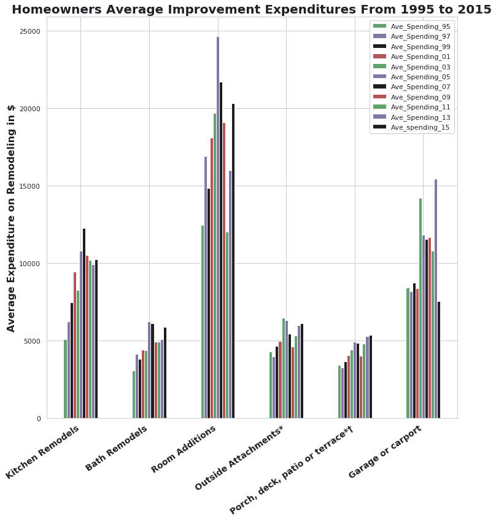
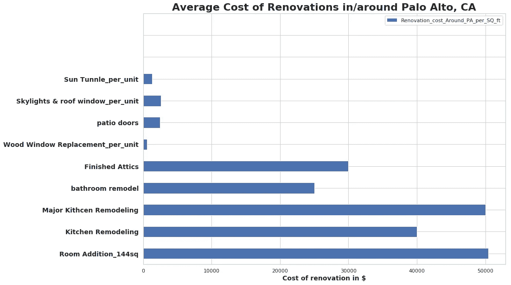
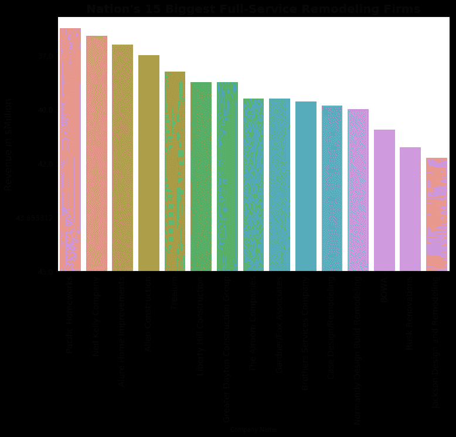
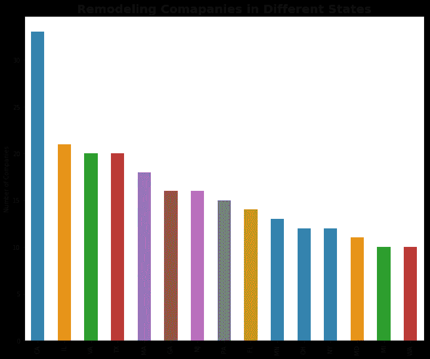
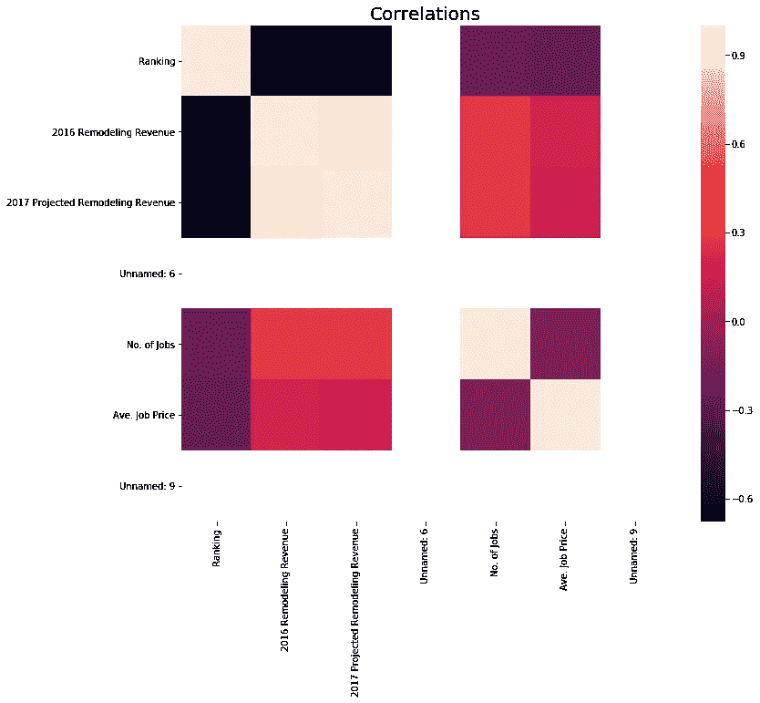
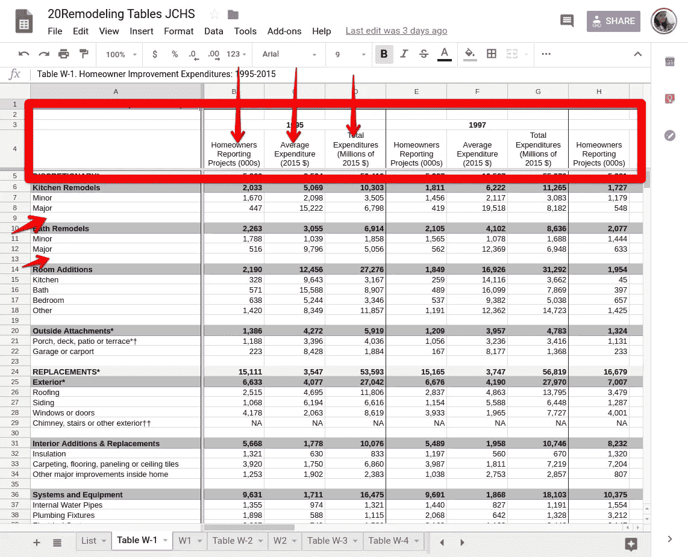
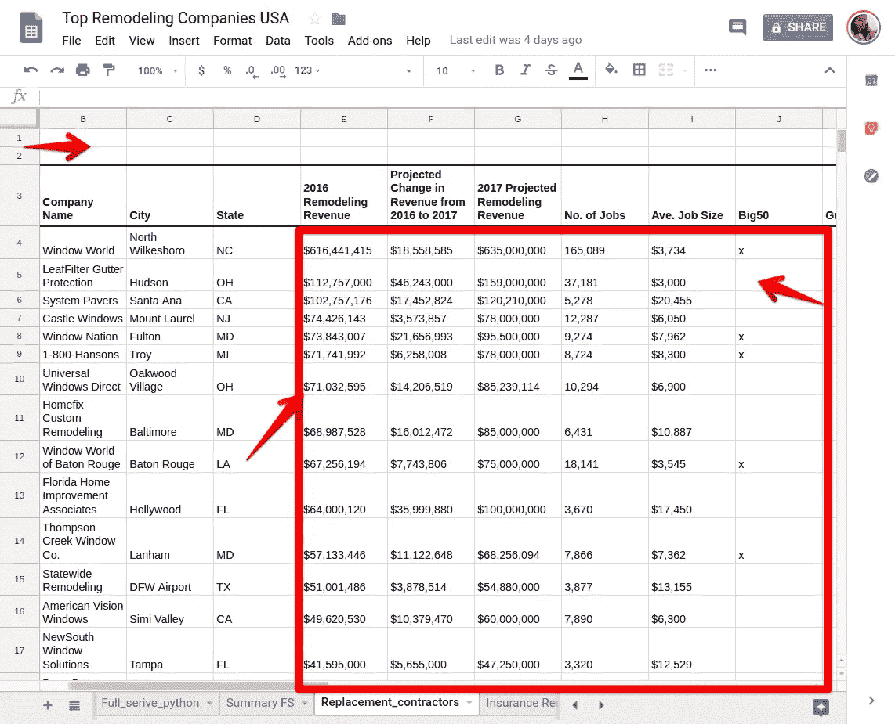
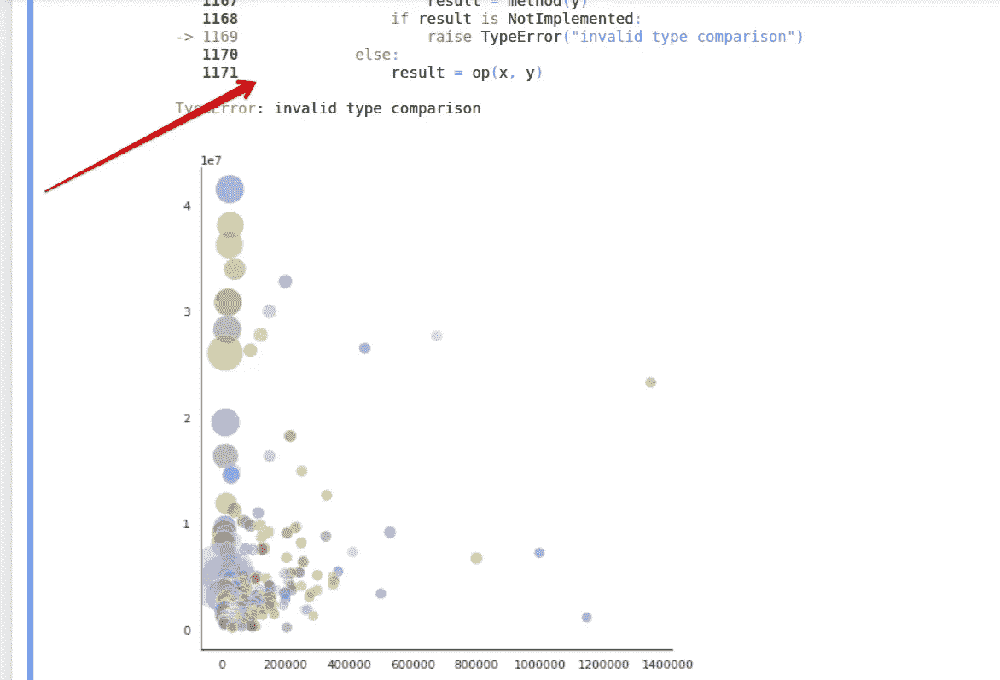

# 房屋改造分析转变为 Python 中的 Excel 数据处理

> 原文：<https://towardsdatascience.com/home-remodeling-analysis-turned-excel-data-handling-in-python-e1115f8302e4?source=collection_archive---------25----------------------->

## 为什么清理数据是最重要的步骤

**原始项目任务**:寻找有趣的见解，了解改造市场的发展方向

**项目任务(Twist):** 如何用 Python 处理修剪良好的 excel 数据(剧透:整齐是骗人的词)

**时间线**:一周(我告诉你，如果你像我一样是 DS 新手，一周**是不够的**

**针对最初目标**的项目调查结果:

*   这些数字看起来很稳定，只是在优先级上有所调整
*   加州帕洛阿尔托的平均成本远高于全国平均水平
*   最大的全方位服务改造公司所在的州

**关于数据处理的发现:**熊猫(Python)有解决方案，生活还没绝望！

**数据**:探索不同来源的公开可用数据——哈佛大学[联合住房研究中心](http://www.jchs.harvard.edu/research-areas/reports/demographic-change-and-remodeling-outlook)、[重塑杂志](https://www.remodeling.hw.net/benchmarks/remodeling-550/the-2017-remodeling-550-list_o?bwts=1544475223)，并从 [Hinkle 建筑公司](http://hinkle-construction.com/project-costs/)的网页上获取加州帕洛阿尔托及其周边地区的平均项目成本。

**方法**:Python——主要使用 Pandas、Matplotlib、Seaborn 进行数据角力、基础统计和可视化。

这篇文章的顺序将是首先谈论我们从家庭改造数据中得到的结果。稍后，我们也将经历数据清理的斗争。

下图显示了不同类别的家庭装修的全国平均支出。数据显示,“客房增加”是最受欢迎的类别。在过去的 15 年中，这一类别的支出在 2005 年达到顶峰，平均支出约为 2.5 万美元。最低点是在 2011 年，支出降至 1.2 万美元以下。自那以后，市场似乎正在复苏。从 1995 年到 2005 年，房主在房屋扩建上的支出在 20 年内增长了 62%以上。另一个相对较大的变化是厨房改造，支出从 1995 年到 2015 年翻了一番，并在 2007 年达到顶峰。

Source: [Joint Center for Housing Studies at Harvard](http://www.jchs.harvard.edu/research-areas/reports/demographic-change-and-remodeling-outlook)

当我得到上述结果时，我很想知道在我居住的地方，房主的平均支出。考虑到时间限制，我找不到与上图直接可比的数据，只能找到我们地区这些项目的平均值。

下面的条形图描绘了加利福尼亚州帕洛阿尔托市内及周边不同类型的房屋装修的平均成本。费用明显高于全国平均水平。增加一个 144 平方英尺的新房间，花费超过 5 万美元。主要的厨房改造也同样昂贵，为 5 万美元。

Source: [Hinkle Construction Inc](http://hinkle-construction.com/project-costs/)’ website

对于前两个图，如果感兴趣，请检查所附的 python 文件。

我不得不找出谁是装修行业最大的玩家。《重塑杂志》在这一领域进行了深入的研究。该杂志的重塑 550 部门收集数据，并根据前几年的收入宣布重塑业务的获胜者。用他们自己的话说:“*2017*[*重塑 550*](https://www.remodeling.hw.net/benchmarks/remodeling-550/) *有四个列表，每个列表都在下面的一个标签中显示，并显示全方位服务的重塑者、替代承包商、保险修复公司和特许经销商中的谁是谁。公司排名基于其 2016 年改造产生的收入；不按公司毛收入*。

我只调查了 2017 年的全服务公司。该排名基于 2016 年的收入(2018 年的榜单要到 2019 年 5 月才会公布)。

该条形图显示了全国重塑业务中最突出的 15 家公司(总共 340 家)。

Source: [Remodeling magazine](https://www.remodeling.hw.net/benchmarks/remodeling-550/the-2017-remodeling-550-list_o?bwts=1544475223)

不出所料，这些公司中有相当一部分位于加州。

Source: [Remodeling magazine](https://www.remodeling.hw.net/benchmarks/remodeling-550/the-2017-remodeling-550-list_o?bwts=1544475223)

最后的情节只是为了好玩。我运行了一个相关矩阵，以了解收入、排名和其他变量之间的相互关系。阴影显示相关系数的强度。比如:排名(' # ')和营收高度负相关。不要在这里混淆。我们都知道排名是如何工作的:数字越低，排名越好(1 是最好的)。所以，收入越高，数字越低(比如 1)，意味着排名越高。

以下是我在 Jupyter 笔记本上为以上情节所做的工作。

现在，让我们像承诺的那样谈谈数据争论/清理斗争部分。我为这个项目收集的数据的一些背景:

*   我下载了比我实际需要/可以及时处理的多得多的数据
*   我认为更多的数据总是意味着更好的结果
*   excel 中漂亮、整洁的数据意味着 Pandas/Python 中更少的清理。不对！第一个错误。
*   我的数据分布在 4 个不同文件的 26 个 Excel 表格中(我不是开玩笑)

**整洁的 Excel 表格中的问题:**这些是我遇到过的问题，所以要小心，可能还有更多我还没有遇到的问题。

Impressively neat excel data

*   空单元格:Excel 在让单元格为空时更灵活，但你的熊猫阅读功能不会喜欢它。它在嘲笑你，就像“告诉过你，现在就去对付南方人！”
*   页眉:excel 中干净的页眉在 Pandas 中不一定意味着什么。您检查实际的列名，不要惊讶实际的列名与 excel 标题中显示的有很大不同！更改列名。列数越多，工作量越大。
*   另一个类似的问题是，当除了第一列之外的所有列都有列名时(在 excel 中，如果是分类变量列，这仍然有意义)，但是在 Pandas framework 中对这样的列进行操作是一个问题。

*   啊！那些看起来整洁的数值！不要被骗了。你将不得不应付每一个。单身。号外。东西。你在这两个数字之间。可以是美元符号、逗号等等。熊猫把它看做一个物体，这是一个问题。你不可能用它达到任何统计/数学目标。你必须把它转换成 int/float 才能使用。

**我从这个项目中学到了什么:**

*   想想时间线，不要有额外的野心。选择一个可行的数据集。与其选择多个数据集，不如选择一个，想想有多少种方法可以操纵/分析它。
*   围绕项目可交付成果对工作进行优先级排序。当你陷入我这种有很多零碎数据的情况时，重新安排你的目标的优先次序，遵循倒金字塔原则:先做最重要的工作。
*   您不必总是将 excel 文件转换为. csv。有一种更简单的方法可以直接导入所需的工作表。它只需要一个工作路径名。
*   求助。作为 Python 的初学者，我比我希望的更经常地挣扎。但是向你的同事/导师/经理寻求帮助可能会给你提供有价值的见解和针对单一问题的多种解决方案。
*   当你遇到困难时，在 excel 中解决问题比花时间在 Python 中解决问题更容易。但是，我告诉你，在熊猫身上，不付出并以正确的方式得到回报是值得的。
*   您需要知道什么样的可视化适合您的数据。Python 中有很酷的可视化库，但是没有一个很酷的图形适用于您的数据，这没关系。当看到大错误时，不要忽视它。

在上图中，我试图描绘出所有 340 家重塑公司，它们的收入，工作数量和平均工作价格。这是无效的比较类型。尊重错误，深入挖掘，才知道什么样的图更适合你的数据表示。简单并不意味着坏，因为花哨并不总是意味着更好(好吧，可能是葡萄酸在这种情况下，因为我不能得到一个花哨的情节，但我说的是真的)。

对我来说，第一个项目是一个很大的学习曲线。但在培训中，我成为了一名更强大、准备更充分的数据科学家，再也不会以同样的眼光看待 excel 数据表了。:-)