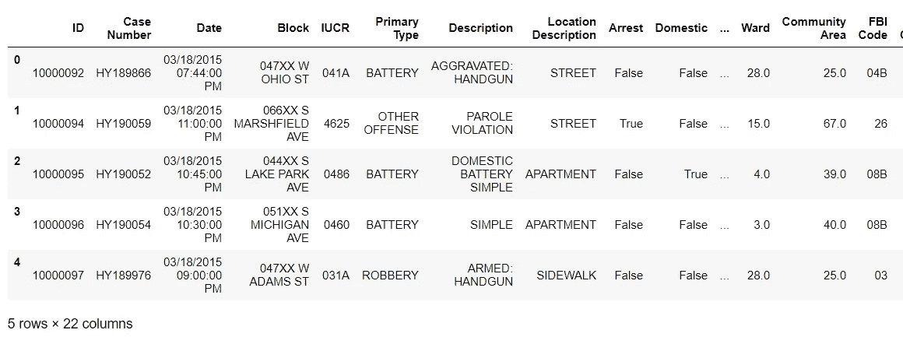
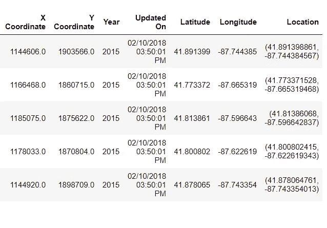
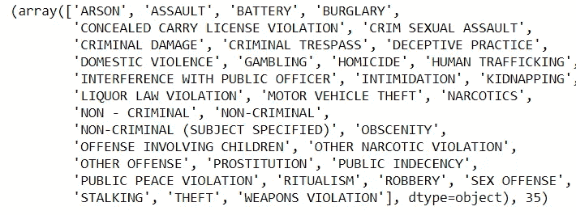
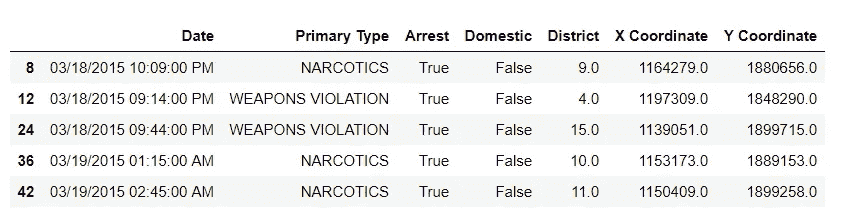
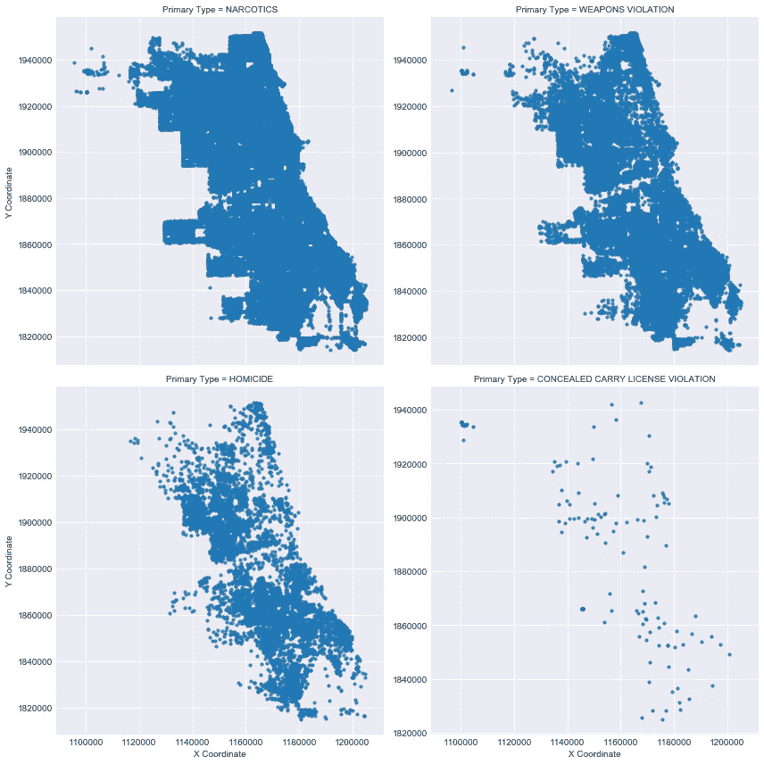
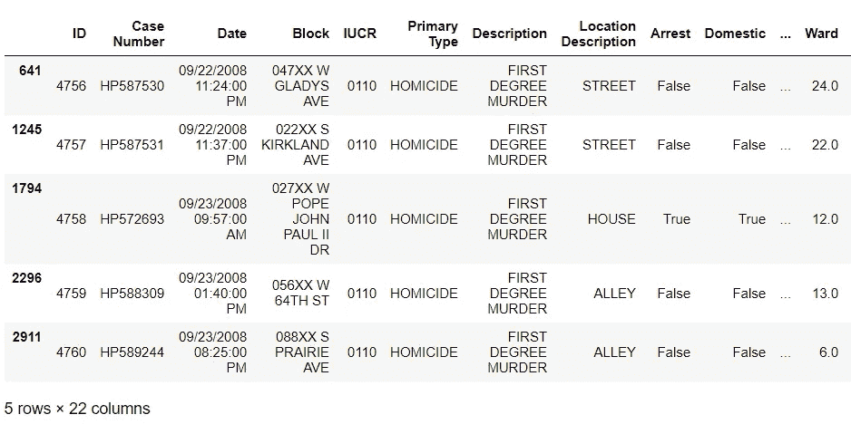
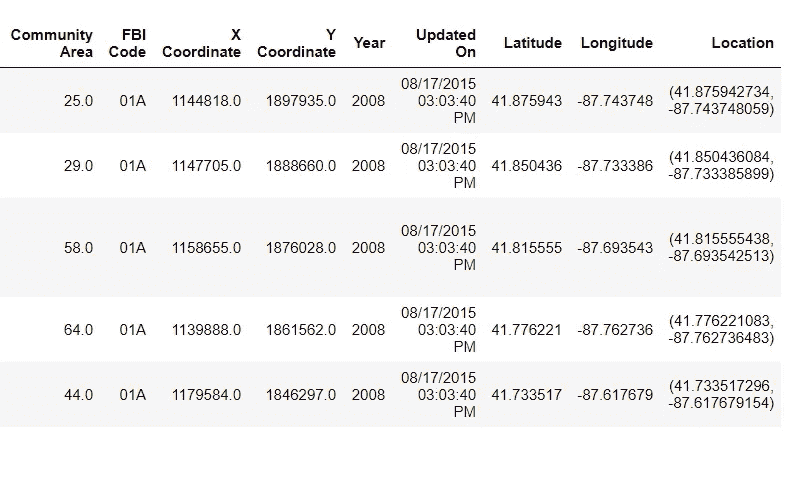
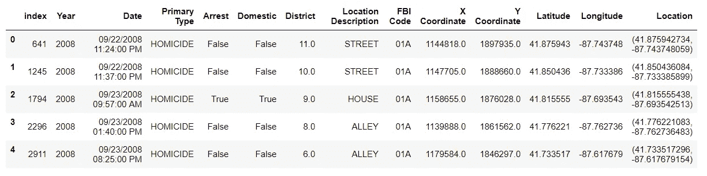
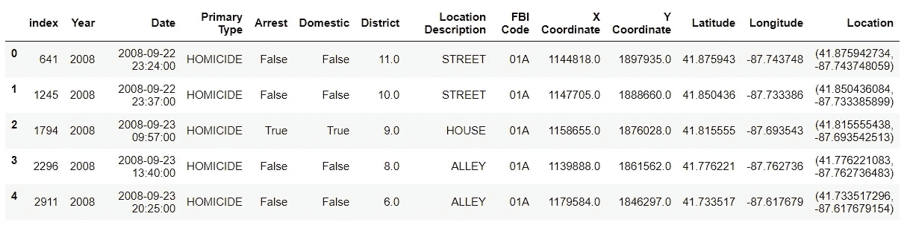
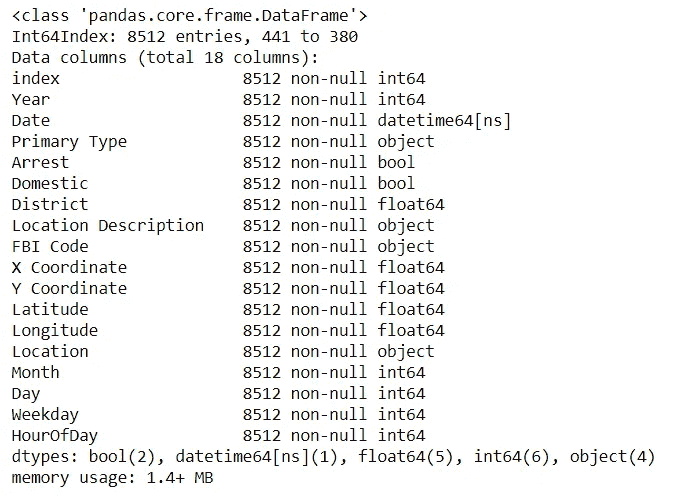

# 芝加哥凶杀案:数据故事第一部分

> 原文：<https://towardsdatascience.com/homicide-in-chicago-data-storytelling-part-one-e6fbd77afc07?source=collection_archive---------12----------------------->


## 数据清理

在过去的几年里，芝加哥经常出现在新闻中，尤其是因为最近枪支暴力导致的谋杀案激增。作为芝加哥的居民，我知道这些枪击事件大多局限于该市的某些地区，但为了真正了解这种暴力的真实性质，我决定深入挖掘芝加哥市的数据。

> 很可能因杀人被捕的几率不到一半。如果你是住在高犯罪率地区的罪犯，这种可能性会大得多。

这篇博文分为两部分。第一部分包括数据清理，第二部分[在这里找到](https://medium.com/@wahomeron/homicide-in-chicago-data-stroytelling-part-two-e8748602daca)进入数据探索和可视化。

我在 Jupyter 笔记本上使用 Python 进行了数据清理、探索和可视化，希望在这个过程中发现一些有趣的见解。我也用过下面的 python 库。完整的笔记本、支持代码和文件可以在我的 [GitHub](https://github.com/RonKG/machine-learning-portfolio-projects.......in-progress/tree/master/2.%20data_storytelling_project) 中找到。

```
*# import modules*
**import** **numpy** **as** **np**
**import** **pandas** **as** **pd**
**from** **pandas** **import** *
**import** **os**
**import** **matplotlib.pyplot** **as** **plt**
**import** **seaborn** **as** **sns**
%**matplotlib** inline
**import** **datetime**
**from** **scipy** **import** stats
sns.set_style("darkgrid")
**import** **matplotlib.image** **as** **mpimg**
**from** **IPython.display** **import** IFrame
**import** **folium**
**from** **folium** **import** plugins
**from** **folium.plugins** **import** MarkerCluster, FastMarkerCluster, HeatMapWithTime
```

我使用了下面链接的芝加哥市数据门户网站的公开数据，来探索芝加哥从 2001 年 1 月到 2018 年 2 月的犯罪情况。

数据来源:

*   [https://data . city of Chicago . org/Public-Safety/Crimes-2001 年至今/ijzp-q8t2](https://data.cityofchicago.org/Public-Safety/Crimes-2001-to-present/ijzp-q8t2)
*   [https://data . city of Chicago . org/Public-Safety/Boundaries-Police-Beats-current-/aerh-rz74](https://data.cityofchicago.org/Public-Safety/Boundaries-Police-Beats-current-/aerh-rz74)

笔记本工作流程如下:

1.  将数据集加载到 pandas 数据框架
2.  数据探索和清理
3.  洞察提取
4.  结论

来自城市数据门户的原始数据集。CSV 格式，但对我的笔记本电脑资源来说太大了(1.5 GB)。我无法在内存中容纳整个文件，所以我使用 pandas 的 *TextFileReader* 函数，该函数允许我以 100，000 行的块加载大文件，然后将这些块连接回一个新的数据帧。

加载数据集后，我使用了 panda 的一些内置函数来探索数据的特征，如下所示。

```
 *# use TextFileReader iterable with chunks of 100,000 rows.*
tp = read_csv('Crimes_-_2001_to_present.csv', iterator=**True**, chunksize=100000)  
crime_data = concat(tp, ignore_index=**True**)  

*# print data's shape*
crime_data.shape# Output:
(6546899, 22)
```

接下来，我们查看列的基本统计信息

```
crime_data.info()Output:<class 'pandas.core.frame.DataFrame'>
RangeIndex: 6546899 entries, 0 to 6546898
Data columns (total 22 columns):
ID                      int64
Case Number             object
Date                    object
Block                   object
IUCR                    object
Primary Type            object
Description             object
Location Description    object
Arrest                  bool
Domestic                bool
Beat                    int64
District                float64
Ward                    float64
Community Area          float64
FBI Code                object
X Coordinate            float64
Y Coordinate            float64
Year                    int64
Updated On              object
Latitude                float64
Longitude               float64
Location                object
dtypes: bool(2), float64(7), int64(3), object(10)
memory usage: 1011.5+ MB
```

下一行代码预览数据帧的前 5 行。

```
crime_data.head()
```



## 关于数据的观察。

*   从上面的单元格中，我们可以看到有 22 列和 600 多万行，但同样重要的是，我们可以看到每一列中使用的数据类型。
*   这一步很重要，有助于我们发现是否需要将数据类型更改为更适合我们特定需求的格式。例如，*日期*列可能需要更改为 python 的 *datatime.datetime* 格式，以提取月份、时间和星期几信息。
*   我们还可以从*主要类型*栏中看到，我们的研究主题(凶杀)与其他犯罪混合在一起，因此在某些时候我们必须将凶杀放在单独的表格中。
*   通过观察上面的输出，我们可以获得的另一条信息是，数据集中的一些列在重要性上重叠，因此在最终的 dataframe 配置中保留所有这些列是没有意义的。
*   从内存的角度来看，这也会使我们的数据帧不那么庞大。将这种臃肿的配置输入到机器学习(ML)任务中是一种糟糕的做法，因为它无助于模型对数据进行良好的概括。

```
*# preview all crime variables in the "Primary Type" column*

crimes = crime_data['Primary Type'].sort_values().unique()
crimes, len(crimes)
```



## 芝加哥警区地图与所有犯罪地理位置散点图

*   我对凶杀案的数字感兴趣，但我仍然想知道整个城市的总体犯罪率是如何分布的。有多种方法可以做到这一点，但我还是创建了一个散点图，绘制了数据集中所有犯罪地理位置(X 和 Y 坐标),并将其绘制在城市的地理地图上。
*   我还使用了*警区*作为色调，以更好地了解城市不同社区的犯罪分布情况。
*   我本可以使用*社区区域*或*选区*将城市细分为不同的区域，但这两个变量在可用时间框架(2001-2018)的持续时间内缺少大量数据点。
*   使用替代列意味着我们必须删除其他行中的大量数据，多达 600，000 多行，而这恰好是数据集的 10 %。有点太多的数据丢失，可能还有重要的信息。

```
*# Created a scatter plot of X and Y coordinates vs all crime data available in the dataset*

crime_data = crime_data.loc[(crime_data['X Coordinate']!=0)]

sns.lmplot('X Coordinate', 
           'Y Coordinate',
           data=crime_data[:],
           fit_reg=**False**, 
           hue="District",
           palette='Dark2',
           size=12,
           ci=2,
           scatter_kws={"marker": "D", 
                        "s": 10})
ax = plt.gca()
ax.set_title("All Crime Distribution per District")
```


*   从上面的可视化效果中，我们可以看到来自地区网络的图像和数据集中所有犯罪数据地理位置的散点图，从而生成了芝加哥地图的副本图像。
*   散点图中有一些缺口，但这些地方没有连续的人类活动，如河流、港口和机场。
*   芝加哥警方过去将芝加哥的绝大多数凶杀案归因于帮派暴力，所以我从*主要类型*列中分组了 4 种通常与帮派活动有关的犯罪，并创建了散点图，以查看它们在整个城市中是否有相似的地理分布。这四种罪行是杀人罪、私藏武器罪、毒品和武器罪，其情节如下所示。

```
*# create and preview dataframe containing crimes associated with gang violence*

col2 = ['Date','Primary Type','Arrest','Domestic','District','X Coordinate','Y Coordinate']
multiple_crimes = crime_data[col2]
multiple_crimes = multiple_crimes[multiple_crimes['Primary Type']\
                  .isin(['HOMICIDE','CONCEALED CARRY LICENSE VIOLATION','NARCOTICS','WEAPONS VIOLATION'])]

*# clean some rouge (0,0) coordinates*
multiple_crimes = multiple_crimes[multiple_crimes['X Coordinate']!=0]

multiple_crimes.head()
```



接下来，我将该组中每起犯罪的地理分布散点图可视化，以了解这 4 起犯罪在整个城市中的分布情况。

```
# geographical distribution scatter plots by crime
g = sns.lmplot(x="X Coordinate",
               y="Y Coordinate",
               col="Primary Type",
               data=multiple_crimes.dropna(), 
               col_wrap=2, size=6, fit_reg=**False**, 
               sharey=**False**,
               scatter_kws={"marker": "D",
                            "s": 10})
```



*   看起来*毒品*和*武器违规*犯罪在整个城市都很常见，但是*杀人*和*隐蔽携带违规*犯罪有一个特定的地理模式开始出现。
*   在左上角和底部有两个区域似乎发生了犯罪集群，这是一个很好的观察结果，但得出任何鼓舞人心的结论还为时过早。
*   也可能是毒品犯罪在帮派活动之外更为常见，就凶杀案而言，它并不能真正告诉我们任何事情。这将成为机器学习预测任务的一个好主题。

在进行了一些基本的观察之后，是时候检索一个包含凶杀案数据的数据框架并做一些数据清理了，然后我才能继续深入研究它。

```
*# create a dataframe with Homicide as the only crime*

df_homicideN = crime_data[crime_data['Primary Type']=='HOMICIDE']
df_homicideN.head()
```



```
*# print some attributes of our new homicide dataframe*

df_homicideN.info()<class 'pandas.core.frame.DataFrame'>
Int64Index: 8975 entries, 641 to 6546894
Data columns (total 22 columns):
ID                      8975 non-null int64
Case Number             8975 non-null object
Date                    8975 non-null object
Block                   8975 non-null object
IUCR                    8975 non-null object
Primary Type            8975 non-null object
Description             8975 non-null object
Location Description    8975 non-null object
Arrest                  8975 non-null bool
Domestic                8975 non-null bool
Beat                    8975 non-null int64
District                8975 non-null float64
Ward                    8594 non-null float64
Community Area          8594 non-null float64
FBI Code                8975 non-null object
X Coordinate            8893 non-null float64
Y Coordinate            8893 non-null float64
Year                    8975 non-null int64
Updated On              8975 non-null object
Latitude                8893 non-null float64
Longitude               8893 non-null float64
Location                8893 non-null object
dtypes: bool(2), float64(7), int64(3), object(10)
memory usage: 1.5+ MB
```

找到数据帧中的所有空值，以便进一步清理。

```
*# find null values in our dataframe*

df_homicideN.isnull().sum()# OUTPUTID                        0
Case Number               0
Date                      0
Block                     0
IUCR                      0
Primary Type              0
Description               0
Location Description      0
Arrest                    0
Domestic                  0
Beat                      0
District                  0
Ward                    381
Community Area          381
FBI Code                  0
X Coordinate             82
Y Coordinate             82
Year                      0
Updated On                0
Latitude                 82
Longitude                82
Location                 82
dtype: int64
```

从上面的单元格我们可以观察到:

*   我们现在总共有 8981 行数据，7 列包含空值。
*   *选区*和*社区区域*列有 386 个空值，而*区*的空值为零。就绘制地理比较而言，我选择了地区列，因为它似乎更容易获得。然而，对于数据清理，人们总是必须权衡保留或丢弃数据的利弊，规则不是一成不变的，而是我们必须使用我们最好的判断和测试测试。
*   我总共有 463 行包含一个或多个空值。
*   接下来，我从数据帧中删除了所有包含空值的行，以便能够对数据集执行不同的数据转换。

```
*# drop null values and confirm*

df_homicide = df_homicideN.dropna()
df_homicide.isnull().sum().sum()# OUTPUT
0
```

接下来，我创建了一个要保存的列列表，并用新列更新了数据帧。

```
*# create a list of columns to keep and update the dataframe with new columns*

keep_cols = ['Year','Date','Primary Type','Arrest','Domestic','District','Location Description',
             'FBI Code','X Coordinate','Y Coordinate','Latitude','Longitude','Location']

df_homicide = df_homicide[keep_cols].reset_index()
df_homicide.head()
```



删除空列后，我用我认为最有助于理解芝加哥凶杀案的列更新了数据框架。

*   我应该提到，新的见解可能会导致我们回去重新检查我们放弃的列，但现在我们应该没问题。
*   下面我使用 pandas *datetime* 函数从 *Date* 列中提取一些时间变量。这些新列给了我额外的维度来可视化数据，也许还有新的见解。

```
*# change string Date to datetime.datetime format*

df_homicide['Date'] = df_homicide['Date'].apply(**lambda** x: datetime.datetime.strptime(x,"%m/**%d**/%Y %I:%M:%S %p"))
df_homicide.head()
```



```
*# create new columns from date column -- Year, Month, Day, Hour, Minutes, DayOfWeek* 

df_homicide['Year'] = df_homicide['Date'].dt.year
df_homicide['Month'] = df_homicide['Date'].dt.month
df_homicide['Day'] = df_homicide['Date'].dt.day
df_homicide['Weekday'] = df_homicide['Date'].dt.dayofweek
df_homicide['HourOfDay'] = df_homicide['Date'].dt.hour

df_homicide = df_homicide.sort_values('Date')
*# print columns list and info*

df_homicide.info()
```



到目前为止，我已经创建了一个更精简的熊猫数据框架，只包含原始犯罪数据框架中的相关数据。在下一节中，我们将尝试探索和可视化新的凶杀数据框架。

## 泡菜数据

现在，我们已经执行了一些数据清理，我们可以开始将其可视化，以获得芝加哥犯罪的更大图片。为了能够从我们停止的地方继续，我以 pickle 形式存储了新数据，这是 Python 中一种将对象保存到文件中供以后检索的方法。Pickling 通过将对象写成一个长字节流来实现这一点。

```
*# save cleaned data to pickle file* 
df_homicide.to_pickle('df_homicide.pkl') 
print('pickle size:', os.stat('df_homicide.pkl').st_size)# load pickled data 
df_homicide = pd.read_pickle('df_homicide.pkl')
```

这个芝加哥犯罪数据集的数据探索和可视化将在本帖的第二部分继续。