# 芝加哥凶杀案:数据故事第二部分

> 原文：<https://towardsdatascience.com/homicide-in-chicago-data-stroytelling-part-two-e8748602daca?source=collection_archive---------10----------------------->


Image via [Wikipedia](https://commons.wikimedia.org/wiki/File:Chicago_police_pan.jpg)

## 数据探索和可视化

这是关于芝加哥凶杀案的数据故事的第二部分，这是最近的一个热门话题，包括特朗普总统在 2017 年竞选时提到的。作为芝加哥人，每次我遇到来自其他州的人，他们都会情不自禁地和我谈论这个城市的谋杀率，但很少有人从数据意识的角度提起这个话题。

在本系列的第一部分中，我清理了犯罪数据，但现在我将尝试从这些数据中提取一些见解。在这一节中，我将使用前一节中新创建的熊猫数据帧来描绘芝加哥市的凶杀案。

> 芝加哥最危险的地方是街道上，在夏天，周末，晚上 11 点到凌晨 2 点。

## 整个城市的犯罪分布

我们首先想看到的是按警区分组的整个城市的凶杀犯罪分布。

为此，我们将使用 [Seaborn](http://seaborn.pydata.org/) 。我们将从第一部分中早期的散点图中获得灵感，按地区可视化 2001 年至 2018 年 2 月的所有凶杀案。下面是代码和结果图。

```
*# plot all homicides in dataset by location per District*df_homicide = df_homicide.loc[(df_homicide['X Coordinate']!=0)]sns.lmplot('X Coordinate',
           'Y Coordinate',
           data=df_homicide[:],
           fit_reg=**False**, 
           hue="District", 
           palette='Dark2',
           size=12,
           ci=2,
           scatter_kws={"marker": "D", 
                        "s": 10}) 
ax = plt.gca()
ax.set_title("All Homicides (2001-2018) per District")
```

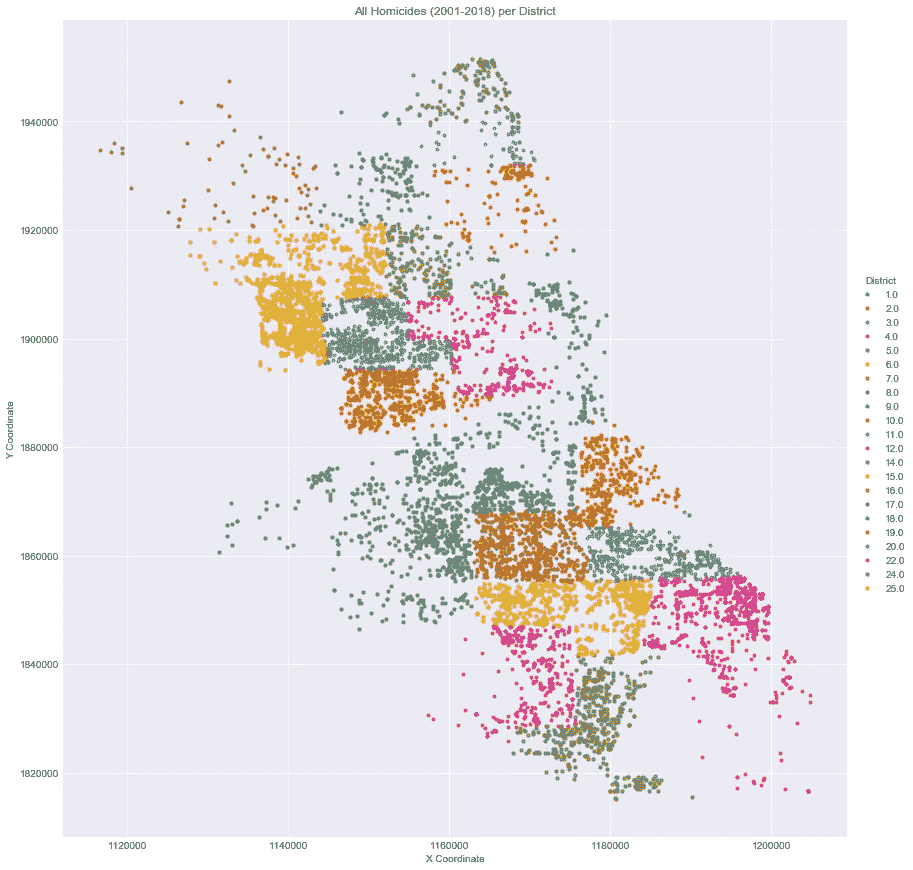

从上图中，我们可以观察到以下情况:

*   高凶杀率聚集在散点图的左上方和中下方。
*   右上角和中间一些区域的凶杀率更为分散。

由于每个区都是不同的颜色，我们可以从这张图表中获得的重要见解是，有很多点聚集在一起的区比没有聚集在一起的区有更多的凶杀率。所以现在，在某种程度上，我们对空间维度的凶杀有了一个概念，但我也想从时间维度了解这些凶杀率。

下面我创建了一些凶杀案与时间的可视化，并对之后的观察做了笔记。

## 年度凶杀率:

```
*# plot bar chart of homicide rates for all years*plt.figure(figsize=(12,6))
sns.barplot(x='Year',
            y='HOMICIDE',
            data=df_homicide.groupby(['Year'])['Primary Type'].value_counts().\
                 unstack().reset_index(),
            color='steelblue').\
            set_title("CHICAGO MURDER RATES: 2001 - 2018")
```


从上面的柱状图可视化中，我们可以得出以下结论:

*   在现有的数据范围内，芝加哥的凶杀案从 2001 年到 2003 年有一个短暂的上升趋势，从 460 起上升到 586 起。
*   接下来是一个良好的下降到 400 的范围，并保持了四年，直到 2008 年。
*   在 2016 年之前的七年里，凶杀率立即回落到 400。
*   然而，谋杀率在 2016 年急剧上升，从 2015 年的 467 起上升到 749，282 起，创历史新高。
*   2017 年也出现了持续的高凶杀率，尽管下降了 90 至 659 起。
*   我们可以说，2016 年和 2017 年芝加哥的凶杀率显著上升。
*   我想我们可以开始理解为什么有那么多关于风城谋杀案的新闻了。
*   根据我们对数据集中过去两年的观察，我想记住这一点，并在探索其余数据的过程中进行更深入的研究。

## 每月凶杀率:

```
*# plot homicides sorted by month*fig, ax = plt.subplots(figsize=(14,6))
month_nms = ['January','February','March','April','May','June','July','August'\
             ,'September','October','November','December']    
fig = sns.barplot(x='Month',
                  y='HOMICIDE',
                  data=df_homicide.groupby(['Year','Month'])['Primary Type'].\
                  value_counts().unstack().reset_index(),
                  color='#808080')
ax.set_xticklabels(month_nms)
plt.title("CHICAGO MURDER RATES by MONTH -- All Years")*# -------------------------------------------**# plot average monthly temps in Chicago*
*# source of data:  ncdc.noaa.gov*mntemp = [26.5,31,39.5,49.5,59.5,70,76,75.5,68,56,44,32]
df_temps = pd.DataFrame(list(zip(month_nms,mntemp)),
                       columns=['Month','AVERAGE TEMPERATURE'])
fig, ax = plt.subplots(figsize=(14,6))
sns.barplot(x='Month', y='AVERAGE TEMPERATURE', data=df_temps,color='steelblue')
```

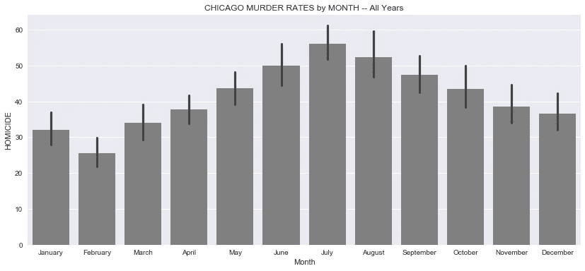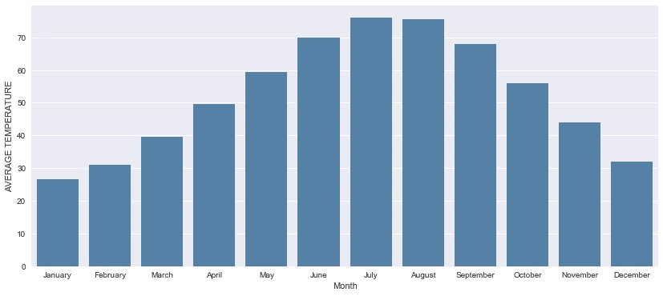

*   从逐月凶杀率来看，我们看到平均凶杀案在 3 月份开始稳步上升，在 7 月份达到高峰。
*   一月份略高于二月份，但这似乎是十二月份的延续。
*   这种周期性趋势有很多原因，但最好的解释似乎与月平均气温和总体天气有关。
*   芝加哥的冬天往往很冷，这使得大多数人不到万不得已不出门。
*   这种周期性趋势的另一个可能原因是，学校在夏季放假，因此更多的年轻人有时间去惹更多的麻烦。考虑到风险最大的年龄组在 15 至 30 岁之间。(来源:[芝加哥论坛报](http://homicides.redeyechicago.com/ages/))

## 一周中的凶杀率:

```
*# plot homicide rates vs. day of the week*fig, ax = plt.subplots(figsize=(14,6))
week_days = ['Sunday','Monday','Tuesday','Wednesday','Thursday','Friday','Saturday']    
fig = sns.barplot(x='Weekday',
                  y='HOMICIDE',
                  data=df_homicide.groupby(['Year','Weekday'])['Primary Type'].\
                       value_counts().unstack().reset_index(),
                  color='steelblue')
ax.set_xticklabels(week_days)
plt.title('HOMICIDE BY DAY OF THE WEEK -- All Years')
```

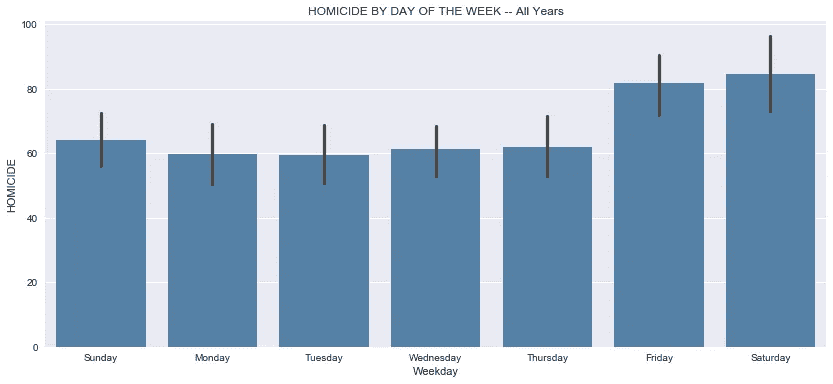

接下来，我们深入挖掘从每月到每周的时间框架，以获得更精细的外观。

*   在这个水平上，周一和周二的谋杀率最低，平均每天约 60 起。
*   周三略有上升，周四又略有上升。这种微小的变化几乎不明显，但考虑到这是 18 年的平均值，我们可以假设这种上升在某些周比其他周更明显。
*   本周早些时候出现的这种小幅上升趋势从平均每天 61 起凶杀案跃升至每天 81 起凶杀案，增幅达 25%。我们必须记住，这些平均值并没有根据这些杀戮的季节性进行调整。所以实际上，在温暖的月份，这个数字要高得多，而在寒冷的月份，这个数字要低得多。
*   周六出现了持续的高利率，但仅比周五略有上升。
*   周日的谋杀率确实从 80 年代下降到 60 年代，并持续下降到周一，并在每周循环再次重复之前稳定在 50 年代以上。
*   我们不知道是什么导致了这种循环，但我们可以假设，它们与离开学校或工作的时间有关，更多的人倾向于在这段时间参与毒品和帮派活动以及其他犯罪。

## 一天中的小时凶杀率:

```
*# use seaborn barplot to plot homicides vs. hour of the day* fig, ax = plt.subplots(figsize=(14,6))
fig = sns.barplot(x='HourOfDay',
                  y='HOMICIDE',
                  data=df_homicide.groupby(['Year','HourOfDay'])['Primary Type'].\
                       value_counts().unstack().reset_index(),
                  color='steelblue',
                  alpha=.75)
plt.title('HOMICIDE BY HOUR OF THE DAY -- All Years')
```


继续时间框架分析，从一天中的某个时间来看芝加哥的凶杀率是有意义的。我认为很容易假设谋杀发生在晚上比白天多，但这充其量只是一种猜测，所以不管我们认为结论有多明显，看看这些数字是明智的。

看待上述情节的一种方式是从一个正常的工作日或学校日的角度。

*   上午 7 点的凶杀案数量最少，约为 9 起，但随着时间的推移，我们看到凶杀案的数量稳步上升。
*   下午 2 点，我们穿过 15 关口，这为另一个稳定的上涨让路，有一点波动，其中下午 6 点飙升，下午 7 点下降，但不足以抹去之前的利率收益。
*   晚上 9 点是事情开始变得令人担忧的时候。平均值有时可能无法给出清晰的图像，但它们确实报告了一个简单的指标，即所有观察值的总和除以观察值的数量。考虑到这一点，每小时 25 起谋杀案是相当高的。
*   从晚上 9 点到凌晨 12 点的高峰，我们看到这些数字持续上升。凌晨 12 点和 1 点的谋杀率保持在每小时 30 起以上，只有在凌晨 2 点我们才看到低于 30 起，然后迅速下降，直到早上 7 点回到低于 10 起。
*   下降的一个可能原因可能是因为每个人都倾向于在深夜睡觉。即使是毒贩子和黑帮成员也有睡着的时候。
*   我想从上面的图表中得出的最后一个观察结果是，通过每个小时的误差棒线，夜间的时间比白天的时间有更多的变化，这表明夜间的凶杀活动更加活跃。

## 按家庭成员分列的年度凶杀率:

```
*# plot domestic variable vs. homicide variable*fig, ax = plt.subplots(figsize=(14,6))
df_arrest = df_homicide[['Year','Domestic']]
ax = sns.countplot(x="Year",
                   hue='Domestic',
                   data=df_arrest,
                   palette="Blues_d")
plt.title('HOMICIDE - DOMESTIC STATS BY YEAR')
```

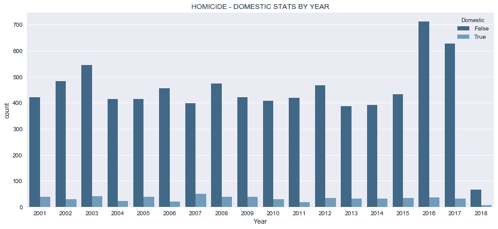

*   在整个数据范围内，家庭参与的程度似乎对凶杀率没有任何明显的影响。2016 年至 2017 年谋杀案的激增与国内数字没有任何明显的相关性。
*   考虑到原始数据集包含 40 多种犯罪类型，包括纵火、性侵犯、家庭暴力、跟踪等，因此将该变量包含在数据集中是有意义的，但它对我们涉及杀人的特定案例没有用处，尽管它在家庭暴力中肯定有权重。

## 按犯罪现场分列的凶杀率:

```
*# visualize the "scene of the crime" vs. number of occurences at such scene*crime_scene = df_homicide['Primary Type'].\
            groupby(df_homicide['Location Description']).\
            value_counts().\
            unstack().\
            sort_values('HOMICIDE',ascending=**False**).\
            reset_index()

*# Top Homicide Crime Scene Locations*
crime_scene.head(10)
```

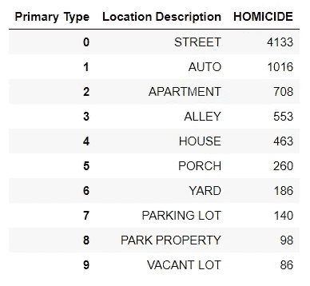

```
*# create a count plot for all crime scene locations*g = sns.factorplot(x='Location Description',
                   y='HOMICIDE',
                   data=crime_scene,
                   kind='bar',
                   size=10,
                   color='steelblue', 
                   saturation=10)g.fig.set_size_inches(15,5)
g.set_xticklabels(rotation=90)
plt.title('CRIME SCENE BY LOCATION FREQUENCY')
```

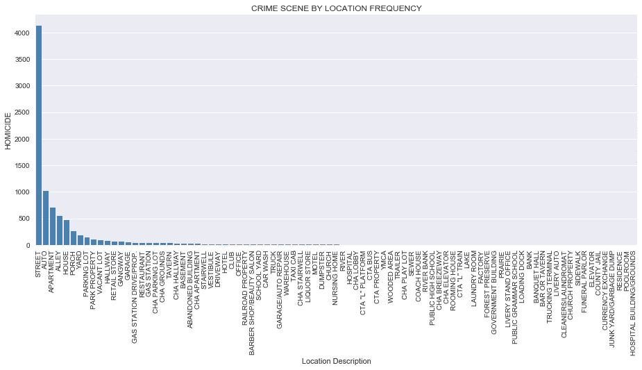

*   从上面的 Seaborn FactorPlot，我们可以观察到大多数谋杀(超过 60%)发生在街上。
*   第二个最常见的地方是汽车，然后依次是公寓、小巷、房子、门廊、院子和停车场。
*   其余位置的含量非常低，具有显著的统计影响。然而，更深入地研究数据采集方法是值得的，因为其他一些位置(尽管标注可能很专业)可能会在更大的一般化标注(如街道)之后进行标注。
*   到目前为止，从所有上述观察到目前为止，我们可以开始看到一个画面出现；芝加哥最危险的地方是街道上，在夏天，周末，晚上 11 点到凌晨 2 点。
*   然而，我们想知道这是否适用于芝加哥的所有地区。我经常被外地的朋友问住在芝加哥是否安全，我告诉他们，只要你不去错误的地方，这是安全的。接下来，我将展示我的探索，看看这是否是真的。

## 热图—每个警区的凶杀率:

```
*# create a heatmap showing crime by district by year*corr = df_homicide.groupby(['District','Year']).count().Date.unstack()
fig, ax = plt.subplots(figsize=(15,13))
sns.set(font_scale=1.0)
sns.heatmap(corr.dropna(axis=1),
            annot=**True**,
           linewidths=0.2,
           cmap='Blues',
            robust=**True**,
           cbar_kws={'label': 'HOMICIDES'})
plt.title('HOMICIDE vs DISTRICT vs YEAR')
```

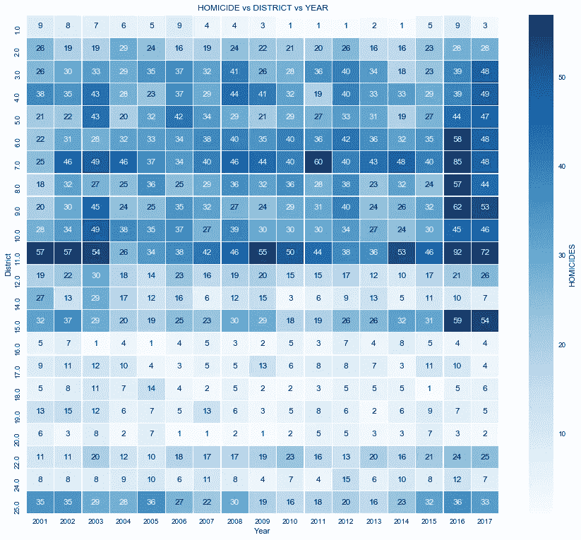

上面我创建了一个热图，比较了 2001 年至 2017 年芝加哥所有警区与每个警区的凶杀案数量。

*   正如热图所示，谋杀案在各地区的分布并不均匀。较暗区域对应较高的谋杀率。
*   热图上的区域越暗，该地区相应年份的谋杀案就越多。
*   在数据集中的所有年份中，第 1、16 和 20 区的凶杀率较低，每年为 **10 起或更少**。
*   第 17、18、19 和 24 区的谋杀率都在每年 20 起或更少(T3)的水平，尽管有些年份低于 10 起。
*   第 2、12、14 和 22 区每年有 30 起或更少的谋杀案发生在 T4。
*   其余的地区每年有超过 30 起谋杀案，有些地区的谋杀率甚至超过了 50 起。
*   第 7 区和第 11 区在 17 年的数据集中一直保持较高的数字。我们甚至可以宣布它们为芝加哥凶杀案最致命的警区。
*   整个数据集的最高谋杀率**是在 2016 年的第 11 区，有 92 起谋杀案。**
*   2016 年是数据集中凶杀案最糟糕的一年**，有 6 个区的凶杀案超过 50 起。**
*   热图使这些数据变得生动，是我们数据探索工具包中的一个非常好的工具。

## 最危险和最不危险的警区

```
**with** sns.plotting_context('notebook',font_scale=1.5):
    sorted_homicides = df_homicide[df_homicide['Year']>=2016].groupby(['District']).count()\
                    .Arrest.reset_index().sort_values('Arrest',ascending=**False**)
    fig, ax = plt.subplots(figsize=(14,6))
    sns.barplot(x='District',
                y='Arrest',
                data=sorted_homicides,
                color='steelblue',
                order = list(sorted_homicides['District']),
                label='big')
    plt.title('HOMICIDES PER DISTRICT (2016-2017) - Highest to Lowest')
```

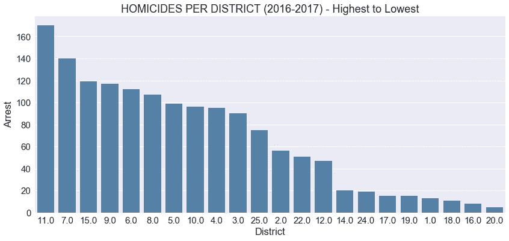

正如我们之前从热图中观察到的，有些地区比其他地区更危险，但现在我们可以更仔细地观察这一现象。从我们创造的各种可视化来看，我们至少可以得出结论，2016 年和 2017 年是芝加哥凶杀案最活跃的年份。

*   在上面的柱状图中，我将每个地区在这两年中最多和最少的谋杀案可视化，以了解它们之间的关系。
*   在这两年中，排名前 10 的地区都发生了 90 起以上的凶杀案。
*   11 区比名单上的下一组多了 30 起谋杀案。
*   22 个群体中的前 5 个群体占了该市所有凶杀案的 50%以上。
*   前 10 个群体占芝加哥所有凶杀案的 80%以上。
*   25 个区中有 8 个区的凶杀率非常低或相对较低。

## 杀人罪的逮捕与不逮捕:

接下来，我通过绘制下面的一些关系来看逮捕和杀人之间的关系。

> 看起来你可以在芝加哥逃脱谋杀。

```
*# create seaborn countplots  for whole dataset*fig, ax = plt.subplots(figsize=(14,6))
df_arrest = df_homicide[['Year','Arrest']]
ax = sns.countplot(x="Year",
                   hue='Arrest',
                   data=df_arrest,
                   palette="PuBuGn_d")
plt.title('HOMICIDE - ARRESTS STATS BY YEAR')
```

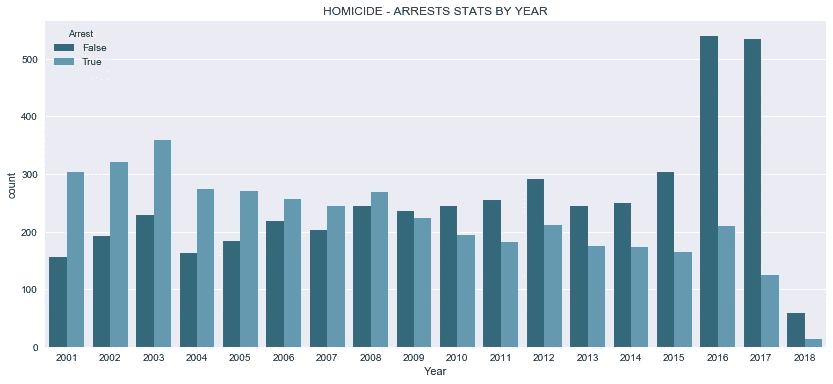

上图比较了 17 年来数据集中所有凶杀案的逮捕与不逮捕情况。

*   在 21 世纪初，警方逮捕的人比没有逮捕的人多。
*   从 2001 年到 2008 年，警方逮捕了超过一半的凶杀案。
*   从 2009 年至今，警方逮捕了不到一半的人。
*   事实上，这种趋势看起来像是警察逮捕人数的下降趋势，可能始于 2004 年左右。
*   2016 年和 2017 年，逮捕率不到 30%。

```
*# create seaborn countplots for 2016 and 2017 -- high crime rate spike years*fig, ax = plt.subplots(figsize=(14,6))
ax = sns.countplot(x="Month",
                   hue='Arrest',
                   data=df_homicide[df_homicide['Year']>=2016][['Month','Arrest']],
                   palette="PuBuGn_d")
month_nms = ['January','February','March','April','May','June','July',\
             'August','September','October','November','December']    
ax.set_xticklabels(month_nms)
plt.title('HOMICIDE - ARRESTS STATS BY MONTH -- (2016-2018)')
```

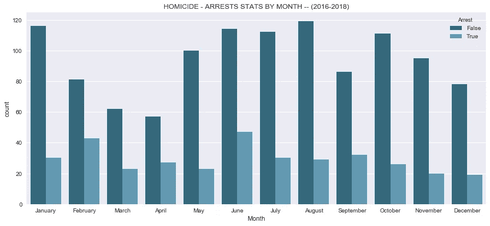

*   真正让我惊讶的是，即使在 2016 年和 2107 年犯罪激增后，警方逮捕的谋杀事件仍在继续下降。上图试图观察月份特征，但只是证实了我们之前的观察。
*   我还没有发现这种下降的好原因，但经过一点点挖掘，我发现媒体报道了芝加哥警察局的政策变化，减少了对逮捕低级别罪犯的关注，更多地关注犯罪规模方面的大鱼。这就引出了一个问题，谋杀难道不是一种高调的犯罪吗？
*   2016 年发生的另一件有趣的事情是公众关注警察对有色人种的枪击事件，这让我想知道这是否在警察逮捕时不太积极方面发挥了重要作用。大多数高犯罪率地区都是以少数族裔为主的社区，2016 年，一名法官下令发布一段视频，显示芝加哥警察枪杀了一名黑人社区成员。

```
*# create seaborn lmplot to compare arrest rates for different districts*dfx = df_homicide[df_homicide['District'].\
                isin(list(sorted_homicides.head(10)['District']))].\
                groupby(['District','Year','Month','Arrest'])['Primary Type'].\
                value_counts().unstack().reset_index()**with** sns.plotting_context('notebook',font_scale=1.25):
    sns.set_context("notebook", font_scale=1.15) g = sns.lmplot('Year','HOMICIDE',
                   col='District',
                   col_wrap=5,
                   size=5,
                   aspect=0.5,
                   sharex=**False**,
                   data=dfx[:],
                   fit_reg=**True**,
                   hue="Arrest", 
                   palette=sns.color_palette("seismic_r", 2),
                   scatter_kws={"marker": "o",
                            "s": 7},
                   line_kws={"lw":0.7})
```

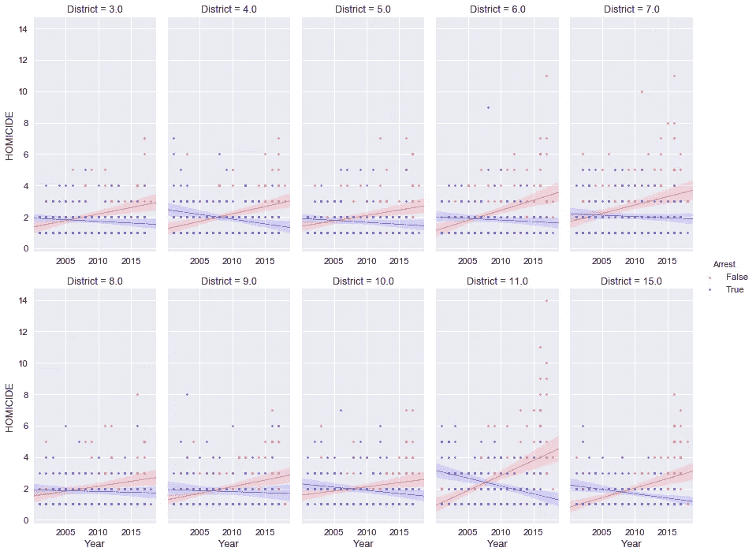

进一步细分地区一级的逮捕与不逮捕，仅是高凶杀率地区，为我之前观察到的数据集中逮捕数量逐年下降提供了更多依据。上图显示了前 10 个最危险地区在同一轴上的逮捕和未逮捕回归线。

2006 年以前，警察逮捕的人数就开始比前一年少，到 2010 年，所有地区逮捕的杀人案不到一半。

很可能因杀人被捕的几率不到一半。如果你是住在高犯罪率地区的罪犯，这种可能性会大得多。

接下来，我用 python 可视化相册“叶子”创建了一些地图，展示了我的一些发现，并在下面做了笔记。[原始代码](http://nbviewer.jupyter.org/github/RonKG/machine-learning-portfolio-projects.......in-progress/blob/master/2.%20data_storytelling_project/homicide.data.cityofchicago.org.ipynb#)上的地图是用户响应的，所以你可以放大、缩小和移动它们。

## 凶杀案与地区的对比图

## (2001–2017)

```
*# plot chloropleth maps 2001 - 2017* **def** toString(x):
    **return** str(int(x))df_homicide_allyears = df_homicide.groupby(['District']).count().Arrest.reset_index()
df_homicide_allyears['District'] = df_homicide_allyears['District'].apply(toString)*# ______________________________________________________#*chicago = location=[41.85, -87.68]
m = folium.Map(chicago,
               zoom_start=10)plugins.Fullscreen(
    position='topright',
    title='Expand me',
    title_cancel='Exit me',
    force_separate_button=**True**).add_to(m)m.choropleth(
    geo_data='chicago_police_districts.geojson',
    name='choropleth',
    data=df_homicide_allyears,
    columns=['District', 'Arrest'],
    key_on='feature.properties.dist_num',
    fill_color='YlOrRd', 
    fill_opacity=0.4, 
    line_opacity=0.2,
    legend_name='Choropleth of Homicide per Police District : 2001-2017',
    highlight=**True**
    )
folium.TileLayer('openstreetmap').add_to(m)
folium.TileLayer('cartodbpositron').add_to(m)
folium.LayerControl().add_to(m)
m.save("map1.html") 
IFrame('map1.html', width=990, height=700)*# plot 2016-2018 chloropleth map*# code for *second map* is available on github
```

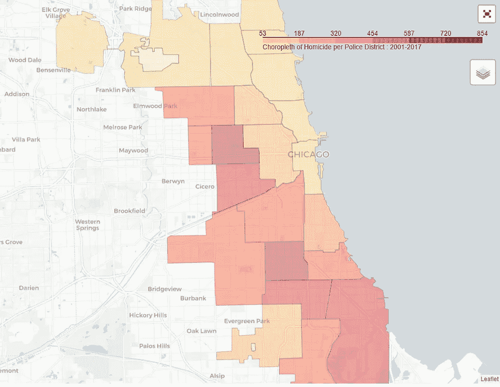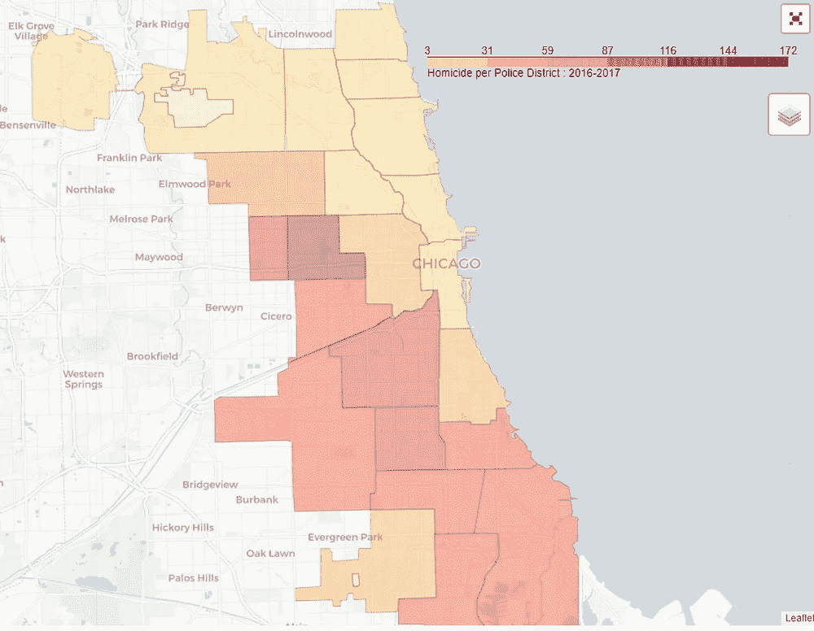

2001–2017 vs 2018

*   我为两个不同的时间段制作了两张 choropleth 地图。一个针对整个数据集，另一个针对 2016-2017 年期间，我们看到了谋杀案的激增。
*   这些地图很好地展示了不同警区的凶杀犯罪情况。
*   从这两张地图上，我们可以看到犯罪集中在城市西边和南边的警区周围。
*   有两个地区特别突出。这是 11 区和 7 区。
*   此外，犯罪率较高的地区在地理上是相连的/会传染的。

## 凶杀案 vs 地区热图—(2016–2017)

```
*# plot heatmap all districts -- (2016-2018)*after_2015_geo = []
**for** index, row **in** df_homicide[df_homicide['Year']>=2016][['Latitude','Longitude','District']].dropna().iterrows():
    after_2015_geo.append([row["Latitude"], row["Longitude"],row['District']])
*# ___________________________________________________________________*
chicago = location=[41.85, -87.68]
m = folium.Map(chicago, zoom_start=9.5,control_scale = **False**)plugins.Fullscreen(
    position='topright',
    title='Expand me',
    title_cancel='Exit me',
    force_separate_button=**True**).add_to(m)m.choropleth(
    geo_data='chicago_police_districts.geojson',
    name='choropleth',
    data=df_homicide_after_2015,
    columns=['District', 'Arrest'],
    key_on='feature.properties.dist_num',
    fill_color='YlOrRd', 
    fill_opacity=0.4, 
    line_opacity=0.2,
    legend_name='HeatMap Homicides : 2016-2017',
    highlight=**True**
    )
m.add_child(plugins.HeatMap(after_2015_geo,
                            name='all_homicides_2016_to_2017',
                            radius=5,
                            max_zoom=1,
                            blur=10, 
                            max_val=3.0))
folium.TileLayer('openstreetmap').add_to(m)
folium.TileLayer('cartodbpositron').add_to(m)
folium.LayerControl().add_to(m)
m.save("map3.html") 
IFrame('map3.html', width=990, height=700)
```

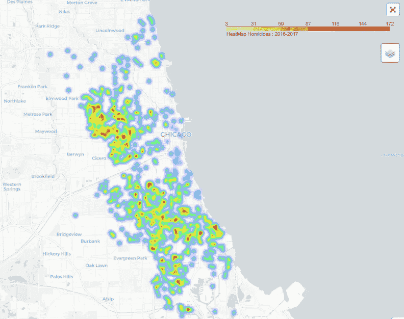

Chicago Homicide Heat Map

*   上面的热图可视化是用 python[follow](https://folium.readthedocs.io/en/latest/)可视化库创建的，它可以很好地控制在*笔记本*上绘制动态地图。
*   该热图适用于 2016-2017 年时间框架。这个时间段的各个犯罪现场位置被绘制在城市的画布上，并用颜色表示。
*   热图可以帮助我们在地图上直观地显示犯罪发生频率高或低的大致位置。深橙色代表犯罪率高的区域，断开的浅黄色/绿色阴影显示地图上犯罪率低的位置。
*   给人的第一印象是芝加哥西区和南区的凶杀率较高。我们可以放大每个区域的更多细节，每次放大都会显示该子区域中的更多集群。

*注:我还创建了更具交互性的时移热图和聚类图，可以在这里* *和在*[*github*](https://github.com/RonKG/machine-learning-portfolio-projects.......in-progress/tree/master/2.%20data_storytelling_project)*上**查看。*

最后，我创建了显示谋杀地点的聚类地图。在 [nbviewer](http://nbviewer.jupyter.org/github/RonKG/machine-learning-portfolio-projects.......in-progress/blob/master/2.%20data_storytelling_project/homicide.data.cityofchicago.org.ipynb#) 上渲染的现场互动笔记本就位于这里。

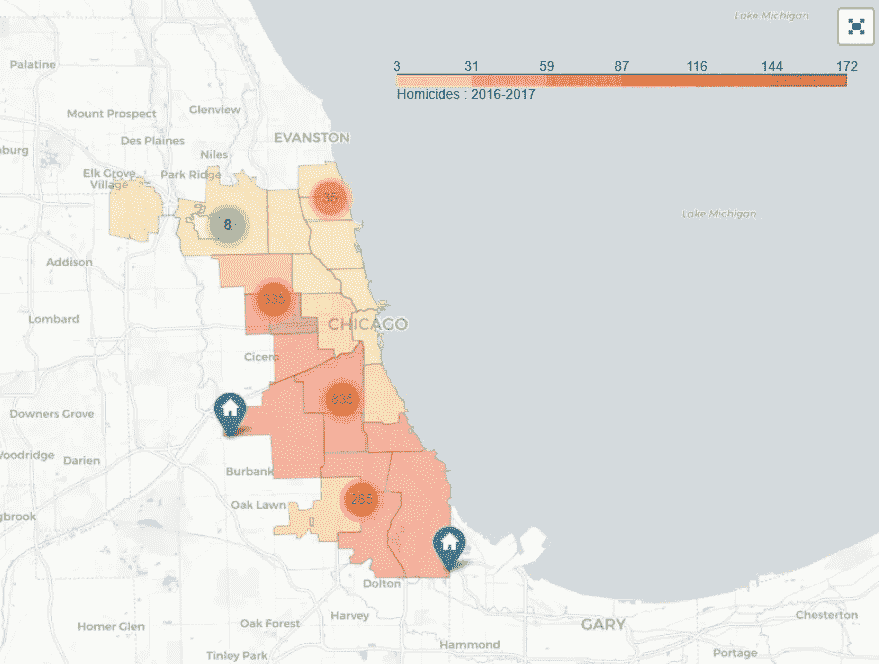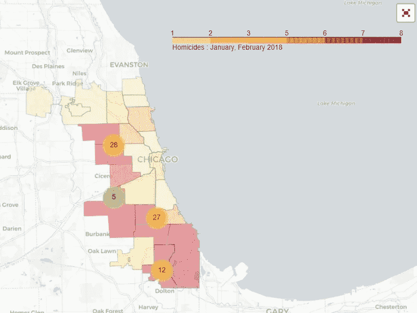

(2001–2017) vs 2018

这些地图描绘了各个犯罪现场，这或多或少类似于热图，只是没有给这些地理位置添加颜色。其中一张地图是 2016-2017 年期间的，另一张地图是 2018 年的两个月数据(1 月和 2 月)。

1 月和 2 月的地图特别有趣，因为它显示了 2018 年初犯罪已经开始大量出现的地方。可悲的是，凶杀案遵循与前几年相同的模式，绝大多数犯罪发生在同一地区。

对于在正确领域中试图确定哪些问题点需要更多资源的任何人来说，该地图将是一个很好的工具。这些地图也是一个很好的工具，可以直观地检查社区中的个人犯罪地点，结合他们对该地区的了解，可以带来新的见解，可以探索并采取行动，使社区更加安全。例如，社区成员可以确定问题点，并为儿童建立安全的上下学通道。这张地图将有助于他们识别不太危险的街区。

# 结论

在这本笔记本中，我使用了芝加哥警察局收集的数据，从中提取了一些关于芝加哥凶杀案的见解。虽然这里进行的数据分析缺乏国家视角，但我的主要发现可以归纳为以下几个要点:

*   各警区的凶杀犯罪数量差异很大。数字高的地区似乎年复一年都有高的数字，反之亦然。
*   从 2004 年到 2015 年，凶杀案数量基本未变，每年分别为 400 起和 500 起。这些数字在 2016 年突然跃升至每年 700 起凶杀案。
*   这个新数字一直保持到 2017 年，每年超过 650 起凶杀案。
*   天气温度和每月凶杀案数量之间有关联。越是温暖的月份，杀人犯罪就越多。
*   一周中的某一天也会影响谋杀案的数量，周末的谋杀案数量会更多。
*   一天中的时间也会影响杀人案件的数量，晚上 9 点到凌晨 2 点最危险，早上 7 点到下午 1 点最安全。
*   第 11 区、第 7 区和第 15 区在 2016-2017 年期间发生的凶杀案最多，同一时期各发生了 120 多起凶杀案。
*   绝大多数凶杀案发生在街头，占所有凶杀犯罪现场的 60%以上。
*   2016-2017 年期间，第 20、16、18、1、19、17、24 和 14 区的凶杀案都不到 20 起，这使它们成为芝加哥最安全的*警区。*
*   自 2003 年以来，因杀人罪而被逮捕的人数一直在下降，2008 年，谋杀案的数量超过了因谋杀而被逮捕的人数。截至 2018 年，每 10 起凶杀案中有不到 3 起被逮捕。

虽然这些观察结果很有启发性，但我应该指出，它们并没有描绘出全貌，应该与国家或其他可比数据进行比较，以提供更多的视角。例如，虽然每年的凶杀案数量看起来很高，但我们不知道这是在全国平均水平以内还是太高了。这种比较将有助于我们在讲述数据故事时建立更有说服力的论据，用它们来支持我们的本地发现。

话虽如此，我们的发现仍然与当地决策者密切相关，因为他们非常清楚何时何地，但不是为什么。