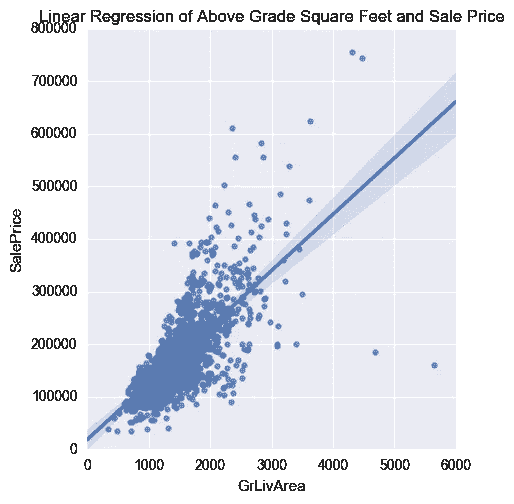
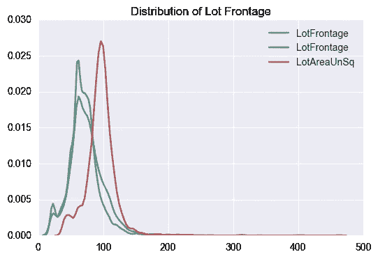
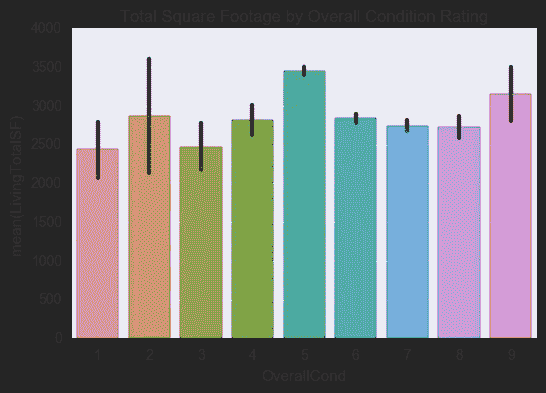
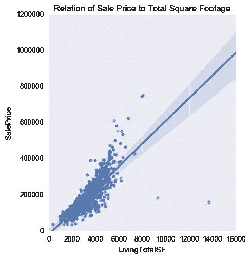
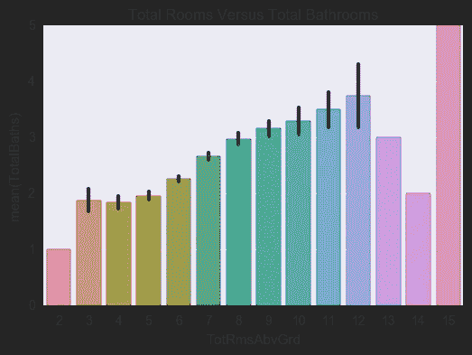
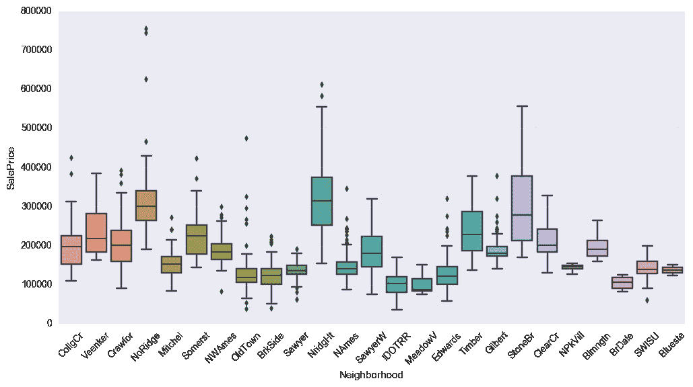
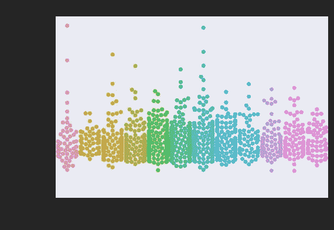
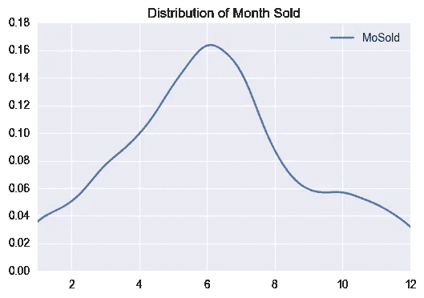

# 房价和回归

> 原文：<https://towardsdatascience.com/house-prices-and-regressions-7adf696053d6?source=collection_archive---------1----------------------->

本着我正在进行的系列活动的精神，如[泰坦尼克号游戏竞赛](https://medium.com/@kefortney/titanic-maritime-machine-learning-6d48f9dc91eb#.o68l1ec9n)，这里是另一个机器学习[游戏竞赛](https://www.kaggle.com)。这次是为了用回归法计算出缺失的房价。

一如既往这里是我提交的捷径[这里](https://www.kaggle.com/kefortney/house-prices-advanced-regression-techniques/house-prices-advanced-regression-techniques)

## 数据

你从来不知道你想去爱荷华州的埃姆斯，但最终你会从迪安·德·科克收集的一组数据中获得超乎你想象的知识。有许多城市都有公开的住房数据集，比如我所在的佛蒙特州伯灵顿镇，但是在这次卡格尔竞赛中，我们希望探索销售价格与房子所有其他特征之间的可能关系。

房子的许多特征，但不是所有特征，都与销售价格有线性关系。通过填补缺失值，一些决定销售价格的功能工程和功能选择应该不会太远。在这种情况下，我尝试应用[随机森林回归、套索和山脊回归](https://medium.com/@kefortney/10-machine-learning-flavors-in-sklearn-948206342da2#.xcinmj2ds)来得出我的最终答案。

快速看一下地面以上平方英尺与销售价格的线性回归，就可以看出这种方法的优势。

# 方法

该数据集中有大量的特征，为了创建良好的预测，必须提前做大量的工作。组合训练集和测试集将意味着只需要在两个数据集之间进行一次更改。我们将探索以下步骤:

*   相互关系
*   特征探索
*   缺少值
*   数据标准化
*   特征工程
*   组装数据集
*   预言；预测；预告

销售价格应该有几个良好的指标，挑战将是数据和特征工程的标准化。

# 数据

该数据具有广泛的整数、浮点和分类信息。最终，它们将以数字的形式结束，但还不完全是。有几组不同类型的测量，了解它们的差异将有助于确定可以创建哪些新特征。

**街区—** 关于街区、分区和地段的信息。

*   示例:MSSubClass、LandContour、Neighborhood、BldgType

**日期—** 关于何时建造、改造或出售的基于时间的数据。

*   示例:YearBuilt、YearRemodAdd、GarageYrBlt、YrSold

**质量/条件—** 对房屋的各种特征进行分类评估，很可能是由房产评估员进行的。

*   示例:PoolQC、SaleCondition、GarageQual、HeatingQC

**物业特征—** 建筑附加特征和属性的分类集合

*   示例:基础、外部 1st、BsmtFinType1、实用程序

**平方英尺—** 建筑截面的面积测量以及门廊和地块面积等特征(单位为英亩)

*   示例:TotalBsmtSF、GrLivArea、GarageArea、PoolArea、LotArea

**房间/特征计数—** 特征(相对于分类)的定量计数，如房间，特征工程的主要候选

*   例如:全浴室、卧室、壁炉、车库

**定价—** 货币值，其中之一是我们试图确定的销售价格

*   示例:SalePrice、MiscVal

# 相互关系

快速相关性检查是了解数据集核心的最佳方式。销售价格与几个变量有很大的相关性:

*   总质量— 0.790982
*   GrLivArea — 0.708624
*   车库汽车-0.640409
*   车库面积-0.623431
*   TotalBsmtSF — 0.613581
*   1stFlrSF — 0.605852
*   全浴— 0.560664
*   TotRmsAbvGrd — 0.533723
*   年份-0.522897
*   YearRemodAdd — 0.507101

热图显示了整个数据集与其自身的相关性。记住红色越深(正相关)或蓝色越深(负相关)越好。

# 缺少值

缺失值的选择范围很广。首先，有意义的是先击中低垂的果实，处理那些缺少一两个值的，然后处理剩下的。其中一些看起来缺少值，不是因为他们没有数据，而是因为建筑物缺少该特征，如车库。使用熊猫获取。傻瓜会把那个问题分成真/假值。

# 替换丢失的数据

对于缺少单个值的分类信息，快速检查会显示哪些值占主导地位，并手动替换缺少的值。对大多数人来说，这是一个快速的过程。

# 推断缺失值

某些缺失值可以从该给定属性的其他值中推断出来。车库的建造时间最早应该是房子建造的那一年。同样，TotalBasementSQFeet 必须等于一楼的平方英尺。

# 地段临街

很多正面有点棘手。有 486 个缺失值(占总值的 17%)，但快速检查相关性后发现，在地块区域之外具有高相关性的要素少得惊人。

逻辑表明，地块面积应与地块正面成线性关系。通过对地块正面和地块面积的平方根(如果是方形地块，则为有效的一边)之间的关系进行线性回归，快速检查表明我们处于大致范围内。

一旦缺失的值被填充，就可以很好地确认分布没有超出 wack 的范围。蓝色是原始分布，绿色是推断出缺失值的新分布，红色是地块面积的平方根曲线。不出所料，这些地产中的大部分看起来都没有完美的正方形地块，但就我们的目的而言，一切看起来都很好。

# 特征工程

现在是时候创建一些新的功能，看看它们如何帮助模型的准确性。首先是几个宏观的创造，比如把所有的内部和外部面积加在一起，得到包括楼层、车库和外部空间在内的总居住空间。有趣的是，这里有一个与整体条件评级相关的新功能的可视化

条件评级增加到平方英尺，这并不奇怪。然而，当对销售价格进行线性回归时，一个更明显的模式出现了。

这是一个很好的添加特性，但是它确实向您展示了特性的选择非常依赖于您想要预测的内容。

# 房间总数

相反，如果你对房间感兴趣，房间和浴室的数量有明显的关系。这是浴室的平均值，这条线是方差(大多数值偏离平均值的程度)。

楼上的房间越多，浴室之间的关系也越紧密。对于 13 个房间及以上的房间，房屋数量要少得多，因此数据的可靠性和可预测性较差。

# 地区

我们都知道社区有各种各样的特点。在某种程度上，它与销售价格有关系，但它更难定义，在预测中也不太有用。

# 销售月

在结束之前，最后一次彩色图表。我想知道佛蒙特州的房地产市场，因为天气会对许多活动产生很大的影响，包括看我想象中的房子。

这两个图表向我们展示了，虽然价格没有明显的月与月之间的变化，但有几个月的房屋销售量比其他月份多得多。如果我想预测房子什么时候会被卖掉，那会很有用。因为我看到的是实际价格，所以实际价格要低得多。

# 特征选择

选择正确的功能至关重要。低相关性的不良特征只会使噪声比信号更强，遗漏太多会导致数据丢失。因为有这么多，我不打算在这里列出来，但它在笔记本上。

# 模型和结论

有几个模型试过了。随机森林回归、LassoLarsCV 和 Ridge 都是选项，经过试验，我最终选择 Ridge 作为更好的选项。令人着迷和沮丧的是，每次我运行它时，准确性都有很大的变化。这些模型似乎都有一些波动。最后，我有了大约 82%-90%的准确率。在尝试将同样的过程应用于伯灵顿的住房数据时，我遇到了更奇怪的不一致和巨大的过度拟合问题。

回归的应用是复杂的，因为你试图预测一个特定的值，而不是像泰坦尼克号一样的是/否答案。我的[提交](https://www.kaggle.com/kefortney/house-prices-advanced-regression-techniques/house-prices-advanced-regression-techniques)可以进一步完善，但我的目标是在我拥有的 Burlington 数据集上做，而不是在这里。