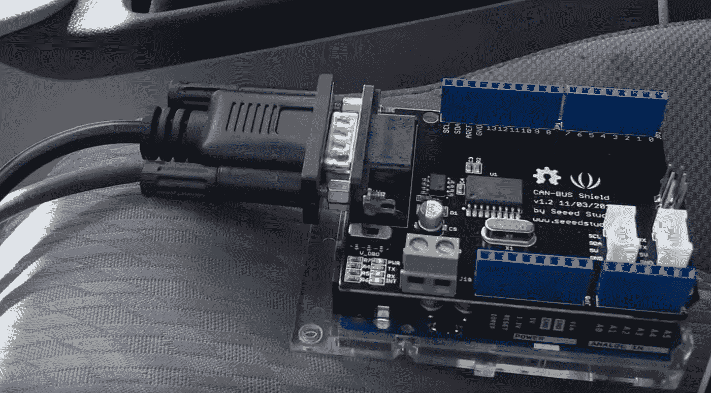
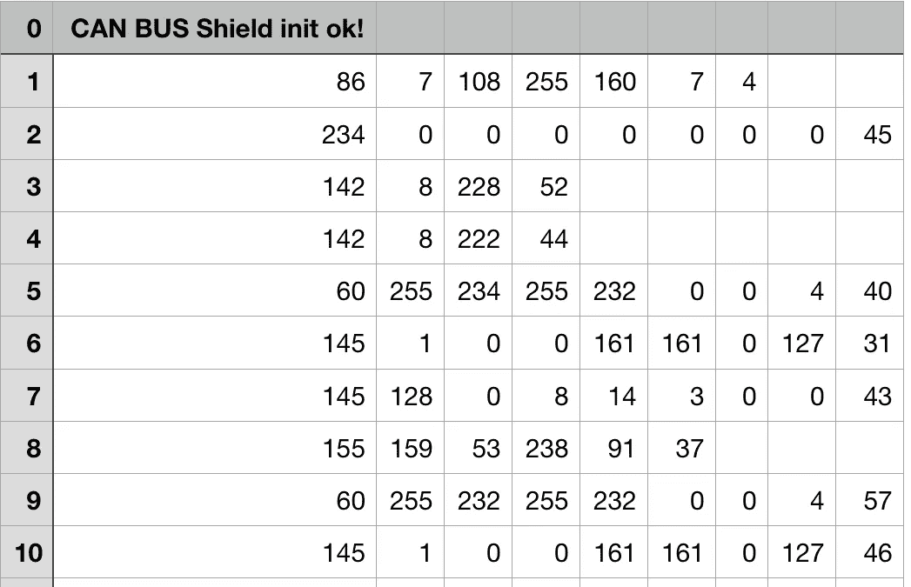
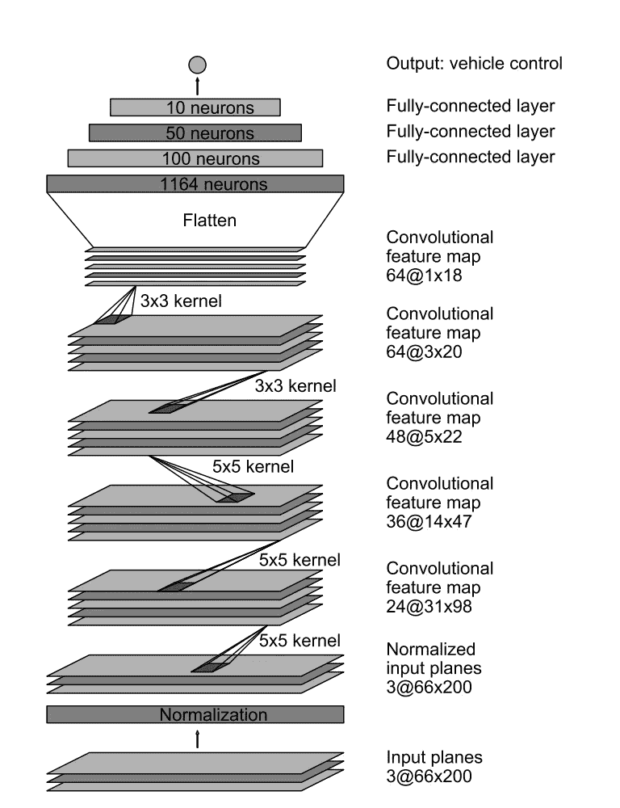

# 一个高中生如何制造一辆自动驾驶汽车

> 原文：<https://towardsdatascience.com/how-a-high-school-junior-made-a-self-driving-car-705fa9b6e860?source=collection_archive---------9----------------------->

与这个库相关的问题是我收到的最多的问题之一，这个库来自我三年前创建的一个项目。这个存储库本身并没有什么特别的，只是一年前发布的 [Nvidia 论文](https://arxiv.org/pdf/1604.07316.pdf)的一个实现。一名研究生后来设法在一辆实际大小的汽车上实现了我的代码，这真的很酷。我的代码创建背后的故事是有趣的部分。

我对机器学习的迷恋始于 2015 年初，那时我偶然发现了遗传算法和神经网络。YouTube 上的热门视频显示，虚拟生物似乎在没有任何人类输入的情况下神奇地进化出复杂的行为。视频解释说，算法就像我在生物课上学到的交叉和随机突变一样简单，但我仍然不相信这样的计算机模拟是可能的。所以很自然的，我写了[我自己的模拟](https://www.youtube.com/watch?v=DT7ykemj3B4)来验证这是可能的。在它*实际上*起作用后，我被迷住了，我深入研究了[麻省理工学院关于人工智能的开放课件系列](https://www.youtube.com/watch?v=TjZBTDzGeGg&index=2&list=PLnvKubj2-I2LhIibS8TOGC42xsD3-liux)。我花了大约两个星期的时间，每天看一到两个讲座，基本上是吃了整整一学期的人工智能入门材料。

现在，真正有趣的事情开始了——数学。老实说，在我真正理解 backprop 之前，我与它斗争了几个星期。我找到的所有论文、指南和博客都没有以我能真正理解的方式解释它，我花了很长时间试图实现它，但几乎没有成功。最后，我找到了[一个我点击的博客](http://neuralnetworksanddeeplearning.com/chap2.html)，我在 YouTube 上制作了一个[视频](https://youtu.be/gl3lfL-g5mA)浓缩了我所了解到的信息，以便处于我这个位置的困惑的人可以像我一样学习*。最后，我用 C++从头开始编写了一个神经网络库，以确保我理解了我所学的内容，并且(很)后来将其改进为一个[小型知识库](https://github.com/SullyChen/Chai)，旨在帮助初学者理解神经网络如何工作。*

*我对自动驾驶汽车的迷恋几乎完全是受特斯拉(该公司，而不是天才)的启发，特斯拉最近发布了他们的自动驾驶仪“驾驶”他们汽车的疯狂视频。带着我新发现的天真和对机器学习的浅薄知识，我开始制作我自己的。*

*第一个(也许是最明显的)挑战是数据收集。我需要记录视频和相应的方向盘角度。视频很简单:我只是草率地在挡风玻璃上贴了一个摄像头。另一方面，方向盘角度是一个完全不同的挑战。我的第一个方法是将加速度计和 Arduino 连接到方向盘上，并将时间数据与视频同步。对于任何一个曾经在糟糕的司机急转弯时被甩到车边的人来说，你会立刻明白为什么这种方法会彻底失败。首先，加速度计从汽车的任何微小运动中获得加速度。其次，精确同步来自*不同*设备的加速度计数据和视频数据是一个巨大的挑战，我不想应对。*

*我的第二种方法是直接与汽车接口，使用每辆现代汽车都配备的 OBD-II 端口访问 CAN 总线。这给*带来了许多*挑战，但回报(超精确的方向盘测量)绝对值得。*

***挑战 1:** *我如何从 OBD-II 端口读取 CAN 总线？*解码和处理 CAN 总线信号是一个复杂的过程，需要花费大量时间来编写和调试。幸运的是，[已经有人做到了](https://github.com/Seeed-Studio/CAN_BUS_Shield)。使用这段代码和相对便宜的 Arduino shield，我能够轻松地从汽车中提取和读取 CAN 总线数据。*

**

***挑战 2:** *我如何将大量的 CAN 总线数据转化为方向盘读数？*下面是我收到的仅 10 行(不到一秒)CAN 总线数据的图像。*

**

*所有这些数据都包含了与 CAN 总线相连的汽车中每个系统的*信息，从挡风玻璃雨刷到方向盘上的扭矩传感器。在数据的最左列是对应于接收到的数据包的地址(右列)。例如，在第 1 行，我们从地址 86 接收[7，108，255，160，7，4]。汽车公司*真的*不喜欢公开发布哪些地址对应于汽车的哪些部件，他们尤其不喜欢有人摆弄他们汽车的硬件。因此，我必须设计一些方法来解析数百个 CAN 总线通道，并找到提供方向盘角度信息的*单个*通道。**

*我基本上是通过手动单独监控每个通道来做到这一点的，同时我慢慢转动方向盘，寻找接收到的数据的平滑变化。经过大量的实验，我设法找出了哪个通道对应于方向盘，以及汽车的其他几个部件(油门、刹车、速度等)。).*

***挑战三:** *我有了数据和渠道，现在怎么办？*来自 CAN 总线的数据格式不佳。你不会收到类似“64 频道发送信息:43.5 度”的信息相反，你得到的是一堆杂乱的数据，这些杂乱的数据在某种程度上对应着一个角度。我需要确定几个字节的数据和方向盘角度之间的某种“转换函数”。为此，我将方向盘移动到不同的位置，并记录与该位置相关的相应字节。例如，如果我将方向盘移动到 90 度并接收到[0，128，0，0]，然后将其移动到 135 度并接收到[0，192，0，0]，我可以粗略估计第二个数据点对应于大约:(192–128)/(135–90)度的倍数。我非常幸运地得到*数据是转向角的简单线性变换。使用这种方法，我最终通过实验确定了一个可以应用于数据的线性变换，以获得方向盘角度。**

*这里有一个[视频](https://youtu.be/nzKzee-Mhnc)展示了这一过程，三个挑战都得到了解决。后来我出去了，在我的镇上开了几个小时的车，收集有标签的数据，我的 2015 Macbook Air 放在副驾驶座上。我拿到驾照还不到一年，所以这真的不是个好主意。另一个有趣的事实是:我有几次逃学出去收集数据，所以为我错过的所有课程向 S 先生和 N 女士道歉！*

*现在有趣的部分:*将机器学习应用于任务*。*

*我的第一次尝试是用 Caffe 在 AlexNet 上训练一个分类模型。我把我的数据分成大小为 10 度的箱，得到一组方向盘角度在 0-9 度、10-19 度、20-29 度之间的图像。最后，我对分类输出进行线性组合，以获得最终预测。动机大致是这样的:*“如果模型预测 20 度和 30 度的角度有相同的可能性，那么真实的角度可能在 25 度左右。”*快速声明:这是*而不是*处理事情的好方法。感谢当时我并不真正理解的统计学的魔力，[这实际上并没有变成可怕的](https://youtu.be/fSbWnQ_wzvM)，我后来把它变成了一个仓库的[垃圾箱火灾](https://github.com/SullyChen/Caffe-Autopilot)。知识库中嵌入了许多糟糕的编码实践，我将它作为我成功和失败的提醒，将它作为我从那时起学到的许多东西的时间胶囊。*

*我的第二次尝试是复制最近出来的 Nvidia 论文，稍加修改。Nvidia 型号使用以下架构:*

**

*最后的输出是前面十个神经元的简单线性组合，我觉得还可以改进。我通过对线性组合应用反正切函数来改变这一点，我认为这样更直观。反正切为网络提供了一种从可视数据中“恢复”曲率角度的工具，而不必重新学习将斜率或切线转换为弧度的方法。在实践中，它真的没有什么不同，但我保留它只是为了好玩。*

*我在 TensorFlow 中花了大约一个晚上编写了代码，并在我当时拥有的廉价 750ti GPU 上对它进行了训练。Nvidia 的论文并没有详细说明他们的训练过程，总体来说，论文没有给出太多关于他们如何完成他们所做事情的信息。我使用亚当优化连同 L2-正常化和辍学的训练。最后，我取得了不错的成绩！*

*总的来说，这个庞大的项目教会了我大量的信息、技术和编码实践。它也引起了很多关注，并为我带来了一些面试和一些工作机会！Nvidia 甚至让我飞到他们的自动驾驶实验室，参观他们的技术，这真的很酷！他们给了我一个相当优厚的条件，让我在接下来的一年里和他们一起实习，但我不情愿地拒绝了继续读本科。在我发布了我的作品后，我在网上遇到了很多了不起的人，这可能是整个经历中最有收获的部分。*

*有什么问题尽管问！*