# 一个简单的算法如何以中等精度对文本进行分类

> 原文：<https://towardsdatascience.com/how-a-simple-algorithm-classifies-texts-with-moderate-accuracy-79f0cd9eb47?source=collection_archive---------1----------------------->

## **涵盖的内容**:数据探索、文本分类、不平衡数据、各种度量


Photo by [Damiano Lingauri](https://unsplash.com/@dendrolago89?utm_source=medium&utm_medium=referral) on [Unsplash](https://unsplash.com?utm_source=medium&utm_medium=referral)

尽管最近围绕 NLP 的深度学习取得了令人兴奋的进展，但我想展示简单的分类器如何能够达到中等精度。这是一件好事，因为训练这些分类器不需要大量的数据和计算，这是训练深度神经网络的情况。

在这篇博文中，我选择了一个叫做[逻辑回归](https://en.wikipedia.org/wiki/Logistic_regression)的分类器。我将在[亚马逊美食评论](https://www.kaggle.com/snap/amazon-fine-food-reviews/data)上训练它，以预测给定的文本被归类为正面评论或负面评论。

# **1。数据描述**

数据形状(行，列):(568454，10)

**列名:描述**

1.  Id:分配给每行的唯一编号

2.产品 Id:产品 id 号

3.用户标识:用户标识号

4.ProfileName:用户名

5.HelpfulnessNumerator:认为评论有帮助的用户数量

6.HelpfulnessDenominator:投票总数(认为评论有帮助的用户数和认为没有帮助的用户数)

7.得分:评分在 1 到 5 之间(1 =最不喜欢，5 =最喜欢)

8.时间:审核的时间戳

9.总结:产品的简短回顾

10.文本:产品评论的文本

我将只使用两个特征:7:分数和 10:文本作为预测器或自变量。

# 2.数据探索

```
import panda as pd
import numpy as np
import matplotlib.pyplot as plt
%matplotlib inline
import seaborn as sns; sns.set();data = '../../datasets/amazon_review/Reviews.csv'
data = pd.read_csv(data) *# Take proportion of each review score* score_pct = np.bincount(data['Score']) **/** data.shape[0]
scores = pd.DataFrame(np.random.rand(1, 5), 
                      index=['scores'],
                      columns=pd.Index([1, 2, 3, 4, 5], name='Score'))
scores.iloc[0] = score_pct[1:]
scores.plot.bar()
```

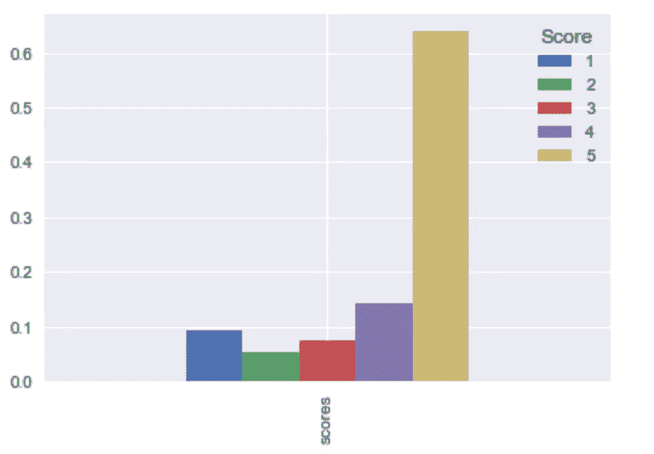

Proportion of review from 1 to 5

超过 60%的评论是最受欢迎的评论(得分 5)，其次是中等受欢迎的评论(得分 4)。总评论的 70%由这两个评论分数组成。

来看一些评分 3 和评分 4 的评论。

**10 条评分为 3 的评论:**

这些评论包括正面评论和负面评论。我将评分为 3 的评论归类为负面，原因如下:第一、第三和第十条评论不包含任何正面评论，即使有些评论有正面评论，但在同一食品的评论中包含负面评论可能会阻止其他人购买食品。

```
print(data[data['Score'] == 3]['Text'].values[:10])[ "This seems a little more wholesome than some of the supermarket brands, but it is somewhat mushy and doesn't have quite as much flavor either.  It didn't pass muster with my kids, so I probably won't buy it again."
 'The flavors are good.  However, I do not see any differce between this and Oaker Oats brand - they are both mushy.'
 'This is the same stuff you can buy at the big box stores.  There is nothing healthy about it.  It is just carbs and sugars.  Save your money and get something that at least has some taste.'
 "we're used to spicy foods down here in south texas and these are not at all spicy.  doubt very much habanero is used at all.  could take it up a notch or two."
 'Watch your prices with this.  While the assortment was good, and I did get this on a gold box purchase, the price for this was<br />$3-4 less at Target.'
 "If you're impulsive like me, then $6 is ok. Don't get me wrong, the quality of these babies is very good and I have no complaints. But in retrospect, the price is a little ridiculous (esp. when you add on the shipping)."
 'The taste was great, but the berries had melted.  May order again in winter. If you order in cold weather you should enjoy flavor.'
 'While my dogs like all of the flavors that we have tried of this dog food, for some reason their itching increased when I tried the lamb and rice. I have some very itchy dogs and am giving them a limited ingredient dog food to try to help. The duck and sweet potato cut down on the itching significantly, but when we tried lamb and rice they started itching more once again. I like Natural Balance for the quality ingredients.'
 'Awesome dog food. However, when given to my "Boston", who has severe reactions to some food ingredients; his itching increased to violent jumping out of bed at night, scratching. As soon as I changed to a different formula, the scratching stopped. So glad Natural Balance has other choices. I guess you have to try each, until you find what\'s best for your pet.'
 "not what I was expecting in terms of the company's reputation for excellent home delivery products"]
```

**5 条评分为 4 的评论:**

得分为 4 的评论总体上是正面的，并且包括诸如“高度推荐”、“我很高兴”之类的词语。

```
print(data[data['Score'] == 4]['Text'].values[:10])[ 'This is a confection that has been around a few centuries.  It is a light, pillowy citrus gelatin with nuts - in this case Filberts. And it is cut into tiny squares and then liberally coated with powdered sugar.  And it is a tiny mouthful of heaven.  Not too chewy, and very flavorful.  I highly recommend this yummy treat.  If you are familiar with the story of C.S. Lewis\' "The Lion, The Witch, and The Wardrobe" - this is the treat that seduces Edmund into selling out his Brother and Sisters to the Witch.'
 'I got a wild hair for taffy and ordered this five pound bag. The taffy was all very enjoyable with many flavors: watermelon, root beer, melon, peppermint, grape, etc. My only complaint is there was a bit too much red/black licorice-flavored pieces (just not my particular favorites). Between me, my kids, and my husband, this lasted only two weeks! I would recommend this brand of taffy -- it was a delightful treat.'
 'good flavor! these came securely packed... they were fresh and delicious! i love these Twizzlers!'
 'I was so glad Amazon carried these batteries.  I have a hard time finding them elsewhere because they are such a unique size.  I need them for my garage door opener.<br />Great deal for the price.'
 "McCann's Instant Oatmeal is great if you must have your oatmeal but can only scrape together two or three minutes to prepare it. There is no escaping the fact, however, that even the best instant oatmeal is nowhere near as good as even a store brand of oatmeal requiring stovetop preparation.  Still, the McCann's is as good as it gets for instant oatmeal. It's even better than the organic, all-natural brands I have tried.  All the varieties in the McCann's variety pack taste good.  It can be prepared in the microwave or by adding boiling water so it is convenient in the extreme when time is an issue.<br /><br />McCann's use of actual cane sugar instead of high fructose corn syrup helped me decide to buy this product.  Real sugar tastes better and is not as harmful as the other stuff. One thing I do not like, though, is McCann's use of thickeners.  Oats plus water plus heat should make a creamy, tasty oatmeal without the need for guar gum. But this is a convenience product.  Maybe the guar gum is why, after sitting in the bowl a while, the instant McCann's becomes too thick and gluey."]
```

# **2。训练分类器和预测**

我会将每一篇评论分为正面或负面，并训练一个分类器来预测这两个值。正如我们在上面看到的，分数为 3 的评论可以被视为负面的，所以如果分数超过 3，我会将每个评论分为正面的，如果分数低于 3，则分为负面的。由于数据量很大，我将使用 4%的数据。

```
*# We shuffle the rows and extract 10% of the rows* df_reduced = data.sample(frac=0.04, random_state=7)
reduced_data_size = df_reduced.shape[0]# Encode positive as 1 and negative as 0
reduced_labels  = np.array([df_reduced['Score'] >= 4])[0][:].astype(int) 
reduced_texts = df_reduced['Text'].values
```

样本数量从 568454 减少到 22738

```
reduced_sentiment_pct = np.bincount(reduced_labels) / reduced_data_size # percentage value of each sentiment
sentiment = pd.DataFrame(np.random.rand(1, 2), 
index=[‘count’],
columns=pd.Index([“negative”, “positive”], name=’sentiment’))
sentiment.iloc[0] = reduced_sentiment_pct
sentiment
sentiment.plot.bar(title="Ratio of each sentiment")
```

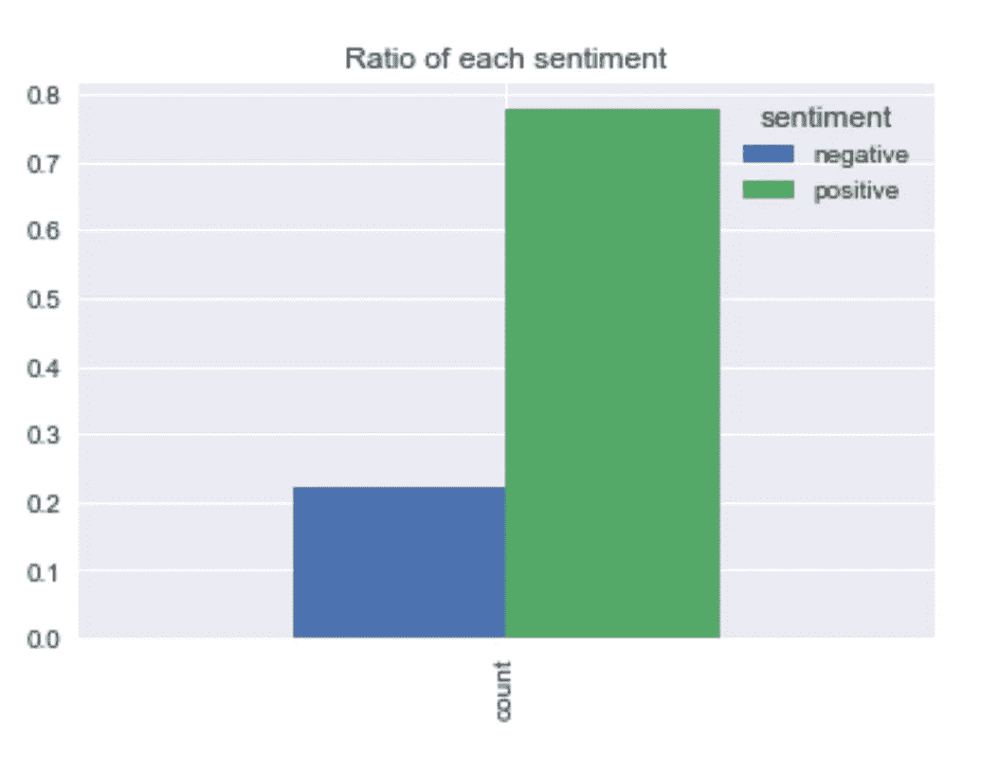

Proportion of each sentiment value

正如我们在上面的柱状图中看到的，78%的评论是正面的。所以这是不平衡的数据，这意味着，**“如果我们只是手动将每个样本(或每个样本)分类为“阳性”，我们将获得大约 78%的分类准确率。”**因此，78%的准确率是我们的基准之一。

我将使用 80%的数据作为训练集，20%作为测试集。

```
*# we will use 80% of data as training set, 20% as test set*train_size = int(reduced_data_size ***** .8)text_train = reduced_texts[:train_size]y_train = reduced_labels[:train_size]text_test = reduced_texts[train_size:]y_test = reduced_labels[train_size:]
```

训练集:18190 个样本
测试集:4548 个样本

我会将文本转换成适当的格式(由数值组成)，以便可以对它们进行分类训练。我将使用两种方法:A:单词袋和 B.TFIDF

**答:一堆废话**

单词包使用标记化将文本转换成数字表示。

使用下面的单词包处理两个文档的示例:

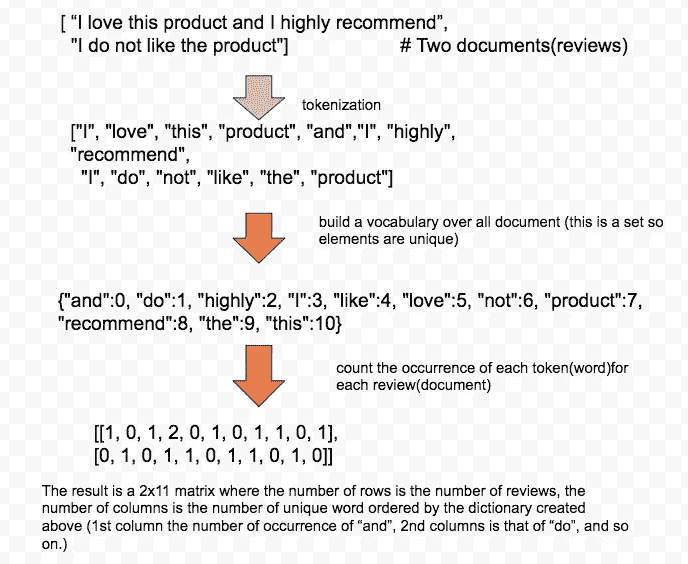

Process of bag-of-words. Inspired by [Introduction to Machine Learning with Python](http://Process of bag-of-words. Inspired by Introduction to Machine Learning with Python)

上述过程的代码

```
from sklearn.feature_extraction.text import CountVectorizer
vect = CountVectorizer().fit(text_train)
X_train = vect.transform(text_train)
print(repr(X_train))X_test = vect.transform(text_test)
print(repr(X_test))
```

X_train 是:8190x26817 稀疏矩阵

X_test 为:4548x26817 稀疏矩阵

#稀疏矩阵是只包含非零元素的矩阵

**拟合逻辑回归**

注意:

1.  我在下面的实例化中使用了 class_weigtht="balanced"。[这具有惩罚少数类](https://svds.com/learning-imbalanced-classes/)(该数据集中的负类)上的错误的效果。
2.  我用的 GridSearchCV 是带“roc_auc”的，不是“分类精度”。这方面的理由写在下面一节。

```
from sklearn.pipeline import make_pipeline
from sklearn.model_selection import GridSearchCV
from sklearn.metrics import confusion_matrix
from sklearn.linear_model import LogisticRegressionlogreg = LogisticRegression(class_weight=”balanced”, random_state=0)
param_grid = {‘C’: [0.01, 0.1, 1, 10, 100]}grid = GridSearchCV(logreg, param_grid, scoring=”roc_auc”, cv=5)
logreg_train = grid.fit(X_train, y_train)pred_logreg = logreg_train.predict(X_test)
confusion = confusion_matrix(y_test, pred_logreg)
print(confusion)
print("Classification accuracy is: ", (confusion[0][0] + confusion[1][1]) / np.sum(confusion))
```

混乱矩阵:
[[ 826 206]
[ 468 3048]]

分类精度为:0.851802990325

我打印了一个混淆矩阵，下面画出了它的一个概念。总的来说，我们希望增加真阴性和真阳性的数量。(这两个是矩阵的主对角线)同时最小化假阴性和假阳性的数量(这两个是非对角线)。在上面的混淆矩阵中，假阴性比假阳性多。这可能是由于给定的类权重的惩罚。分类精度计算为:(TN+TP) / (TN+TP+FP + FN)。

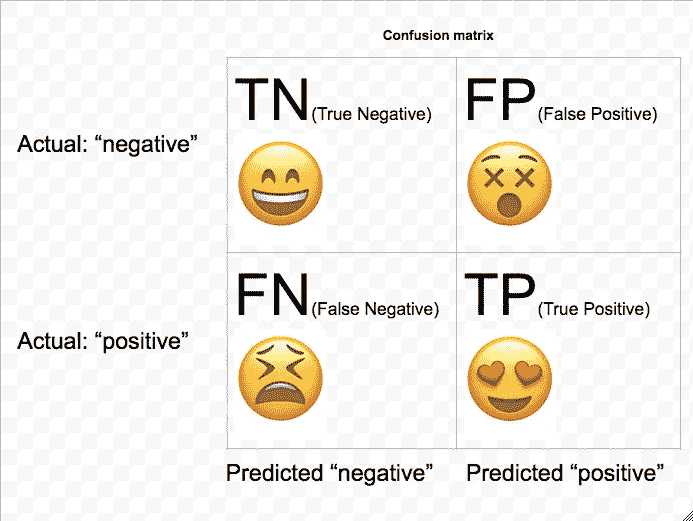

Concept of confusion matrix

```
from sklearn.metrics import roc_curvefpr, tpr, thresholds = roc_curve(y_test, grid.decision_function(X_test))
# find threshold closest to zero:
close_zero = np.argmin(np.abs(thresholds))
plt.plot(fpr[close_zero], tpr[close_zero], ‘o’, markersize=10, 
 label=”threshold zero(default)”, fillstyle=”none”, c=’k’, mew=2)
plt.plot([0,1], linestyle=’ — ‘, lw=2, color=’r’, label=’random’, alpha=0.8)
plt.legend(loc=4)
plt.plot(fpr, tpr, label=”ROC Curve”)
plt.xlabel(“False Positive Rate”)
plt.ylabel(“True Positive Rate (recall)”)
plt.title(“roc_curve”);
from sklearn.metrics import auc
print(“AUC score is: “, auc(fpr, tpr));
```

AUC 分数是:0.901340273919

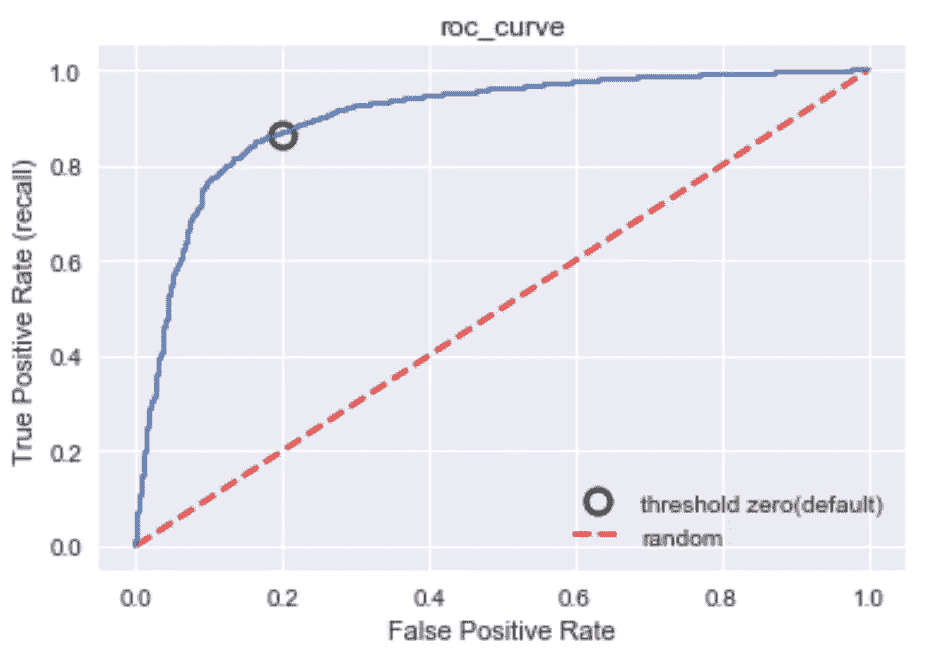

ROC curve

**ROC & AUC**

ROC:针对假阳性率和真阳性率绘制的曲线，它考虑了分类器的所有阈值。真阳性率也叫召回率。最佳点是左上角，在这里可以实现最低的 FPR 和最高的 TPR。

AUC:ROC 曲线下的面积。此 AUC 的范围(可能值)介于 0(最差)和 1(最佳)之间。随机预测总是产生 0.5 的 AUC 分数。 [AUC 是从阳性类别中随机选择的样本比从阴性类别中随机选择的样本给出更高分数的概率](https://datascience.stackexchange.com/questions/806/advantages-of-auc-vs-standard-accuracy)或阳性类别中的置信度。因此，AUC 给出了关于预测的附加信息，即关于模型比较(例如，一些模型可能是随机分类器)和可以产生更高分类率的适当阈值的信息。这就是我在 GridSearch 中使用 AUC 作为度量标准的原因。

```
from sklearn.metrics import precision_recall_curve
precision, recall, thresholds = precision_recall_curve(\
                                                      y_test, logreg_train.decision_function(X_test))
close_zero = np.argmin(np.abs(thresholds))
plt.plot(precision[close_zero], recall[close_zero], 'o', markersize=10, 
         label="threhold zero", fillstyle="none", c="k", mew=2)
plt.plot(precision, recall, label="precision recall curve")
plt.xlabel("precision")
plt.ylabel("recall")
plt.title("Precision Recall Curve")
plt.legend(loc="best");
```

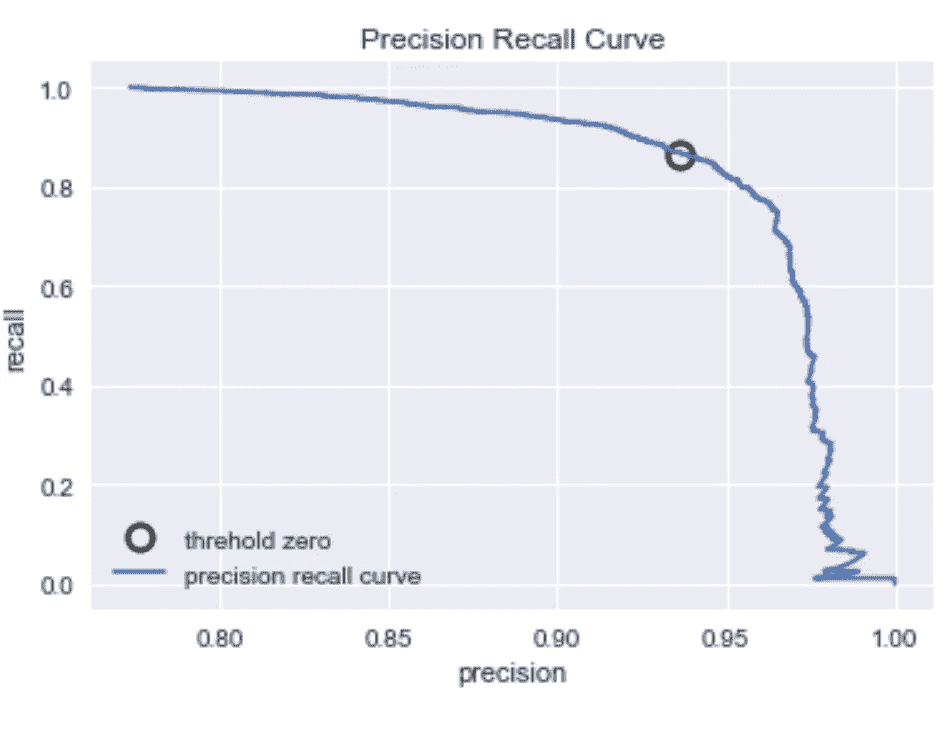

Precision Recall Curve

**精确和召回**

精确度和召回率由下面的公式决定。这两种价值观之间是有取舍的。当目标是减少假阳性的数量时，使用精度。在该数据中，目标可以是减少被预测为正面的负面评论的数量。设定这一目标的理由是，如果预测是肯定的，一些食品公司可能会出售大量不喜欢或不受欢迎的食品。因此，更高的假阳性率将导致不必要的更高的食品生产成本。另一方面，当目标是减少假阴性的数量时，使用召回。在这些数据中，这意味着目标是减少被错误分类为负面评价的正面评价的数量。我们可能需要更高的召回率，因为销售更多的大众食品会增加利润。因此，我们可以将**精确度和召回率的权衡**视为该数据集中**成本最小化和利润最大化的权衡**。

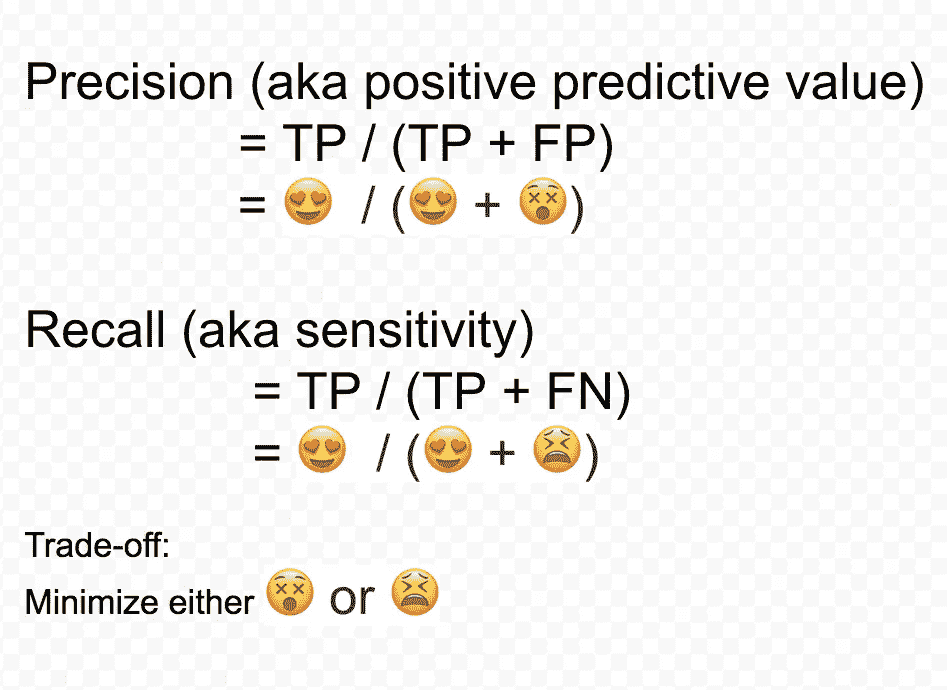

Formulas of precision and recall and tradeoff

**B: TFIDF(频率-逆文档频率)**

TFIDF 对在特定评论(文档)中频繁出现但在作为整体的评论(语料库)中不频繁出现的词给予高权重。具有高权重的单词是每个评论的代表，而具有低权重的单词出现在许多评论(例如，吃、食物)中，并且不与特定评论相关联。

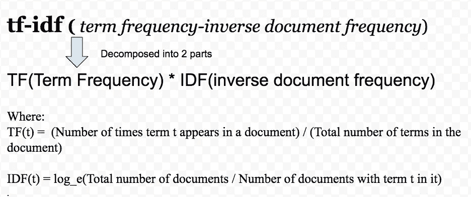

[A formula of tf-idf](http://www.tfidf.com/)

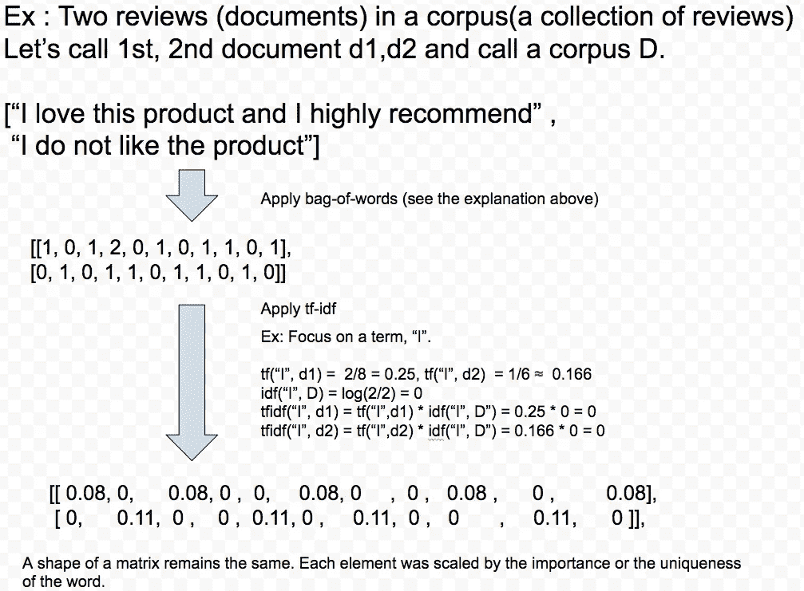

A process of tf-idf

```
logreg = LogisticRegression(class_weight="balanced", random_state=0)
pipe = make_pipeline(TfidfVectorizer(norm=None, stop_words='english'), logreg)
param_grid = {'logisticregression__C': [0.001, 0.01, 0.1, 1, 10]}grid = GridSearchCV(pipe, param_grid, scoring="roc_auc", cv=5)
logreg_train = grid.fit(text_train, y_train)fpr, tpr, thresholds = roc_curve(y_test, grid.decision_function(text_test))
pred_logreg = logreg_train.predict(text_test)
confusion = confusion_matrix(y_test, pred_logreg)
print(confusion)
print("Classification accuracy is: ", (confusion[0][0] + confusion[1][1]) / np.sum(confusion)) 
print("Test AUC score is: ", auc(fpr, tpr));
```

混淆矩阵

[[806 226]
【454 3062]]
分类准确率为:0.850483729112
AUC 得分为:0.899483666

让我们想象一下哪 25 个单词对预测的影响最大。(点击下图放大)

```
mglearn.tools.visualize_coefficients(grid.best_estimator_.named_steps['logisticregression'].coef_, 
                                   feature_names, n_top_features=25)
plt.title("tfidf-cofficient")
```

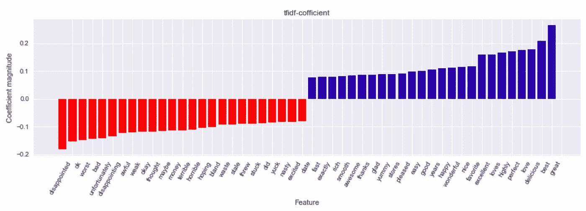

Blue for word which has huge influence on making prediction on positive review and red for negative.

对于负面评论(红色部分)，会出现“失望”、“最差”等词语。对于正面评论(蓝色部分)，会出现“很好”、“最好”等词语。奇怪的是，还有一些红色的单词，如“ok”、“excited”，这些应该是正面的评论。这将在下面讨论。

**N-gram**

对单词或每个单词进行训练是很棘手的，因为一些单词组合在一起表示非常不同的意思。

例如，“这不是一个好产品”，如果你用 1-gram(unigram)来标记这个句子，你会得到 6 个不同的单词，其中包括“好”。如果你用 3-gram，那么你会得到 3 个单词的所有组合，其中一个是“不好”。很明显，对“不是一个好”的训练可能导致更好的准确性，因为“不是一个好”更好地抓住了这句话的负面含义。

3-gram(三元模型)用于训练下面的分类器。

```
pipe = make_pipeline(TfidfVectorizer(min_df=5), LogisticRegression(class_weight="balanced", random_state=0))
param_grid = {'logisticregression__C': [0.001, 0.01, 0.1, 10, 100], 
              'tfidfvectorizer__ngram_range': [(1,1), (1,2), (1,3)]}grid = GridSearchCV(pipe, param_grid, scoring="roc_auc", cv=5)
logreg_train = grid.fit(text_train, y_train)
pred_logreg = logreg_train.predict(text_test)

confusion = confusion_matrix(y_test, pred_logreg)
print("confusion matrix \n", confusionprint("Classification accuracy is: ", (confusion[0][0] + confusion[1][1]) / np.sum(confusion)) 
print("AUC score is: ", auc(fpr, tpr)); 
```

混淆矩阵
[[810 222]
【261 3255】]
分类准确率为:0.893799472296
AUC 评分为:0.932426383

# AUC 增加了约 3%

```
feature_names = np.array(grid.best_estimator_.named_steps["tfidfvectorizer"].get_feature_names())
coef = grid.best_estimator_.named_steps["logisticregression"].coef_
mask = np.array([len(feature.split(" ")) for feature in feature_names]) == 3
mglearn.tools.visualize_coefficients(coef.ravel()[mask], 
                                   feature_names[mask], n_top_features=40)
```

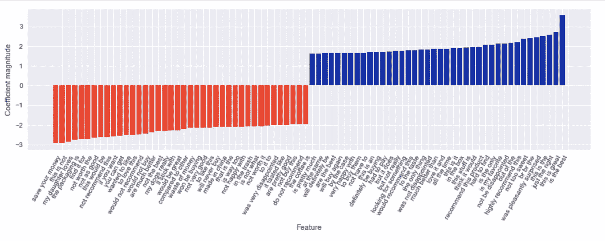

Trigram gram visualization

对于负面评论，会出现“不值得”、“不如”这样的词。对于这些单词，每个单词不传达任何意思(例如，the，as)或相反的意思(例如，值得，不值得)。对于正面评价，有一个连词，“喜出望外”。“惊讶”只能被认为是消极或积极的，副词，“愉快地”确保这有一个积极的意义。

# **总结:**

对于少量数据和少量计算资源，您可以使用分类器，如逻辑回归，并根据如何转换数据来达到中等精度。考虑到数据大小和有限的硬件，在某些情况下，您可能不需要使用像 RNN、LSTM 这样的模型。

# [完整代码在此](https://github.com/Juice178/sentiment_analysis)