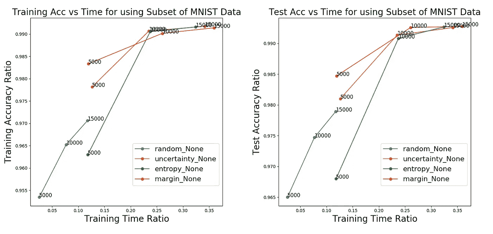

# 主动学习如何帮助您用更少的数据训练模型

> 原文：<https://towardsdatascience.com/how-active-learning-can-help-you-train-your-models-with-less-data-389da8a5f7ea?source=collection_archive---------5----------------------->

即使有大量的计算资源，在大型数据集上训练一个机器学习模型也可能需要几个小时、几天甚至几周的时间，这是昂贵的，并且是你生产力的负担。但是，在大多数情况下，您不需要所有可用的数据来训练您的模型。在本文中，我们将比较数据子集化策略以及它们对模型性能的影响(训练时间和准确性)。我们将在对 [MNIST](https://en.wikipedia.org/wiki/MNIST_database) 数据集子集的 SVM 分类器的训练中实现它们。

# 通过主动学习构建子集

我们将使用[主动学习](https://en.wikipedia.org/wiki/Active_learning_(machine_learning))来构建我们的数据子集。

> 主动学习是机器学习的一种特殊情况，在这种情况下，学习算法能够交互式地询问用户，以在新的数据点获得所需的输出。

子集化数据的过程是由一个主动学习者完成的，该学习者将基于一个策略进行学习，该策略的训练子集适合于最大化我们的模型的准确性。我们将考虑 4 种不同的策略来从原始训练集中构建这些数据子集:

*   **随机采样**:随机采样数据点
*   **不确定性采样**:我们选择我们最不确定其类别的点。
*   **熵采样**:选择类概率熵最大的点
*   **边缘采样**:我们选择最有可能和第二有可能类别之间的差异最小的点。

这些策略中的概率与 SVM 分类器的预测相关联。

对于这项研究，我们将构建 5000 个子集(8%的数据)；原始训练集 60，000 点中的 10，000 点(数据的 17%)和 15，000 点(数据的 25%)。

# 结果

为了测量我们在子集上训练的性能，我们将测量 ***训练准确度*** 和 ***训练时间*比率**计算如下:

我们可以为测试数据集计算相同的比率。结果总结在下图中。每个策略的 3 个数据点对应于子集的大小(5，000；一万和一万五)。

正如我们所看到的，使用不确定性采样策略，我们可以在 15，000 个点的子集上实现 99%以上的性能，而在完整数据集上训练 SVM 所需的时间仅为 35%。这清楚地表明，我们可以获得与使用完整数据集相当的结果，但只需要 25%的数据和 35%的时间。随机抽样是所有策略中最快的，但就准确率而言也是最差的。

因此，对数据子集进行处理是一种合理的方法，可以用更少的计算量显著减少训练时间，并且不会影响准确性。子集化数据适用于大多数分类数据集，但需要扩展以适用于时间序列数据和您正在训练的模型。

# 我们需要多少数据？

既然我们已经证明了在数据子集上训练模型的价值和可行性，我们如何知道最佳的子集大小应该是多少呢？一种叫做 FABOLAS [Klein et al.]的方法在这里实现可以推荐你应该使用的子集的大小。它通过学习上下文变量(要使用的数据集的大小)和最终得分的可靠性之间的关系来做到这一点。这意味着，通过在子集上训练模型，它可以推断模型在完整数据集上的性能。

# 贝叶斯优化扩展

如果我们想更进一步，我们可以通过使用贝叶斯优化来更有效地优化子集上的超参数的训练。我在以前的帖子中已经写了很多关于它的内容:

 [## 高斯过程贝叶斯优化背后的直觉

### 在某些应用中，目标函数是昂贵的或难以评估的。在这些情况下，一般…

towardsdatascience.com](/the-intuitions-behind-bayesian-optimization-with-gaussian-processes-7e00fcc898a0)  [## 揭开超参数调谐的神秘面纱

### 它是什么，为什么是自然的

towardsdatascience.com](/demystifying-hyper-parameter-tuning-acb83af0258f) 

在 Mind Foundry，我们正在努力通过贝叶斯优化和主动学习来实现最优和高效的机器学习。如果您有任何问题或想尝试我们的产品，请随时给[发电子邮件](http://Charles.brecque@mindfoundry.ai)给我！

【**更新**:我开了一家科技[公司](http://www.legislate.tech/)。你可以在这里找到更多的

1:[https://en . Wikipedia . org/wiki/Active _ learning _(machine _ learning)](https://en.wikipedia.org/wiki/Active_learning_(machine_learning))

2: [亚伦·克莱因](https://arxiv.org/search/cs?searchtype=author&query=Klein%2C+A)，[斯特凡·福克纳](https://arxiv.org/search/cs?searchtype=author&query=Falkner%2C+S)，[西蒙·巴特尔](https://arxiv.org/search/cs?searchtype=author&query=Bartels%2C+S)，[菲利普·亨宁](https://arxiv.org/search/cs?searchtype=author&query=Hennig%2C+P)，[弗兰克·赫特](https://arxiv.org/search/cs?searchtype=author&query=Hutter%2C+F)，大型数据集上机器学习超参数的快速贝叶斯优化，[**arXiv:1605.07079**](https://arxiv.org/abs/1605.07079)**【cs。LG]**