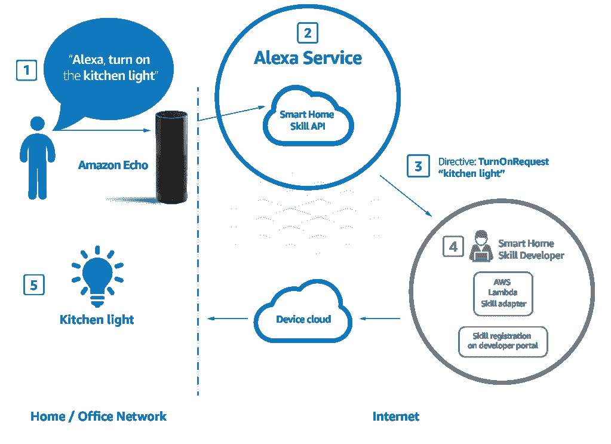
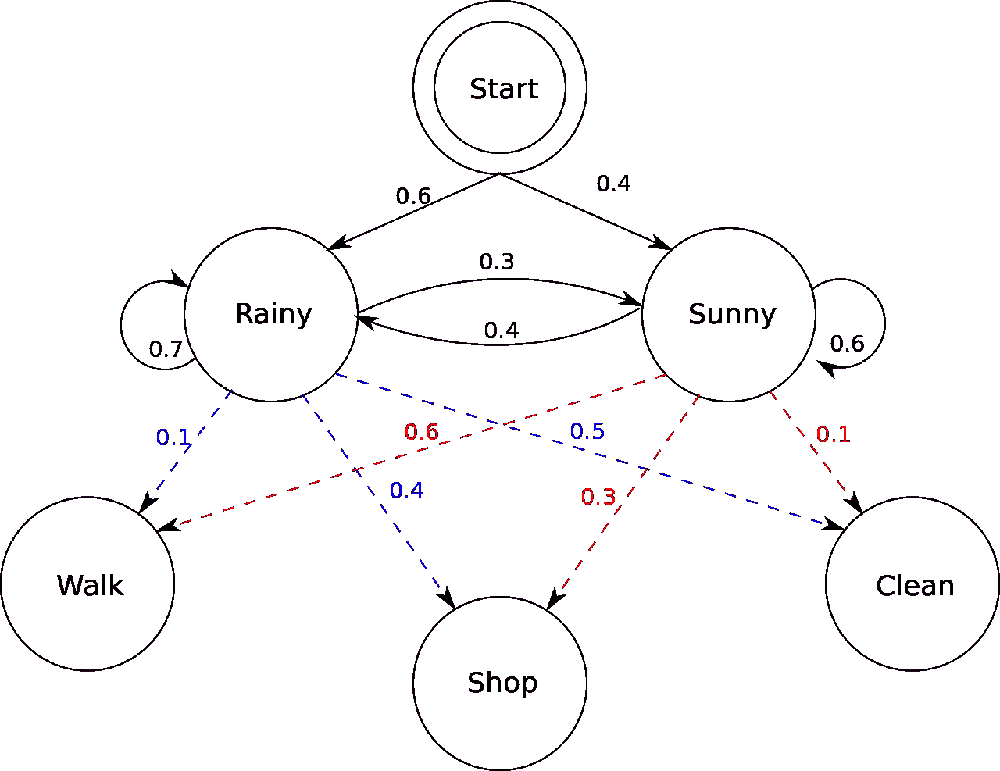

# 亚马逊 Alexa 是如何工作的？你的自然语言处理指南

> 原文：<https://towardsdatascience.com/how-amazon-alexa-works-your-guide-to-natural-language-processing-ai-7506004709d3?source=collection_archive---------1----------------------->

我们现在可以与几乎所有的智能设备对话，但它是如何工作的呢？当你问“这是什么歌？”，正在使用哪些技术？

【Alexa 是如何工作的？

据微软项目经理[阿迪·阿加什](https://www.quora.com/profile/Adi-Agashe)称，Alexa 是基于自然语言处理(NLP)构建的，这是一种将语音转换为单词、声音和想法的程序。

*   亚马逊记录你的话。事实上，解释声音需要大量的计算能力，**你讲话的录音会被发送到亚马逊的服务器上进行更有效的分析。**

> **计算能力:**指指令执行的速度，通常用千浮点、百万浮点等表示。

*   亚马逊将你的“订单”分解成单独的声音。然后，它会查询包含各种单词发音的数据库，以**找到哪些单词最接近单个发音的组合**。
*   然后**识别重要的单词以理解任务**并执行相应的功能。例如，如果 Alexa 注意到像*“运动”*或*“篮球”*这样的词，它就会打开运动应用。
*   **亚马逊的服务器将信息发送回你的设备，Alexa 可能会说话**。如果 Alexa 需要回应什么，它会经历上述相同的过程，但顺序相反
    ( [来源](https://www.quora.com/How-does-Alexa-work))

[Source](https://www.amazon.com/HQTECHFLY-Security-Wireless-Multi-functional-Compatible/dp/B07D8SCQ81)

# 深入解释

根据 [Trupti Behera](https://www.quora.com/profile/Trupti-Behera-6) 的说法，“它从信号处理开始，这给了 Alexa 尽可能多的机会通过清理信号来理解音频。信号处理是远场音频领域最重要的挑战之一。

这个想法是为了改善目标信号，这意味着能够识别像电视这样的环境噪声，并将其降至最低。为了解决这些问题，七个麦克风被用来大致识别信号来自哪里，以便设备可以专注于它。声学回声消除可以减去该信号，从而只留下剩余的重要信号。

下一个任务是“唤醒词检测”。它确定用户是否说出设备被编程需要打开的单词之一，例如“Alexa”。这是减少误报和漏报所必需的，误报和漏报可能会导致意外购买和愤怒的顾客。这真的很复杂，因为它需要识别发音差异，并且它需要在 CPU 能力有限的设备上这样做。

如果检测到唤醒词，信号将被发送到云中的语音识别软件，该软件将音频转换为文本格式。这里的输出空间是巨大的，因为它查看英语中的所有单词，云是唯一能够充分扩展的技术。使用回声音乐的人的数量使这变得更加复杂——许多艺术家使用不同的拼写作为他们的名字，而不是单词。

Amazon.com

为了将音频转换成文本，Alexa 将分析用户语音的特征，如频率和音高，以给你特征值。

给定输入特征和分成两部分的模型，解码器将确定最可能的单词序列。第一个是先验，它基于大量的现有文本给你最可能的序列，而不看特征，另一个是声学模型，它通过查看音频和转录本的配对，用**深度学习**进行训练。这些被组合并应用动态编码，这必须实时发生。"([来源](https://www.quora.com/What-is-the-technology-behind-Amazon-Echo))

# 对“订单”的分析

[Source](https://chatbotsmagazine.com/how-does-alexa-skills-works-82a7e93dea04)

上面的命令有 3 个主要部分:唤醒词、调用名、话语。(这部分摘自基兰·克里希南的[文章](https://chatbotsmagazine.com/how-does-alexa-skills-works-82a7e93dea04))

*   **唤醒词** 当用户说‘Alexa’时，唤醒设备。唤醒词将 Alexa 置于监听模式，并准备接受用户的指令。
*   **调用名称** 调用名称是用来触发某个特定“技能”的关键字。用户可以将调用名称与动作、命令或问题结合起来。所有的定制技能必须有一个调用名来启动它。

> Alexa“技能”:语音驱动的 Alexa 能力。

*   **话语** 【金牛座】是话语。话语是用户向 Alexa 发出请求时使用的短语。Alexa 从给定的话语中识别用户的意图，并做出相应的响应。所以基本上话语决定了用户想要 Alexa 执行什么。

之后，支持 Alexa 的设备将用户的指令发送到一个名为 Alexa 语音服务(AVS)的云服务。

> 将 Alexa 语音服务视为 Alexa 启用设备的大脑，并执行所有复杂的操作，如自动语音识别(ASR)和自然语言理解(NLU)。

Alexa 语音服务处理响应并识别用户的意图，然后在需要时向第三方服务器发出 web 服务请求。

# 什么是 NLP？

这是**人工智能**和**计算语言学**的融合，处理机器和人类自然语言之间的交互，其中计算机需要分析、理解、改变或生成自然语言。

**NLP** 帮助计算机机器使用多种形式的自然人类语言进行交流，包括但不限于演讲和写作。

> "与电脑进行 20 分钟的闲聊不仅仅是一次登月，而是一次火星之旅。"

在这篇[文章](https://machinelearning-blog.com/2018/07/25/natural-language-processing/)中，我发现了一个有趣的部分，它说“理解人类语言由于其复杂性而被认为是一项困难的任务。例如，在一个句子中有无数种不同的方式来排列单词。此外，单词可以有多种含义，正确解释句子需要上下文信息。”

开始时，系统得到自然语言的输入。

> **自然语言:**人类通过使用和重复，没有有意识的计划或预谋，自然进化出来的任何语言。自然语言可以采取不同的形式，如语音或手语

之后，它将它们转换成类似语音识别的人工语言。在这里，我们将数据转换成文本形式，由 NLU(自然语言理解)处理以理解其含义。

> 如果你只是在谈论机器理解我们所说的话的能力，一个好的规则是使用术语 NLU。NLU 实际上是更广阔的 NLP 世界的一个子集

## 隐马尔可夫模型(NLU 例子) :

在语音识别中，该模型将波形的每个部分与之前和之后的内容进行比较，并与波形字典进行比较，以找出正在说的内容。

> **波形:**声带*的周期性振动*产生浊音

隐马尔可夫模型(HMM)是一种观察到一系列排放，但不知道模型产生排放所经历的状态序列的模型。隐马尔可夫模型的分析寻求从观测数据中恢复状态序列。

[Image source](https://en.wikipedia.org/wiki/Hidden_Markov_model)

对于 NeoSpeech 的营销专家 Trevor Jackins 来说，“它试图通过获取语音数据并将其分解为特定持续时间(通常为 10-20 毫秒)的小样本来理解你所说的话。这些数据集进一步与预输入的语音进行比较，以解码你在演讲的每个单元中所说的话。这里的目的是找到**音素(语音的最小单位)。然后，机器会查看这一系列音素，并通过统计确定最有可能说出的单词和句子。”([来源](https://blog.neospeech.com/what-is-natural-language-processing/)**

然后 NLU 开始深入理解每个单词，试图理解它是名词还是动词，用的是什么时态，等等。这个过程被定义为**词性标注。**

根据 EasyGov 的 CPO Pramod Chandra Yan 所说，“NLP 系统也有一个词典(一个词汇表)和一组编码到系统中的语法规则。现代 NLP 算法使用统计机器学习将这些规则应用于自然语言，并确定你所说的话背后最可能的含义。”([来源](https://codeburst.io/a-guide-to-nlp-a-confluence-of-ai-and-linguistics-2786c56c0749))

对于一家名为 Lola.com 的公司来说，“为了建造理解自然语言的机器，有必要结合使用规则和统计建模来提取语音。必须提取、识别和解析实体，语义必须在上下文中导出，并用于识别意图。例如，一个简单的短语“我需要 12 月 5 日到 10 日在巴黎的航班和酒店”必须被解析并给出结构:

# **need:航班{intent} / need:酒店{intent} /巴黎{ city }/12 月 5 日{ date }/10 日{ date }/sensation:0.5723(中性)"**

([来源](https://medium.com/@lola.com/nlp-vs-nlu-whats-the-difference-d91c06780992))

Bernard Marr，[作者、主题演讲人和顾问，](https://bernardmarr.com/default.asp?contentID=645)“当 Alexa 在解释你的请求时出错，这些数据将用于下次改进系统。机器学习是语音激活用户界面功能快速提高的原因。”([来源](https://www.forbes.com/sites/bernardmarr/2018/10/05/how-does-amazons-alexa-really-work/#7ee9be521937))

在亚马逊网站上，我们可以读到“通过自然语言理解(NLU)，计算机可以推断出说话者实际的意思，而不仅仅是他们说的话。基本上，当你问“Alexa，外面天气怎么样？”时，它使像 Alexa 这样的语音技术能够推断出你可能在问当地的天气预报。"

今天的语音优先技术是由 NLU 构建的，它是以识别人类语言中的模式和意义为中心的人工智能。以语音助手为代理的自然语言处理已经重新定义了我们在家里和其他地方与技术互动的方式。"([来源](https://developer.amazon.com/fr/alexa-skills-kit/nlu))

你可以在这里查看 Alexa 设备背后的代码:

 [## Alexa/AVS-设备-sdk

### 商业设备制造商将 Alexa 直接集成到互联产品中的 SDK。-Alexa/AVS-设备-sdk

github.com](https://github.com/alexa/avs-device-sdk/wiki) 

# 有关更多信息:

*   https://www.quora.com/How-does-Alexa-work
*   [https://www . quora . com/亚马逊回声背后的技术是什么](https://www.quora.com/What-is-the-technology-behind-Amazon-Echo)
*   [https://chatbotsmagazine . com/how-does-Alexa-skills-works-82 a7 e 93 DEA 04](https://chatbotsmagazine.com/how-does-alexa-skills-works-82a7e93dea04)
*   [https://becoming human . ai/a-simple-introduction-to-natural-language-processing-ea6a 1747 b 32](https://becominghuman.ai/a-simple-introduction-to-natural-language-processing-ea66a1747b32)
*   [http://future-ai.news/2018/03/02/hi-ai-lets-chat/](http://future-ai.news/2018/03/02/hi-ai-lets-chat/)
*   [https://machine learning-blog . com/2018/07/25/自然语言处理/](https://machinelearning-blog.com/2018/07/25/natural-language-processing/)
*   [https://code burst . io/a-guide-to-NLP-a-confluence-of-ai-and-language-2786 c56c 0749](https://codeburst.io/a-guide-to-nlp-a-confluence-of-ai-and-linguistics-2786c56c0749)
*   [https://blog . neo speech . com/what-is-natural-language-processing/](https://blog.neospeech.com/what-is-natural-language-processing/)
*   [https://medium . com/@ Lola . com/NLP-vs-nlu-whats-the-difference-d91c 06780992](https://medium.com/@lola.com/nlp-vs-nlu-whats-the-difference-d91c06780992)
*   [https://medium . com/@ Lola . com/NLP-vs-nlu-what-the-difference-d91c 06780992](https://medium.com/@lola.com/nlp-vs-nlu-whats-the-difference-d91c06780992)
*   https://developer.amazon.com/fr/alexa-skills-kit/nlu