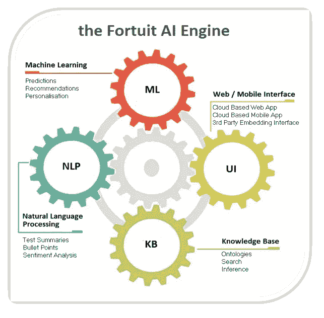
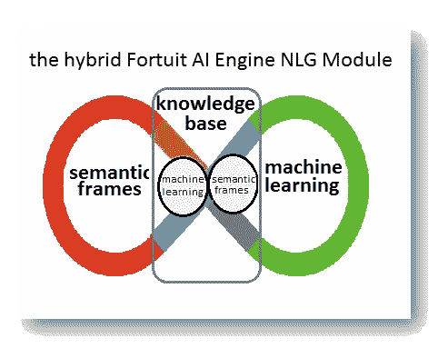

# 人工智能引擎如何改善你的业务

> 原文：<https://towardsdatascience.com/how-an-ai-engine-can-improve-your-business-f8dc91e8371?source=collection_archive---------3----------------------->

[Image Attribution](https://pixabay.com/users/geralt-9301/?utm_source=link-attribution&amp;utm_medium=referral&amp;utm_campaign=image&amp;utm_content=4694502)

过去十年的巨大技术进步解决并极大地影响了人类的基本通信需求。一方面是网站、博客、电子邮件、短信、脸书、Snapchat、Slack 和智能手机，另一方面是作为主导媒介的谷歌，所有这些本质上都满足了我们的沟通需求。我将此称为“通信时代”，我认为就潜在的真正颠覆性创新而言，这个时代已经“停滞不前”。

我们现在正处于下一个时代的开端，即“知识时代”，人工智能(AI)将占据主导地位。AI 是一个总括术语，包括机器学习(ML)、自然语言处理(NLP)和知识表示(KR)等多种技术。人工智能现在是技术的前沿。

你的企业如何使用人工智能？

客户和潜在客户总是问他们如何使用人工智能来增加他们业务的价值。答案是通过部署人工智能引擎作为实现工具，通过它可以利用人工智能功能，抽象出内在的复杂性。由几个不同的模块组成，例如人工智能驱动的[创意引擎](https://fekosn.medium.com/how-to-infuse-your-business-with-ai-powered-creativity-68ff071276fd)，人工智能引擎可以作为服务(AIaaS)部署，也可以嵌入客户端-服务器、web 或移动应用程序中。

**什么是人工智能引擎？**

一个 AI 引擎由几个基本模块组成，包括一个**机器学习模块、**一个**自然语言处理模块**和一个**知识表示(本体)模块**。

为了实现特定的业务目标，如增加销售额、降低成本、解决合规性和提高网络安全性，这些模块用于收集和转换数据、生成准确的预测和见解、读取和分类文本等。

**Fortuit AI 引擎**

在 [Fortuitapps](http://www.fortuitapps.com/fortuitcontacts.aspx) 我们开发了一个强大的、面向商业的人工智能引擎(相对于同样重要的面向学术的对手)。下面我将详细介绍 AI 引擎组件，并描述它们如何用于改进业务流程。

**机器学习模块**

机器学习基于模拟生物大脑功能的神经网络。神经网络是一个由神经元(脑细胞)组成的网络，这些神经元通过称为突触的连接相互连接(想象一个渔网)。这些连接具有一定的强度(正或负)，这些连接的组合将根据特定的阈值导致神经元打开(触发)或不打开(想象一个连接有一些电源线的灯泡:如果累积的功率足够大，灯泡将打开)。人类的思维是神经元放电(或不放电)的结果。

现在，拿一个神经网络的一边，打开一些神经元。然后拿另一边，再次打开一些神经元。你已经给了网络一个给定输入和预期输出的例子(想象一个 1 加 1 的输入和一个 2 的输出，以便教它加法)。接下来，给它许多例子，然后使用一种特定的标准化学习算法，通过这种算法，它可以通过调整其连接的能力以及神经元何时激活来学习。一旦它通过多次迭代稳定下来，让它添加你没有教过它的数字:它会根据它所学到的东西以很高的概率做出准确的响应。这样，给定输入数据集(例如图像)和输出数据集(例如这些图像的描述)，基于它“看到”的模式，它可以非常准确地回答新图片包含什么，即使它以前从未见过它。

**机器学习模块如何改善您的业务**

机器学习模块可以提供

o 描述性分析(发生了什么)

o 预测分析(将会发生什么)

o 规范性见解(应该做什么)

换句话说，ML 模块可以分析游戏的当前状态，并提供关于未来的预测和建议。用于商业目的的机器学习部署的具体示例如下:

*库存需求预测*

一家全国性面包店希望准确预测需求并相应地调整生产。给定与一系列因素相关的过去表现，如一年中的时间、天气、政治局势、当前事件等，基于 ML 的准确需求预测可以产生可测量的显著节约。

*减少产品退货*

一家在线零售服装公司希望根据各种因素降低其产品的退货率，这些因素包括买家性别、年龄、订单历史、网站访问量、产品兴趣等。根据可用数据，选择最佳 ML 模型以提供对促成退货的因素的重要见解，可以显著影响盈利能力和效率(甚至达到实时“阻止”有高退货概率的订单的程度)

*产品推荐*

也许机器学习最受欢迎的应用是网飞的电影推荐系统和亚马逊的“顾客也买了”功能。“结帐”时推荐的产品是根据对将要发生的事情的非常准确的预先评估(即实际将购买多少建议产品)来选择的。

*不良贷款*

贷款人面临的一个巨大问题是，在潜在的不良贷款候选人实际成为不良贷款之前识别出他们，并采取相应的行动，这显然可以提供重要的价值。给定足够的历史数据，包括客户交易、概况、当前事件、失业率、利率和股票市场利率，所有这些都输入到 ML 模型的选定组合中，可以以令人印象深刻的准确度识别潜在的不良贷款。

**自然语言模块**

自然语言处理(NLP)为计算机提供了以书面或口头方式理解和解释人类语言的能力。目标是让计算机在理解语言、识别语音和生成语言方面像人类一样智能。

主要应用领域包括:

o **摘要**:提供只包含主要概念的文本摘要。摘要使用已经提供的句子或短语，而摘要使用新生成的文本

o **情绪分析** —识别给定文本中的感觉、判断和/或观点(即负面或正面的 twitter 帖子)

o **文本分类** —对文本进行分类(例如，根据域对新闻进行分类)或对文本进行比较，以识别其可能所属的组(例如，此电子邮件是否为垃圾邮件)

o **实体提取** —识别人物、地点、组织等

**自然语言处理模块如何帮助您的业务**

具体来说，在商业中部署自然语言处理模块的例子如下:

*在线博客、新闻网站和论坛上用户评论的汇总和情感分析*

抓取目标博客、论坛和新闻网站，提取与特定产品或公司相关的评论，然后自动总结和分析相关观点，以提供关于产品和服务的有价值的见解。

*利用许多网站上的“关于”栏目寻找潜在客户*

给定目标公司网站的列表(例如来自 CrunchBase)，专门的爬行器可以从“关于”部分提取文本，对这些文本进行总结和分类，然后提供洞察，以便通过根据当前客户的“关于”部分进行分类，从列表中定位潜在客户可能感兴趣的那些公司。

*电子邮件发送者档案和情感*

对于每个电子邮件联系人，对所有收到的电子邮件进行总结和分类，然后将它们输入预先训练的 ML 模型，以确定符合联系人个性和写作风格的回复方式。

**知识表示/本体模块**

KR 是人工智能的一个领域，致力于表示关于世界的信息:以计算机系统可以使用和理解的形式对现实的基本性质进行概念表征。这可以以“本体”的形式实现，本体是一种知识表示形式，由一组分层的概念和类别以及它们的属性和它们之间的关系组成。本质上，我们对世界的认识是一种内在的本体论。

人工智能引擎的核心是作为一个本体来实现的，该本体可以默认填充大量的一般知识(例如 DBPedia 形式的整个维基百科)，或者特定领域的知识，如电子商务或医疗保健。

**在业务中利用知识表示模块**

领域特定的本体可以提供显著的商业影响。具体例子包括:

电子商务

在电子商务网站上，用户可以通过名称或特征来搜索产品，但他们不支持诸如“如何减肥”或“如何消除蚂蚁”的查询，尽管他们可能针对这种情况销售产品。他们需要的是一个本体，通过这个本体，用自然语言表达的概念被映射到产品上。类似地，客户支持可以使用聊天机器人来利用本体，以提高的准确性和效率自动处理查询。

卫生保健

在医疗保健领域，将症状、病情、治疗和药物联系起来的本体可以为日常医疗保健业务流程提供显著的附加值。

集中公司知识

大多数公司都有一组存储在共享目录中的常用文档，以及一组驻留在本地员工 pc 和笔记本电脑上的文档。这些文档(可能是 word、pdf 或文本文档)包含重要的信息，这些信息总体上构成了重要的数字资产。通过 NLP/NLU 系统，这种知识可以被收集、预处理和语义分析，以创建公司集中的本体/知识库，然后可以被扩展、搜索或更新。

**预览:自然语言生成模块**

NLG 是上述“知识时代”向前迈出的非常重要的一步。在 Fortuitapps，我们现在正致力于为上述 AI 引擎添加一个 NLG 模块。由于这是我们商业专有工作的一部分，我不会给出确切的细节，而是在本文的上下文中以更一般的术语描述我们的工作。

**什么是自然语言生成(NLG)？**

NLG 是用自然语言生成文本以响应查询或特定用户请求的智能过程。为了做到这一点，一个 NLG 模块必须对使人类变得聪明的一项非常重要的能力进行建模:常识。如果没有大量关于世界的日常知识(或者至少是关于特定应用领域的知识)，自然语言的生成在产品层面是不可能的。因此，任何 NLG 模块的核心都必须由一个本体形式的知识库组成，该本体提供最终将作为“文本”响应产生的“知识”。

我们如何创建 NLG 核心知识库？

由于人类通过阅读任何形式的文档(如书籍、文章、博客、报纸、网站等)来学习，因此 NLG 核心知识库必须由机器“阅读”文档来填充。

从机器的角度来看，文档展示了一个具有多个抽象层次的顺序结构，如标题、句子、段落和章节。这些层次抽象提供了上下文，通过它我们可以推断文本中单词和句子的意思。

因此，为了填充 NLG 核心知识库，我们需要能够阅读和理解语料库(例如谷歌新闻文本)的软件，并利用通过维基百科(文本)和 DBPedia(本体)获得的大量一般知识。

**机器如何阅读和理解文本？**

从更广泛的意义上来说，有两种主要的自然语言理解方法，**,这两种方法我们都使用，并且在更高层次的控制模块的上下文中互为补充。这两种方法描述如下。**

***基于机器学习的方法***

如上所述，关于神经网络，LSTM 或长短期记忆网络是一种递归神经网络，它能够从过去的“经验”中给自己反馈。LSTM 是一种非常强大的算法，可以对数据，尤其是时间序列和文本进行分类、聚类和预测。

我们将上下文特征(主题)合并到模型中，以实现特定的 NLP 任务，如**下一个单词或字符预测、下一个句子选择和句子主题预测**。我们使用的模型帮助我们回答问题，完成句子，生成释义，并在对话系统中提供下一个话语预测。

除了上面的深度学习模型，我们还使用 Word2vec 中实现的“浅层”模型。Word2vec 是一个工具，它为我们提供了单词、它们的含义以及与其他单词的交互的“心理地图”。每个单词被映射到“数字空间”中的一组数字，这被称为“单词嵌入”。相似的词在这个数字空间中彼此靠近，不相似的词相距很远

***基于语义框架的方法***

语义框架是相关概念的结构化模型，它们共同提供所有概念的知识，没有它们就不可能有任何概念的完整知识。

一个例子是查询“苹果价格预测”:我们指的是水果苹果或苹果公司的价格以及与其股票价格相关的预测吗？为了回答这个问题，我们必须模拟人类是如何做到这一点的，那就是本质上使用“贝叶斯推理”。贝叶斯推理是一种统计理论，其中关于世界真实状态的证据是根据被称为贝叶斯概率的信任度来计算的。

在贝叶斯概率的上下文中，为了选择与查询“苹果价格预测”相关的正确概念框架，从而知道我们在谈论什么，我们使用“先验素性分布”，简称为不确定量的“先验”。先验是在一些证据被考虑之前，表达一个人对这个量的信念的概率。

虽然没有保证，但是给定先验和结构，我们选择我们认为与查询相关的语义框架(水果价格或股票价格),以便产生适当的响应。在我们的例子中，我们实际上是在问人们通常是什么意思，所以我们使用股票价格语义框架。

**生成自然语言文本**

基于我们的核心 NLG 本体知识库，以及结合上述两种方法的**，给定一个查询或命令，我们基于以下三个主要步骤继续生成自然语言文本:**

**o 制定一个文件计划:选择将形成要制作的文本的知识地图的概念**

**o 将概念转化为句子**

**o 过滤结果:概念、语义和句法审查和调整**

****

**在 NLG 领域还会有更多有趣的事情发生！**

**最新跟进:[元宇宙](https://fekosn.medium.com/virtual-reality-virtual-insanity-or-a-business-opportunity-15a7a4fcb59)**

****关于作者****

**[**尼古拉·费克斯**](https://gr.linkedin.com/in/nicolas-fekos-ab809025?trk=profile-badge-name)**

**[http://www.fortuitapps.com](http://www.fortuitapps.com)**