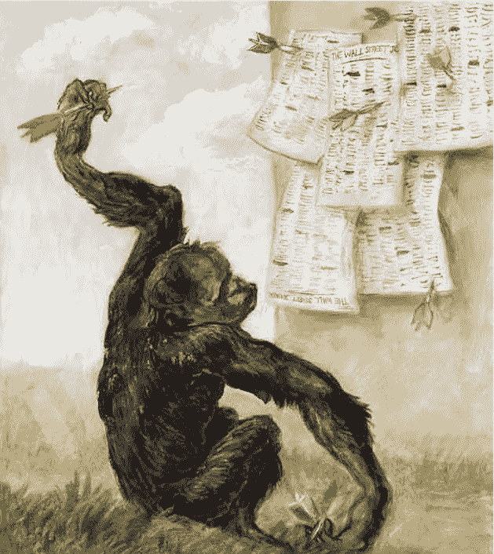
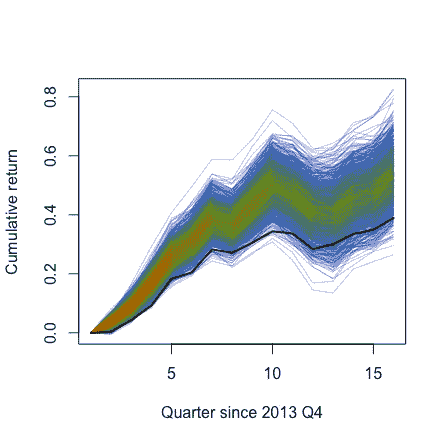
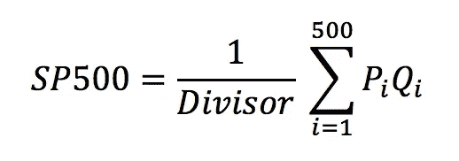
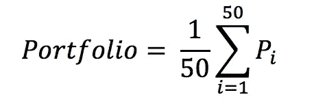

# 动物投资者如何战胜市场

> 原文：<https://towardsdatascience.com/how-animal-investors-beat-the-market-3c052dd1e31c?source=collection_archive---------4----------------------->

许多文章声称，一群驯养的动物可以成为选股者，不仅打败市场，也打败了熟练的基金经理。从一只名叫 [Orlando](https://www.forbes.com/sites/frederickallen/2013/01/15/cat-beats-professionals-at-stock-picking/#41f7a3de621a) 的可爱的猫，它通过将一只老鼠放在股票网格上来“击败”经理，到[训练外汇交易的实验室老鼠](https://www.vice.com/en_uk/article/dpw9yx/rattraders-0000519-v21n12)和[被蒙住眼睛的猴子在《华尔街日报》扔飞镖](https://www.researchaffiliates.com/en_us/publications/journal-papers/p_2013_aug_surprising_alpha.html)，动物王国似乎比我们优越！

> “一只被蒙住眼睛的猴子向一份报纸的金融版投掷飞镖，可能会选择一个与专家精心挑选的投资组合一样好的投资组合。”—伯顿·马尔基尔

这回避了一个显而易见的问题——为什么我们付给基金经理那么多钱，而这些钱显然应该去奥兰多？

好吧，让我们看看是否有其他动物可以战胜市场！为了节省水族馆的费用，我将模拟金鱼从 S&P500 随机挑选股票。奥兰多几乎没有研究基本面，所以随机选择对我们的鱼来说不是一个可怕的假设。在这个模拟中，每条鱼挑选 50 只股票，构建一个相等权重的投资组合，持有 3 年。

1000 goldfish returns, S&P500 in black

在管理金鱼的 1000 个模拟基金中，96.1%跑赢了市场，市场回报与金鱼 3 年回报的平均差为 14.5%！

但是，S&P500 96%的随机样本怎么可能胜过整个 S&P500 呢？乍一看，这类似于抛硬币，96%的情况下得到的是反面，或者在 1-100 之间随机选择 10 个数字，大多数情况下得到的平均值在 50 以上。

然而，这是假设 S&P500 的每只股票对 S & P500 指数的*整体*表现的贡献是相同的，但是 S & P500 和其他指数是根据其中包含的每家公司的规模或市值进行加权的。

The divisor is roughly $8.933 Billion and is adjusted for major shakeups any of the component companies

与 S&P500 不同，我们的金鱼和其他非人类投资者选择的投资组合权重相等，这意味着他们持有相同数量的每只股票。

事实证明，S&P500 前 10%的股票贡献了近 50%的整体指数。这些大盘股的回报往往远不如小盘股那样易变或多变，这使得小盘股的风险更大。大多数投资者并不特别喜欢高风险的股票，所以为了补偿购买这些股票的投资者，这些股票需要提供更高的回报。这是从经验上看的，因为在 1980 年至 2015 年之间，小型股票的平均年增长率为 11.24%，而大型股票的平均年增长率为 8.0%。

因此，当我们的动物朋友选择随机投资组合时，他们选择了不成比例的大量小股票，与 S&P500 相比，这提高了投资组合的回报率，同时也增加了很多风险，这一点 Orlando 忘记提到了。因此，尽管金鱼/猫/老鼠选择的随机投资组合确实提供了高回报，但其风险水平的回报不太可能是最佳的。