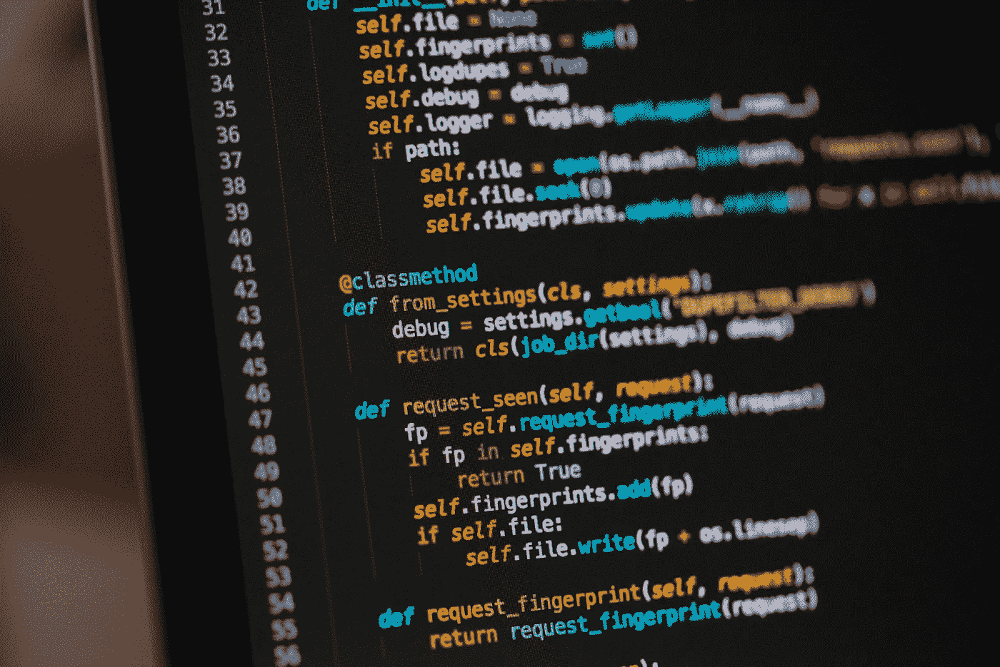

# 苹果如何建立其 iPhone X 面部识别系统 TensorFlow 中的暹罗网络解释道

> 原文：<https://towardsdatascience.com/how-apple-built-its-iphone-x-facial-recognition-system-siamese-networks-in-tensorflow-explained-707321c07d99?source=collection_archive---------8----------------------->

# 背景

在机器学习中，输入数据的质量经常取代模型架构和训练方案。与在较低质量数据集上训练的更高级、高度调整的模型相比，具有正确标记的高质量图像的*大型*、*平衡*数据集将始终产生更好的模型性能。然而，数据科学家并不总是收到大量的数据集。事实上，在我参与的大多数项目中，**数据集甚至没有被标上**。因此，机器学习的最大瓶颈是数据集的创建。

苹果已经建立了一个自动面部识别系统——在训练中只需给定几个人脸样本，它就能在测试中以极高的准确度正确识别出个人。有几个模型在幕后一起工作来实现这一点。这里有两个最重要的模型——1)能够区分真实的人和其他人工制品(如人的照片)的模型，以及 2)能够区分人的模型。考虑到 iPhone 用户的巨大数量(为了便于讨论，假设有 1000 万)，苹果如何建立一个足够强大的系统来识别一个人的图像？

解决这个问题的第一步是数据扩充。通过旋转、模糊或裁剪图像数据，可以创建近似反映原始数据集中图像分布的合成图像。然而，这种方法并不完美——它提供了一种正则化效果，如果网络在训练中表现不佳，这种效果可能是不想要的。

第二步，也是更重要的一步，是采用一类被称为暹罗网络的通用架构。这里讨论的暹罗网络的特殊风格使用带有共享参数的**模型为每个图像构建特征表示。损失定义如下——如果两个图像属于同一类，则当它们的相关特征向量之间的距离较低时损失较低，而当它们的相关特征向量之间的距离较高时损失较高。反之亦然，如果两个图像属于不同的类别，只有当图像特征表示相距很远时，损失才很低。该模型架构旨在处理以下两种情况:**

1.  稀疏数据
2.  新数据

该架构已经在苹果、百度等公司进行了全球部署。

现在，让我们在 tensorflow 中建立模型！



# 输入管道

由于暹罗网络严格的输入参数，输入管道可能是我们编写的最复杂的代码。基本要求是我们必须选择两幅输入图像。这些输入图像必须以相等的概率属于同一类或不同类。

虽然 tensorflow 中的健壮数据集类可以简单有效地提供图像数据，但它不是为暹罗网要求而设计的，因此需要一些技巧才能实现。

为了提高效率，在下面的代码中，我从 TFRecords 格式读入图像数据。图像数据可以很容易地与 tensorflow 的数据集类

```
dataset = tf.data.Dataset.from_tensor_slices()
```

第一步是创建一个包含所有图像数据的数据集。

数据以一定的缓冲区大小进行混洗(较大的值增加时间，较小的值减少随机性)，并映射到它们各自的图像和标签张量。回想一下，所有这些操作都是张量流图的一部分。

接下来，必须将上述结构的两个数据集压缩在一起，以创建暹罗数据集。对于这个数据集，我们有一些架构和性能要求

1.  数据必须被重新洗牌
2.  数据必须均匀分布
3.  开销应该是分布式的和同步的

通过 tensorflow 的`prefetch()`、`filter()`和 `shuffle()`实用程序，这可以实现。这些操作的顺序非常重要——在过滤之前重复可能会导致无限循环！`prefetch()`操作允许 CPU 在 GPU 训练时加载一批图像。

由于我们已经在 tensorflow 图形中工作，所有操作都必须由 tensorflow 支持。我在这里定义了操作`filter_func`。该操作根据图像对是否出现在同一数据集中来随机过滤图像对。

咻！我们有数据集了！现在，我们建模。

# 模型

让我们定义一个基本模型。首先，我们可以定义一个卷积块。

有了这些卷积块，我们可以定义一个模型。给定一个输入图像，该模型返回一个展平的 1024 单位特征向量。

回想一下，在暹罗网络中，两个图像都是由同一模型处理的。因此，我们可以在 tensorflow 中设置一个可变范围，允许我们在处理每一对输入时共享参数。

一个紧密连接的层被附加到特征因子的绝对差上。值得注意的是，没有激活函数应用于这个最终向量，这允许模型捕捉输出的自然分布，并允许所有神经元被表示。

最后，我们必须定义暹罗损失。在暹罗网络的这个特殊变体中，我展示了对比损耗——另一种常见的损耗是三重损耗。然而，三重态损耗需要与上述不同的模型架构。

# 培养

让我们现在把它拉在一起。首先，我们调用我们的数据集，并在我们的图中实例化代表左右输入图像的张量，以及它们对应的标签。

接下来，我们将损耗添加到张量流图中。

最后，我们实例化一个优化器来最小化损失，实例化一个初始化器来将所有变量实例化为值的某种分布(可以为每个操作指定)。我在这里使用流行的 Adam 优化器。

现在，我们可以开始张量流训练。

# 一些离别的想法

这里描述了一个使用低级 tensorflow API 的基本暹罗网络。这个网络在解析稀疏数据集方面非常强大，并被用于全球公认的系统，包括 iPhone X。

如果你对代码有任何问题/评论/修正，给我发消息或在这个帖子上发表评论。